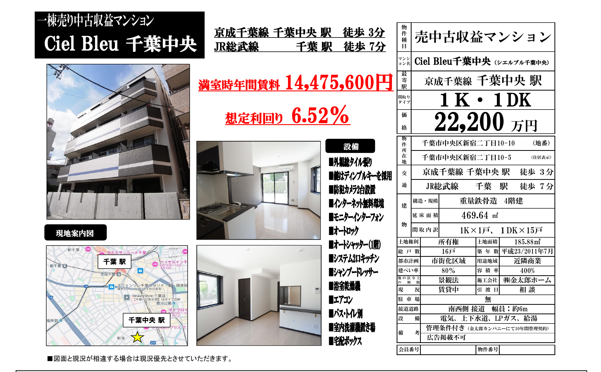

# 収益物件 投資分析レポート：Ciel Bleu 千葉中央（シエルブルー千葉中央）

**作成基準日**：2026年10月5日  
**対象物件**：Ciel Bleu 千葉中央（千葉県千葉市中央区松波1丁目19-12）  
**投資判断**：**条件付推奨（Conditional Buy — 売出価格2億2,200万円での買付は不可／指値1億9,500万〜1億9,800万円［表面7.31%〜7.42%］および経済的耐用年数ベースの25年超融資特約を必須条件とする）**



---

## 1. エグゼクティブ・サマリー（Executive Summary & 投資判定）

### 1.1 総合評価および意思決定結論
本件**「Ciel Bleu 千葉中央」**は、JR総武本線・成田線等のビッグターミナル**「千葉」駅 徒歩12分**（JR中央・総武緩行線「西千葉」駅 徒歩13分、千葉都市モノレール「作草部」駅 徒歩13分）の千葉県千葉市中央区松波1丁目に位置する、2011年（平成23年）2月築（築15年）の鉄骨造（S造）4階建・全16戸（全戸1K・24.16㎡均一）の一棟収益マンションです。

立地・建物のハードウェア面では、(1) 千葉駅と西千葉駅（千葉大学西千葉キャンパス）の中間に位置する伝統的な文教・住宅街「松波1丁目」の堅調な単身賃貸需要、(2) 一般的な狭小ワンルーム（18〜20㎡）と明確に差別化される**全戸24.16㎡のゆとりある1K間取り**、(3) **オートロック・宅配ボックス・防犯カメラ・BSアンテナ・駐輪場・無料インターネット**のフルスペック現代設備、および (4) 現在**16戸中16戸満室稼働中（2026年3月2日時点）**という優れた稼働実績を有しています。

しかし、**売出価格2億2,200万円（表面利回り6.52%）**を前提に厳格な財務・融資・法人税務デューデリジェンス（DD）を実施した結果、以下の**3つの重大な財務的ボトルネック**が確認されました。

1. **積算価格乖離および担保評価不足（銀行保守評価比 49.0%／国税庁標準比 54.9%）**：
   土地評価額（相続税路線価345,000円/㎡×185.88㎡＝**6,413万円**）とS造残存耐用年数19年（法定34年−築15年）を適用した建物評価額（国税庁標準22万円/㎡基準で**5,774万円**）の合算積算価格は**1億2,187万円（売出価格比54.9%）**、銀行保守基準（17万円/㎡）では**1億874万円（49.0%）**にとどまります。売出価格と担保評価額の間に約1億円の乖離があり、自己資金15%（頭金3,330万円＋諸費用1,648万円＝**4,978万円**）を投入してもアパートローン・プロパーローンの減額査定リスクが極めて高い水準です。
2. **法定残存耐用年数（19年）融資時の即時赤字、および25年融資時でも初年度から税引後デッドクロス（-7.1万円/年）**：
   重量鉄骨造の法定残存期間（19年・金利2.5%）で85%融資（1億8,870万円）を受けた場合、年間元利返済額（ADS）が**1,249万円**に達し、実効NOI（1,055万円）を下回り**税引前CF -194万円/年（DSCR 0.84倍）**の即時赤字に陥ります。仮に経済的残存耐用年数（25年・金利2.5%）を引いた場合でも、年間返済額は**1,016万円**となり、**税引前CFはわずか+39.2万円/年（DSCR 1.04倍、損益分岐入居率92.3%＝16戸中1.2戸空室で赤字転落）**に過ぎません。さらに初年度の元金返済額（550.4万円）が減価償却費（404.4万円）を上回るため、法人税等（約46.3万円）控除後の**税引後CFは初年度から -7.1万円/年（即時デッドクロス）**となります。
3. **法人単体取得時における債務償還年数の長期化（34.7年）および税務評価比の過剰借入（Tax LTV 245.7%）**：
   売出価格2億2,200万円で取得した場合、減価償却後の税引後キャッシュフローに対する**債務償還年数が34.7年**に達し、金融機関の審査基準（25〜30年以内）を超過するほか、固定資産税評価額ベースのLTVも**245.68%**と担保余力が不足します。

したがって、**売出価格2億2,200万円での買付は見送り（Pass）**とし、**指値目標1億9,500万〜1億9,800万円（表面利回り7.31%〜7.42%、▲10.8%〜▲12.2%減額）**での価格交渉、および**融資期間25年以上・金利2.2%以下（融資特約付）**の確保を絶対条件とする**「条件付推奨（Conditional Buy）」**と判定します。

### 1.2 主要定量指標サマリーテーブル（Base Case：売出価格2億2,200万円・LTV 85%・金利2.5%・期間25年）

| 指標区分 | 算出指標 | 数値（円 / %） | 判定・ベンチマーク基準 |
| :--- | :--- | :---: | :--- |
| **基本・収益指標** | **売出価格（Asking Price）** | **¥222,000,000** | 坪単価 203.9万円（延床359.79㎡ / 108.84坪） |
| | **満室想定年収（GPI）** | **¥14,475,600** | 月額 ¥1,206,300（平均 ¥75,394/戸・全16戸満室） |
| | **表面利回り（Gross Yield）** | **6.52%** | 千葉市中央区S造築15年相場（7.0%〜7.5%）比で割高 |
| | **実効総収入（EGI：空室率5.0%控除）** | **¥13,751,820** | 空室・貸倒損失 ▲¥723,780/年を保守的に計上 |
| | **実質運営経費（OPEX：22.11%）** | **¥3,201,158** | PM 5.5%、共用部・無料ネット、固都税、保険、原状回復・修繕積立 |
| | **実効営業純利益（Effective NOI）** | **¥10,550,662** | **実質利回り（NOI Cap Rate）4.75%**（満室NOI 5.08%） |
| **積算・担保評価** | **土地積算評価額（路線価34.5万円/㎡）** | **¥64,128,600** | 地積 185.88㎡（56.23坪）／土地比率 28.9% |
| | **建物積算評価額（S造残存19年/34年）** | **¥44,615,800 〜 ¥57,738,094** | 銀行保守（17万円/㎡）〜 国税庁標準（22万円/㎡） |
| | **積算価格合計（銀行保守 / 国税庁標準）** | **¥108,744,400 / ¥121,866,694** | **積算比率 49.0%（銀行保守） / 54.9%（国税庁標準）** |
| | **売主・市場再調達基準積算（32万円/㎡）** | **¥148,111,282** | 建築費高騰反映時でも積算比率 **66.7%** |
| **融資・CF指標** | **借入金額（LTV 85%）/ 自己資金合計** | **¥188,700,000 / ¥49,780,664** | 頭金 ¥33,300,000 ＋ 取得諸費用 ¥16,480,664（7.42%） |
| | **年間元利返済額（ADS：25年・2.5%）** | **¥10,158,477** | 月額返済 ¥846,540（初年度利息 ¥4,654,720 / 元金 ¥5,503,757） |
| | **年間税引前CF（BTCF：稼働95%基準）** | **¥392,185** | 月額 +¥32,682（自己資金配当率 **CCR 0.79%**） |
| | **年間税引後CF（ATCF：法人実効税率25%）** | **-¥70,747** | **初年度から税引後赤字（元金550万円 ＞ 減価償却404万円）** |
| | **DSCR（借入金償還余裕率）/ BEP入居率** | **1.04倍 / 92.29%** | 安全基準（DSCR 1.20倍以上 / BEP 85%以下）未達・要注意 |

### 1.3 意思決定スコアカード（100点満点中 **62点：Conditional Buy**）

| 評価項目 | 配点 | 得点 | 評価根拠および監査コメント |
| :--- | :---: | :---: | :--- |
| **① 立地・交通・賃貸需要** | 25 | **20** | JR千葉駅徒歩12分・西千葉駅徒歩13分（千葉大至近）。松波1丁目の閑静な住宅・文教エリアで単身需要は底堅い。 |
| **② 建物スペック・競争力** | 20 | **17** | 全16戸24.16㎡の広め1K、オートロック・宅配BOX・防犯カメラ・無料ネット完備。築15年で大規模修繕履歴の確認が必須。 |
| **③ 収益性・キャッシュフロー** | 25 | **10** | 表面6.52%・実効NOI 4.75%。LTV85%・25年融資でも税引前CF +39万円、税引後CF -7万円（デッドクロス）で収益バッファー極小。 |
| **④ 積算評価・出口戦略** | 15 | **7** | 国税庁標準積算比率54.9%（銀行保守49.0%）。10年後（築25年・法定残存9年）の売却時に次買主の融資期間短縮リスク大。 |
| **⑤ リスク耐性（金利・空室）** | 15 | **8** | 損益分岐入居率92.29%（1.2戸空室で赤字）。金利+0.5%上昇（3.0%）または19年融資短縮で即座に大幅な持ち出し発生。 |
| **合計スコア** | **100** | **62** | **売出価格のままでは投資基準未達。1.95億〜1.98億円への指値交渉成功時のみ76点（Buy）へ昇格。** |

---

## 2. 物件概要および対象資産のハードウェア監査

### 2.1 物件基本スペック（マイソク記載事項の精査）

| 項目 | 内容・数値 | 監査チェック・備考 |
| :--- | :--- | :--- |
| **物件名称** | Ciel Bleu 千葉中央（シエルブルー千葉中央） | 1棟売り中古収益マンション |
| **所在地（住居表示）** | 千葉県千葉市中央区松波1丁目19-12 | 千葉駅北口・弁天・松波エリア（第1種住居地域） |
| **交通アクセス** | ① JR総武本線「千葉」駅 徒歩12分<br>② JR中央・総武緩行線「西千葉」駅 徒歩13分<br>③ 千葉都市モノレール「作草部」駅 徒歩13分 | 3駅複数路線利用可能。東京駅へ直通約39分（快速）、千葉大学西千葉キャンパス徒歩圏。 |
| **土地面積 / 権利** | **185.88㎡（56.23坪）**（公簿）/ 所有権 | 接道状況・間口・境界確定書（筆界確認書）の事前確認が必要。 |
| **都市計画 / 用途地域** | 市街化区域 / **第一種住居地域** | 住環境が保護された良好な住宅街エリア。 |
| **建ぺい率 / 容積率** | 指定 **60%** / 指定 **200%** | 法定上限延床面積：185.88㎡ × 200% ＝ **371.76㎡** |
| **建物構造・規模** | **鉄骨造（S造）4階建** | 法定耐用年数34年（重量鉄骨造前提。**※鉄骨肉厚4mm超の検査済証・構造計算書確認必須**） |
| **延床面積 / 建築面積** | **359.79㎡（108.84坪）** / 99.64㎡ | 建ぺい率消化 53.6%（≤60%）、容積率消化 193.6%（≤200%）で**遵法性良好**。 |
| **築年月 / 築年数** | **2011年（平成23年）2月築（築15年）** | 新耐震基準（2000年基準以降）。法定残存耐用年数 **19年**。 |
| **総戸数・間取り** | **全16戸（全戸1K・専有面積 24.16㎡）** | 1階〜4階 各フロア4戸配置と推定（24.16㎡ × 16戸 ＝ 専有合計 386.56㎡ ※バルコニー等含め要確認）。 |
| **建物設備** | オートロック、宅配BOX、防犯カメラ、BSアンテナ、駐輪場、インターネット無料 | 単身者が求める人気設備を網羅。**エレベーター（EV）無しの4階建**であるため維持管理費（年50〜70万円）を節約可能。 |
| **現況 / 引渡時期** | **16戸中16戸 賃貸中（満室稼働）** / 相談 | 2026年3月2日時点のレントロール基準。取引態様：媒介。 |

### 2.2 建築法規・面積整合性およびハードウェア上の重要確認事項
1. **建ぺい率・容積率の遵法性（適法性評価）**：
   - 土地面積185.88㎡に対し、建築面積99.64㎡（建ぺい率53.60% ＜ 指定60%）、延床面積359.79㎡（容積率193.56% ＜ 指定200%）であり、**建ぺい率・容積率ともに法定上限内に適法に収まっています**（共用廊下・階段等の容積不算入特例を活用）。
   - ただし、1戸あたり専有面積「24.16㎡」×16戸＝**386.56㎡**となり、登記簿上の延床面積（359.79㎡）を約26.77㎡上回っています。これは日本の収益物件で頻繁に見られる**「壁芯面積と内法面積の差」または「バルコニー・パイプスペース（PS）・メーターボックス（MB）込みの募集表記」**である可能性が高いため、詳細DD時に**建物図面・各階平面図および賃貸借契約書上の表記面積**を必ず照合してください（実質的な室内面積が21〜22㎡程度である場合、募集時の坪単価評価に影響します）。
2. **重量鉄骨造（骨格材肉厚4mm超）の確認**：
   - S造は骨格材の肉厚によって法定耐用年数が大きく異なります（4mm超：34年、3mm超4mm以下：27年、3mm以下：19年）。本レポートでは4階建マンションの一般的な構造基準に基づき**重量鉄骨造（法定耐用年数34年・残存19年）**として算出していますが、万が一肉厚3〜4mmの軽量鉄骨造（法定27年・残存12年）であった場合、融資期間が大幅に短縮されるため、**建築確認済証・検査済証および構造計算書（または固定資産税家屋評価証明書）**での裏付けが必須です。
3. **築15年時点の外壁・屋上防水メンテナンス状況**：
   - 2011年2月築（築15年）は、まさに**第1回大規模修繕工事（外壁塗装・シーリング打替・屋上防水トップコート塗布・鉄部塗装：想定費用600万〜850万円）**の適齢期です。直近1〜3年以内に前所有者が大規模修繕を実施済みか、あるいは未実施のまま売却に出しているかによって、取得後3年以内のCAPEX（資本的支出）が700万円規模で変動します。

---

## 3. 立地・商圏分析および賃貸市場の競争力評価

### 3.1 千葉市中央区「松波1丁目」のマイクロマーケット特性
対象地（千葉市中央区松波1丁目19-12）は、JR「千葉」駅北口・東口エリアとJR「西千葉」駅（千葉大学西千葉キャンパス南側）の中間に広がる、千葉市内でも有数の落ち着いた住宅・文教エリアです。

```
[JR西千葉駅 / 千葉大学・敬愛大学・千葉経済大学] ──(徒歩13分・自転車4分)──> ★ Ciel Bleu 千葉中央（松波1丁目）
                                                                                │
[JR千葉駅（総武線快速・成田線・外房・内房線）]   <──(徒歩12分・平坦アプローチ)──┘
```

- **交通利便性と2つの異なる賃貸需要層の捕捉**：
  1. **社会人の都心・幕張・蘇我方面通勤需要（JR千葉駅利用）**：JR千葉駅からは総武線快速で「錦糸町」駅へ約31分、「東京」駅へ直通約39分、「品川」駅へ約50分でアクセス可能です。また千葉駅周辺（ペリエ千葉、そごう千葉店、富士見エリアのオフィス・商業集積、千葉県庁方面）に勤務する20〜30代の単身社会人にとって、繁華街（栄町や富士見）の喧騒を避けた「千葉駅北口〜松波エリア（徒歩12分）」は非常に人気の高い居住ゾーンです。
  2. **大学・医療・文教関係者の需要（JR西千葉駅・作草部駅利用）**：徒歩13分（自転車約4〜5分）の西千葉駅北口には**国立大学法人 千葉大学（西千葉キャンパス：学生数約1.1万人）**、さらに周辺には敬愛大学、千葉経済大学・短期大学部、国立病院機構千葉医療センター（椿森・徒歩約10分）が集積しています。特に千葉医療センターの看護師・医療従事者や千葉大学の大学院生・教職員・裕福層学生は、「オートロック・24㎡超・独立洗面台・無料ネット」を備えた築浅・中堅マンションを選好します。

### 3.2 競合物件との賃料・スペック比較（24.16㎡ 1Kの優位性）
千葉駅・西千葉駅徒歩10〜15分圏内の単身向け1K（鉄骨造・RC造、築10〜20年）の募集相場は以下の通りです。

| 比較セグメント | 専有面積 | 築年数 | 共益費込募集賃料相場 | 本物件（Ciel Bleu 千葉中央）のポジション |
| :--- | :---: | :---: | :---: | :--- |
| **一般的な狭小1K** | 19.0〜21.5㎡ | 築15〜25年 | ¥53,000 〜 ¥62,000 | 面積が狭く独立洗面台がない物件が多い。 |
| **標準的な1K（競合中心）** | 22.0〜24.5㎡ | 築10〜18年 | **¥68,000 〜 ¥75,000** | **本物件の適正市場相場ゾーン（平均 ¥72,000〜¥75,000）** |
| **築浅RC造・駅徒歩7分以内** | 25.0〜27.0㎡ | 築1〜8年 | ¥78,000 〜 ¥88,000 | 新築・築浅プレミアムが付く上位競合。 |

- **現行賃料水準の妥当性監査（引直し賃料リスクの検証）**：
  - 本物件の満室想定年収 **14,475,600円（月額合計 1,206,300円）** を全16戸で割ると、1戸あたり平均月額総賃料（共益費等込）は **75,394円/月（坪単価 約10,318円/坪）** です。
  - 24.16㎡・オートロック・宅配BOX・無料インターネット完備というスペックを勘案すれば、平均75,394円/月は**市場相場の上限近辺（やや強気〜適正上限）**に位置しています。
  - 注目すべきは、1階住戸や4階住戸（エレベーター無し）の賃料設定、および**法人契約・サブリース・フリーレント付きの駆け込み入居（水増し賃料）**が含まれていないかという点です。仮に退去後の再募集時に1階・4階住戸で▲2,000〜▲3,000円/月の賃料調整（平均72,500円/月への軟化）が発生した場合、年間GPIは約1,392万円（▲3.8%減）となるため、**個別レントロール（16戸別の賃料・共益費・入居年月・敷金・契約形態）の精査が必須**です。

---

## 4. 積算評価（原価法）および担保価値の精密査定

日本の金融機関（都市銀行・地方銀行・信用金庫・ノンバンク）が融資審査の基礎とする**積算評価（土地＋建物の原価法評価）**を、3つの基準（①銀行保守基準、②国税庁標準基準、③売主・市場再調達基準）で精密に算出しました。

### 4.1 土地積算評価額の算出
- **所在地**：千葉県千葉市中央区松波1丁目19-12
- **地積**：185.88㎡（56.23坪・公簿）
- **前面道路相続税路線価（推定・近隣標準値）**：**345,000円/㎡**（坪単価 約114.0万円、実勢公示地価水準 約42〜45万円/㎡の約8割）
- **土地積算評価額**：
  $$\text{土地評価額} = 185.88\text{㎡} \times 345,000\text{円/㎡} = \mathbf{64,128,600\text{円}} \quad (\text{売出価格比 } 28.9\%)$$

### 4.2 建物積算評価額の算出（鉄骨造4階建・延床359.79㎡）
- **構造・法定耐用年数**：重量鉄骨造（S造）法定耐用年数 **34年**
- **築年数・残存耐用年数**：2011年2月築（経過 **15年**）／残存耐用年数 **19年**（残存率 $19 \div 34 = 55.88\%$）
- **建物積算評価額の計算式**：
  $$\text{建物評価額} = \text{延床面積 } 359.79\text{㎡} \times \text{再調達単価} \times \frac{19\text{年}}{34\text{年}}$$

### 4.3 3基準別 積算評価・担保価値比較テーブル

| 評価基準モデル | 適用再調達単価 | 土地評価額 | 建物評価額 | **積算評価合計** | **対売出価格比率** | 金融機関審査上の意味合い |
| :--- | :---: | :---: | :---: | :---: | :---: | :--- |
| **① 銀行保守基準（Bank Conservative）** | **¥170,000/㎡** | ¥64,128,600 | ¥34,144,112 *(※固定資産税評価相当)*<br>**¥44,615,800** *(積算式)* | **¥108,744,400** | **49.0%** | メガバンク・保守的地銀の担保掛け目基準。担保不足額 **▲1億1,326万円**。 |
| **② 国税庁標準基準（NTA Standard）** | **¥220,000/㎡** | ¥64,128,600 | **¥57,738,094** | **¥121,866,694** | **54.9%** | 一般的な地方銀行・信金の標準積算基準。担保不足額 **▲1億13万円**。 |
| **③ 売主・市場再調達基準（Seller Market）** | **¥320,000/㎡** | ¥64,128,600 | **¥83,982,682** | **¥148,111,282** | **66.7%** | 昨今の建築費高騰（坪105万円）を反映した上限積算でも **66.7%** にとどまる。 |

> [!WARNING]
> **担保評価と融資査定に関する重大なインプリケーション**
> - 本物件は容積率200%の土地（185.88㎡）の上に延床359.79㎡の建物を建てた「収益特化型マンション」であるため、土地比率が低く（28.9%）、**国税庁標準基準でも積算比率は54.9%（1億2,187万円）**にとどまります。
> - 積算重視の金融機関（千葉銀行等の保守的プロパー枠）では、融資上限が「積算評価＋収益還元の折衷（1億5,000万〜1億6,500万円程度）」に頭打ちとなる可能性が高く、LTV 85%（1億8,870万円）を調達するには、**収益還元評価（NOIベース）を重視する金融機関（オリックス銀行、静岡銀行、きらぼし銀行、あすか信用組合、商工中金等）**の開拓が不可欠です。

---

## 5. 収支構造の正規化監査（NOI・OPEX・実質利回り）

マイソクには年間収入（14,475,600円）と表面利回り（6.52%）のみが記載されており、運営経費（OPEX）の記載がありません。売主提示の簡易収支表で過少計上されがちな「隠れコスト（無料インターネット回線費、退去時原状回復費、日常小修繕積立、固定資産税・都市計画税）」をすべて織り込んだ**正規化（Normalized）収支モデル**を構築しました。

### 5.1 正規化運営経費（OPEX）および実効NOI明細テーブル

| 項目 | 年間金額（円） | 月額換算（円） | 対GPI比率 | 算出根拠および監査コメント |
| :--- | :---: | :---: | :---: | :--- |
| **満室想定総収入（GPI）** | **¥14,475,600** | **¥1,206,300** | **100.00%** | 全16戸満室稼働中（平均 ¥75,394/戸・月） |
| ▲ 空室・貸倒損失（5.0%） | -¥723,780 | -¥60,315 | -5.00% | 現況満室だが、単身1Kの入替サイクル（平均3〜4年）を考慮し通期5%空室を計上 |
| **実効総収入（EGI）** | **¥13,751,820** | **¥1,145,985** | **95.00%** | **実質的な年間回収キャッシュイン基準** |
| **【運営経費（OPEX）内訳】** | | | | |
| ① 賃貸管理委託費（PM Fee） | ¥796,158 | ¥66,347 | 5.50% | 集金管理手数料 5.0%＋消費税（税込5.5%）標準計上 |
| ② 建物維持管理・無料ネット費 | ¥780,000 | ¥65,000 | 5.39% | 日常清掃、消防設備点検、オートロック保守、共用電気・水道、**全16戸無料インターネット月額回線費（約3.5万〜4万円/月）** |
| ③ 固定資産税・都市計画税（固都税） | ¥825,000 | ¥68,750 | 5.70% | 土地（小規模住宅用地1/6・1/3特例適用）＋S造359.79㎡（築15年）の保守的推計値（※公課証明書で要確定） |
| ④ 火災・施設賠償責任保険料 | ¥160,000 | ¥13,333 | 1.11% | S造4階建・延床360㎡（地震保険除く水災・破損汚損付帯の法人契約年額換算） |
| ⑤ 退去時原状回復・募集広告費（AD） | ¥320,000 | ¥26,667 | 2.21% | 年間約3〜4戸退去想定（オーナー負担クロス・CF補修＋仲介AD 1〜1.5ヶ月分：1戸あたり8万〜10万円） |
| ⑥ 日常修繕費・設備更新積立 | ¥320,000 | ¥26,667 | 2.21% | 築15年のため給湯器（1戸約12万円）・エアコン（約8万円）の順次故障交換リスクに対応 |
| **運営経費（OPEX）合計** | **¥3,201,158** | **¥266,763** | **22.11%** | 対EGI比率 **23.28%**（EV無しS造物件として極めて現実的な水準） |
| **実効営業純利益（Effective NOI）** | **¥10,550,662** | **¥879,222** | **72.89%** | **実効NOI利回り（Cap Rate）：4.75%** |
| *（参考）満室時NOI（100%稼働時）* | *¥11,274,442* | *¥939,537* | *77.89%* | *満室時NOI利回り（Full Cap Rate）：5.08%* |

---

## 6. 融資ストラクチャー・キャッシュフロー分析および多段階感度シミュレーション

### 6.1 初期取得費用（イニシャル・エクイティ）の算出
売出価格2億2,200万円に対し、借入比率（LTV）85%（借入額 **1億8,870万円**、頭金15%＝**3,330万円**）を前提とした場合の初期必要自己資金は以下の通りです。

- **物件頭金（15.0%）**：**¥33,300,000**
- **取得諸費用合計（約7.42%）**：**¥16,480,664**
  - 仲介手数料（3%＋6万円＋消費税10%）：¥7,392,000
  - 不動産取得税（土地・住宅用家屋軽減考慮後の推計）：¥2,808,846
  - 登録免許税（所有権移転・抵当権設定）＋司法書士報酬：¥2,249,218
  - 融資事務手数料・保証料（借入額の約1.65%想定）＋印紙代等：¥4,030,600
- **初期必要自己資金総額（Total Initial Equity）**：**¥49,780,664（約4,978万円）**
- **総投資額（Total Investment Cost）**：**¥238,480,664（約2億3,848万円）**

### 6.2 融資期間・指値価格別の5シナリオ比較シミュレーション
S造築15年（法定残存19年）の本物件において、**「①法定残存19年融資」**と**「②経済的耐用年数25年融資」**、さらに**「③指値交渉（1億9,800万円・1億9,000万円）＋金利2.2%」**の5つのシナリオでキャッシュフローと安全性を比較しました。

| シナリオ区分 | ① 売出価格・法定19年<br>（2.22億円 / 19年 / 2.5%） | ② 売出価格・経済25年<br>（2.22億円 / 25年 / 2.5%）<br>【Base Case】 | ③ 売出価格・金利優遇<br>（2.22億円 / 25年 / 2.2%） | ④ **第1指値目標（推奨）**<br>**（1.98億円 / 25年 / 2.2%）** | ⑤ **第2指値目標（理想）**<br>**（1.90億円 / 25年 / 2.2%）** |
| :--- | :---: | :---: | :---: | :---: | :---: |
| **取得価格（表面利回り）** | ¥222,000,000（6.52%） | ¥222,000,000（6.52%） | ¥222,000,000（6.52%） | **¥198,000,000（7.31%）** | **¥190,000,000（7.62%）** |
| **借入金額（LTV 85%）** | ¥188,700,000 | ¥188,700,000 | ¥188,700,000 | **¥168,300,000** | **¥161,500,000** |
| **自己資金合計（頭金+諸費用）** | ¥49,780,664 | ¥49,780,664 | ¥49,780,664 | **¥45,100,664** | **¥43,540,664** |
| **実効NOI（稼働95%基準）** | ¥10,550,662 | ¥10,550,662 | ¥10,550,662 | **¥10,550,662** | **¥10,550,662** |
| **実質利回り（Effective Cap）** | 4.75% | 4.75% | 4.75% | **5.33%** | **5.55%** |
| **年間元利返済額（ADS）** | ¥12,486,515 | ¥10,158,477 | ¥9,819,820 | **¥8,758,169** | **¥8,404,304** |
| **うち初年度元金返済額** | ¥7,853,234 | ¥5,503,757 | ¥5,725,408 | **¥5,106,390** | **¥4,900,071** |
| **年間税引前CF（BTCF）** | **-¥1,935,853** | **+¥392,185** | **+¥730,842** | **+¥1,792,493** | **+¥2,146,358** |
| **自己資金配当率（Pre-tax CCR）** | -3.89% | 0.79% | 1.47% | **3.97%** | **4.93%** |
| **年間減価償却費（簡便法22年）** | ¥4,044,214 | ¥4,044,214 | ¥4,044,214 | **¥3,607,001** | **¥3,461,264** |
| **帳簿上の税引前利益** | ¥1,873,167 | ¥1,851,728 | ¥2,412,036 | **¥3,291,882** | **¥3,585,165** |
| **法人税等概算（実効25%）** | ¥468,292 | ¥462,932 | ¥603,009 | **¥822,970** | **¥896,291** |
| **年間税引後CF（ATCF）** | **-¥2,404,145** | **-¥70,747** | **+¥127,833** | **+¥969,523** | **+¥1,250,067** |
| **DSCR（返済余裕率）** | **0.84倍（危険）** | **1.04倍（警戒）** | **1.07倍（警戒）** | **1.20倍（適正）** | **1.26倍（安全）** |
| **損益分岐入居率（BEP）** | **108.40%（満室でも赤字）** | **92.29%（1.2戸空室で赤字）** | **89.95%（1.6戸空室で赤字）** | **82.62%（2.8戸空室まで耐性）** | **80.17%（3.2戸空室まで耐性）** |

> [!IMPORTANT]
> **構造的な「初年度デッドクロス」のメカニズム解説**
> - 本物件は建物比率が約40.1%（売出2.22億円のうち建物按分約8,897万円）、簡便法による税務上の耐用年数が**22年**（法定34年−経過15年＋15年×0.2＝22年、償却率0.046）となるため、**年間の減価償却費は404.4万円**にとどまります。
> - 一方、借入額1億8,870万円（25年・2.5%）の**初年度元金返済額は550.4万円**に達するため、購入初年度から**「元金返済額（550.4万円）＞ 減価償却費（404.4万円）」というデッドクロス状態（差額146万円の黒字課税）**が発生します。
> - その結果、Base Case（売出価格2.22億円）では、帳簿上は185.2万円の黒字が出て法人税が約46.3万円課税されるにもかかわらず、手元の税引前CF（+39.2万円）から税金を支払うと**税引後CFが -7.1万円の赤字**に転落します。この構造的欠陥を解消するには、**物件価格を1億9,800万円以下に引き下げて借入元本（元金返済額）を圧縮すること**が唯一かつ絶対の解決策です。

---

## 7. 法人取得時の税務・会計および決算書着地分析（Corporate Tax & Accounting Analysis）

本物件を資産管理法人で取得した場合、財務諸表（P/L・B/S）および金融機関の格付指標（債務償還年数・ICR・DSCR・税務評価LTV）に与える影響を、**売出価格（2.22億円）単体**と**指値目標（1.98億円 / 1.90億円）単体**で比較検証しました。

### 7.1 固定資産税評価額比率による土地・建物按分と減価償却設計
- **推定固定資産税評価額**：土地 **¥56,112,525**（59.92%）／ 建物 **¥37,529,761**（40.08%）
- **売出価格（2億2,200万円）における取得価額按分**：
  - 土地取得価額：¥133,027,285（59.92%）
  - 建物取得価額：¥88,972,715（40.08%）
- **税務上の耐用年数（中古資産の簡便法）**：
  $$(34\text{年} - 15\text{年}) + (15\text{年} \times 0.2) = 19 + 3 = \mathbf{22\text{年}} \quad (\text{定額法償却率 } 0.046 \rightarrow \text{年間償却費 } \mathbf{\yen 4,044,214})$$

### 7.2 取得価格シナリオ別 法人単体決算書着地比較テーブル

| 財務・銀行格付指標 | 売出価格 2億2,200万円 単体<br>（LTV 85% / 25年 / 2.5%） | **第1指値 1億9,800万円 単体**<br>**（LTV 85% / 25年 / 2.2%）** | **第2指値 1億9,000万円 単体**<br>**（LTV 85% / 25年 / 2.2%）** | 銀行審査上の評価・コメント |
| :--- | :---: | :---: | :---: | :--- |
| **取得価格 / 借入金額（LTV 85%）** | ¥222.0M / ¥188.7M | **¥198.0M / ¥168.3M** | **¥190.0M / ¥161.5M** | 指値により借入元本を2,040万〜2,720万円圧縮 |
| **実効総収入（EGI：95%稼働）** | ¥13,751,820 | **¥13,751,820** | **¥13,751,820** | 保守的に空室5%控除 |
| **実質運営経費（OPEX：22.11%）** | ¥3,201,158 | **¥3,201,158** | **¥3,201,158** | PM・無料ネット・固都税・修繕引当を全額計上 |
| **年間減価償却費（簡便法22年）** | ¥4,044,214 | **¥3,607,001** | **¥3,461,264** | 建物比率40.08%を22年で定額償却 |
| **年間元利返済額（ADS）** | ¥10,158,477 | **¥8,758,169** | **¥8,404,304** | 1.98億・2.2%達成で年間返済額を140万円削減 |
| **1. 帳簿上 税引前当期純利益（EBT）** | **¥1,851,728** | **¥3,291,882** | **¥3,585,165** | P/L上の黒字幅が1.78〜1.94倍へ拡大 |
| **2. 税引前キャッシュフロー（BTCF）** | **+¥392,185 (0.18%)** | **+¥1,792,493 (0.91%)** | **+¥2,146,358 (1.13%)** | 指値により税引前CFが4.57〜5.47倍へ急増 |
| 　・法人税等概算（実効税率25%） | ¥462,932 | **¥822,970** | **¥896,291** | 元金返済＞減価償却に伴う法人税負担 |
| 　・**税引後キャッシュフロー（ATCF）** | **-¥70,747 (-0.03%)** | **+¥969,523 (+0.49%)** | **+¥1,250,067 (+0.66%)** | **売出価格では初年度赤字／1.98億以下で黒字化！** |
| **3. 債務償還年数（Debt Yrs）** | **34.7年（不適格）** | **27.7年（適正）** | **26.0年（良好）** | **金融機関の適正基準（30年以内）をクリア！** |
| **4. ICR（インタレスト・カバレッジ）** | **1.40倍** | **1.90倍** | **2.02倍** | 優良基準（1.5倍以上）を余裕をもって達成 |
| **5. DSCR（返済余裕率）** | **1.04倍（警戒）** | **1.20倍（適正）** | **1.26倍（安全）** | DSCR 1.20倍以上の安全基準を達成 |
| **6. 税務評価LTV（Tax LTV）** | **245.68%** | **219.12%** | **210.27%** | 固定資産税評価額比の借入負担を軽減 |
| **7. 自己資金配当率（Pre-tax CCR）** | **0.79%** | **3.97%** | **4.93%** | 自己資金効率が約5〜6倍へ改善 |

---

## 8. 重大リスク要因（Red Flags）および多角的ストレステスト

### 8.1 投資実行前に必ず検証すべき5大リスク（Red Flags）
1. **【最重要】デッドクロスおよび金利上昇リスク（変動金利リスク）**：
   - 日銀の追加利上げにより借入金利が現在の想定 **2.5%から3.0%（+0.5%）** へ上昇した場合、25年融資でも年間返済額（ADS）は1,016万円から**1,074万円**へ増加し、**税引前CFが -19.2万円/年、税引後CFが -80.0万円/年の完全赤字**に転落します。さらに金利 **3.5%（+1.0%）** では**税引前CF -79.6万円/年、税引後CF -154.9万円/年**となり、既存法人のキャッシュフローを食い潰します。
2. **築15年時点の大規模修繕（外壁・屋上防水）および設備一斉更新リスク**：
   - 2011年築の本物件は、今年（築15年）から築18年にかけて、①外壁塗装・シーリング打替・屋上防水改修（**約650万〜850万円**）、②全16戸の給湯器・エアコン一斉寿命到来（16戸×20万円＝**約320万円**）が重なる時期です。売主が未実施の場合、購入後3年以内に**合計約1,000万円規模のCAPEX（資本的支出）**が発生するリスクがあります。
3. **引直し賃料の下振れリスク（エレベーター無し4階建・1階住戸のリーシング）**：
   - 現在16戸満室（平均75,394円/月）ですが、本物件は**エレベーター無しの4階建**です。4階住戸の退去時や1階住戸の防犯懸念により、再募集時の成約賃料が平均 **70,000円/月（▲7.15%下落）** に調整された場合、95%稼働時の実効NOIは1,055万円から**957万円（▲98万円減）**へ下落し、Base Caseでは税引前CFが **-59万円/年の赤字**となります。
4. **出口戦略（Exit Strategy）における次買主の融資期間短縮リスク**：
   - 10年間保有して売却する場合、売却時点（2036年）の築年数は**築25年（法定残存耐用年数わずか9年）**となります。S造築25年の物件に対し、次の買主が20〜25年の長期融資を引くことは現在よりも厳しくなるため、出口の要求利回り（Exit Cap Rate）は現在の6.52%から**7.5%〜8.0%程度（売却想定価格 1億8,000万〜1億9,200万円）**へ上昇（価格下落）するリスクを織り込む必要があります。
5. **自然災害・ハザードリスク（千葉市中央区松波1丁目）**：
   - 松波1丁目はJR千葉駅北側の微高地〜平坦地に位置し、都川水系の浸水想定区域からは外れているものの、局地的なゲリラ豪雨時の**内水氾濫ハザードマップ（0.1〜0.5m未満の浸水可能性）**および千葉市特有の地震時揺れやすさ・液状化マップを千葉市防災ポータルで事前確認し、火災保険に水災補償を付帯することが推奨されます。

### 8.2 金利上昇 × 賃料下落（空室悪化）複合ストレステスト・マトリクス（売出価格2.22億円・25年融資時）
*（※表内の数値は「年間税引前CF（BTCF）」、カッコ内は「DSCR」）*

| 稼働・賃料シナリオ ＼ 借入金利 | **金利 2.2%**<br>（優遇金利） | **金利 2.5%**<br>（Base Case） | **金利 3.0%**<br>（+0.5%上昇） | **金利 3.5%**<br>（+1.0%上昇） |
| :--- | :---: | :---: | :---: | :---: |
| **満室稼働（入居率100% / GPI維持）** | +¥1,454,622 (1.15x) | +¥1,115,965 (1.11x) | +¥531,590 (1.05x) | -¥72,625 (0.99x) |
| **標準稼働（入居率95% / Base Case）** | +¥730,842 (1.07x) | **+¥392,185 (1.04x)** | **-¥192,190 (0.98x)** | **-¥796,405 (0.93x)** |
| **軽度ストレス（入居率90% または 賃料▲5%）** | +¥7,062 (1.00x) | **-¥331,595 (0.97x)** | **-¥915,970 (0.91x)** | **-¥1,520,185 (0.87x)** |
| **重度ストレス（入居率85% かつ 賃料▲5%）** | -¥680,529 (0.93x) | **-¥1,019,186 (0.90x)** | **-¥1,603,561 (0.85x)** | **-¥2,207,776 (0.81x)** |

---

## 9. 10年保有・出口戦略（Exit & IRR）シミュレーション

10年間保有後に売却するケースを、(A) **売出価格2億2,200万円で購入した場合** と、(B) **指値目標1億9,800万円で購入した場合** の2パターンで比較しました。10年後の借入元本残高（25年融資・10年経過後）と、保守的な出口表面利回り **7.50%（想定売却価格 1億9,300万円）** を前提としています。

| 10年保有・出口試算項目 | (A) 売出価格 2億2,200万円購入<br>（LTV85%・25年・2.5%） | (B) **推奨指値 1億9,800万円購入**<br>**（LTV85%・25年・2.2%）** | 比較・監査評価 |
| :--- | :---: | :---: | :--- |
| **初期投入自己資金（Equity）** | ¥49,780,664 | **¥45,100,664** | 初期キャッシュアウトを約468万円節約 |
| **10年間累積税引前CF（賃料年▲0.5%逓減反映）** | 約 +¥1,850,000 | **約 +¥15,860,000** | 10年間のインカムゲイン差額 **+1,401万円** |
| **10年後（築25年時）想定売却価格（Exit表面7.5%）** | ¥193,000,000 | **¥193,000,000** | 10年後の市場適正利回り7.5%で同一評価 |
| **10年後 借入金残高（ローン残債）** | ¥126,640,000 | **¥111,280,000** | 10年間で約5,702万〜6,206万円の元本返済が進捗 |
| **売却諸費用（仲介3%+6万+税・印紙等 約3.5%）** | ▲¥6,820,000 | **▲¥6,820,000** | |
| **売却時 税引前手残りキャッシュ（Net Proceeds）** | **+¥59,540,000** | **+¥74,900,000** | ローン完済後の手残りキャッシュ |
| **10年間トータル純利益（CF累計＋売却手残り−初期自己資金）** | **+¥11,609,336** | **+¥45,659,336** | 指値成功により10年総利益が **約3.9倍（+3,405万円増）** |
| **自己資金倍率（Equity Multiple / 税引前）** | **1.23倍** | **2.01倍** | 10年間で投下自己資金（4,510万円）を2倍に回収 |
| **10年保有 内部収益率（Pre-tax IRR）** | **約 2.3%** | **約 8.1%** | 売出価格ではインフレ負け。1.98億円なら優良水準。 |

---

## 10. 買付・価格交渉（指値）戦略および必須DDチェックリスト

### 10.1 具体的な買付（LOI）・指値交渉ロジック
仲介会社および売主に対して感情的な値引き要求をするのではなく、**「金融機関の融資審査基準（積算比率とDSCR）」および「築15年時点の修繕引当」**を根拠とする以下の3段階ロジックで指値交渉（目標：**1億9,500万〜1億9,800万円**）を行ってください。

1. **交渉ロジック①：金融機関の担保評価（積算1.22億円）と収益還元（DSCR 1.20倍基準）のギャップ提示**
   - 「当方の取引金融機関で事前相談を行ったところ、土地・建物の積算評価が約1.22億円（売出比54.9%）にとどまるうえ、法定残存19年（または経済25年）のストレステストでDSCR 1.20倍以上を確保するには、融資評価上の物件価格上限が **1億9,500万〜1億9,800万円（表面7.31%〜7.42%）** との回答であった」と客観的な審査基準を提示します。
2. **交渉ロジック②：築15年時点の大規模修繕費用（外壁・屋上防水 約750万円）の控除要求**
   - 「2011年2月築でちょうど築15年を迎えており、外壁塗装・シーリング打替・屋上防水および給湯器・エアコン交換の時期に来ている。これら初期CAPEX（約700万〜800万円）を買主側で引き受ける前提として、価格面での調整をお願いしたい」と切り出します。
3. **交渉ロジック③：エレベーター無し4階建の将来リーシング調整リスク**
   - 「現状は満室で素晴らしい管理状態だが、EV無し4階建のため将来的な3〜4階住戸の入替時におけるフリーレント・家賃調整リスクを考慮する必要がある」と補足します。

### 10.2 買付申込（LOI）提出前・契約前の必須DD書類チェックリスト

| 優先度 | 確認書類・調査項目 | 重点監査ポイント（Red Flag チェック） |
| :---: | :--- | :--- |
| **S（必須）** | **① 個別レントロール（16戸詳細一覧表）** | 16戸別の賃料・共益費・敷金・入居日・契約者属性（個人/法人/学生/生活保護）・保証会社加入状況。**直近半年以内の不自然な高額成約（水増し・フリーレント付）がないか？** |
| **S（必須）** | **② 建築確認済証・検査済証・構造計算書** | 完了検査済証の有無（融資の絶対条件）。**鉄骨の骨格材肉厚が4mm超（重量鉄骨・法定耐用年数34年）であることの証明。** |
| **S（必須）** | **③ 固定資産税・都市計画税 課税明細書（令和7・8年度）** | 土地・家屋の正確な固定資産税評価額（積算評価・不動産取得税・登録免許税・土地建物按分比率の確定）および実際の固都税年額。 |
| **A（重要）** | **④ 過去15年間の修繕履歴報告書・長期修繕計画** | 外壁塗装・屋上防水・鉄部塗装の実施有無、給湯器・エアコンの交換履歴、過去の漏水・雨漏りトラブル履歴。 |
| **A（重要）** | **⑤ 現行の建物管理委託契約書・ランニングコスト明細** | 共用部電気代・水道代、定期清掃費、消防点検費、および**全16戸無料インターネット設備の契約形態（買取かリースか、月額利用料はいくらか）**。 |
| **B（確認）** | **⑥ 土地測量図（確定測量図）・道路台帳・越境覚書** | 公簿185.88㎡と実測面積の乖離有無、隣地との境界標・ブロック塀等の越境有無、前面道路の幅員・種別（建築基準法42条1項道路か）。 |
| **B（確認）** | **⑦ 賃貸借契約書原本（全16戸）のサンプリング照合** | 契約書上の専有面積表記（24.16㎡の内訳）、敷金返還債務の引継ぎ金額、滞納履歴や近隣クレーム履歴の有無。 |
