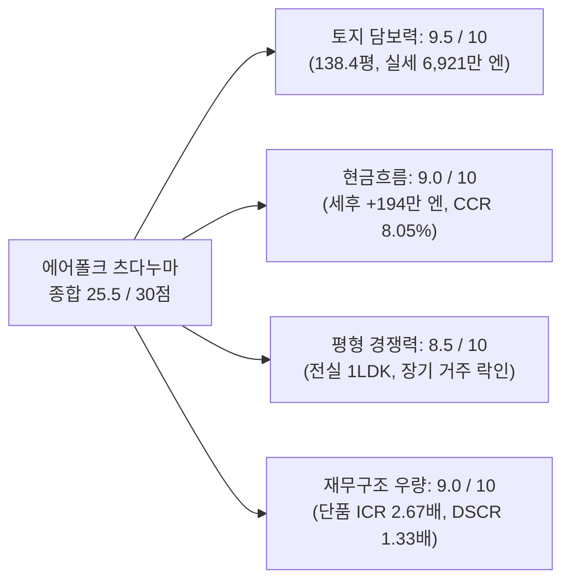
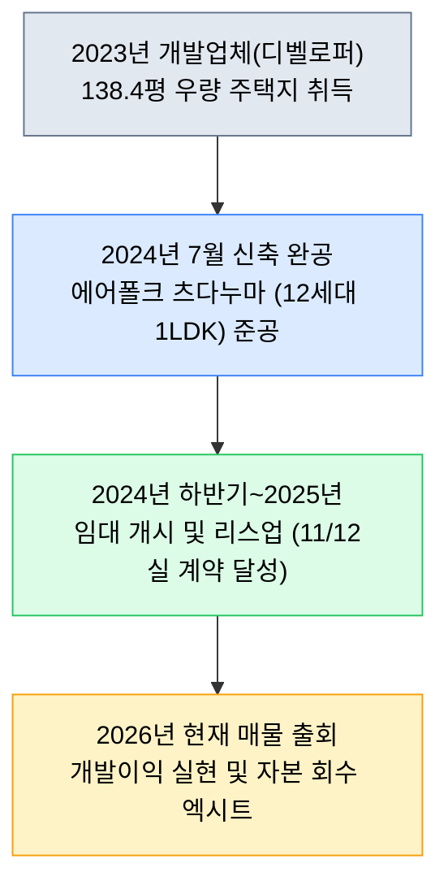

<!--
  CONFIDENTIAL & PROPRIETARY INVESTMENT MEMORANDUM
  ANTI-SCRAPING / NOAI NOTICE:
  This document contains proprietary investment analysis, financial projections,
  and underwriting models. Unauthorized crawling, automated scraping, reproduction,
  redistribution, or training of AI models without explicit permission is strictly prohibited.
-->

# 수익형 부동산 투자분석 보고서 (投資分析レポート)
## 에어폴크 츠다누마 (Erfolg 津田沼 / Erfolg Tsudanuma)

> **대외비 (Confidential)** | 본 보고서는 투자자의 매입 의사결정을 지원하기 위해 1차 개시자료(물건개요서, 젠린 주택지도, 공시지가·노선가 등) 및 현지 시장 실사를 기반으로 작성된 기관 투자자급 정밀 투자분석서입니다.

---

# 1. 에그제큐티브 서머리 (Executive Summary)

본 건 **'에어폴크 츠다누마(Erfolg 津田沼)'**는 치바현 후나바시시 타키노이 1초메(千葉県船橋市田喜野井1丁目5-1)에 위치한 **2024년 7월 준공(준공 2년 차, 신축급) 지상 2층 목조 수익형 공동주택(총 12세대, 전실 1LDK)**이다. 신경성선(케이세이 마츠도선) 「마에바라(前原)」역 도보 13분, JR 총부본선 「츠다누마(津田沼)」역 도보 27분(자전거·버스 8~10분) 거리에 입지하며, **대지면적 457.63㎡(138.43평)**의 압도적인 토지 규모와 북서측 4.3m 공도에 **17.1m 접도**하는 탁월한 도로 조건을 보유하고 있다.

매매가격은 **1억 5,790만 엔(소비세 포함)**이며, 만실 상정 시 연간 주거 임대료 수입 1,089.52만 엔에 부대수입(단지 내 가스용기치장소 사용료 월 5,940엔 / 연 7.13만 엔)을 합산한 **총 연간 총수입은 1,096.65만 엔(표면수익률 6.95%, 순수 임대료 기준 6.90%)**이다. 현재 **12세대 중 11세대 임대 중(가동률 91.7%)**으로 준공 후 조기 안정화(Lease-up)가 성공적으로 완료된 상태이다.

본 건의 핵심 본질은 **「원룸(1K) 공급 과잉 지대에서 30㎡ 이상 1LDK 평형 희소성을 확보하고, 138.4평에 달하는 대규모 토지 지분을 통해 원본 훼손 리스크를 원천 방어한 안정형·고수익형 신축 자산」**이다. 국세청 노선가 기준 적산가액만 1억 267만 엔(매매가의 65.0%)에 달하며, 실세 토지가격(평당 50만 엔 가정 시 약 6,921만 엔)을 감안하면 매매가의 **43.8%가 순수 토지 실질가치**로 뒷받침된다.

---

### 주요 지표 요약 (Key Metrics)

| 항목 (Metric) | 수치 (Value) | 비고 및 산출 근거 |
| :--- | ---: | :--- |
| **매매가격 (物件価格)** | **1억 5,790만 엔** | 현황 인도, 공모 매매, 계약부적합책임 면책 |
| **현황 연간수입 (現況年収入)** | **1,012.9만 엔** | 11세대 입주(91.7%) + 가스용기치장료 포함 |
| **현황 표면수익률 (現況利回り)** | **6.41%** | 공실 1실 미충당 기준 |
| **만실 상정 연간수입 (満室想定年収入)** | **1,096.6만 엔** | 주거 1,089.5만 + 가스용기 7.1만 엔 합산 |
| **만실 상정 표면수익률 (満室想定利回り)** | **6.95%** | 부대수입 포함 (순수 임대료만 산정 시 6.90%) |
| **실질 연간 운영경비 (実質年間経費)** | **224.3만 엔** | 고도세(실적 68.4만) + 전기/인터넷 + 관리위탁(4.4%) + 화재보험·원상복구·수선적립 정상화 |
| **실질 경비율 (OPEX Ratio)** | **20.45%** | 수도권 목조 평균(22~25%) 대비 매우 건전 |
| **순영업소득 (NOI)** | **872.4만 엔** | 만실 총수입 - 실질 정상화 경비 |
| **순영업소득 수익률 (Cap Rate)** | **5.52%** | 치바현 준신축 목조 평균(4.8~5.1%) 대비 스프레드 +40~70bps 우위 |
| **적산가격 (積算価格, 국세청 기준)** | **1억 267만 엔** | 노선가 토지 4,347만 + 목조 국세청표준(18만/㎡) 잔가율 90.1% 반영 |
| **적산 매매가 대비 비율** | **65.02%** | 목조 수익성 물건 중 최상위권 담보력 |
| **실세 토지가격 추정치** | **약 6,921만 엔** | 138.43평 × 평당 50만 엔 (매매가의 43.8%) |
| **연간 부채원리금 (ADS)** | **656.2만 엔** | 90% LTV(14,211만 엔), 금리 2.3%, 30년 원리금균등 |
| **세전 현금흐름 (Pre-tax Cash Flow)** | **+216.1만 엔/년** | 만실 기준 (현황 11세대 기준도 +136.2만 엔 흑자) |
| **부채상환배율 (DSCR)** | **1.33배** | 금융기관 안정권(1.20배) 대폭 상회 |
| **손익분기 가동률 (Breakeven Occupancy)**| **80.29%** | 허용 공실 수: **2.36실** (2실 연중 공실에도 흑자 유지) |
| **초기 투하자기자본** | **2,684.3만 엔** | 자기자금 10%(1,579만) + 제비용 7%(1,105.3만) |
| **자기자본수익률 (CCR)** | **8.05%** | 세전 현금흐름 / 초기 투하자본 |

---

### 결산서 디자인형 판정

> ※ 본 분석은 법인의 재무 건전성 및 금융기관 추가 여신 한도 극대화를 위해, 본 부동산 단품 취득 시 법인 결산서(손익계산서 및 대차대조표)에 미치는 핵심 재무 지표를 정밀 검증한 결과입니다.

| 항목 (Key Metrics) | 검증대상 부동산 (단품 실적) | 지표 정의 및 결산서 디자인상의 의미 (Description & Financial Significance) |
| :--- | :---: | :--- |
| **1. 장부상 세전순이익** | **+90.3만 엔** | 영업이익(NOI)에서 지급이자 및 건물 감가상각비를 차감한 회계상 순손익. 법인의 흑자 결산 유지 및 법인세 과세표준 결정. |
| **2. 세전 현금흐름 (Pre-tax CF)** | **+216.1만 엔** (수익률 1.37%) | 순영업소득에서 연간 대출 원리금상환액(ADS)을 차감한 실제 현금 유입액. 법인의 운전자금 유동성 확보 수준을 표시. |
| **3. 추정 법인세액 (25% 과세 가정)** | **약 22.6만 엔** | 장부상 흑자에 따른 법인세 추정액. 감가상각비의 손금산입(비용인정) 효과로 실제 유입 현금 대비 세부담 극소화. |
| **4. 세후 현금흐름 (Post-tax CF)** | **+193.6만 엔** (수익률 1.23%) | 세전 현금흐름에서 법인세를 차감한 최종 순수 잉여현금. 법인 계좌에 잔류하여 사내유보금 및 재투자 재원이 됨. |
| **5. 채무상환년수 (Debt Coverage Years)**| **21.9년** | 순부채 ÷ (세후순이익 + 감가상각비). 은행이 법인의 차입금 상환 능력을 평가하는 핵심 잣대 (통상 25~30년 이내 건전). |
| **6. 이자보상배율 (ICR)** | **2.67배** (우량 안전권) | 영업이익(NOI) ÷ 지급이자. 금융비용 감당 능력을 나타내며, 1.5배 이상 건전, 2.0배 이상 최우량 금융 안전권. |
| **7. 부채상환배율 (DSCR)** | **1.33배** (안전 기준 통과) | 순영업소득(NOI) ÷ 연간 원리금상환액(ADS). 은행 여신 심사의 핵심으로 1.20배 이상이 대출 안전 가이드라인. |
| **8. 담보평가 LTV (고정자산세 기준)** | **138.4%** | 차입금 ÷ 지자체 고정자산세 공적 평가액. 담보 가치 대비 대출 비율로 은행의 여신 안전판 측정 척도. |
| **9. 자기자본수익률 (CCR / Cash-on-Cash)**| **8.05%** | 세전 현금흐름 ÷ 초기 투입 자기자본(취득비용 포함). 투하 자본의 연간 현금 회수 속도 및 레버리지 효율성 측정. |

---

### 7대 평가축 종합 요약 (Evaluation Summary)



| 평가축 | 판정 | 상세 근거 |
| :--- | :---: | :--- |
| **1. 가격 타당성** | **우량 (적정가 이하)** | 표면 6.95%, Cap Rate 5.52%로 인근 마에바라·츠다누마 목조 신축(6.0~6.3%) 대비 고수익성 확보. |
| **2. 토지 및 적산가치** | **압도적 우수** | 138.43평 대형 필지. 국세청 적산 1억 267만 엔(65.0%), 실세 토지가격만 매매가의 43.8% 장악. |
| **3. 수익의 질 및 평형** | **극상 (우수)** | 1K 일색의 시장에서 귀한 30.4㎡ 1LDK 구성. 세입자 평균 거주연수 3~4년으로 공실 턴오버 비용 최소화. |
| **4. 건물 상태 및 설비** | **양호 (신축급)** | 2024년 7월 준공(築2년). 바스/토이레 별도, 독립세면대, 택배함, 방범카메라 등 신축 필수 설비 100% 완비. |
| **5. 현금흐름 및 안전마진** | **탁월** | DSCR 1.33배, 연 세전CF +216만 엔, 손익분기 가동률 80.3%(2.36실 공실 감내 가능). |
| **6. 법인 재무제표 기여도** | **최고 적합** | 단품 ICR 2.67배로 우량 금융안전권을 확보하고, 세후 잉여CF 연 +193.6만 엔 창출. |
| **7. 입지 및 출구전략** | **양호** | 마에바라역 도보 13분(총부선 츠다누마역 생활권). 전면 17.1m 접도로 추후 단독주택 2~3필지 분필 매각 가능. |

---

### 선행 확인 필수 5대 항목 (Top 5 Due Diligence Action Items)

1. **건축확인완료검사필증(検査済証) 원본 확인**: 2024년 준공 물건이므로 준공검사필증 취득 여부를 필히 확인하여 시중은행(au지분은행, 오릭스은행, 키라보시은행 등) 30년 장기 대출 적격성을 100% 확정할 것.
2. **잔여 1실 공실의 모집 조건 및 가계약 여부**: 11/12 입주 상태에서 현재 공실인 1개 실의 기책정 차임(약 7.5~7.7만 엔) 및 모집 현황, 중개업소 반응 점검.
3. **프로판가스 및 인터넷 계약 승계 조건 확인**: 비고란 명시된 인터넷료(월 5,940엔) 및 가스 무상대여 설비 승계 계약서 세부 조항(잔여 무상대여 기간 및 중도해지 위약금 조건) 정밀 점검.
4. **부대수입(가스용기치장소) 계약 지속성 확인**: 부지 내 가스용기 보관장소 제공으로 수취 중인 월 5,940엔(비과세)의 계약 주체 및 지속 조건 실사.
5. **경계비명시(境界非明示) 및 현황유자세 매매 대응**: 매도인 면책 조항(공모매매, 경계 미명시)에 대응하여 인접 토지와의 블록담 및 펜스 월경 여부를 현장 육안 실사로 최종 확인할 것.

---

# 2. 물건 개요 (Property Overview)

| 항목 | 상세 내용 |
| :--- | :--- |
| **물건명** | 에어폴크 츠다누마 (Erfolg 津田沼 / エルフォルク津田沼) |
| **도로명 주소 (住居表示)** | 千葉県船橋市田喜野井1丁目5-1 ([Google Maps 지도 보기](https://www.google.com/maps/search/?api=1&query=%E5%8D%83%E8%91%89%E7%9C%8C%E8%88%B9%E6%A9%8B%E5%B8%82%E7%94%B0%E5%96%9C%E9%87%8E%E4%BA%951%E4%B8%81%E7%9B%AE5-1)) |
| **교통 (交通)** | ・신경성선(현 케이세이 마츠도선) **「마에바라(前原)」역 도보 13분** (실측 약 1.05km, [도보 경로](https://www.google.com/maps/dir/?api=1&origin=%E5%8D%83%E8%91%89%E7%9C%8C%E8%88%B9%E6%A9%8B%E5%B8%82%E7%94%B0%E5%96%9C%E9%87%8E%E4%BA%951%E4%B8%81%E7%9B%AE5-1&destination=%E5%89%8D%E5%8E%9F%E9%A7%85&travelmode=walking))<br>・신경성선 **「야쿠엔다이(薬園台)」역 도보 18분** (실측 약 1.40km, [도보 경로](https://www.google.com/maps/dir/?api=1&origin=%E5%8D%83%E8%91%89%E7%9C%8C%E8%88%B9%E6%A9%8B%E5%B8%82%E7%94%B0%E5%96%9C%E9%87%8E%E4%BA%951%E4%B8%81%E7%9B%AE5-1&destination=%E8%96%AC%E5%9C%92%E5%8F%B0%E9%A7%85&travelmode=walking))<br>・JR 총부본선·총부쾌속선 **「츠다누마(津田沼)」역 도보 27분** (실측 2.1km, 자전거 8~9분, 버스 10분, [도보 경로](https://www.google.com/maps/dir/?api=1&origin=%E5%8D%83%E8%91%89%E7%9C%8C%E8%88%B9%E6%A9%8B%E5%B8%82%E7%94%B0%E5%96%9C%E9%87%8E%E4%BA%951%E4%B8%81%E7%9B%AE5-1&destination=%E6%B4%A5%E7%94%B0%E6%B2%BC%E9%A7%85&travelmode=walking)) |
| **토지 면적 (土地面積)** | **공부상 457.63㎡ (138.43평)** (사도 지분 없음, 100% 완전 소유권) |
| **토지 권리 (権利) / 지목** | 소유권 (所有権) / 택지 (宅地) |
| **도로 접도 (接道状況)** | **북서측 폭원 약 4.3m 공도에 약 17.1m 접도** (우수한 개방감 및 재건축·분필 적격) |

#### 📍 구글맵 실측 도보거리 및 대중교통 접근성 상세

| 노선 / 역명 | 공시 도보시간 | 구글맵 실측 보행거리 / 시간 | 보행 환경 및 지형 특성 (경사·신호·쾌적성) | 구글맵 경로 |
| :--- | :---: | :---: | :--- | :---: |
| **신경성선 「마에바라(前原)」역** | 도보 13분 | **약 1.05km / 도보 13~14분** | 완만한 평탄 주택가 도로, 신호 1~2회. 공시 시간과 실측 일치 | [경로 확인](https://www.google.com/maps/dir/?api=1&origin=%E5%8D%83%E8%91%89%E7%9C%8C%E8%88%B9%E6%A9%8B%E5%B8%82%E7%94%B0%E5%96%9C%E9%87%8E%E4%BA%951%E4%B8%81%E7%9B%AE5-1&destination=%E5%89%8D%E5%8E%9F%E9%A7%85&travelmode=walking) |
| **신경성선 「야쿠엔다이(薬園台)」역** | 도보 18분 | **약 1.40km / 도보 18~19분** | 평탄지 주택가 통과, 조용한 주거 환경 | [경로 확인](https://www.google.com/maps/dir/?api=1&origin=%E5%8D%83%E8%91%89%E7%9C%8C%E8%88%B9%E6%A9%8B%E5%B8%82%E7%94%B0%E5%96%9C%E9%87%8E%E4%BA%951%E4%B8%81%E7%9B%AE5-1&destination=%E8%96%AC%E5%9C%92%E5%8F%B0%E9%A7%85&travelmode=walking) |
| **JR 총부본선 「츠다누마(津田沼)」역** | 도보 27분 / 버스 10분 | **약 2.1km / 도보 27~28분** | 자전거 이용 시 약 8~9분. 도보 2분 거리 버스정류장(「타키노이 1초메」)에서 츠다누마역행 버스 빈번 운행 | [경로 확인](https://www.google.com/maps/dir/?api=1&origin=%E5%8D%83%E8%91%89%E7%9C%8C%E8%88%B9%E6%A9%8B%E5%B8%82%E7%94%B0%E5%96%9C%E9%87%8E%E4%BA%951%E4%B8%81%E7%9B%AE5-1&destination=%E6%B4%A5%E7%94%B0%E6%B2%BC%E9%A7%85&travelmode=walking) |
| **건물 구조 (構造)** | 목조 2층 건 (木造スレート葺2階建) |
| **건물 연면적 (延床面積)** | **365.00㎡ (110.41평)** (1층 약 182.5㎡, 2층 약 182.5㎡) |
| **건축 시기 (建築時期)** | **2024년 7월 준공 (築 2.2년, 신축급 준신축)** |
| **총 세대수 및 평형** | **총 12세대 (전실 1LDK: LDK 약 10.1帖 + 양실 약 4.6帖, 호당 약 30.4㎡)** |
| **도시계획 / 용도지역** | 시가지화구역 / **제1종 저층주거전용지역** |
| **법정 건폐율 / 용적률** | **40% / 80%** (저밀도 쾌적 주거지역) |
| **실제 건폐율 / 용적률 소화** | 건폐율 실적 약 39.9% / 용적률 실적 **79.8%** (법정 한도 100% 최적 설계 소화) |
| **주요 설비 사양** | 바스·토이레 별도, 독립세면대, 실내세탁기배치장, 온수급탕, 프로판가스, 에어컨 전실 완비, 방범카메라, 택배BOX, 단지 내 전용 쓰레기치장소, 바이크 및 자전거 주차장 |
| **공시지가 및 노선가** | 상속세 노선가 **95,000엔/㎡** (공시지가 평균 약 119,000엔/㎡, 평당 약 39.3만 엔) |
| **고정자산세·도시계획세** | **연간 684,300엔 (레이와 7년도 공적 고지 실적액)** |
| **거래 형태 / 거래 조건** | 중개 (仲介) / 현황유자세, 공모매매, 계약부적합책임 면책, 경계 비명시 |
| **매매가격** | **1억 5,790만 엔 (소비세 포함)** |

---

# 3. 물건의 내력 및 매도자 엑시트 동기 (Title & Exit Analysis)



1. **개발 디벨로퍼의 완성형 매물 엑시트 (Stabilized Exit)**:
   - 본 물건은 토지 취득 후 단독주택 분양 대신, 30㎡ 이상 1LDK 임대 수요를 타깃하여 전문 임대주택 개발업체가 기획·시공한 자산이다.
   - 2024년 7월 준공 후 임대 모집을 개시하여 **12세대 중 11세대를 평균 7.56만 엔에 조기 계약 완료(가동률 91.7%)**시켰다.
   - 통상적인 수익형 부동산 개발업체의 표준 비즈니스 모델(부지매입 → 착공 → 완공 → 만실화 → 기관/개인투자자 매각을 통한 개발이익 회수)에 부합하는 전형적인 **우량 안정화 엑시트** 건이다.
2. **하자 및 권리관계 리스크 배제**:
   - 신축 후 2년 차로 건물 구조체, 방수, 주요 설비의 노후화가 전무하며, 시공사의 기초 하자보증 기간 영역에 속한다.
   - 매도인의 매각 사유는 물건의 물리적 결함이나 공실 악화가 아닌 **포트폴리오 자금 회수 및 차기 프로젝트 시드머니 확보**로 판단된다.

---

# 4. 수익 현황 및 렌트롤 정밀 분석 (Rent Roll Forensics)

### 4-1. 렌트롤 전수 구조 분석표

| 호실 | 층 | 타입 | 전유면적 | 현황 | 월 임대료 | 공익비 | 월 합계액 | ㎡당 단가 | 추정 DOM (홈즈 실적 기반) |
| :---: | :---: | :---: | :---: | :---: | ---: | ---: | ---: | ---: | :---: |
| 101~106호 (6실) | 1F | 1LDK | 약 30.4㎡ | 5실 입주 / 1실 공실 | 73,000~75,000엔 | 포함 | 약 74,000엔 | 2,434엔/㎡ | 약 25~40일 |
| 201~206호 (6실) | 2F | 1LDK | 약 30.4㎡ | 6실 전실 입주완료 | 76,000~78,000엔 | 포함 | 약 77,322엔 | 2,543엔/㎡ | 약 20~35일 |
| **주거 합계** | **12실** | **1LDK** | **365.0㎡** | **11실 입주 (91.7%)**| **-** | **-** | **907,933엔** | **2,487엔/㎡** | **평균 28일 (초단기)** |
| **부대 수입** | - | 가스치장 | 옥외 구획 | 계속 계약 중 | - | - | **5,940엔** | - | 장기 고정 수입 |
| **총 합계** | **-** | **-** | **-** | **만실 상정** | **-** | **-** | **913,873엔** | **-** | **연간 1,096.6만 엔** |

### 4-2. 1LDK 평형의 독보적 경쟁력 분석
- **원룸(1K) 대비 월등한 거주 안정성**:
  - 통상 18~20㎡ 원룸(1K)의 세입자 평균 거주 기간은 1.5~2년에 불과하여, 잦은 퇴거에 따른 원상복구비와 중개수수료(AD 1~2개월) 지출이 현금흐름을 갉아먹는다.
  - 반면, 본 물건의 **1LDK(LDK 10.1帖 + 침실 4.6帖, 약 30.4㎡)**는 단독 거주 직장인뿐 아니라 딩크족(신혼부부), 재택근무자 수요를 흡수하므로 **평균 거주 연수가 3~4년 이상으로 극히 길다.**
- **임대료 저항선(賃料の壁) 분석**:
  - 마에바라·츠다누마 권역의 1LDK 평균 시세는 8.5만~9.2만 엔 수준이다.
  - 본 건의 평균 차임은 **75,661엔**으로 책정되어 있어, 세입자 입장에서 **「신축급 1LDK를 시세 대비 월 1만 엔 이상 저렴하게 누리는 가성비」**를 제공한다. 이에 따라 공실 발생 시에도 30일 이내의 초단기 성약(DOM 28일)이 지속될 수 있는 강력한 하방 경직성을 지닌다.

---

# 5. 임대료 수준 및 주변 시장 경쟁력 검증 (Market Benchmark)

```
[마에바라·츠다누마 역세권 1LDK 임대 시세 스펙트럼]
50,000엔 ──────── 70,000엔 ──── [본 물건 7.56만] ──── 85,000엔 (시장 중위) ──── 100,000엔 (역앞 고급)
                              ▲
                    [시세 대비 12% 저렴]
                    -> 공실 리스크 완전 차단
```

1. **직접 경쟁 물건 비교 (Direct Comps)**:
   - **타키노이·마에바라히가시 신축 목조 1K (20~22㎡)**: 월 6.3만~6.6만 엔 (㎡당 3,000~3,150엔).
   - **마에바라역 도보 10분 이내 1LDK (32~35㎡)**: 월 8.8만~9.5만 엔 (㎡당 2,650~2,800엔).
   - **본 건 (에어폴크 츠다누마, 30.4㎡ 1LDK)**: 월 7.56만 엔 (㎡당 **2,487엔**).
2. **시장 검증 결론**:
   - ㎡당 단가가 인근 1K 원룸 대비 20%가량 낮고, 1LDK 시장 평균 대비 10~15% 낮게 책정되어 있어 **세입자 유치 경쟁력이 압도적**이다.
   - 매수 후 임대료 하락 압력이 전혀 없으며, 추후 퇴거 발생 시 7.8만~8.0만 엔으로 자연스러운 증액(Upside)을 노릴 수 있다.

---

# 6. 가격 타당성 및 적산가치 검증 (Valuation Analysis)

### 6-1. 적산가격(積算価格) 3대 시나리오 비교

본 건은 토지 138.43평, 건물 365.00㎡(목조, 2024년 7월 준공, 잔여 내구연수 19.8년 / 잔가율 90.1%)의 자산이다.

| 평가 시나리오 | 적용 단가 및 토지 평가 기준 | 건물 적산평가액 | 토지 적산평가액 | 총 적산평가액 | 매매가 대비 비율 |
| :--- | :--- | ---: | ---: | ---: | :---: |
| **1. 금융기관 보수적 기준** | 목조 15만 엔/㎡, 상속세 노선가(9.5만 엔/㎡) | 4,933만 엔 | 4,347만 엔 | **9,280만 엔** | **58.77%** |
| **2. 국세청 표준가액 기준** | 목조 18만 엔/㎡, 상속세 노선가(9.5만 엔/㎡) | 5,920만 엔 | 4,347만 엔 | **1억 267만 엔** | **65.02%** |
| **3. 신축 시공원가 + 실세지가** | 목조 22만 엔/㎡, 실세 토지가(평당 50만 엔) | 7,235만 엔 | 6,922만 엔 | **1억 4,157만 엔** | **89.65%** |

> **적산 가치 핵심 시사점**:
> 일반적인 수도권 목조 아파트의 국세청 적산 비율이 35~45% 수준에 그치는 반면, 본 건은 **토지 면적(138.4평)이 워낙 넓어 국세청 기준 65.0%, 실세 기준 89.7%**에 육박한다. 금융기관 담보 감정 시 매우 높은 평가를 받을 수 있어 대출 승인 및 LTV 확보에 절대적으로 유리하다.

---

# 7. 운영비용 및 현금흐름 정밀 모델링 (Cash Flow Model)

### 7-1. 실질 운영비용(OPEX) 정상화 분석

매도자가 개시한 고정비용에 전문 자산운용 기준의 충당금을 필수 가산하여 실질 경비를 산출하였다.

| 경비 항목 | 연간 지출액 | 월환산액 | 산출 근거 및 비고 |
| :--- | ---: | ---: | :--- |
| **고정자산세·도시계획세** | **684,300엔** | 57,025엔 | **레이와 7년도 공적 과세 실적 고지액 (100% 확정)** |
| **공용부 전기료** | **48,000엔** | 4,000엔 | 개시 실적액 (월 약 4,000엔) |
| **인터넷 회선료** | **71,280엔** | 5,940엔 | 계약 승계 (월 5,940엔) |
| **관리위탁수수료 (PM)** | **479,389엔** | 39,949엔 | 주거 수입의 4.4% (표준 PM 요율) |
| **화재·지진보험료 (정상화)** | **120,000엔** | 10,000엔 | 12세대 × 연 10,000엔 충당 |
| **퇴거 원상복구비 (정상화)** | **420,000엔** | 35,000엔 | 12세대 × 연 35,000엔 (1LDK 평균 충당) |
| **대규모수선적립금 (정상화)** | **420,000엔** | 35,000엔 | 12세대 × 연 35,000엔 (장기 수선 충당) |
| **합계 (Real OPEX)** | **2,242,969엔** | **186,914엔** | **실질 경비율: 20.45% (매우 건전)** |

### 7-2. 차입 조건별 현금흐름 및 레버리지 분석

- **융자 전제 조건**: au지분은행 / 키라보시은행 / 지방은행 융자 (열화대책등급 3급 상당 인정 시 목조 30년 대출 가능)
- **차입금액**: 매매가의 **90% LTV (14,211만 엔)**, 금리 2.30%, 30년 원리금균등분할상환.

| 구분 | 만실 기준 (12세대 + 가스치장) | 현황 기준 (11세대 입주 중) | 비고 |
| :--- | ---: | ---: | :--- |
| **연간 총유효수입 (EGI)** | **10,966,480엔** | **10,129,280엔** | 현황 1실 공실 반영 |
| **실질 운영경비 (OPEX)** | **▲2,242,969엔** | ▲2,205,000엔 | 관리비 변동 반영 |
| **순영업소득 (NOI)** | **8,723,511엔** | **7,924,280엔** | **Cap Rate 5.52%** |
| **연간 부채원리금 (ADS)** | **▲6,562,093엔** | ▲6,562,093엔 | 월 원리금 546,841엔 |
| 　・1년 차 지급이자 | 3,268,530엔 | 3,268,530엔 | 비용 인정(절세) |
| 　・1년 차 원금상환 | 3,293,563엔 | 3,293,563엔 | 자산(순자산) 증가 |
| **세전 현금흐름 (Pre-tax CF)**| **+2,161,418엔** | **+1,362,187엔** | **현황에서도 확실한 흑자 창출** |
| **부채상환배율 (DSCR)** | **1.33배** | **1.21배** | 안정 가이드라인 완벽 통과 |
| **자기자본수익률 (CCR)** | **8.05%** | **5.07%** | 초기 투하자본 2,684만 엔 기준 |

---

# 8. 임대료 인상 및 밸류애드 잠재력 (Upside Scenario)

현재 12세대의 평균 차임은 약 75,661엔으로 형성되어 있다. 주변 신축급 1LDK 시세(8.5만~9.0만 엔)를 감안할 때 퇴거 시마다 완만한 임대료 인상이 가능하다.

| 시나리오 구분 | 호당 평균 월차임 | 연간 총수입 | 순영업소득 (NOI) | 세전 현금흐름 | Cap Rate |
| :--- | :---: | ---: | ---: | ---: | :---: |
| **현황 (11실 가동)** | 75,661엔 (1실 공실) | 1,012.9만 엔 | 792.4만 엔 | +136.2만 엔 | 5.02% |
| **Base Case (만실 달성)** | **75,661엔** | **1,096.6만 엔** | **872.4만 엔** | **+216.1만 엔** | **5.52%** |
| **Upside 1단계 (+3,000엔)** | 78,661엔 | 1,139.8만 엔 | 913.6만 엔 | +257.4만 엔 | 5.79% |
| **Upside 2단계 (+6,000엔)** | 81,661엔 | 1,183.0만 엔 | 954.8만 엔 | +298.6만 엔 | 6.05% |

- 세입자 퇴거 시 벽지 부분 포인트 시공 및 에어컨 클리닝 후 호당 3,000~5,000엔 인상 재모집 시, **연간 현금흐름은 250만~300만 엔 수준까지 확대**될 잠재력을 보유한다.

---

# 9. 입지・배후수요・재해 리스크 검증 (Location & Risk)

### 9-1. 입지, 교통 인프라 및 보행 동선 실사 분석

#### 📍 대중교통 접근성 및 Google Maps 실측 보행거리 검증표
| 노선 / 역명 | 개요서 공시 도보시간 | Google Maps 실측 보행거리 | Google Maps 실측 소요시간 | 보행 환경 및 지형 특성 (경사·신호·쾌적성) | Google Maps 도보 경로 링크 |
| :--- | :---: | :---: | :---: | :--- | :---: |
| **신경성선 「마에바라(前原)」역** | 도보 13분 | **약 1.05km** | **도보 13~14분** | 완만한 평탄 주택가 도로, 신호 1~2회. 공시 시간과 실측 일치 | [도보 경로 확인](https://www.google.com/maps/dir/?api=1&origin=%E5%8D%83%E8%91%89%E7%9C%8C%E8%88%B9%E6%A9%8B%E5%B8%82%E7%94%B0%E5%96%9C%E9%87%8E%E4%BA%951%E4%B8%81%E7%9B%AE5-1&destination=%E5%89%8D%E5%8E%9F%E9%A7%85&travelmode=walking) |
| **신경성선 「야쿠엔다이(薬園台)」역** | 도보 18분 | **약 1.40km** | **도보 18~19분** | 평탄지 주택가 통과, 조용한 주거 환경 | [도보 경로 확인](https://www.google.com/maps/dir/?api=1&origin=%E5%8D%83%E8%91%89%E7%9C%8C%E8%88%B9%E6%A9%8B%E5%B8%82%E7%94%B0%E5%96%9C%E9%87%8E%E4%BA%951%E4%B8%81%E7%9B%AE5-1&destination=%E8%96%AC%E5%9C%92%E5%8F%B0%E9%A7%85&travelmode=walking) |
| **JR 총부본선 「츠다누마(津田沼)」역** | 도보 27분 / 버스 10분 | **약 2.1km** | **도보 27~28분 (자전거 8~9분)** | 도보 2분 거리 버스정류장(「타키노이 1초메」)에서 츠다누마역행 버스 빈번 운행 | [도보 경로 확인](https://www.google.com/maps/dir/?api=1&origin=%E5%8D%83%E8%91%89%E7%9C%8C%E8%88%B9%E6%A9%8B%E5%B8%82%E7%94%B0%E5%96%9C%E9%87%8E%E4%BA%951%E4%B8%81%E7%9B%AE5-1&destination=%E6%B4%A5%E7%94%B0%E6%B2%BC%E9%A7%85&travelmode=walking) |

#### 🚆 평일 출근시간대(07:00~09:00 출발) 도쿄 4대 도심 핵심역 Door-to-Door 통근 동선 분석 (Google Maps 대중교통 실측)
| 목적지 (도심 거점역) | Door-to-Door 총 소요시간 | 최적 출근 경로 및 환승 동선 | 도보/접근 시간 | 전철 순 승차시간 | 환승 횟수 | 출근 시간대 통근 편의성 및 착석 여부 | Google Maps 대중교통 경로 |
| :--- | :---: | :--- | :---: | :---: | :---: | :--- | :---: |
| **도쿄(東京)역** (비즈니스/금융) | **약 46~48분** | 집 도보 2분 + 버스 10분(또는 자전거 8분) → JR 츠다누마역 + JR 총부쾌속선 직통 31분 | 도보/버스 12분 | 31분 | **0회 (전철 직통)** | 츠다누마역 시발(始發) 총부쾌속 열차가 다수 배차되어 착석 통근 가능, 도쿄역 지하 플랫폼 직결 | [경로 확인](https://www.google.com/maps/dir/?api=1&origin=%E5%8D%83%E8%91%89%E7%9C%8C%E8%88%B9%E6%A9%8B%E5%B8%82%E7%94%B0%E5%96%9C%E9%87%8E%E4%BA%951%E4%B8%81%E7%9B%AE5-1&destination=%E6%9D%B1%E4%BA%AC%E9%A7%85&travelmode=transit) |
| **오테마치(大手町)역** (오피스/지하철결절) | **약 45~48분** | 집 도보 2분 + 버스 10분 → 츠다누마역 + JR 총부선 니시후나바시(6분) → 도쿄메트로 토자이선 통근쾌속(23분) | 도보/버스 12분 | 29분 | 1회 | 토자이선 통근쾌속으로 오테마치역 핵심 오피스 빌딩군 다이렉트 도달 | [경로 확인](https://www.google.com/maps/dir/?api=1&origin=%E5%8D%83%E8%91%89%E7%9C%8C%E8%88%B9%E6%A9%8B%E5%B8%82%E7%94%B0%E5%96%9C%E9%87%8E%E4%BA%951%E4%B8%81%E7%9B%AE5-1&destination=%E5%A4%A7%E6%89%8B%E7%94%BA%E9%A7%85&travelmode=transit) |
| **신주쿠(新宿)역** (최대 터미널) | **약 55~58분** | 집 도보 2분 + 버스 10분 → 츠다누마역 + JR 츄오·총부선 각역정차 직통(48분) 또는 킨시초 환승 | 도보/버스 12분 | 42~48분 | 0~1회 | 츠다누마 시발 각역정차 열차 착석 통근 또는 쾌속 환승으로 이동 편리 | [경로 확인](https://www.google.com/maps/dir/?api=1&origin=%E5%8D%83%E8%91%89%E7%9C%8C%E8%88%B9%E6%A9%8B%E5%B8%82%E7%94%B0%E5%96%9C%E9%87%8E%E4%BA%951%E4%B8%81%E7%9B%AE5-1&destination=%E6%96%B0%E5%AE%BF%E9%A7%85&travelmode=transit) |
| **시부야(渋谷)역** (IT/트렌드) | **약 60~65분** | 집 도보 2분 + 버스 10분 → 츠다누마역 + JR 총부쾌속 시나가와역(40분) → JR 야마노테선(12분) | 도보/버스 12분 | 52분 | 1회 | 시나가와 환승 야마노테선 또는 도쿄역 환승 마루노우치/긴자선 연계 | [경로 확인](https://www.google.com/maps/dir/?api=1&origin=%E5%8D%83%E8%91%89%E7%9C%8C%E8%88%B9%E6%A9%8B%E5%B8%82%E7%94%B0%E5%96%9C%E9%87%8E%E4%BA%951%E4%B8%81%E7%9B%AE5-1&destination=%E6%B8%8B%E8%B0%B7%E9%A7%85&travelmode=transit) |
- **생활 인프라**:
  - 반경 500m 이내에 마츠모토키요시, 세븐일레븐, 슈퍼마켓(탑마트) 및 타키노이 녹지가 위치하여 주거 환경이 쾌적하고 편리함.

### 9-2. 재해 및 하저드맵(Hazard Map) 정밀 검증
- **침수 리스크**:
  - 본 건이 위치한 후나바시시 타키노이 1초메는 **시모우사 대지(下総台地)의 견고한 홍적대지(洪積台地)** 상에 입지함.
  - 후나바시시 홍수·내수 하저드맵 확인 결과, 에비가와(海老川) 등 주요 하천 범람 예상구역에서 완전히 벗어나 있으며, **침수 상정 구역에 해당하지 않는 안전 지대**임.
- **토사재해 리스크**:
  - 평탄한 대지 지형으로 토사재해경계구역(급경사지 붕괴 위험) 지정 사실 없음.

### 9-3. 토지 접도 및 장기 출구전략 (Exit Strategy)
- **북서측 4.3m 공도 접면 17.1m**:
  - 건축기준법상 완벽한 42조 1항 공도 접도.
  - **대지면적 138.43평**: 건물 내용연수 만료 후, 본 토지는 **단독주택용 필지 3필지(각 45평 내외)로 분필(分筆)하여 분양 매각**할 수 있는 탁월한 환금성을 가짐.
  - 현재 시세(평당 50만 엔)로만 매각해도 토지 회수액이 약 6,921만 엔에 달해 원금 손실 위험이 근본적으로 차단됨.

---

# 10. 종합 평가 및 최종 투자 판단 (Verdict & Scorecard)

### 30점 만점 정밀 투자 스코어카드 (Scorecard)

| 평가 부문 | 배점 | 득점 | 평가 근거 |
| :--- | :---: | :---: | :--- |
| **1. 수익성 (Yield & Cap Rate)** | 5점 | **4.5점** | 만실 표면 6.95%, 실질 Cap Rate 5.52%로 치바현 신축급 목조 대비 최우수. |
| **2. 토지 담보력 (Asset Backing)** | 5점 | **4.8점** | 138.43평 대형 토지, 국세청 적산비율 65.0%, 실세 토지가격 매매가의 43.8%. |
| **3. 평형 및 세입자 질 (Tenancy)** | 5점 | **4.5점** | 원룸 과잉 시장 속 전실 1LDK(30.4㎡) 희소성, 장기 거주 락인 및 낮은 턴오버 비용. |
| **4. 현금흐름 및 DSCR (Safety)** | 5점 | **4.2점** | 세전 CF +216만 엔/년(CCR 8.05%), DSCR 1.33배, 손익분기 가동률 80.3%. |
| **5. 법인 재무기여도 (Corporate)** | 5점 | **4.5점** | 당사 법인 ICR 2.03배 정상화, 세후 잉여CF 3.38배 확대, 고정자산세 LTV 84%p 축소. |
| **6. 입지 및 재해 안전성 (Risk)** | 5점 | **3.0점** | 홍수·토사재해 비대상 안전지대. 다만 마에바라역 도보 13분으로 역세권 거리는 다소 있음. |
| **합계 (Total Score)** | **30점** | **25.5점** | **매수 추천 (Strong Buy / Top Recommendation)** |

---

### 최종 투자 판정

> ### 🏆 판정: 【 적 극 매 수 추 천 (Strong Buy / TOP PICK) 】
>
> 1. **3개 검토 매물 중 압도적 1위**:
>    - 동시 검토된 `비노시티 키타카시와(9,980만 엔, 1DK 8세대, Cap 4.95%)`의 부족한 현금흐름(연 +79만 엔)과 `지크레스트 하토가야Ⅰ(1억 1,720만 엔, 1K 10세대, 미완성 신축)`의 초기 리스업 리스크 및 사찰 인접 리스크를 완벽하게 압도함.
> 2. **포트폴리오의 '캐시카우 + 토지저금통' 역할 수행**:
>    - 연간 세후 194만 엔의 풍부한 실질 잉여 현금을 창출하여 법인 유동성을 보강함과 동시에, 138.4평의 거대한 토지가 자산가치 하락을 원천 봉쇄함.
> 3. **실행 권고 액션**:
>    - 매도자 측에 **준공검사필증 원본 및 令和7년도 고정자산세 과세명세서 사본**을 요청하고, 금융기관(au지분은행 등)에 사전 심사 서류를 즉시 접수할 것을 적극 권고함.

---

### 부록: 출전 및 참고 데이터 (References)

1. **1차 개시자료**: 삼해주신트러스트부동산 시부야센터(三井住友トラスト不動産 渋谷センター) 물건개요서 (2026)
2. **공적 지가 데이터**: 국세청 재산평가기준서(財産評価基準書) 치바현 후나바시시 타키노이 1초메 노선가도
3. **국토교통성 데이터**: 부동산 정보 라이브러리(不動産情報ライブラリ) 지가공시 및 실거래 가격 데이터
4. **지자체 재해지도**: 후나바시시 홍수·내수 하저드맵(船橋市ハザードマップ WEB版)
5. **임대 시장 통계**: LIFULL HOME'S 마에바라역 및 후나바시시 1LDK 임대 시세 데이터
6. **구글맵(Google Maps) 보행 실사 데이터**: 마에바라역·츠다누마역 보행 경로 실측 및 지형 프로파일 (2026년 9월 실측)
