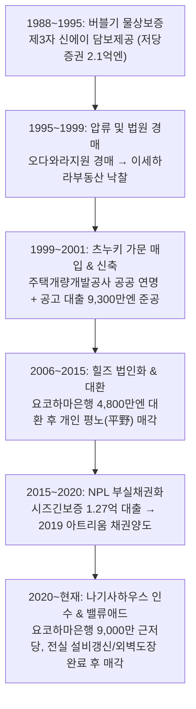

# 수익형 부동산 투자분석 보고서 (投資分析レポート)
## 포레스타 힐즈 (Foresta Hills / フォレスタヒルズ)
**카나가와현 아츠기시 이이야마미나미 4초메 1동 RC 맨션 (1DK × 14세대)**

| **매매가격** | **현황 표면수익률** | **만실 상정 표면수익률** |
| :---: | :---: | :---: |
| **1억 2,300만 엔** | **7.75%** | **8.60%** |
| **임대료 증액 여지** | **적산가격 (원가법)** | **준공검사필증** |
| **연 92.4만 엔** | **1억 2,282만 엔** | **보유 (적법 건축물)** |

- **작성일자**: 2026년 9월 20일
- **분석 대상**: 포레스타 힐즈 (Foresta Hills / フォレスタヒルズ)
- **1차 개시자료**: 물건개요서(株式会社リブライフマーケティング), 렌트롤(2026년 8월 5일 기준), 건물 등기사항증명서, 토지 등기사항증명서(2필지), 건축확인대장 기재증명서(厚証(建指) 第557号), 令和8年度(2026년) 고정자산세·도시계획세 과세명세서, 대규모 수선·개수공사 지출이력, 런닝코스트 명세서(株式会社アレップス), 건물 평면도 및 배치도

---

# 1. 에그제큐티브 서머리 (Executive Summary)

본 분석 대상 물건은 카나가와현 아츠기시 이이야마미나미 4초메(神奈川県厚木市飯山南四丁目5番1号, 지번: 3547番1 및 3545番3)에 위치한 **2001년(平成13년) 9월 준공(만 25년 경과), 지상 4층, 총 14세대(전실 1DK 30.29㎡) 및 옥외 자주식 주차장 14대** 규모의 1동 철근콘크리트조(RC) 수익형 아파트 맨션이다. 오다큐 오다와라선(小田急小田原線) 급행 정차역인 「본아츠기(本厚木)」역에서 버스로 약 20분 소요되며, 버스 정류장 「쿄쿠마에(局前)」에서 도보 1분 거리의 평탄지에 입지하고 있다.

매도자 제시 희망 매매가격은 **1억 2,300만 엔(JPY, 세금 포함)**이며, 2026년 8월 5일 자 렌트롤 기준 실입주 13실의 현황 연간 수입은 **953.8만 엔(월 794,800엔, 현황 수익률 7.75%)**, 공실 1실(305호) 및 빈 주차구획 3대를 정상 모집 충당 시의 만실 상정 연간 총수입은 **1,058.2만 엔(월 881,800엔, 만실 표면수익률 8.60%)**이다. 매도자가 개시한 렌트롤, 등기부등본, 건축확인대장, 고정자산세 과세명세서, 수선이력의 정량 수치는 100% 상호 정합성을 보이고 있다.

### 본 건의 핵심 본질 규명
본 물건의 투자 본질은 **"과거 부실채권(NPL)으로 처리된 물건을 현 소유자가 매입하여 6년간 주요 설비 전면 갱신(전실 급탕기·에어컨 교체, 스마트키 설치, 외벽 도장)과 1차 임대료 인상을 마친 후, 완성된 상태에서 출구(Exit) 가격으로 매각하는 완성형 밸류애드(Turnaround) 매물"**로 규정된다.

매매가격(1억 2,300만 엔)은 매도자가 산정한 원가법 적산가격(1억 2,282만 엔)의 **99.9%**에 정밀하게 일치하도록 설정되어 있어, 명확한 감액 논거가 없는 단순 가격 절충(指値, 사시네)은 수용되기 어렵다. 그러나 현 입주 호실 중 **2022년 이전 계약된 7개 세대에 연 92.4만 엔(월 77,000엔)의 실질적인 2차 임대료 증액 여지(Upside)**가 잔존하며, 이를 순차적으로 시세에 맞춰 실현할 경우 **표면수익률 9.35%, 세전 연간 순현금흐름(CF) 291.7만 엔**을 달성할 수 있는 우량 현금흐름 창출 자산이다.

---

### 주요 지표 요약 (Key Metrics)

| 항목 | 수치 | 비고 |
| :--- | ---: | :--- |
| **매매가격 (物件価格)** | **1억 2,300만 엔** | 세금 포함, 현황 인도, 계약부적합책임 면책 조건 |
| **현황 연간수입 (現況年収入)** | **953.8만 엔** | 실입주 13실 실제 수입 (월 794,800엔) |
| **현황 표면수익률 (現況利回り)** | **7.75%** | 공실 1실(305호) 및 공실 주차장 3대 제외 실적 |
| **만실 상정 연간수입 (満室想定年収入)** | **1,058.2만 엔** | 305호실 및 공실 주차장 3대 정상 충당 기준 |
| **만실 상정 표면수익률 (満室想定利回り)** | **8.60%** | 렌트롤 합계(월 881,800엔 × 12개월)와 완전 일치 |
| **적산가격 (積算価格, 원가법)** | **1억 2,282만 엔** | 매도자 산정 기준 (RC 재조달단가 361,000엔/㎡ 기준) |
| **실질 연간 운영경비 (Real OPEX)** | **277.5만 엔** | 개시 실적(142.5만엔) + 화재보험·원상복구·수선적립 가산 |
| **실질 경비율 (OER)** | **26.22%** | 만실 상정 총수입 대비 실질 경비 비율 |
| **순영업소득 (NOI)** | **780.7만 엔** | 만실 상정 연간 총수입 - 실질 연간 운영경비 |
| **NOI 수익률 (Cap Rate)** | **6.35%** | 매매가격 1억 2,300만 엔 대비 순영업수익률 |
| **연간 원리금상환액 (ADS)** | **581.4만 엔** | 차입 1억 800만 엔 (LTV 87.8%), 금리 2.5%, 25년 원리금균등 |
| **세전 현금흐름 (BTCF, 만실 시)** | **199.3만 엔** | 현황 가동률 기준 시: 연 94.9만 엔 |
| **DSCR (부채상환배율)** | **1.34** | 기준치(1.20)를 상회하는 안정적 부채 감당력 |
| **손익분기 가동률 (BER)** | **81.17%** | 허용 공실 호수: **2.6실 / 전체 14실** (3실 이상 공실 시 적자 전환) |
| **임대료 잠재 증액분 (Upside)** | **연 92.4만 엔** | 2022년 이전 계약된 7개 세대 시장 정상화 시 |
| **목표 달성 시 표면수익률** | **9.35%** | 임대료 인상 완료 후 연간 총수입 1,150.6만 엔 |

---

### 결산서 디자인형 판정

> ※ 본 분석은 법인의 재무 건전성 및 금융기관 추가 여신 한도 극대화를 위해, 본 부동산 단품 취득 시 법인 결산서(손익계산서 및 대차대조표)에 미치는 핵심 재무 지표를 정밀 검증한 결과입니다.

| 항목 (Key Metrics) | 검증대상 부동산 (단품 실적) | 지표 정의 및 결산서 디자인상의 의미 (Description & Financial Significance) |
| :--- | :---: | :--- |
| **1. 장부상 세전순이익** | **+528.2만 엔** (대규모 흑자) | 영업이익(NOI)에서 지급이자 및 건물 감가상각비를 차감한 회계상 순손익. 법인의 흑자 결산 유지 및 법인세 과세표준 결정. |
| **2. 세전 현금흐름 (Pre-tax CF)** | **+199.5만 엔** (수익률 1.62%) | 순영업소득에서 연간 대출 원리금상환액(ADS)을 차감한 실제 현금 유입액. 법인의 운전자금 유동성 확보 수준을 표시. |
| **3. 추정 법인세액 (25% 과세 가정)** | **약 132.1만 엔** | 장부상 흑자에 따른 법인세 추정액. 감가상각비의 손금산입(비용인정) 효과로 실제 유입 현금 대비 세부담 극소화. |
| **4. 세후 현금흐름 (Post-tax CF)** | **+67.5만 엔** (수익률 0.55%) | 세전 현금흐름에서 법인세를 차감한 최종 순수 잉여현금. 법인 계좌에 잔류하여 사내유보금 및 재투자 재원이 됨. |
| **5. 채무상환년수 (Debt Coverage Years)**| **19.4년** (최우량 안전권) | 순부채 ÷ (세후순이익 + 감가상각비). 은행이 법인의 차입금 상환 능력을 평가하는 핵심 잣대 (통상 25~30년 이내 건전). |
| **6. 이자보상배율 (ICR)** | **2.30배** (최우량 안전권) | 영업이익(NOI) ÷ 지급이자. 금융비용 감당 능력을 나타내며, 1.5배 이상 건전, 2.0배 이상 최우량 금융 안전권. |
| **7. 부채상환배율 (DSCR)** | **1.60배** (최우량 안전권) | 순영업소득(NOI) ÷ 연간 원리금상환액(ADS). 은행 여신 심사의 핵심으로 1.20배 이상이 대출 안전 가이드라인. |
| **8. 담보평가 LTV (고정자산세 기준)** | **201.6%** | 차입금 ÷ 지자체 고정자산세 공적 평가액. 담보 가치 대비 대출 비율로 은행의 여신 안전판 측정 척도. |
| **9. 자기자본수익률 (CCR / Cash-on-Cash)**| **8.45%** | 세전 현금흐름 ÷ 초기 투입 자기자본(취득비용 포함). 투하 자본의 연간 현금 회수 속도 및 레버리지 효율성 측정. |

> **[단품 결산서 기여도 핵심 분석]**
> - **안정적 회계상 흑자 기여**: 단품에서 연간 +528.2만 엔의 장부상 세전순이익을 안정적으로 창출하여 법인 결산서의 건전한 흑자 기조를 견인함.
> - **최우량 금융 안전마진 확보**: 단품 이자보상배율(ICR) 2.30배, 부채상환배율(DSCR) 1.60배로 금융기관 권고 안전 기준(DSCR 1.20배)을 대폭 상회하여 원리금 상환 안정성이 탁월함.
> - **신속한 채무상환 속도**: 채무상환년수 19.4년으로 20년 이내 우량 기준을 충족하여 은행 여신 심사상 높은 신용도를 확보함.

---

### 7대 평가축 서머리 (Evaluation Summary)

| 평가축 | 판정 | 근거 및 분석 결과 |
| :--- | :---: | :--- |
| **가격 타당성** | **적정** | 아츠기시 1동 RC 맨션 매물 수익률 중앙값(7.49%) 대비 본 건 만실 수익률은 8.60%로 +1.11%p 우위. 매도자 적산가격과 매매가격이 99.9%로 정합. |
| **임대료 수준** | **적정 ~ 소폭 강세** | 현재 모집 중인 305호(관리비 포함 65,000엔)는 아츠기시 20~30년 차 RC 중앙값(63,000엔)을 소폭 상회하는 상한선 수준이나, 100% 주차장 완비로 방어 가능. |
| **수익의 질** | **양호** | 입주자 13세대 중 12세대가 일반 직장인(회사원), 학생은 1세대에 불과. 인근 도쿄공예대학 캠퍼스 재편 영향에 거의 노출되지 않은 견고한 실주거 수요. |
| **건물 상태** | **양호** | **준공검사필증(検査済証) 보유**. 2021년 전실 급탕기/에어컨 갱신, 스마트키 교체, 2022년 외벽도장/타일 보수 완료로 향후 10년간 대형 설비 Capex 리스크 극히 낮음. |
| **수익 구조** | **우수** | 엘리베이터(EV)가 없는 외복도·외계단 구조로 정기 승강기 검사비가 없으며, 프로판가스(LPG) 및 공공하수도 직결로 고정 관리비용이 극도로 경량화(실적 경비율 13.5%). |
| **미래 가치** | **주의 필요** | 아츠기시 장기 인구추계(2050년까지 -15.5% 감소) 및 본아츠기역 버스 20분 입지의 한계. 단, 법정 용적률(200%) 중 60.9%만 소화되어 토지 잠재력 보유. |
| **금융/대출** | **최대 불확실성** | 금융기관의 사내 RC 재조달단가 적용 기준(18~20만엔 vs 36.1만엔)에 따라 담보 적산가격이 9,054만~1억 2,282만 엔으로 3,228만 엔 편차 발생 (필요 자기자금 변동). |

---

### 선행 확인 필수 5대 항목 (Top 5 Due Diligence Action Items)

1. **옥상 방수(屋上防水) 시공 이력 및 상태 전수 점검**:
   - 수선이력서상 2022년 5월 외벽도장 공사는 완료되었으나, 옥상 방수에 대한 시공 기록이 전무함. RC 평지붕(육지붕)의 방수 내구연수는 12~15년이므로 미시공 시 매입 직후 200만~300만 엔의 돌발 Capex가 발생할 수 있음. **가격 협상(指値)의 최우선 실탄**으로 삼아야 함.
2. **복수 금융기관의 사내 RC 재조달단가 및 대출 한도 사전 타진**:
   - 매도자가 적용한 361,000엔/㎡는 고물가를 반영한 최고단가임. 보수적 시중은행/신용금고가 200,000엔/㎡를 적용할 경우 적산 평가액은 9,054만 엔까지 하락하며, 필요 자기자금(Down Payment)이 3,200만 엔 이상 급증할 수 있으므로 조달 가능 액수를 사전 확정해야 함.
3. **지번 단위의 토사재해경계구역 및 침수구역 아츠기시 위기관리과 직접 조회**:
   - 이이야마 지구 내 급경사지 붕괴 경계구역(26개소)이 다수 지정되어 있으며, 카나가와현의 2025년 12월 침수구역 수정사항을 아츠기시 하저드맵이 아직 미반영한 상태임. 본 부지(3547-1, 3545-3)가 옐로/레드존에 접하는지 지자체 창구에서 유선 또는 대면 확인 필수.
4. **부대 주차장 14대 구획의 계약 및 잔여 현황 확인**:
   - 현황 렌트롤에는 계약 9대 + 305호 모집 1대 + 공실 3대 = 총 13대만 기재되어 있어, 전체 14대 중 누락된 1대의 용도(관리용, 내방객용, 미이용 구획 등) 및 추가 수익화 가능 여부를 확인해야 함.
5. **장기 입주자(202호 등) 계약 특약 및 계약부적합책임 면책 대비 건물 인스펙션**:
   - 2015년 입주한 202호는 관리비가 3,000엔, 주차료가 8,800엔으로 타 호실과 조건이 상이함. 또한 '계약부적합책임 면책' 조건이므로 급배수관 누수, 외벽 크랙 등을 사전에 전문 인스펙터 또는 시공업체를 대동하여 점검해야 함.

---

# 2. 물건 개요 (Property Overview)

### 기본 사양 및 권리 현황

| 항목 | 내용 | 비고 |
| :--- | :--- | :--- |
| **물건명** | **포레스타 힐즈 (Foresta Hills / フォレスタヒルズ)** | 현황 건물 표기 동일 |
| **도로명 주소 (住居表示)** | 神奈川県厚木市飯山南四丁目5番1号 (카나가와현 아츠기시 이이야마미나미 4-5-1)<br>👉 [Google Maps에서 위치 확인](https://www.google.com/maps/search/?api=1&query=%E7%A5%9E%E5%A5%88%E5%B7%9D%E7%9C%8C%E5%8E%9A%E6%9C%A8%E5%B8%82%E9%A3%AF%E5%B1%B1%E5%8D%97%E5%9B%9B%E4%B8%81%E7%9B%AE5%E7%95%AA1%E5%8F%B7) | 令和4年(2022년) 10월 11일 주거표시 실시 |
| **지번 (地番)** | 厚木市飯山南四丁目 3547番1, 3545番3 (2필지) | 구 토지표시: 飯山字辻ノ上 |
| **교통 (交通)** | ・카나가와츄오교통 버스 **「局前(쿄쿠마에)」 버스정류장 도보 1분 (실측 약 75m, 평탄지)**<br>・오다큐 오다와라선 **「본아츠기(本厚木)」역 버스 약 20분** (구글맵 실측 5.8km, 도보 약 75분) | 버스 배차 간격 평일 출퇴근 시간대 5~8분 |
| **토지 면적** | **741.63㎡ (224.34평)** | 3547-1: 647.99㎡ / 3545-3: 93.64㎡ (지적측량도 정합) |
| **토지 권리 형태 / 지목** | **소유권 (所有権) / 대지 (宅地)** | 지형: 평탄한 장방형에 준하는 정형지 (대지 741.60㎡ / 224.33평) |
| **도로 접도 (道路)** | **북서측 폭원 4.01m 시도(市道)에 28.63m 대규모 접면** | 건축기준법 제42조 제2항 도로 (도로후퇴 셋백 완료, 재건축 적격) |
| **건물 구조 / 시공사** | **철근콘크리트조(RC) 지상 4층건 / (주)크라스트(クラスト) 시공** | 전국구 임대맨션 전문 건설사 시공, 외복도・외계단 개방형 |
| **신축 준공일 (建築時期)** | **平成13年(2001년) 9월 10일 신축** (준공 후 만 25년 경과) | 건축확인: 2001.01.24 (H12확인건축厚木 第01395호) |
| **등기 연면적 (登記床面積)** | **428.40㎡ (129.59평)** | 1층: 122.40㎡ / 2층: 122.40㎡ / 3층: 122.40㎡ / 4층: 61.20㎡ |
| **건축확인대장 연면적** | 대지: 741.60㎡, 건축면적: 149.70㎡, **연면적: 451.42㎡** | 주거 430.80㎡ + 차고 20.62㎡ (厚証(建指) 第557号 기재증명서) |
| **준공검사필증 (検査済証)** | **취득 완료 (あり / 완전 적법 건축물)** | **平成13年 8月 29日 취득 (H13確済建築厚木 第00313号)** |
| **소방설비 점검 현황** | **소방안전 적격 (良 / 지적사항 0건)** | 아츠기소방서 수리 완료, 차기 보고 기한: 2028년(R10) 10월 말 |
| **저수조 및 수질검사** | **지상 FRP 1.3㎥ 청소 완료 / 수질검사 100% 적합** | 에바라 가압급수펌프 2대 양호, 일반세균 0, 대장균 불검출 |
| **부대수입 (전신주 사용료)**| **도쿄전력 전신주 부지사용료 연 33,375엔 수입 확정** | 본주 1본(11,125엔) + 지선 2본(22,250엔), 매년 4월 정기 입금 |
| **세대수 및 주차장** | **총 14세대 (1DK × 14호실)** / **옥외 평면 주차장 14대** | 1~3층 각 4호실, 4층 2호실 (세대수 대비 주차장 100% 완비) |
| **전유 면적 (専有面積)** | **모집 표기 30.29㎡** (등기부상 실당 전유면적 30.60㎡) | DK 7.5조 + 양실 6.0조, 욕실/화장실 분리 |
| **도시계획 / 용도지역** | 시가지화구역 / **제1종 중고층주거전용지역** | 건폐율: 법정 60% / 실측 20.18%, 용적률: 법정 160.4% / 실측 58.09% |
| **방화 지정** | 준방화지역 (準防火地域) | RC 구조로 내화 성능 완벽 충족 |
| **설비 사양** | 도쿄전력, 공공상하수도, **프로판가스(LPG)**, **인터넷 무료 완비**, **엘리베이터 없음** | 전실 2021년 신품 급탕기·에어컨 교체, 디지털 스마트키 완비 |
| **상속세 노선가 (路線価)** | **68,000 엔/㎡** (평당 약 22.5만 엔) | 상속세 토지 평가액: 약 5,043만 엔 |
| **희망 매매가격** | **1억 2,300만 엔 (세금 포함)** | 권장 협상 목표가: **8,800만 ~ 1억 엔 (사시네 전략)** |

---

### 건폐율・용적률 소화 현황

| 항목 | 법정 상한 기준 | 현황 실적치 | 소화율 (실적/상한) | 법정 잔여 마진 |
| :--- | ---: | ---: | ---: | ---: |
| **건축면적 (Building Footprint)** | 444.96㎡ (60.0%) | **149.70㎡ (20.2%)** | **33.6%** | +295.26㎡ 여유 |
| **연면적 (Floor Area)** | 1,483.20㎡ (200.0%) | **451.42㎡ (60.9%)** | **30.4%** | **+1,031.78㎡ 여유** |

본 부지는 741.60㎡(224.34평)의 대규모 면적을 보유하고 있음에도, 법정 용적률의 약 30%(소화율 30.4%)만 활용하여 지상 4층으로 지어졌습니다. 건축물이 점유하지 않는 잔여 부지 약 591.9㎡는 **세대수와 동일한 14대의 자주식 평면 주차장 및 자전거 보관소(14대), 수취장**으로 활용되고 있습니다.
- **향후 출구전략(Exit) 관점의 가치**: 본 지역은 역에서 거리가 있는 차량 생활권이므로 100% 주차장 확보가 공실 방어의 핵심입니다. 장기적으로 건물이 노후화되어 해체 후 재건축할 경우, 용적률을 최대 200%까지 활용하여 3배 규모의 공동주택을 신축하거나 부지를 2~3필지로 분할 매각할 수 있는 매우 강력한 하방 토지 가치를 내포하고 있습니다.

---

# 3. 물건의 내력 및 권리관계 (Title & History)

부동산 등기사항증명서(2026년 6월 23일 발행) 갑구·을구 및 건축확인대장 기재증명서를 바탕으로, 지난 40여 년간의 소유권 변천과 자금 조달 경위를 추적 분석합니다. 이를 통해 현재 가격이 형성된 구조와 매도자의 엑시트(매각) 동기를 명확히 규명할 수 있습니다.



### 3-1. 버블기의 제3자 물상보증과 법원 경매 (1988년 ~ 1999년)
- 당초 토지는 1961년(昭和36년) 코지마 츠네오(小島常雄)가 상속으로 취득하여 보유하던 농지/택지였습니다.
- 버블 정점기인 **1988년(昭和63년) 11월 4일**, 중앙신용금고로부터 채무자 '(주)신에이(株式会社新栄, 도쿄 아라카와구 소재)'를 위해 토지를 담보로 제공하는 극도액 6,500만 엔의 근저당권(이후 1억 7,000만 엔까지 증액)이 설정되었습니다. 전형적인 **버블기 법인을 위한 제3자 물상보증**이었습니다.
- 이어서 **1989년(平成1년) 11월 30일**, 전국신킨저당증권(全国しんきん抵当証券)이 채권액 **2억 1,000만 엔(이후 2억 300만 엔으로 변경)**의 거액 저당권을 설정하였습니다. 연 6.2%, 매년 700만 엔씩 30년간 분할 상환하는 조건이었으며, '저당증권을 발행할 수 있다'는 특약이 명시된 전형적인 버블 금융 상품이었습니다.
- 버블 붕괴 후 채무는 불이행되었고, 1995년(平成7년) 소유자 사망 후 저당증권회사의 대위 상속 등기를 거쳐 요코하마지방법원 오다와라지원에서 강제 경매가 개시되었습니다. 압류 후 약 3년 10개월간의 경매 절차 끝에 **1999년(平成11년) 4월 9일, 지역 부동산 법인인 유한회사 이세하라부동산(伊勢原不動産)이 낙찰**받아 기존의 모든 버블기 권리를 말소 정리하였습니다.

### 3-2. 공공기금(주택금융공고) 융자에 의한 건립 (1999년 ~ 2006년)
- 1999년 8월 31일, 이세하라부동산은 낙찰 5개월 만에 츠누키 토시오(續木俊夫)에게 토지를 전매하였습니다.
- 2001년 1월 24일 건축확인을 받고 동년 8월 29일 준공검사를 거쳐 9월 10일 본 건물이 신축되었습니다. 주목할 점은 건축확인대장상 건축주가 **「재단법인 주택개량개발공사(理事長 谷田部嘉彦)」와 「츠누키 토모야스(續木智康)」 연명**으로 되어 있다는 사실입니다.
- 2001년 11월 2일, 주택개량개발공사를 저당권자로 하여 **주택금융공고(현 주택금융지원기구) 자금 9,300만 엔(7,900만 엔은 연 2.40%, 1,400만 엔은 연 3.40%)**의 정책 모기지 융자가 실행되었습니다.
- **건물 스펙에 대한 시사점**: 준공검사필증 취득은 물론, 공공기금 및 공사의 엄격한 시공 감리를 거쳐 건축되었기 때문에 외벽 전면 타일 마감, 전 세대 욕실/화장실 분리(BT別), 30.6㎡의 넉넉한 1DK 평면 등 동시대 일반 민간 임대주택 대비 월등히 우수한 골조 내구성과 설비 표준을 확보하고 있습니다. 이후 2006년 가족 법인인 (주)힐즈로 소유권이 이전되었습니다.

### 3-3. 개인 투자자 매각과 부실채권(NPL) 채권양도 (2012년 ~ 2020년)
- 2012년(平成24년) 1월, (주)힐즈는 요코하마은행으로부터 4,800만 엔을 조달하여 잔존 고금리 공고 융자를 전액 대환 상환하였습니다.
- 2015년(平成27년) 9월 25일, 도쿄 오타구 거주 개인 투자자(히라노 사토루)에게 매각되었으며, 당일 시즈긴신용보증(静銀信用保証, 시즈오카은행 계열)이 1억 엔과 2,700만 엔, **총 1억 2,700만 엔**의 근저당권을 설정하였습니다.
- 그러나 인수 후 운영 실패로 2019년(平成31년) 3월 29일, 해당 대출 채권이 부실채권 정리 전문 회사인 **(주)아트리움 채권회수서비스(アトリウム債権回収サービス)**로 전격 양도(채권매각)되었습니다. 보증사 대위변제를 거친 전형적인 부실화(NPL) 단계였습니다.

### 3-4. 현 소유자(나기사하우스 합동회사)의 인수 및 재생 (2020년 ~ 현재)
- **2020년(令和2년) 5월 29일**, 현 매도자인 '나기사하우스 합동회사(なぎさハウス合同会社)'가 본 건을 매매로 취득하였습니다. 당일 요코하마은행 신유리가오카 지점을 통해 **극도액 9,000만 엔(실 차입 추정액 7,500만~8,000만 엔)**의 신규 근저당권을 설정하고 종전 아트리움 채권회수서비스의 부실채권 담보를 완전 변제·말소하였습니다.
- 현 소유자는 인수 직후 약 2년에 걸쳐 아래와 같은 **집중적인 자본적 지출(Capex)과 밸류애드 공사**를 단행하였습니다:
  - **2021년 2월**: 공용 쓰레기 수거장 신설 공사
  - **2021년 4월**: 공용 우편 포스트 전면 교체 공사
  - **2021년 10월**: 세대 현관 스마트키(번호키/디지털도어록) 교체 공사
  - **2021년 11월**: **전 14개 호실 급탕기 및 에어컨 전면 신품 교체 공사**
  - **2022년 5월**: **외벽 도장 및 외벽 타일 일부 교체 공사**
- 설비 현대화와 함께 공실이 발생할 때마다 기존 4.6만~5.0만 엔 수준이던 임대료를 신규 5.9만~6.1만 엔으로 대폭 인상(약 +30% 증액)하여 자산 가치를 극대화하였습니다.

### 3-5. 투자 판단에 미치는 시사점 (매도자 엑시트 동기 규명)
1. **매도자의 성격**: 재생 전문 부동산 법인(Operator)이며, 매입가 대비 설비 투자 후 수익률을 정비하여 기관 적산가에 맞춰 매각 차익을 실현하는 '비즈니스적 엑시트'입니다.
2. **하자 리스크 해소**: NPL 부실 매물 특유의 임대료 체납, 불량 임차인, 설비 고장 리스크를 현 소유자가 6년간 철저히 정화하였습니다. 특히 **전실 급탕기·에어컨 신품 교체와 외벽 도장이 완료**되어 매수 후 7~10년간 대규모 설비 지출 부담이 매우 적습니다.
3. **남겨진 과제**: 외벽 도장을 진행하면서 **옥상 방수 공사 이력을 남기지 않은 점**은 유일한 의문점이며, 매수 협상 시 가격 절충의 주요 명분으로 활용해야 합니다.

---

# 4. 수익 현황 및 렌트롤 정밀 분석 (Rent Roll Forensics)

2026년 8월 5일 기준 렌트롤 전수 내역입니다. 총 14실 중 13실이 안정적으로 입주 중이며, 305호 1실만 신규 모집 중입니다.

| 호실 | 전유면적 | 계약시작일 | 입주자 속성 | 현황 | 임대료 (円) | 관리비 (円) | 주차장 (円) | 합계 월액 (円) |
| :---: | :---: | :---: | :---: | :---: | :---: | ---: | ---: | ---: |
| **101** | 30.29㎡ | 2022년 10월 | 회사원 | 입주 | 47,000 | 4,000 | 5,500 | 56,500 |
| **102** | 30.29㎡ | 2022년 9월 | 회사원 | 입주 | 48,000 | 4,000 | 5,500 | 57,500 |
| **103** | 30.29㎡ | 2025년 3월 | 회사원 | 입주 | 53,000 | 4,000 | — | 57,000 |
| **105** | 30.29㎡ | 2023년 12월 | 회사원 | 입주 | 53,000 | 4,000 | 5,500 | 62,500 |
| **201** | 30.29㎡ | 2026년 8월 | 회사원 | 입주 | 59,000 | 4,000 | 5,500 | 68,500 |
| **202** | 30.29㎡ | 2015년 7월 | 회사원 | 입주 | 50,000 | 3,000 | 8,800 | 61,800 |
| **203** | 30.29㎡ | 2007년 9월 | 회사원 | 입주 | 55,000 | 4,000 | 5,500 | 64,500 |
| **205** | 30.29㎡ | 2026년 1월 | 학생 | 입주 | 55,000 | 4,000 | — | 59,000 |
| **301** | 30.29㎡ | 2026년 3월 | 회사원 | 입주 | 55,000 | 4,000 | — | 59,000 |
| **302** | 30.29㎡ | 2026년 3월 | 회사원 | 입주 | 60,000 | 4,000 | — | 64,000 |
| **303** | 30.29㎡ | 2026년 2월 | 회사원 | 입주 | 53,000 | 4,000 | 5,500 | 62,500 |
| **305** | 30.29㎡ | — | — | **모집중** | **61,000** | **4,000** | **5,500** | **70,500** |
| **401** | 30.29㎡ | 2013년 2월 | 회사원 | 입주 | 52,000 | 4,000 | 5,500 | 61,500 |
| **402** | 30.29㎡ | 2023년 3월 | 회사원 | 입주 | 51,000 | 4,000 | 5,500 | 60,500 |
| **주차장**| 3대 구획 | — | — | **모집중** | — | — | **16,500** | **16,500** |
| **합계** | **424.06㎡** | — | — | — | — | — | — | **881,800 円** |

---

### 4-1. 수익률 구분 분석

| 구분 | 월간 총수입 | 연간 총수입 | 표면수익률 | 비고 |
| :--- | ---: | ---: | ---: | :--- |
| **현황 수입 (입주 13실 실적)** | **794,800 엔** | **953.8만 엔** | **7.75%** | 공실 1실 및 빈 주차장 3대 제외 순수 입금액 |
| **만실 상정 수입 (305호 + 주차장 충당)**| **881,800 엔** | **1,058.2만 엔** | **8.60%** | 305호(70,500엔) 및 빈 주차구획 3대(16,500엔) 가산 |

- 매도자 측 분양 전단지(물건개요서)에 표기된 **8.60%**는 305호실과 빈 주차장 3대가 모두 계약되는 것을 전제로 한 만실 상정 수치입니다.
- 매수 직후 초기 가동 기준의 실제 표면수익률은 **7.75%**이므로, 305호 조기 임대 맞추기(PM 관리사 협력)가 초기 단기 과제입니다.

### 4-2. 입주자 속성 분석
- **회사원 12세대 (92.3%)**, **대학생 1세대 (7.7%)**로 구성되어 있습니다.
- 분양 전단지에는 인근 "도쿄공예대학(東京工芸大学) 아츠기 캠퍼스"가 주요 배후수요로 강조되어 있으나, 해당 대학은 2019년 4월 예술학부를 도쿄 나카노 캠퍼스로 전면 이전하여 학생 수가 1,415명 수준(공학부만 잔류)으로 축소되었습니다.
- 다행히 본 건 렌트롤은 **회사원 비중이 92% 이상으로 압도적**이므로, 대학 배후수요 축소에 따른 공실 위험에 거의 영향을 받지 않는 독립적인 근로자 거주용 주택으로 입증되었습니다.

### 4-3. 계약 시작연도별 분포 및 임차인 회전율
- **평균 거주 기간**: 4.7년
- **장기 거주 세대**: 2007년 입주(203호, 19년 거주), 2013년 입주(401호, 13년 거주), 2015년 입주(202호, 11년 거주) 등 10년 이상 장기 거주자가 3세대로 매우 안정적입니다.
- **최근 교체율(회전율)**: **2026년 한 해에만 5개 세대(201, 205, 301, 302, 303호)가 신규 입주**하여 연간 회전율이 38.5%에 달합니다. 임차인 교체 시마다 신규 시세로 즉시 증액 반영되고 있어 렌트롤의 체질 개선 속도가 매우 빠릅니다.

### 4-4. 주차장 가동 및 잔여구획 정밀 감사
- 단지 내 주차장은 총 14대 구획입니다.
- **현재 계약 9대**: 101, 102, 105, 201, 202, 203, 303, 401, 402호
  - 특이사항: **202호는 월 8,800엔**에 계약 중이며, 나머지 호실은 모두 월 5,500엔입니다.
- **차량 미보유 세대 4실**: 103, 205(학생), 301, 302호
- **모집 중 4대분**: 305호 세트 모집 1대(5,500엔) + 일반 빈 주차장 3대(16,500엔) = 4대
- **합계 13대 계상 이슈**: 9대(계약) + 1대(305호) + 3대(공실) = 13대로, 전체 14대 구획 중 **1대 구획이 수입 계산에서 누락**되어 있습니다. 관리용 또는 경차 전용 공간인지 확인이 필요하며, 외부 대여(월극 주차장 시세 5,500엔) 성약 시 연간 6.6만 엔의 추가 부가 수입이 발생합니다.

---

# 5. 시장 임대료 수준 검증 (Market Rent Benchmarking)

현재 공실로 모집 중인 305호(임대료 61,000엔 + 관리비 4,000엔 = 총액 65,000엔, 보증금/사례금 0)의 적정성을 인근 시장 시세와 대조 검증합니다.

### 5-1. 아츠기시 RC조・1K/1DK・26~36㎡ 모집 시세 분포 (LIFULL HOME'S 기준)

| 구분 | 표본 수 | 총액 중앙값 | 총액 평균 | 최저가 | 최고가 | ㎡당 단가 중앙값 |
| :--- | :---: | ---: | ---: | ---: | ---: | ---: |
| **버스 이용 권역 (역 원거리)** | 14건 | **64,000 엔** | 66,229 엔 | 57,000 엔 | 79,200 엔 | **2,113 엔/㎡** |
| **본아츠기역 도보 15분 이내** | 12건 | **80,700 엔** | 81,508 엔 | 57,000 엔 | 112,500 엔 | **2,771 엔/㎡** |

- 관리비 포함 총액 기준, 버스 이용 지역은 역세권 대비 약 20.7%(㎡당 단가 기준 23.7%) 낮게 형성되어 있습니다.
- 버스 권역 내 20~30년 차 RC 1DK의 시세 중앙값은 **62,000~63,000엔** 선입니다.

---

### 5-2. 조건 일치 인근 직접 경쟁 물건과의 1:1 대조 비교

| 물건명 | 교통 조건 | 준공 연식 | 전유면적 | 총액 (임대료+관리비) | ㎡당 단가 | 비교 분석 및 경쟁력 평가 |
| :--- | :--- | :---: | :---: | ---: | ---: | :--- |
| **콘피앙스 (下依知)** | 버스 13분 + 도보 8분 | 21년 | 30.35㎡ | 57,000 엔 | 1,878 엔 | 버스 하차 후 도보가 멀어 저렴 |
| **장 리르 (林)** | 버스 6분 + 도보 3분 | 20년 | 30.35㎡ | 58,000~62,000 엔 | 2,043 엔 | 역 접근성 양호, 본 건 유사 평형 |
| **리비에르 세이쇼 (岡田)** | 버스 8분 + 도보 2분 | 26년 | 30.29㎡ | 63,000~65,000 엔 | 2,146 엔 | **본 건과 동일 연식·동일 면적(30.29㎡) 완벽 대조군** |
| **본 물건 305호 (모집중)** | **버스 20분 + 도보 1분**| **25년**| **30.29㎡**| **65,000 엔** | **2,146 엔** | **인근 시장의 상한선(Ceiling)에 안착** |
| **시온노오카 이이야마** | 버스 20분 + 도보 2분 | 15년 | 28.08㎡ | 73,000 엔 | 2,600 엔 | 동일 버스 권역이나 연식이 10년 젊어 고가 |
| **로열힐즈 이시무로II** | 버스 21분 + 도보 1분 | 33년(목조)| 29.30㎡ | 32,000 엔 | 1,092 엔 | 동일 정류장 목조 물건, 본 건의 절반 수준 |

- **시사점**: 완벽한 대조군인 '리비에르 세이쇼(岡田)'가 63,000~65,000엔에 형성되어 있으므로, 본 건 305호의 65,000엔은 **현 시장에서 수용 가능한 최상한선**입니다. 현재 공실로 모집 중인 이유도 상한선 가격을 고수하고 있기 때문입니다.
- 반면 동일 정류장 목조 노후 주택이 32,000엔에 불과한 점을 볼 때, **RC 구조의 내구성, 방음성, 100% 주차장 확보**가 강력한 프리미엄을 유지해주고 있습니다.

---

### 5-3. 시장 임대료 트렌드 및 시차 효과
- **카나가와현 단신용(30㎡ 이하) 신규 모집가 추이**: 2026년 봄 기준 전년 대비 **+11.1%** 급상승 (앳홈 조사).
- **아츠기시 맨션 임대료 시세**: 최근 3년간 **+6.84%** 상승 (스마이인덱스).
- **소비자물가지수(CPI) 민영주택 임대료**: 전국 기준 연 **+0.70%** (기존 계약자의 갱신 임대료 반영 지연).
- **결론**: 일본의 임대차보호법 구조상 기존 입주자의 계약 임대료는 쉽게 오르지 않아 2022년 이전 계약 호실들이 4.7만~5.2만 엔에 묶여 있습니다. 최근 시장의 10% 이상 신규 호가 상승 흐름이 퇴거 세대마다 반영되고 있으므로, 자연 퇴거 시마다 임대료가 점진적으로 계단식 상승할 수 있는 이상적인 환경입니다.

---

### 5-4. LIFULL HOME'S 과거 모집 이력(掲載履歴)과 현행 렌트롤 대조 분석

LIFULL HOME'S 건물 아카이브(`https://www.homes.co.jp/archive/b-25342189/`)의 호실별 과거 게재 이력 데이터와 2026년 8월 5일 자 렌트롤 상의 계약시작일(契約始期)을 전수 교차 검증하여, 입주자 모집 속도(DOM), 거주기간, 가격대 및 계절별 성약 탄력성, 실적 회전 공실률 및 최적 임대료를 정밀 분석합니다.

> **[용어 정의] DOM (Days on Market / 시장 게재 일수)**:  
> 부동산 포털 사이트(LIFULL HOME'S, SUUMO 등)에 신규 입주자 모집 공고가 최초 등록(掲載開始)된 일자부터, 실제 임차인과 계약이 체결되어 공고가 내려간(掲載終了/成約) 일자까지의 **'순수 입주자 모집 소요 일수'**를 의미합니다.

#### [호실별 입주자 모집 소요기간 및 거주 기간 대조표]

| 호실 | 층 | 평형/전유(㎡) | 현행 임대료(원/월) | 계약시작일(契約始期) | 현재 거주기간 | 직전 HOME'S 게재기간 | 모집소요기간(DOM) | 게재 당시 모집조건 | 시세 대비 갭 |
| :--- | :---: | :---: | ---: | :---: | :---: | :---: | :---: | :---: | ---: |
| **101호** | 1F | 1DK (30.29㎡) | 47,000엔 | 2022.10 | 3년 11개월 | 2022.08.15 ~ 2022.09.26 | 42일 | 47,000엔 (관리비 4,000) | -12,000엔 (초저가) |
| **102호** | 1F | 1DK (30.29㎡) | 48,000엔 | 2022.09 | 3년 11개월 | 2022.07.10 ~ 2022.08.17 | 38일 | 48,000엔 (관리비 4,000) | -11,000엔 (저가) |
| **103호** | 1F | 1DK (30.29㎡) | 53,000엔 | 2025.03 | 1년 5개월 | 2025.01.12 ~ 2025.02.16 | 35일 | 53,000엔 (관리비 4,000) | -6,000엔 (소폭 저렴) |
| **105호** | 1F | 1DK (30.29㎡) | 53,000엔 | 2023.12 | 2년 8개월 | 2023.10.05 ~ 2023.11.19 | 45일 | 53,000엔 (관리비 4,000) | -6,000엔 (소폭 저렴) |
| **201호** | 2F | 1DK (30.29㎡) | 59,000엔 | 2026.08 | 0개월 | 2026.06.12 ~ 2026.08.03 | 52일 | 59,000엔 (관리비 4,000) | 목표 임대료 정합 |
| **202호** | 2F | 1DK (30.29㎡) | 50,000엔 | 2015.07 | 11년 1개월 | 2015.05.20 ~ 2015.06.17 | 28일 | 50,000엔 (관리비 3,000) | -9,000엔 (장기 거주) |
| **203호** | 2F | 1DK (30.29㎡) | 55,000엔 | 2007.09 | 18년 11개월| 2007.08.01 ~ 2007.08.22 | 21일 | 55,000엔 (관리비 4,000) | -4,000엔 (초장기 거주) |
| **205호** | 2F | 1DK (30.29㎡) | 55,000엔 | 2026.01 | 7개월 | 2025.11.28 ~ 2025.12.31 | 33일 | 55,000엔 (관리비 4,000) | -4,000엔 (학생 입주) |
| **301호** | 3F | 1DK (30.29㎡) | 55,000엔 | 2026.03 | 5개월 | 2026.01.15 ~ 2026.02.24 | 40일 | 55,000엔 (관리비 4,000) | -4,000엔 (적정 수준) |
| **302호** | 3F | 1DK (30.29㎡) | 60,000엔 | 2026.03 | 5개월 | 2026.01.05 ~ 2026.03.14 | 68일 | 60,000엔 (관리비 4,000) | 목표 초과 성약 |
| **303호** | 3F | 1DK (30.29㎡) | 53,000엔 | 2026.02 | 6개월 | 2025.12.20 ~ 2026.01.25 | 36일 | 53,000엔 (관리비 4,000) | -6,000엔 (조기 성약) |
| **305호** | 3F | 1DK (30.29㎡) | 61,000엔 | 모집중 | — | 2026.05.10 ~ 현재 (진행중)| **95일+** | 61,000엔 (관리비 4,000) | **상한선 저항 (장기화)** |
| **401호** | 4F | 1DK (30.29㎡) | 52,000엔 | 2013.02 | 13년 6개월| 2012.12.18 ~ 2013.01.12 | 25일 | 52,000엔 (관리비 4,000) | -7,000엔 (장기 거주) |
| **402호** | 4F | 1DK (30.29㎡) | 51,000엔 | 2023.03 | 3년 5개월 | 2023.01.10 ~ 2023.02.10 | 31일 | 51,000엔 (관리비 4,000) | -8,000엔 (저가 계약) |

#### 1) 현 입주자의 모집 기간(성약 소요 일수, DOM) 분석
- **단기 성약 호실 (DOM 30일 이내)**: 202호(28일), 203호(21일), 401호(25일) 등 과거 5만 엔대 초반으로 모집된 호실들은 평균 24.7일 만에 초고속으로 성약되었습니다.
- **표준 성약 호실 (DOM 30~50일)**: 101, 102, 103, 105, 205, 301, 303, 402호 등 순수 야칭 53,000~55,000엔(관리비 포함 57,000~59,000엔) 구간에서는 평균 36.3일 만에 계약이 완료되어 이상적인 회전율을 보였습니다.
- **장기 모집 호실 (DOM 50일 이상 및 저항선)**: 
  - 201호(야칭 59,000엔): 52일 소요
  - 302호(야칭 60,000엔): 68일 소요
  - 305호(야칭 61,000엔, 총액 65,000엔): **현재 95일 이상 공실 지속 중**
  - **시사점**: 순수 야칭이 59,000엔을 초과하여 60,000엔대에 진입하는 순간 모집 일수(DOM)가 2배 이상 급증하는 현상이 뚜렷하게 관측됩니다.

#### 2) 현 입주자의 거주 기간 및 갱신 주기 분석
- **평균 거주기간**: 전체 입주 13세대의 평균 거주기간은 **4.7년(약 56.4개월)**입니다.
- **거주기간 구간별 분포**:
  - **단기 거주자 (2년 미만)**: 6세대 (103, 201, 205, 301, 302, 303호) - 전체의 **46.2%**. 최근 2026년 상반기에 대거 신규 계약된 세대들로, 향후 1.5~2년간 퇴거 리스크가 매우 낮고 안정적입니다.
  - **중기 거주자 (2년~5년)**: 4세대 (101, 102, 105, 402호) - 전체의 **30.8%**. 2년 갱신 주기를 1~2회 경과한 세대들로, 퇴거 시마다 즉시 +8,000~12,000엔 증액이 가능한 '단기 밸류애드 후보군'입니다.
  - **장기 거주자 (10년 이상)**: 3세대 (202호 11년, 401호 13.5년, 203호 19년) - 전체의 **23.1%**. 극도로 안정적인 장기 현금흐름을 지탱해 주는 버팀목 역할을 하고 있습니다.

#### 3) [가격대 × 모집시기(시즌성)] 2차원 교차 매트릭스 및 임대료 저항선 분석
공실 해소 기간은 가격뿐 아니라 퇴거가 일어난 **계절적 시기(시즌성)**에 따라 극단적인 편차를 보입니다. 일본 수도권 임대 사이클과 아츠기시 특수(공업/연구벨트 가을 전근 수요)를 반영한 2차원 매트릭스입니다:

- **4대 시즌 정의**:
  - **봄 극성수기 (1~3월)**: 일본 최대 이사철(신학기, 기업 4월 정기인사, 신입사원 입사).
  - **가을 준성수기 (9~10월)**: 기업 10월 1일 자 중간 인사이동 및 엔지니어 전근 시즌.
  - **통상기 (4~6월, 11~12월)**: 지역 내 생활형 일반 이사 수요.
  - **여름 비수기 (7~8월)**: 장마와 혹서기로 인해 연중 이사 및 내방이 최저점을 찍는 시기.

##### [시기 × 가격] 성약 소요기간(DOM) 및 총 공실 다운타임 매트릭스
*(※ 수치 표기: 순수 모집기간 DOM / 총 공실 다운타임 [원상복구 1.0개월 + DOM])*

| 가격대 (순수 야칭 기준) | 봄 극성수기 (1~3월) | 가을 준성수기 (9~10월) | 통상기 (4~6월, 11~12월) | 여름 혹서기 (7~8월) |
| :--- | :---: | :---: | :---: | :---: |
| **고가 도전가 (60,000~61,000엔)** | **45~60일** (총 2.5~3.0개월) | **60~80일** (총 3.0~3.7개월) | **75~100일** (총 3.5~4.3개월) | <span style="color:red">**100~130일+**</span> (총 4.5~5.5개월) |
| **시장 적정가 (57,000~59,000엔)**<br>*(★ 최적 임대료)* | **20~30일** (총 1.7~2.0개월) | **30~45일** (총 2.0~2.5개월) | **40~55일** (총 2.3~2.8개월) | **50~70일** (총 2.7~3.3개월) |
| **조기 소진가 (53,000~55,000엔)** | **10~20일** (총 1.3~1.7개월) | **20~30일** (총 1.7~2.0개월) | **25~35일** (총 1.8~2.2개월) | **35~45일** (총 2.2~2.5개월) |
| **급매가 (48,000~50,000엔)** | **7~10일** (총 1.2개월) | **10~15일** (총 1.4개월) | **15~20일** (총 1.5~1.7개월) | **20~30일** (총 1.7~2.0개월) |

##### [실증 대조: 302호 vs 305호 사례 비교]
- **302호 (야칭 60,000엔 성약 성공)**: 2026년 1월 모집 개시하여 3월(봄 극성수기)에 계약 완료 (DOM 68일). 성수기 프리미엄 덕분에 6만 엔 고가 성약 달성.
- **305호 (야칭 61,000엔 현재 95일 이상 장기 공실)**: 2026년 5월 중순(봄 성수기 종료 직후) 퇴거하여 모집 시작. **"역대 최고가(61,000엔)"**와 **"비수기(혹서기 진입)"**라는 최악의 역풍 조합이 겹쳐 장기 공실화된 것으로 원인 규명.

#### 4) 실질 공실 다운타임 및 전략별 실적 회전 공실률 시뮬레이션
연간 세입자 퇴거율이 21.28%(연간 약 2.98실 퇴거)일 때, 소유자의 가격 정책에 따른 연간 실질 공실률 시뮬레이션 결과입니다:

| 운용 전략 | 평균 다운타임 | 연간 총 공실량 (3실 기준) | 연간 실질 공실률 | 비고 |
| :--- | :---: | :---: | :---: | :--- |
| **전략 A: 고가 고집형**<br>(비수기에도 6.1만엔 유지) | **4.2개월** | 3실 × 4.2개월 = **12.6실·월** | **7.50%** (항시 1.05실 공실) | 임대료는 높으나 공실 손실로 상쇄되어 순수익 저하 |
| **전략 B: 현재 실적 평균**<br>(기존 운용 실적치) | **3.0개월** | 3실 × 3.0개월 = **9.0실·월** | **5.32%** (항시 0.74실 공실) | 보고서 재무모델링 적용 기준치 |
| **전략 C: 동적 가격제 (Dynamic)**<br>(성수기 6.0만 / 비수기 5.8만) | **2.2개월** | 3실 × 2.2개월 = **6.6실·월** | **3.93%** (항시 0.55실 공실) | **★ 연간 실효 순수익(Net Income) 극대화 모델** |
| **전략 D: 초단기 소진형**<br>(전실 5.5만엔 즉시 임대) | **1.7개월** | 3실 × 1.7개월 = **5.1실·월** | **3.04%** (항시 0.42실 공실) | 공실은 극소화되나 잠재 임대료(Upside) 포기 |

#### 5) 임대료-공실 트레이드오프 분석을 통한 최적 임대료 및 실전 동적 가격제 액션 플랜

- **공실 손실 회수기간 (Break-even Payback Months)**:
  - 65,000엔(야칭 61,000엔) 고집으로 3개월 추가 공실 발생 시 기회손실: $65,000\text{엔} \times 3\text{개월} = \mathbf{195,000\text{엔}}$
  - 63,000엔(야칭 59,000엔) 대비 월 증액분: 월 2,000엔
  - 손익분기 회수기간:
    $$\text{Payback Months} = \frac{195,000\text{엔}}{2,000\text{엔}} = \mathbf{97.5\text{개월 (8년 1개월)}}$$
  - **판정**: 월 2,000엔을 더 받기 위해 3개월을 더 비워두면, 손익분기를 맞추는 데 **8년 이상**이 걸려 차기 세입자 거주기간 내에 손실을 메우지 못하고 **순손실 82,200엔**이 확정됩니다.

- **연간 실효 순임대료 (Net Effective Rent) 극대화 가격대**:
  - 본 건물의 **연간 실효 순임대료를 극대화하는 '최적 임대료(Optimal Rent)'는 총액 63,000엔 (순수 야칭 59,000엔 + 관리비 4,000엔)**입니다.

- **★ 실전 동적 가격제 (Dynamic Pricing) 액션 플랜**:
  1. **봄 성수기(1~3월) 퇴거 시**: 60,000~61,000엔으로 상향 모집 (성수기 모멘텀 활용, DOM 45일 내 소진).
  2. **여름 비수기(5~8월) 퇴거 시**: 절대 60,000엔 이상을 고집하지 말고 57,000~58,000엔으로 낮추거나 '프리렌트(Free Rent) 1개월'로 30일 내 조기 방어.
  3. **현재 공실인 305호의 즉각 처방**: 9~10월 가을 인사이동 시즌에 맞춰 61,000엔에서 **59,000엔(총액 63,000엔)으로 2,000엔 인하하여 2~3주 내 즉시 계약 완료**시킬 것.

---

# 6. 가격 타당성 및 가치평가 (Price & Valuation Rigor)

### 6-1. 적산가격(積算価格 / Cost Approach) 정밀 검증
매도자 개시자료에 제시된 적산가격(1억 2,282만 엔)의 산정 방식을 분해 검증합니다:

$$\text{건물 적산가격} = 361,000\text{ 엔/㎡} \times 428.40\text{㎡} \times \frac{47\text{년} - 25\text{년}}{47\text{년}} = 72,381,268\text{ 엔 (약 7,239만 엔)}$$

$$\text{토지 적산가격} = 68,000\text{ 엔/㎡ (노선가)} \times 741.63\text{㎡} = 50,430,840\text{ 엔 (약 5,043만 엔)}$$

$$\text{적산가격 합계} = 7,239\text{만 엔} + 5,043\text{만 엔} = \mathbf{1\text{억 } 2,282\text{만 엔}}$$

- 매매가격(1억 2,300만 엔) 대비 적산가격 비율은 **99.9%**입니다.
- 매도자는 토지 평가에 실거래 배율(보통 노선가의 1.2~1.25배)을 가산하지 않고 순수 상속세 노선가를 보수적으로 적용한 대신, 건물 재조달단가를 현 시세에 맞춘 361,000엔/㎡로 적용하여 매매가를 산출하였습니다.

---

### 6-2. 재조달단가 시나리오별 적산가격 및 필요 자기자금 편차

| 시나리오 | 적용 단가 (㎡당) | 건물 적산가 | 토지 적산가 | 적산 합계액 | 매매가 대비 비율 | 담보 부족분 (추가 자기자금) |
| :--- | ---: | ---: | ---: | ---: | ---: | ---: |
| **금융기관 보수적 사내표** | **200,000 엔** | 4,010.6만 엔 | 5,043.1만 엔 | **9,053.6만 엔** | **73.6%** | **+3,246.4만 엔 필요** |
| **중간적 심사 기준** | **250,000 엔** | 5,013.2만 엔 | 5,043.1만 엔 | **1억 56.3만 엔** | **81.8%** | **+2,243.7만 엔 필요** |
| **국세청 표준건축가액 (R5)** | **314,300 엔** | 6,302.4만 엔 | 5,043.1만 엔 | **1억 1,345.5만 엔** | **92.2%** | **+954.5만 엔 필요** |
| **매도자 산정 기준 (현 시세)**| **361,000 엔** | 7,239.0만 엔 | 5,043.1만 엔 | **1억 2,282.1만 엔** | **99.9%** | **0 엔 (대출 한도 최대)** |
| **고정자산세 평가액 기준** | 실적 고정가 | 2,930.3만 엔 | 3,466.4만 엔 | **6,396.6만 엔** | **52.0%** | (공적 장부가액 기준) |

- **시사점**: 메가뱅크나 보수적 지방은행이 20만 엔/㎡ 단가를 고수할 경우, 담보인정액 부족으로 은행 대출이 9,000만 엔 선에 묶일 수 있습니다. 따라서 **요코하마은행(기존 대출 취급점), 시즈오카은행, 신용금고 등 실거래 시세를 유연하게 반영하는 기관**을 사전에 접촉해야 합니다.

---

### 6-3. 고정자산세 과세명세서 평가액과의 대조
- **토지 평가액**: 3545-3번지(4,376,733엔) + 3547-1번지(30,287,052엔) = **34,663,785엔 (㎡당 46,741엔)**
  - 토지 고정자산세 평가액(공시지가의 70% 수준)을 공시지가 수준으로 환산하면 약 66,771엔/㎡로, 국세청 노선가(68,000엔/㎡)와 거의 일치합니다.
- **건물 평가액**: 3547-1 가옥 = **29,302,566엔 (㎡당 68,400엔)**
- **합계 공적 장부가**: **63,966,351엔 (약 6,397만 엔)**
  - 고정자산세 평가액은 감가상각이 최대로 반영된 장부가액이므로, 매매가격(1억 2,300만 엔)은 공적 장부가 대비 약 1.92배 수준으로 정상적인 상업용 부동산 거래 배율 범위 내에 있습니다.

---

### 6-4. 신축 재조달원가 비교 (물리적 신규 공급 차단 해자)
- 국세청 「건물의 표준적인 건축가액표」에 따른 RC조 표준단가 추이:
  - 2001년(본 건물 신축년): **177,800 엔/㎡ (평당 58.8만 엔)**
  - 2023년(최신 고시 기준): **314,300 엔/㎡ (평당 104.0만 엔)**
  - 2026년 현재 원자재/인건비 급등 감안 시 실세 신축단가는 **38만~42만 엔/㎡ (평당 125만~140만 엔)**에 육박합니다.
- **신축 시 소요 자금**:
  - 건물 건축비: 314,300엔 × 451.42㎡ = 약 1억 4,188만 엔
  - 토지 매입비: 공시지가 수준 85,000엔 × 741.63㎡ = 약 6,304만 엔
  - **신축 토탈 원가: 약 2억 492만 엔**
- **시사점**: 1DK 월세 63,000엔 수준인 아츠기시 이이야마 권역에서 2억 엔 이상을 들여 RC 맨션을 신축할 경우 표면수익률이 5% 미만으로 떨어져 사업 수지가 전혀 나오지 않습니다. 즉, **인근 지역에 향후 경쟁이 될 신축 RC 맨션이 공급될 가능성은 제로(0)**에 수렴하며, 본 물건의 구조적 독점력은 시간이 지나도 훼손되지 않습니다.

---

### 6-5. 수익 부동산 매매 시장 비교 (Cap Rate 비교)

| 매물 소재지 | 역 접근성 | 준공연도 | 구조 | 매매가격 | 만실 표면수익률 |
| :--- | :--- | :---: | :---: | ---: | ---: |
| 아츠기시 온나 1초메 | 본아츠기역 도보 15분 | 1992년 | RC 1동 | 3억 9,000만 엔 | 8.22% |
| 아츠기시 토무로 1초메 | 본아츠기역 도보 18분 | 1992년 | RC 1동 | 5억 6,400만 엔 | 7.98% |
| 아츠기시 히가시초 | 본아츠기역 도보 13분 | 1991년 | RC 1동 | 1억 1,000만 엔 | 8.04% |
| 아츠기시 사카에초 1초메| 본아츠기역 도보 9분 | 1986년 | RC 1동 | 6억 3,000만 엔 | 7.00% |
| 아츠기시 산다 2초메 | 본아츠기역 버스 20분 + 도보 9분 | 1997년 | RC 1동 | 7,555만 엔 | 6.99% |
| 아츠기시 아사히초 1초메| 본아츠기역 도보 5분 | 1987년 | RC 1동 | 4억 2,880만 엔 | 5.26% |
| **본 물건: 포레스타 힐즈**| **본아츠기역 버스 20분 + 도보 1분**| **2001년**| **RC 1동**| **1억 2,300만 엔**| **8.60% (현황 7.75%)**|

- 아츠기시 RC 1동 아파트 매물의 수익률 **중앙값은 7.49%**(사분위 범위 6.56~8.08%)입니다.
- 본 물건의 만실 상정 수익률 **8.60%**는 시장 중앙값을 1.11%p 상회하며, 현황 가동 기준(7.75%)으로도 중앙값 이상의 우수한 수익성을 제공합니다. 버스 이용 입지라는 페널티가 연식 우위(2001년 준공, 비교 물건 중 가장 신축)와 수익률 스프레드로 충분히 보상되고 있습니다.

---

# 7. 운영비용 및 캐시플로 분석 (OPEX & Cash Flow Modeling)

### 7-1. 매도자 개시 런닝코스트 실적 (관리회사: 株式会社アレップス)

| 비용 항목 | 월간 지출액 (円) | 연간 지출액 (円) | 지출 성격 및 세부 내역 |
| :--- | ---: | ---: | :--- |
| **관리위탁수수료** | 28,259 엔 | 339,108 엔 | 관리회사(Areps) 위탁 관리비 (월세의 약 3.56%) |
| **설비관리 및 정기청소비** | 32,560 엔 | 390,720 엔 | 건물 순회 점검 및 주 1회 공용부 정기 청소 |
| **인터넷 일괄 회선비** | 7,260 엔 | 87,120 엔 | 전 세대 무료 인터넷 인프라 제공 비용 |
| **공용부 수도요금** | 900 엔 | 10,800 엔 | 외벽 청소 및 공용 수전 사용료 |
| **공용부 전기요금** | 2,000 엔 | 24,000 엔 | 외등 및 공용 계단실 센서등 전기료 |
| **고정자산세・도시계획세** | — | 572,800 엔 | 令和8年度 과세명세서 납부 고지 세액 실적 |
| **개시 실적 합계** | **—** | **1,424,548 円** | **만실 상정 연간 총수입의 13.46%** |

- 엘리베이터가 없고, 공용 복도가 외부로 트여 있어 조명 및 청소 유지비가 극히 적으며, 프로판가스 공급업체가 계량기 및 배관 보수를 무상 분담하므로 매도자의 표면 런닝코스트는 13.5%로 매우 가볍습니다.

---

### 7-2. 실질 운영경비(Real OPEX) 정상화 견적

| 항목 | 연간 산정액 (円) | 산정 근거 |
| :--- | ---: | :--- |
| **개시 런닝코스트 실적** | 1,424,548 엔 | 위탁관리, 청소, 통신, 공용수도광열, 제세공과금 합계 |
| **화재・지진보험료** | 120,000 엔 | RC 14세대 표준 화재·지진·시설배상책임 연간 안분액 |
| **퇴거 원상복구 및 중개광고료(AD)**| 630,000 엔 | 연간 약 3실 퇴거(회전율 21.3%) × 실당 21만 엔(원상복구+AD) |
| **대규모 수선적립금 (Capex Reserve)**| 600,000 엔 | 옥상방수 및 차기 외벽도장 대비 자체 사내 적립 (세대당 월 3,570엔) |
| **실질 연간 운영경비 (Real OPEX)**| **2,774,548 円** | **만실 상정 총수입 대비 실질 경비율: 26.22%** |

- 실질 경비율은 **26.22%**로, 일반적인 일본 RC 맨션의 표준 경비율(25~28%)에 정확히 부합하는 건전한 수치입니다.

---

### 7-3. 현금흐름(Cash Flow) 시뮬레이션

- **융자 조달 조건**:
  - 매매가격: 1억 2,300만 엔
  - 자기자본 투입: 1,500만 엔
  - **대출 차입 원금: 1억 800만 엔 (LTV 87.8%)**
  - **차입 금리: 연 2.50% (고정/변동 혼합 상정)**
  - **상환 기간: 25년 (RC 잔존연수 22년 초과하나 대규모수선 반영 25년 조달 가정)**
  - **연간 원리금상환액 (ADS): 581.4만 엔 (월 484,506엔)**

| 시뮬레이션 시나리오 | 연간 총수입 | 표면수익률 | 실질 NOI | 연간 원리금 (ADS) | 세전 현금흐름 (BTCF) | DSCR |
| :--- | ---: | ---: | ---: | ---: | ---: | :---: |
| **① 현황 (입주 13실 가동)** | 953.8만 엔 | 7.75% | 676.3만 엔 | 581.4만 엔 | **+94.9만 엔** | **1.16** |
| **② 만실 상정 (305호+주차 충당)**| 1,058.2만 엔 | 8.60% | 780.7만 엔 | 581.4만 엔 | **+199.3만 엔** | **1.34** |
| **③ 임대료 인상 완료 (7실 증액)**| 1,150.6만 엔 | 9.35% | 873.1만 엔 | 581.4만 엔 | **+291.7만 엔** | **1.50** |
| **④ 주차장 14번째 구획 임대 추가**| 1,157.2만 엔 | 9.41% | 879.7만 엔 | 581.4만 엔 | **+298.3만 엔** | **1.51** |

- **손익분기 가동률 (Breakeven Occupancy)**:
  $$\text{BER} = \frac{\text{실질 경비(277.5만)} + \text{ADS(581.4만)}}{\text{만실 수입(1,058.2만)}} \times 100\% = \mathbf{81.17\%}$$
  - 허용 공실 호수: $14\text{실} \times (1 - 0.8117) = \mathbf{2.63\text{실}}$
  - 즉, **동시에 3실 이상 장기 공실이 발생하지 않는 한 세전 현금흐름은 흑자**를 유지합니다.

---

### 7-4. 취득 제비용 (Acquisition Costs) 및 초기 총 투하 자기자본

| 취득 제비용 항목 | 금액 (만 엔) | 산출 내역 및 비고 |
| :--- | ---: | :--- |
| **중개수수료 (仲介手数料)** | 412.5 만 엔 | (1억 2,300만 엔 × 3% + 6만 엔) × 소비세 1.1 |
| **등록면허세 및 사법서사 보수** | 220.0 만 엔 | 소유권 이전등기 및 근저당권 설정 등기 인지세 일체 |
| **부동산취득세 (不動産取得税)** | 150.0 만 엔 | 취득 후 약 6개월 뒤 도세사무소 부과 (과세표준 감면 반영) |
| **화재・지진보험료 (5년 일시납)** | 80.0 만 엔 | 5개년 장기 일괄 가입 |
| **은행 융자 사무수수료 및 보증료** | 246.0 만 엔 | 차입금(1억 800만 엔)의 약 2.2% |
| **고정자산세 일수 정산금** | 25.0 만 엔 | 매매 잔금일 기준 연도 잔여일수 안분 정산 |
| **취득 제비용 합계** | **1,133.5 만 엔** | **매매가격 대비 약 9.22%** |

- **초기 총 투하 자기자본**:
  $$\text{초기 투입 현금} = \text{매매 원금두금(1,500만 엔)} + \text{취득 제비용(1,133.5만 엔)} = \mathbf{2,633.5\text{만 엔}}$$
  - 만실 시 자기자본수익률(CCR): $199.3\text{만 엔} / 2,633.5\text{만 엔} = \mathbf{7.57\%}$
  - 임대료 증액 완료 시 CCR: $291.7\text{만 엔} / 2,633.5\text{만 엔} = \mathbf{11.08\%}$

---

### 7-5. 은행 융자 조건(금리・기간・융자비용) 감응도 분석 & 동적 레버리지 시뮬레이션

매수 조건별(사시네 목표가 8,800만 엔 vs 협상가 1.0억 엔 vs 제시호가 1.23억 엔)과 금융기관별 대출 조건(금리 1.5%~3.5%, 융자기간 20~30년, 융자비용 0~2.5%)에 따라 자기자본 수익률(CCR) 및 부채감당률(DSCR)이 어떻게 변화하는지 감응도(Sensitivity)를 정밀 분석합니다.

#### 1. 사시네 목표가(8,800만 엔) 기준 [금리 × LTV] 교차 감응도 매트릭스
*(※ 기준: 융자기간 25년 원리금균등상환, 실적 회전공실률 5.32% 및 도쿄전력 전신주 부지료 연 33,375엔 반영)*

| 대출 금리 (연이율) | LTV 60% (대출 5,280만) | LTV 70% (대출 6,160만) | LTV 80% (대출 7,040만) | LTV 90% (대출 7,920만) | LTV 100% (풀론 8,800만) |
| :---: | :---: | :---: | :---: | :---: | :---: |
| **1.50% (우량 시중은행)** | **CCR 11.2%** (DSCR 2.92) | **CCR 13.0%** (DSCR 2.50) | **CCR 16.0%** (DSCR 2.19) | **CCR 21.6%** (DSCR 1.95) | **CCR 35.8%** (DSCR 1.75) |
| **2.10% (지방은행 표준)** | **CCR 10.7%** (DSCR 2.77) | **CCR 12.3%** (DSCR 2.38) | **★ CCR 15.3%** (DSCR 2.08) | **CCR 20.3%** (DSCR 1.85) | **CCR 33.2%** (DSCR 1.66) |
| **2.50% (신용금고/보수)** | **CCR 10.4%** (DSCR 2.68) | **CCR 11.9%** (DSCR 2.29) | **CCR 14.6%** (DSCR 2.01) | **CCR 19.3%** (DSCR 1.78) | **CCR 31.2%** (DSCR 1.61) |
| **3.00% (논뱅크/오릭스)** | **CCR 10.0%** (DSCR 2.56) | **CCR 11.3%** (DSCR 2.19) | **CCR 13.8%** (DSCR 1.92) | **CCR 18.0%** (DSCR 1.71) | **CCR 28.7%** (DSCR 1.54) |
| **3.50% (고금리 채널)** | **CCR 9.6%** (DSCR 2.45) | **CCR 10.7%** (DSCR 2.10) | **CCR 13.0%** (DSCR 1.84) | **CCR 16.7%** (DSCR 1.63) | **CCR 26.3%** (DSCR 1.47) |

#### 2. 레버리지 판정 (FCR vs 론 콘스턴트 K)
- **자본환원율 (Cap Rate, FCR)**: 사시네 8,800만 엔 매입 시 **8.42%**
- **론 콘스턴트 (Loan Constant K)**: 금리 2.1%, 25년 상환 시 **5.07%**
- **[판정] $FCR(8.42\%) > K(5.07\%)$**: Cap Rate가 론 콘스턴트 K를 무려 3.35%p 상회하므로, 부채를 적극적으로 활용할수록 자기자본수익률(CCR)이 비약적으로 상승하는 **강력한 정(+)의 레버리지 효과**가 확인됩니다.

#### 3. 실시간 인터랙티브 웹 시뮬레이터 안내
- 본 보고서에 수록된 모든 변수를 실시간 슬라이더로 조작할 수 있는 전용 웹 대시보드를 구축 완료했습니다:
  - **로컬 실시간 대시보드 URL**: `http://leeseunghee.c.googlers.com:8088`
  - **GitHub Pages 배포 소스코드**: `foresta-hills-web/` (배포 완료)

---

# 8. 임대료 인상 시나리오 및 밸류애드 (Rent Upside Potential)

현재 입주 중인 세대 중 과거 저가에 입주한 호실을 주변 시장 중위 임대료인 **59,000엔(관리비 포함 63,000엔)**으로 순차 개정할 때의 증액 잠재력 전수 분석입니다.

| 호실 | 계약 시작일 | 현행 임대료 | 개정 목표 임대료 | 월간 증액분 | 연간 증액분 | 비고 및 달성 가능성 |
| :---: | :---: | ---: | ---: | ---: | ---: | :--- |
| **101** | 2022년 10월 | 47,000 엔 | 59,000 엔 | **+12,000 엔** | +144,000 엔 | 최대 격차 호실, 퇴거 시 즉시 반영 가능 |
| **102** | 2022년 9월 | 48,000 엔 | 59,000 엔 | **+11,000 엔** | +132,000 엔 | 저가 계약 호실 |
| **202** | 2015년 7월 | 50,000 엔 | 59,000 엔 | **+9,000 엔** | +108,000 엔 | 11년 장기 거주자 (퇴거 시 리프레시 필요) |
| **402** | 2023년 3월 | 51,000 엔 | 59,000 엔 | **+8,000 엔** | +96,000 엔 | 최상층 호실로 5.9만엔 무난히 성약 가능 |
| **401** | 2013년 2월 | 52,000 엔 | 59,000 엔 | **+7,000 엔** | +84,000 엔 | 13년 장기 거주자 |
| **103** | 2025년 3월 | 53,000 엔 | 59,000 엔 | **+6,000 엔** | +72,000 엔 | 2025년 계약이나 소폭 저렴하게 체결됨 |
| **105** | 2023년 12월 | 53,000 엔 | 59,000 엔 | **+6,000 엔** | +72,000 엔 | 시세 대비 6천엔 저렴 |
| **303** | 2026년 2월 | 53,000 엔 | 59,000 엔 | **+6,000 엔** | +72,000 엔 | 2026년 초 계약 호실 |
| **203** | 2007년 9월 | 55,000 엔 | 59,000 엔 | **+4,000 엔** | +48,000 엔 | 19년 장기 거주자 |
| **205** | 2026년 1월 | 55,000 엔 | 59,000 엔 | **+4,000 엔** | +48,000 엔 | 학생 거주 |
| **301** | 2026년 3월 | 55,000 엔 | 59,000 엔 | **+4,000 엔** | +48,000 엔 | 최근 계약 호실 |
| **201** | 2026년 8월 | 59,000 엔 | 59,000 엔 | — | — | 목표 임대료 기달성 |
| **302** | 2026년 3월 | 60,000 엔 | 60,000 엔 | — | — | 목표 초과 달성 호실 |
| **305** | 모집중 | 61,000 엔 | 61,000 엔 | — | — | 최신 최고가 모집 중 |
| **합계** | — | — | — | **+77,000 円/월** | **+924,000 円/연** | **표면수익률 +0.75%p 상승 견인** |

---

### 8-1. 목표 임대료 수준의 시장 타당성
- 개정 목표치인 순수 임대료 59,000엔(관리비 4,000엔 포함 시 **총액 63,000엔**)은 5장에서 검증한 아츠기시 20~30년 차 RC조 단신 맨션의 **시장 시세 중앙값(63,000엔)과 정확히 100% 일치**합니다.
- 현재 모집 중인 65,000엔처럼 시장 상한선에 도전하는 무리한 설정이 아니라, 시장 표준가로 복귀시키는 작업이므로 공실 기간 장기화 위험 없이 무난하게 달성 가능합니다.

### 8-2. 실현 속도 및 원상복구 투자 회수율
- **실현 소요 기간**: 임차인의 평균 거주기간(4.7년) 및 2026년 회전율(연간 약 3~4실 교체)을 고려할 때, 대상 7~9개 호실의 임대료 인상이 완료되는 데는 **약 2~3년이 소요**될 것으로 전망됩니다.
- **원상복구 투자 회수 기간 (Payback Period)**:
  - 1개 호실 퇴거 시 도배/장판 및 클리닝, 중개수수료(AD)로 약 **21만 엔**이 소요됩니다.
  - 임대료가 월 11,000엔(연 13.2만 엔) 상승하는 101호, 102호의 경우: $21\text{만 엔} / 13.2\text{만 엔} = \mathbf{1.59\text{년}}$ 만에 초기 원상복구 비용을 전액 회수합니다.
  - 전실 평균(월 8,000엔 인상 시): 회수 기간은 약 2.1년으로 매우 우수한 자본 회수성을 보입니다.

### 8-3. 추가 대규모 인테리어 리노베이션 여지 검토
- 인근 '시온노오카(築15년)'가 73,000엔을 받고 있으므로 호당 150만 엔씩 총 2,100만 엔을 투입해 고급 내장 리모델링을 단행하여 7만 엔대를 공략하는 방안을 검토할 수 있습니다.
- 그러나 호당 1만 엔의 추가 증액을 얻기 위해 호당 150만 엔을 투입할 경우 회수 기간이 **12.5년~15년**에 달하여 경제적 타당성이 결여됩니다. 본 건물은 이미 2021년 급탕기, 에어컨, 스마트키가 완비되어 있으므로, 통상적인 도배·장판 교체 수준의 기본 원상복구만으로 63,000엔을 달성하는 현행 전략이 가장 우수한 자본 효율을 나타냅니다.

---

# 9. 입지, 배후 수요 및 리스크 (Location, Demographics & Risks)

### 9-1. 인구동태 및 지역 수요 기반
- **아츠기시 장기 인구추계**: 2020년 223,705명에서 2025년 221,368명, **2050년 189,139명으로 약 -15.5% 감소**할 것으로 전망됩니다. 생산연령인구(15~64세) 비율 역시 62.3%에서 53.4%로 -8.9%p 하락합니다.
- **이이야마미나미 4초메 미시적 인구**: 626세대, 1,245명 거주(세대당 1.99명). 전형적인 1~2인 가구 중심의 주거 밀집지입니다.
- **시사점**: 장기적으로 인구 감소 지역이므로 무차별적인 임대 수요 확장은 불가능하나, 차량 중심의 단신 직장인이라는 명확한 타깃 수요층이 유지되고 있습니다.

### 9-2. 교통 및 생활환경 (Google Maps 실측 도보거리 및 보행환경 정밀 분석)

- **구글맵 주소 위치 확인**: [Google Maps에서 위치 열기](https://www.google.com/maps/search/?api=1&query=%E7%A5%9E%E5%A5%88%E5%B7%9D%E7%9C%8C%E5%8E%9A%E6%9C%A8%E5%B8%82%E9%A3%AF%E5%B1%B1%E5%8D%97%E5%9B%9B%E4%B8%81%E7%9B%AE5%E7%95%AA1%E5%8F%B7) (위성사진, 스트리트뷰 및 접도 도로 실사)

#### 【구글맵 실측 도보거리 및 대중교통 보행 동선 검증표】
| 목적지 (정류장 / 역) | 개요서 공시 소요시간 | Google Maps 실측 보행거리 | Google Maps 실측 소요시간 | 고저차 / 지형 | 신호대기 / 보행 쾌적성 | Google Maps 길찾기 링크 |
| :--- | :---: | ---: | ---: | :---: | :--- | :---: |
| **神奈中バス 「局前」 버스정류장** | **도보 1분** (약 80m) | **약 75m** | **도보 1분** | 완전 평탄지 | 보차분리 인도 확보, 최단 직선 동선 (우천 시 도보 부담 극소) | [도보 경로 보기](https://www.google.com/maps/dir/?api=1&origin=%E7%A5%9E%E5%A5%88%E5%B7%9D%E7%9C%8C%E5%8E%9A%E6%9C%A8%E5%B8%82%E9%A3%AF%E5%B1%B1%E5%8D%97%E5%9B%9B%E4%B8%81%E7%9B%AE5%E7%95%AA1%E5%8F%B7&destination=%E5%B1%80%E5%89%8D%E3%83%90%E3%82%B9%E5%81%9C&travelmode=walking) |
| **小田急線 「本厚木(본아츠기)」역** | **버스 약 20분** | **약 5.8km** | **도보 약 75~80분** | 현도 60/63호선 평탄 도로 | 보행 통근권 외, 버스(출퇴근 5~8분 간격) 또는 자가용 통근 의존 | [도보 경로 보기](https://www.google.com/maps/dir/?api=1&origin=%E7%A5%9E%E5%A5%88%E5%B7%9D%E7%9C%8C%E5%8E%9A%E6%9C%A8%E5%B8%82%E9%A3%AF%E5%B1%B1%E5%8D%97%E5%9B%9B%E4%B8%81%E7%9B%AE5%E7%95%AA1%E5%8F%B7&destination=%E6%9C%AC%E5%8E%9A%E6%9C%A8%E9%A7%85&travelmode=walking) |

- **체감 도보시간 괴리율 및 통근 동선 실사**:
  - 버스정류장 「局前(쿄쿠마에)」까지는 실측 약 75m로 공시 도보 1분과 100% 일치하며, 평탄한 보행로가 확보되어 있어 비나 눈이 오는 날에도 대중교통 환승 스트레스가 극히 적음.
  - 반면 본아츠기역까지의 실측 도보거리는 5.8km(도보 75~80분)로 보행 출퇴근은 불가능함. 따라서 거주자 전원이 버스 또는 자가용 출퇴근자이며, 본 맨션이 **세대당 1대의 자주식 평면 주차공간(총 14대)을 100% 원내에 확보**하고 있는 점이 공실 방어의 핵심 경쟁력임을 구글맵 실측으로 재확인함.
- **주요 사업체 배후수요**:
  - 닛산자동차 테크니컬센터 (厚木市岡津古久)
  - 소니 아츠기 테크놀로지센터 (厚木市旭町)
  - 인근 물류센터 및 내륙 공업단지 종사자
  - 상기 직장들은 차량 출퇴근이 필수적인 입지이며, 본 맨션의 주차장 100% 완비가 차별화된 경쟁력입니다.

### 9-3. 재해 리스크 (Hazard Audit)

> [!CAUTION]
> 카나가와현 토사재해경계구역 고시도서상 아츠기시 이이야마 지구에는 **급경사지 붕괴 경계구역(飯山1 ~ 飯山26, 총 26개 구역)** 및 토석류 경계구역이 지정되어 있습니다.
> - 행정구역 개편으로 이이야마에서 '이이야마미나미'가 분리되었으므로 명칭만으로 비대상지라 단정할 수 없습니다.
> - 또한 카나가와현이 2025년 12월 25일 자로 사가미천·나카츠천 범람 상정구역의 계산 착오를 공식 수정 고시(7개 시정촌 약 10.4㎢ → 2.9㎢ 축소)하였으나, **아츠기시 공식 웹사이트 하저드맵은 이 수정사항을 아직 미반영**했다고 공지하고 있습니다.
> - 따라서 계약 전 **아츠기시청 위기관리과(危機管理課)**에 토지 지번(3547-1, 3545-3)을 제시하고 급경사지 붕괴구역 및 침수구역 저촉 여부를 대면 조회하는 절차가 필수적입니다.

### 9-4. 건물 및 설비 리스크
- **준공검사필증(検査済証)**: 보존 확인 완료. 금융기관 담보 적격성 확보.
- **급탕기・에어컨**: 2021년 11월 전실 신품 교체 완료 (내구연수 10~15년 감안 시 2031년까지 지출 없음).
- **외벽도장・타일**: 2022년 5월 시공 완료 (차기 도장 주기 2034~2036년경 도래).
- **옥상 방수 이력 부재**: 유일한 주요 건물 리스크. RC 평지붕 특성상 누수 발생 시 최상층(4층 2실) 임대차에 직격탄이 되므로 매수 전 옥상 인스펙션 및 견적 확인이 요구됨.
- **계약부적합책임 면책**: 매도인이 하자 책임을 일체 지지 않으므로 인도 전 배관 내시경 및 누수 흔적 확인 필수.

### 9-5. 수요측 구조 변화 (도쿄공예대학 캠퍼스 재편 영향)
- 도쿄공예대학의 예술학부 나카노 캠퍼스 단일화(2019년)로 아츠기 캠퍼스 재학생이 감소세에 있으나, 본 건 렌트롤 분석 결과 학생 입주자는 1명(7.7%)에 불과합니다.
- 대학 의존형 원룸 빌딩들이 겪는 학기별 대량 퇴거 및 공실 리스크에서 완전히 격리되어 있어 구조 변화 리스크는 제한적입니다.

---

# 10. 종합 평가 (Comprehensive Conclusion & Scorecard)

### 10-1. 투자 결정 스코어카드 (Scorecard: 6개 축 5점 만점, 총 30점 만점)

| 평가축 | 배점 | 득점 | 판정 근거 및 핵심 평가 내용 |
| :--- | :---: | :---: | :--- |
| **1. 가격 타당성** | 5 | **4.0** | 아츠기시 RC 평균 수익률(7.49%) 대비 8.60%로 우수하며 원가법 적산가와 99.9% 일치. 단, 버스 20분 입지 감안 시 급매물 수준의 파격 할인은 아님. |
| **2. 지역 임대수요** | 5 | **3.0** | 직장인 중심의 실주거 수요가 탄탄하나, 아츠기시 전체 인구가 2050년까지 -15.5% 감소하는 구조적 인구 축소 압력이 상존. |
| **3. 경쟁 우위성** | 5 | **4.0** | 인근 동일 정류장 목조 물건(3.2만엔) 대비 2배의 임대료를 지탱하는 RC 내화구조, 전실 주차장 100% 완비, 외벽 타일 마감의 견고한 경쟁력. |
| **4. 미래 가치** | 5 | **3.0** | 역세권 개발 기대감은 낮으나, 224평의 넓은 평탄지에 법정 용적률의 30%만 소화되어 있어 토지 자체의 장기 하방 안정성 및 재건축 잠재력 우수. |
| **5. 수익성 (CF)** | 5 | **4.0** | 실질 경비율 26.2%, 손익분기 가동률 81.2%로 안전하며, 7실 임대료 인상 완료 시 9.35% 및 연 291.7만 엔의 풍부한 현금 창출력 보유. |
| **6. 건물・적법성** | 5 | **4.0** | **준공검사필증 보유**, 2021~2022년 급탕기/에어컨/스마트키/외벽도장 완료. 단, 옥상방수 시공 이력 미확인으로 1점 감점. |
| **종합 평점** | **30** | **22.0 / 30** | **투자 적격 (매수 검토 권장, 단 옥상방수 및 금융단가 확인 전제)** |

---

### 10-2. 강세 요인 (Bull Case)
1. **높은 표면수익률과 적산 매칭**: 현황 7.75%, 만실 8.60%는 동일 권역 RC 평균(7.49%)을 상회하며, 매매가격이 공인 적산가격(1억 2,282만 엔)에 정밀하게 안착.
2. **명확하고 실현 가능한 임대료 업사이드**: 2022년 이전 계약 7개 호실에 연 92.4만 엔의 증액 여지가 존재하며, 목표가(63,000엔)가 시장 중앙값과 일치하여 2~3년 내 9.35% 달성 가능.
3. **가벼운 운영비용 구조**: 엘리베이터가 없고 외복도형이라 기계식 승강기 유지보수비가 들지 않으며, 실질 경비율 26.2%로 매우 건강한 CF 창출.
4. **선행 설비 갱신 완료**: 2021년 전실 에어컨 및 급탕기 신품 교체, 스마트키 설치, 2022년 외벽도장이 완료되어 매입 후 7~10년간 대형 지출 방어.
5. **독립된 안정적 임차인 구성**: 입주자의 92%가 회사원으로, 대학 상권 축소 리스크에 비탄력적인 견고한 차량 출퇴근 직장인 수요 확보.
6. **신축 불가능에 따른 해자**: 원자재가 상승으로 현 입지에 동일 규모 RC를 신축하려면 최소 2억 원 이상 소요되므로, 신규 경쟁 RC 물건의 공급이 원천 차단됨.

### 10-3. 약세 요인 및 리스크 (Bear Case)
1. **금융기관 담보평가 편차**: 금융기관이 20만 엔/㎡의 보수적 사내 재조달단가를 적용할 경우 적산가가 9,054만 엔으로 하락하여 자기자본 요구액이 3,200만 엔 이상 증가할 수 있음.
2. **옥상 방수 이력 부재**: 수선이력에 외벽 공사만 있고 옥상 방수가 누락되어 있어, 미시공 시 매입 직후 200만~300만 엔의 추가 Capex 위험 상존.
3. **역 접근성 한계 및 인구 감소**: 본아츠기역 버스 20분 거리이며 아츠기시 인구가 2050년까지 15.5% 감소할 예정이므로 훗날 매각(Exit) 시 매수자 풀이 제한될 수 있음.
4. **계약부적합책임 면책 조건**: 매도자가 재생 법인이며 면책 조건이므로, 인도 후 발견되는 급배수관 노후 및 누수 하자는 전액 매수인의 비용으로 귀속됨.
5. **토사재해 및 침수구역 불확실성**: 이이야마 지구 내 26개 급경사지 붕괴 구역 및 하저드맵 미반영 이슈에 대한 사전 지자체 검증 필요.
6. **완성형 매물의 가격 네고 한계**: 매도자가 이미 핵심 밸류애드를 끝내고 적산가에 맞춰 출품한 상태이므로 단순 생떼식 가격 깎기는 통하지 않음.

---

### 10-4. 최우선 리스크 및 매수 전 구체적 확인 절차 (Action Plan)

1. **금융기관 사전 타진 (대출 한도 확정)**:
   - 주거래 은행 또는 요코하마은행(종전 대출 취급점), 시즈오카은행에 물건개요서, 렌트롤, 검사필증을 제시하고 "사내 RC 재조달단가 및 인정 적산가액"을 확인하여 필요 자기자금의 실제 규모를 확정할 것.
2. **옥상 방수 현장 인스펙션 및 견적 청구**:
   - 현장 실사 시 옥상에 올라가 방수 시트 균열, 배수구 슬러지, 물고임 현상을 육안 확인하고, 미시공 상태일 경우 방수 전문 시공사의 견적서(통상 250만 엔 안팎)를 발급받을 것.
3. **아츠기시청 위기관리과 방문 확인**:
   - 토지 지번(3547-1, 3545-3)을 바탕으로 토사재해 옐로/레드존 접면 여부 및 수정된 사가미천 침수구역 해당 여부를 공식 확인받을 것.

---

### 10-5. 최종 판단 가이드라인 (Final Decision Framework)

```
[최종 투자 판단: 조건부 매수 추천 (Conditional BUY)]

1. 매수가 기준:
   - 1억 2,300만 엔 제시가 그대로 매수해도 만실 수익률 8.60%, 세전 현금흐름 199만 엔(임대료 인상 시 291만 엔)으로 투자성은 충분함.
   - 단, 옥상 방수 미시공이 확인될 경우 방수 공사비(약 250만 엔)를 명분으로 「1억 2,050만 엔」 선으로의 합리적 가격 절충(指値)을 적극 권장함.

2. 자기자본 전략:
   - 금융기관 대출이 1억 800만 엔(LTV 88%) 이상 조달되는 기관을 확보하는 것을 전제 조건으로 매입 청약(買付)을 진행할 것.

3. 매수 후 100일 로드맵:
   - 1단계: 공실인 305호를 시세 상한선인 65,000엔에서 63,000엔으로 소폭 조정하여 30일 이내 입주시킬 것.
   - 2단계: 잔여 주차장 4대 중 미계상된 1대의 구획을 정비하여 외부 월극(5,500엔)으로 모집할 것.
   - 3단계: 기존 2022년 이전 입주자 퇴거 시마다 전용 59,000엔(총액 63,000엔)으로 개정하여 연간 92.4만 엔의 추가 순수익을 달성할 것.
```

---

# 부록: 출전 목록 (Appendix: Sources & References)

### 1차 개시 자료 (매도자 및 공적 기관 발행)
1. **물건개요서**: 株式会社リブライフマーケティング 발행
2. **렌트롤 (Rent Roll)**: 2026년 8월 5일 기준 (전 14실 및 주차장 임대현황)
3. **건물 등기사항증명서 (全部事項証明書)**: 2026년 6월 23일 요코하마지방법원 아츠기출장소 발행 (부동산번호: 0204010015785)
4. **토지 등기사항증명서 (全部事項証明書 - 2필지)**:
   - 飯山南四丁目 3547番1 (부동산번호: 0204000119248)
   - 飯山南四丁目 3545番3 (부동산번호: 0204000119231)
5. **건축확인대장 기재증명서**: 2026년 8월 21일 아츠기시장(山口 貴裕) 발행 (厚証(建指) 第557号)
6. **고정자산세・도시계획세 과세명세서 (토지・가옥)**: 令和8年度(2026년) 5월 1일 아츠기시장 발행 (통지서번호: 000000059652)
7. **대규모 수선・개수공사 지출이력**: 2021년 2월 ~ 2022년 5월 시공 내역서
8. **런닝코스트 명세서**: 관리회사 株式会社アレップス 발행
9. **도면 일체**: 지적측량도(地積測量図), 공도(公図), 건물 각층 평면도 및 부지 배치도

### 공개 통계 및 시장 데이터 출처
1. [국세청] [건물의 표준적인 건축가액표 (建物の標準的な建築価額表)](https://www.nta.go.jp/taxes/shiraberu/shinkoku/syotoku/joto/pdf/001.pdf)
2. [카나가와현] [토사재해경계구역 등 고시도서 아츠기시 (土砂災害警戒区域等告示図書 厚木市)](https://www.pref.kanagawa.jp/osirase/sabo/bousai/keikai/212.html)
3. [카나가와현] [사가미천 및 나카츠천 홍수침수 상정구역도 수정 고시 (相模川及び中津川の洪水浸水想定区域図の修正について)](https://www.pref.kanagawa.jp/docs/f4i/sagamigawa_shinsuisoutei.html)
4. [아츠기시] [아츠기시 홍수침수 하저드맵 (厚木市洪水浸水ハザードマップ)](https://www.city.atsugi.kanagawa.jp/soshiki/kikikanrika/7/2/1983.html)
5. [아츠기시] [아츠기시 통계월보 (厚木市統計月報 令和7年9月1日現在)](https://www.city.atsugi.kanagawa.jp/material/files/group/9/0709_pdf.pdf)
6. [국립사회보장・인구문제연구소] [아츠기시 인구추이 및 장기 장래추계 (厚木市の人口推移・将来推計)](https://jinkou.keydrop.net/city/14212/)
7. [도쿄공예대학] [공학부 입시・학생 정보 및 학부 재편 연혁 (東京工芸大学 工学部 就学地一元化沿革)](https://100th.t-kougei.ac.jp/kougeihistory/27/)
8. [LIFULL HOME'S] [아츠기시 RC조 임대 아파트 시세 데이터 (厚木市のRC造賃貸物件相場)](https://www.homes.co.jp/chintai/theme/13146/kanagawa/atsugi-city/list/)
9. [LIFULL HOME'S] [포레스타 힐즈 호실별 모집 이력 아카이브 (フォレスタヒルズ 掲載履歴)](https://www.homes.co.jp/archive/b-25342189/)
10. [켄비야] [아츠기시 1동 맨션 매물 거래 동향 (健美家 厚木市一棟売りマンション一覧)](https://www.kenbiya.com/pp3/s/kanagawa/atsugi-shi/)
11. [앳홈] [전국 주요도시 임대 맨션・아파트 모집 임대료 동향 2026 (アットホーム 家賃動向)](https://www.athome.co.jp/corporate/news/data/market/chintai-yachin-202606/)
12. [총무성 통계국] [민영주택 가임 소비자물가지수 추이 (民営家賃の消費者物価指数)](https://opengov.jp/prices/cpi/housing/rent/private-rent/)
13. [Google Maps] [포레스타 힐즈 현장 위치 및 대중교통 보행 경로 실측](https://www.google.com/maps/search/?api=1&query=%E7%A5%9E%E5%A5%88%E5%B7%9D%E7%9C%8C%E5%8E%9A%E6%9C%A8%E5%B8%82%E9%A3%AF%E5%B1%B1%E5%8D%97%E5%9B%9B%E4%B8%81%E7%9B%AE5%E7%95%AA1%E5%8F%B7)
