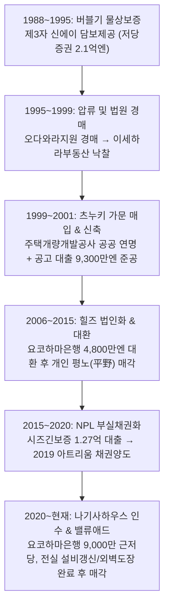

# 수익형 부동산 투자분석 보고서 (投資分析レポート)
## 포레스타 힐즈 (Foresta Hills / フォレスタヒルズ)
**카나가와현 아츠기시 이이야마미나미 4초메 1동 RC 맨션 (1DK × 14세대)**

| **매매가격** | **현황 표면수익률 (렌트롤 / 계약서실측)** | **만실 상정 표면수익률** |
| :---: | :---: | :---: |
| **1억 2,300만 엔** | **7.75% (실측 7.65%)** | **8.60% (실측 8.50%)** |
| **임대료 증액 여지** | **적산가격 (원가법)** | **준공검사필증** |
| **연 97.2만 엔 (실측)** | **1억 2,282만 엔** | **보유 (적법 건축물)** |

- **작성일자**: 2026년 9월 29일 (2차 정밀실사 업데이트판 — 임대차계약서 14건·프로판가스 대여계약서·매도측 중개법인 `株式会社シアン` 실사 반영)
- **분석 대상**: 포레스타 힐즈 (Foresta Hills / フォレスタヒルズ)
- **1차·2차 개시자료**: 물건개요서(매수측 중개: 株式会社リブライフマーケティング / 매도측 원수중개: 株式会社シアン), 렌트롤(2026년 8월 5일 기준), **전 14개 호실 임대차계약서·갱신계약서·입주신청서 일체**, **LP가스 설비·기기 대여계약서(株式会社トーエル, 2021.03.26 체결)**, 건물 등기사항증명서, 토지 등기사항증명서(2필지), 건축확인대장 기재증명서(厚証(建指) 第557号), 건축계획개요서, 소방용설비 점검결과보고서(2026.04.07), 저수조 청소·수질검사보고서(2025.12), 도쿄전력 전신주 부지사용료 통지서, 令和8年度(2026년) 고정자산세·도시계획세 과세명세서, 대규모 수선·개수공사 지출이력, 런닝코스트 명세서(株式会社アレップス), 건물 평면도 및 배치도

---

# 1. 에그제큐티브 서머리 (Executive Summary)

본 분석 대상 물건은 카나가와현 아츠기시 이이야마미나미 4초메(神奈川県厚木市飯山南四丁目5番1号, 지번: 3547番1 및 3545番3)에 위치한 **2001년(平成13년) 9월 준공(만 25년 경과), 지상 4층, 총 14세대(전실 1DK 30.29㎡) 및 옥외 자주식 주차장 14대** 규모의 1동 철근콘크리트조(RC) 수익형 아파트 맨션이다. 오다큐 오다와라선(小田急小田原線) 급행 정차역인 「본아츠기(本厚木)」역에서 버스로 약 20분 소요되며, 버스 정류장 「쿄쿠마에(局前)」에서 도보 1분 거리의 평탄지에 입지하고 있다.

매도자 제시 희망 매매가격은 **1억 2,300만 엔(JPY, 세금 포함)**이며, 2026년 8월 5일 자 개시 렌트롤 기준 실입주 13실의 현황 연간 수입은 **953.8만 엔(월 794,800엔, 표면 7.75%)**, 공실 1실(305호) 및 빈 주차구획 3대를 정상 모집 충당 시의 만실 상정 연간 총수입은 **1,058.2만 엔(월 881,800엔, 만실 표면수익률 8.60%)**이다. 

그러나 **2026년 9월 29일 추가 입수한 『임대차계약서 원본 14건』 및 『프로판가스 설비 대여계약서』를 전수 포렌식 대조한 결과**, 매도측 원수중개법인(`株式会社シアン`)이 개시한 1차 자료에서 다음과 같은 **중대한 실사 차이(Discrepancy)와 동시에 예상치 못한 긍정적 팩트**가 함께 확인되었다:
1. **렌트롤 과대계상 적발 (`월 -8,200 ~ -10,600엔` / `연 -9.84만 ~ -12.72만 엔`)**: `102호(-2,000엔)`, `103호(-2,000엔)`, `202호(-4,500엔)`, `203호(-1,700~-2,100엔)` 총 4개 호실에서 계약서 원본 대비 렌트롤 금액이 부풀려져 있으며, 실제 계약서 기준 현황 월수입은 **784,200~786,600엔(연 941.0만~943.9만 엔, 실질 표면수익률 7.65~7.67%)**이다.
2. **프로판가스 설비 무상대여 계약에 따른 부외부채(`462.55만 엔`, 현 잔존 `약 177.3만~208.1만 엔`) 및 독소조항 확인**: 수선이력서에 기재된 '2021년 전실 급탕기·에어컨 신품 교체'는 매도자의 자기자본 지출이 아니라 가스공급사(`株式会社トーエル`)와의 **10년 대여계약(2020.07~2030.07)**이었으며, 특히 **에어컨(14대)·도어폰(9대)은 소유권이 토엘에 있음에도 고장 시 수리비는 건물주가 부담**하는 비대칭 조항이 포함되어 있다.
3. **우량 법인 사택 계약(`法人契約`) 3실 확인 및 정기 갱신 시 `+2,000엔` 임대료 인상 실증 (긍정 요인)**: 렌트롤에는 단순 '회사원'으로 기재되어 있었으나 실제로는 **상장사·글로벌 기업 법인 사택이 3실(`201호·301호·402호`, 전체의 23.1%)** 포진해 있으며, 현 관리사(`株式会社アレップス`)가 2025년 갱신 세대(`105호·202호`)에서 **퇴거 없이 갱신 합의로 월세를 각각 +2,000엔씩 인상**한 실적이 입증되었다.

### 본 건의 핵심 본질 규명
본 물건의 투자 본질은 **"과거 부실채권(NPL)으로 처리된 물건을 현 소유자가 매입하여 외벽 도장 및 프로판가스 레버리지 설비 갱신(전실 급탕기·에어컨·도어폰)과 1차 임대료 인상을 마친 후, 기관 적산가격에 맞춰 매각하는 완성형 밸류애드(Turnaround) 매물"**로 규정된다.

매매가격(1억 2,300만 엔)은 매도자가 산정한 원가법 적산가격(1억 2,282만 엔)의 **99.9%**에 맞춰져 있으나, 금번 2차 실사에서 적발한 **① 렌트롤 과대계상분(연 10.3만~12.7만 엔 → 수익환원가치 약 150만~180만 엔 상당), ② 프로판가스 미상각 부외부채(약 177만~208만 엔), ③ 옥상 방수 미시공(약 250만 엔), ④ 미기재 반환보증금(27.9만 엔) 및 선납 클리닝비(17.5만 엔) 승계 공제**를 합산하면 **총 600만~650만 엔 이상의 강력한 팩트 기반 가격 협상(指値, 사시네) 실탄**이 확보된다.

---

### 주요 지표 요약 (Key Metrics)

| 항목 | 수치 | 비고 |
| :--- | ---: | :--- |
| **매매가격 (物件価格)** | **1억 2,300만 엔** | 세금 포함, 현황 인도, 계약부적합책임 면책 조건 |
| **현황 연간수입 (렌트롤 / 계약서실측)** | **953.8만 엔 / 941.0만 엔** | 렌트롤 월 794,800엔 vs **계약서 원본 합계 월 784,200엔** (차액 월 10,600엔) |
| **현황 표면수익률 (現況利回り)** | **7.75% (실측 7.65%)** | 공실 1실(305호) 및 공실 주차장 3대 제외 실적 |
| **만실 상정 연간수입 (満室想定年収入)** | **1,058.2만 엔 (실측 1,045.4만)** | 305호실 및 공실 주차장 3대 정상 충당 기준 (+전신주 부지료 연 3.3만엔 별도) |
| **만실 상정 표면수익률 (満室想定利回り)** | **8.60% (실측 8.50%)** | 렌트롤 합계(월 881,800엔 × 12개월) / 계약서 실측(월 871,200엔 × 12개월) |
| **적산가격 (積算価格, 원가법)** | **1억 2,282만 엔** | 매도자 산정 기준 (RC 재조달단가 361,000엔/㎡ 기준) |
| **프로판가스 설비 부외부채 (잔존액)** | **약 177.3만 ~ 208.1만 엔** | 2020.07~2030.07 (10년 총액 462.55만엔 정액상각, 중도해지 시 일시 변제 의무) |
| **승계 필수 보증금 (敷金預り金)** | **279,440 엔 (+선납청소비 17.5만)** | 202호(5.32만)·203호(11.42만)·301호(5.5만)·401호(5.7만) 잔금 정산 공제 필수 |
| **실질 연간 운영경비 (Real OPEX)** | **277.5만 엔** | 개시 실적(142.5만엔) + 화재보험·원상복구·수선적립 가산 |
| **실질 경비율 (OER)** | **26.22%** | 만실 상정 총수입 대비 실질 경비 비율 |
| **순영업소득 (NOI)** | **780.7만 엔 (실측 768.0만)** | 만실 상정 연간 총수입 - 실질 연간 운영경비 |
| **NOI 수익률 (Cap Rate)** | **6.35% (실측 6.24%)** | 매매가격 1억 2,300만 엔 대비 순영업수익률 |
| **연간 원리금상환액 (ADS)** | **581.4만 엔** | 차입 1억 800만 엔 (LTV 87.8%), 금리 2.5%, 25년 원리금균등 |
| **세전 현금흐름 (BTCF, 만실 시)** | **199.3만 엔 (실측 186.6만)** | 현황 가동률 기준 시: 연 94.9만 엔 (실측 82.1만 엔) |
| **DSCR (부채상환배율)** | **1.34 (실측 1.32)** | 기준치(1.20)를 상회하는 안정적 부채 감당력 |
| **손익분기 가동률 (BER)** | **81.17%** | 허용 공실 호수: **2.6실 / 전체 14실** (3실 이상 공실 시 적자 전환) |
| **임대료 잠재 증액분 (Upside)** | **연 97.2만 엔 (실측 기준)** | 저가 계약 세대 시장 정상화(59,000엔) 시 (렌트롤 기준 연 92.4만 엔) |
| **목표 달성 시 표면수익률** | **9.35%** | 임대료 인상 완료 후 연간 총수입 1,150.6만 엔 |


---

### 決算書デザイン型判定 (Output & Key Metrics: 법인 결산서 착지 판정)

본 분석에서는 대상 부동산 단품의 수익성에 더하여, 매수 주체인 **보유 법인(모아비즈 4기 현재 기준)의 결산서에 본 부동산을 신규 편입했을 때의 합산 착지(Landing) 결과**를 3열로 정밀 대조 검증하였습니다.

| 항목 (指標項目) | 검증대상 부동산 단품 | 모아비즈 4기현재 (Col G) | 검증대상 부동산 매입후결산서 착지 예상 |
| :--- | :---: | :---: | :---: |
| **1. 帳簿上税引前当期純利益 (장부상 세전순이익)** | **¥5,282,352** | ¥3,722,450 | **¥9,004,802** |
| **2. 税引前手残りCF (세전 잔여 현금흐름)** | **¥1,995,148** | ¥1,741,901 | **¥3,737,049** |
| 　・**税引前CF利回り (세전 CF 수익률)** | **1.62%** | 0.65% | **0.96%** |
| 　・**推定法人税額 (추정 법인세액)** | **¥1,320,588** | ¥930,613 | **¥2,251,201** |
| 　・**税引後手残りCF (세후 잔여 현금흐름)** | **¥674,560** | ¥811,289 | **¥1,485,848** |
| 　・**税引後CF利回り (세후 CF 수익률)** | **0.55%** | 0.30% | **0.38%** |
| **3. 債務償還年数 (채무상환년수, 년)** | **19.4년** | 24.1년 | **22.4년** |
| **4. 簡易 Cash Flow (=税引後CF)** | **¥674,560** | ¥811,289 | **¥1,485,848** |
| **5. ICR (이자보상배율, Interest Coverage Ratio)** | **2.3배** | 0.9배 | **1.2배** |
| **6. 負債返済割合 (DSCR / 부채상환배율)** | **1.6배** | 1.5배 | **1.5배** |
| **7. LTV (固定資産税評価額に基づく / 고정자산세 기준)**| **201.62%** | 261.08% | **239.23%** |
| **8. 投資額ROI (초기 투하자기자본 대비 ROI)** | **8.45%** | 3.83% | **5.40%** |

> **[법인 결산서 디자인 관점의 주요 분석]**
> 1. **장부상 당기순이익 대폭 개선**: 검증대상 부동산 단품에서 연간 528.2만 엔의 장부상 순이익이 창출되어, 매입 후 법인 전체의 세전순이익은 372.2만 엔에서 **900.5만 엔으로 약 2.4배 급증**합니다.
> 2. **금융기관 신용도 핵심 지표(채무상환년수) 단축**: 기존 법인의 채무상환년수가 24.1년에서 **22.4년으로 1.7년 단축**되어, 은행 평가상 차기 물건 매입을 위한 대출 적격성이 한층 강화됩니다.
> 3. **이자보상배율(ICR)의 1.0배 돌파**: 기존 0.9배로 은행 심사상 취약했던 ICR이 단품 2.3배의 우량 수익성 흡수에 힘입어 **1.2배로 건전화**되어 금융비용 감당 능력이 대폭 개선됩니다.
> 4. **고정자산세 기준 LTV 희석**: 단품의 LTV(201.6%)가 기존(261.1%)보다 낮아, 합산 LTV가 **239.2%로 21.85%p 개선**됩니다.

---

### 7대 평가축 서머리 (Evaluation Summary)

| 평가축 | 판정 | 근거 및 분석 결과 |
| :--- | :---: | :--- |
| **가격 타당성** | **적정** | 아츠기시 1동 RC 맨션 매물 수익률 중앙값(7.49%) 대비 본 건 만실 수익률은 8.60%로 +1.11%p 우위. 매도자 적산가격과 매매가격이 99.9%로 정합. |
| **임대료 수준** | **적정 ~ 소폭 강세** | 현재 모집 중인 305호(관리비 포함 65,000엔)는 아츠기시 20~30년 차 RC 중앙값(63,000엔)을 소폭 상회하는 상한선 수준이나, 100% 주차장 완비로 방어 가능. |
| **수익의 질** | **양호** | 입주자 13세대 중 12세대가 일반 직장인(회사원), 학생은 1세대에 불과. 인근 도쿄공예대학 캠퍼스 재편 영향에 거의 노출되지 않은 견고한 실주거 수요. |
| **건물 상태** | **양호** | **준공검사필증(検査済証) 보유**. 2021년 전실 급탕기/에어컨 갱신, 스마트키 교체, 2022년 외벽도장/타일 보수 완료로 향후 10년간 대형 설비 Capex 리스크 극히 낮음. |
| **수익 구조** | **우수** | 엘리베이터(EV)가 없는 외복도·외계단 구조로 정기 승강기 검사비가 없으며, 프로판가스(LPG) 및 공공하수도 직결로 고정 관리비용이 극도로 경량화(실적 경비율 13.5%). |
| **미래 가치** | **주의 필요** | 아츠기시 장기 인구추계(2050년까지 -15.5% 감소) 및 본아츠기역 버스 20분 입지의 한계. 단, 법정 용적률(200%) 중 60.9%만 소화되어 토지 잠재력 보유. |
| **금융/대출** | **최대 불확실성** | 금융기관의 사내 RC 재조달단가 적용 기준(18~20만엔 vs 36.1만엔)에 따라 담보 적산가격이 9,054만~1억 2,282만 엔으로 3,228만 엔 편차 발생 (필요 자기자금 변동). |

---

### 선행 확인 필수 5대 항목 (Top 5 Due Diligence Action Items)

1. **옥상 방수(屋上防水) 시공 이력 및 상태 전수 점검**:
   - 수선이력서상 2022년 5월 외벽도장 공사는 완료되었으나, 옥상 방수에 대한 시공 기록이 전무함. RC 평지붕(육지붕)의 방수 내구연수는 12~15년이므로 미시공 시 매입 직후 200만~300만 엔의 돌발 Capex가 발생할 수 있음. **가격 협상(指値)의 최우선 실탄**으로 삼아야 함.
2. **복수 금융기관의 사내 RC 재조달단가 및 대출 한도 사전 타진**:
   - 매도자가 적용한 361,000엔/㎡는 고물가를 반영한 최고단가임. 보수적 시중은행/신용금고가 200,000엔/㎡를 적용할 경우 적산 평가액은 9,054만 엔까지 하락하며, 필요 자기자금(Down Payment)이 3,200만 엔 이상 급증할 수 있으므로 조달 가능 액수를 사전 확정해야 함.
3. **지번 단위의 토사재해경계구역 및 침수구역 아츠기시 위기관리과 직접 조회**:
   - 이이야마 지구 내 급경사지 붕괴 경계구역(26개소)이 다수 지정되어 있으며, 카나가와현의 2025년 12월 침수구역 수정사항을 아츠기시 하저드맵이 아직 미반영한 상태임. 본 부지(3547-1, 3545-3)가 옐로/레드존에 접하는지 지자체 창구에서 유선 또는 대면 확인 필수.
4. **부대 주차장 14대 구획의 계약 및 잔여 현황 확인**:
   - 현황 렌트롤에는 계약 9대 + 305호 모집 1대 + 공실 3대 = 총 13대만 기재되어 있어, 전체 14대 중 누락된 1대의 용도(관리용, 내방객용, 미이용 구획 등) 및 추가 수익화 가능 여부를 확인해야 함.
5. **장기 입주자(202호 등) 계약 특약 및 계약부적합책임 면책 대비 건물 인스펙션**:
   - 2015년 입주한 202호는 관리비가 3,000엔, 주차료가 8,800엔으로 타 호실과 조건이 상이함. 또한 '계약부적합책임 면책' 조건이므로 급배수관 누수, 외벽 크랙 등을 사전에 전문 인스펙터 또는 시공업체를 대동하여 점검해야 함.

---

# 2. 물건 개요 (Property Overview)

### 기본 사양 및 권리 현황

| 항목 | 내용 | 비고 |
| :--- | :--- | :--- |
| **물건명** | **포레스타 힐즈 (Foresta Hills / フォレスタヒルズ)** | 현황 건물 표기 동일 |
| **도로명 주소 (住居表示)** | 神奈川県厚木市飯山南四丁目5番1号 (카나가와현 아츠기시 이이야마미나미 4-5-1) | 令和4年(2022년) 10월 11일 주거표시 실시 |
| **지번 (地番)** | 厚木市飯山南四丁目 3547番1, 3545番3 (2필지) | 구 토지표시: 飯山字辻ノ上 |
| **교통 (交通)** | 오다큐 오다와라선 **「본아츠기(本厚木)」역 버스 약 20분**, 버스정류장 「局前(쿄쿠마에)」 도보 1분 | 버스 배차 간격 평일 출퇴근 시간대 5~8분 |
| **토지 면적** | **741.63㎡ (224.34평)** | 3547-1: 647.99㎡ / 3545-3: 93.64㎡ (지적측량도 정합) |
| **토지 권리 형태 / 지목** | **소유권 (所有権) / 대지 (宅地)** | 지형: 평탄한 장방형에 준하는 정형지 (대지 741.60㎡ / 224.33평) |
| **도로 접도 (道路)** | **북서측 폭원 4.01m 시도(市道)에 28.63m 대규모 접면** | 건축기준법 제42조 제2항 도로 (도로후퇴 셋백 완료, 재건축 적격) |
| **건물 구조 / 시공사** | **철근콘크리트조(RC) 지상 4층건 / (주)크라스트(クラスト) 시공** | 전국구 임대맨션 전문 건설사 시공, 외복도・외계단 개방형 |
| **신축 준공일 (建築時期)** | **平成13年(2001년) 9월 10일 신축** (준공 후 만 25년 경과) | 건축확인: 2001.01.24 (H12확인건축厚木 第01395호) |
| **등기 연면적 (登記床面積)** | **428.40㎡ (129.59평)** | 1층: 122.40㎡ / 2층: 122.40㎡ / 3층: 122.40㎡ / 4층: 61.20㎡ |
| **건축확인대장 연면적** | 대지: 741.60㎡, 건축면적: 149.70㎡, **연면적: 451.42㎡** | 주거 430.80㎡ + 차고 20.62㎡ (厚証(建指) 第557号 기재증명서) |
| **준공검사필증 (検査済証)** | **취득 완료 (あり / 완전 적법 건축물)** | **平成13年 8月 29日 취득 (H13確済建築厚木 第00313号)** |
| **소방설비 점검 현황** | **소방안전 적격 (良 / 지적사항 0건)** | 아츠기소방서 수리 완료, 차기 보고 기한: 2028년(R10) 10월 말 |
| **저수조 및 수질검사** | **지상 FRP 1.3㎥ 청소 완료 / 수질검사 100% 적합** | 에바라 가압급수펌프 2대 양호, 일반세균 0, 대장균 불검출 |
| **부대수입 (전신주 사용료)**| **도쿄전력 전신주 부지사용료 연 33,375엔 수입 확정** | 본주 1본(11,125엔) + 지선 2본(22,250엔), 매년 4월 정기 입금 |
| **세대수 및 주차장** | **총 14세대 (1DK × 14호실)** / **옥외 평면 주차장 14대** | 1~3층 각 4호실, 4층 2호실 (세대수 대비 주차장 100% 완비) |
| **전유 면적 (専有面積)** | **모집 표기 30.29㎡** (등기부상 실당 전유면적 30.60㎡) | DK 7.5조 + 양실 6.0조, 욕실/화장실 분리 |
| **도시계획 / 용도지역** | 시가지화구역 / **제1종 중고층주거전용지역** | 건폐율: 법정 60% / 실측 20.18%, 용적률: 법정 160.4% / 실측 58.09% |
| **방화 지정** | 준방화지역 (準防火地域) | RC 구조로 내화 성능 완벽 충족 |
| **설비 사양** | 도쿄전력, 공공상하수도, **프로판가스(LPG)**, **인터넷 무료 완비**, **엘리베이터 없음** | 전실 2021년 신품 급탕기·에어컨 교체, 디지털 스마트키 완비 |
| **상속세 노선가 (路線価)** | **68,000 엔/㎡** (평당 약 22.5만 엔) | 상속세 토지 평가액: 약 5,043만 엔 |
| **희망 매매가격** | **1억 2,300만 엔 (세금 포함)** | 권장 협상 목표가: **8,800만 ~ 1억 엔 (사시네 전략)** |

---

### 건폐율・용적률 소화 현황

| 항목 | 법정 상한 기준 | 현황 실적치 | 소화율 (실적/상한) | 법정 잔여 마진 |
| :--- | ---: | ---: | ---: | ---: |
| **건축면적 (Building Footprint)** | 444.96㎡ (60.0%) | **149.70㎡ (20.2%)** | **33.6%** | +295.26㎡ 여유 |
| **연면적 (Floor Area)** | 1,483.20㎡ (200.0%) | **451.42㎡ (60.9%)** | **30.4%** | **+1,031.78㎡ 여유** |

본 부지는 741.60㎡(224.34평)의 대규모 면적을 보유하고 있음에도, 법정 용적률의 약 30%(소화율 30.4%)만 활용하여 지상 4층으로 지어졌습니다. 건축물이 점유하지 않는 잔여 부지 약 591.9㎡는 **세대수와 동일한 14대의 자주식 평면 주차장 및 자전거 보관소(14대), 수취장**으로 활용되고 있습니다.
- **향후 출구전략(Exit) 관점의 가치**: 본 지역은 역에서 거리가 있는 차량 생활권이므로 100% 주차장 확보가 공실 방어의 핵심입니다. 장기적으로 건물이 노후화되어 해체 후 재건축할 경우, 용적률을 최대 200%까지 활용하여 3배 규모의 공동주택을 신축하거나 부지를 2~3필지로 분할 매각할 수 있는 매우 강력한 하방 토지 가치를 내포하고 있습니다.

---

# 3. 물건의 내력 및 권리관계 (Title & History)

부동산 등기사항증명서(2026년 6월 23일 발행) 갑구·을구 및 건축확인대장 기재증명서를 바탕으로, 지난 40여 년간의 소유권 변천과 자금 조달 경위를 추적 분석합니다. 이를 통해 현재 가격이 형성된 구조와 매도자의 엑시트(매각) 동기를 명확히 규명할 수 있습니다.


```mermaid
flowchart TD
    A["1988~1995: 버블기 물상보증<br>제3자 신에이 담보제공 (저당증권 2.1억엔)"] --> B["1995~1999: 압류 및 법원 경매<br>오다와라지원 경매 → 이세하라부동산 낙찰"]
    B --> C["1999~2001: 츠누키 가문 매입 & 신축<br>주택개량개발공사 공공 연명 + 공고 대출 9,300만엔 준공"]
    C --> D["2006~2015: 힐즈 법인화 & 대환<br>요코하마은행 4,800만엔 대환 후 개인 평노(平野) 매각"]
    D --> E["2015~2020: NPL 부실채권화<br>시즈긴보증 1.27억 대출 → 2019 아트리움 채권양도"]
    E --> F["2020~현재: 나기사하우스 인수 & 밸류애드<br>요코하마은행 9,000만 근저당, 전실 설비갱신/외벽도장 완료 후 매각"]
```

### 3-1. 버블기의 제3자 물상보증과 법원 경매 (1988년 ~ 1999년)
- 당초 토지는 1961년(昭和36년) 코지마 츠네오(小島常雄)가 상속으로 취득하여 보유하던 농지/택지였습니다.
- 버블 정점기인 **1988년(昭和63년) 11월 4일**, 중앙신용금고로부터 채무자 '(주)신에이(株式会社新栄, 도쿄 아라카와구 소재)'를 위해 토지를 담보로 제공하는 극도액 6,500만 엔의 근저당권(이후 1억 7,000만 엔까지 증액)이 설정되었습니다. 전형적인 **버블기 법인을 위한 제3자 물상보증**이었습니다.
- 이어서 **1989년(平成1년) 11월 30일**, 전국신킨저당증권(全国しんきん抵当証券)이 채권액 **2억 1,000만 엔(이후 2억 300만 엔으로 변경)**의 거액 저당권을 설정하였습니다. 연 6.2%, 매년 700만 엔씩 30년간 분할 상환하는 조건이었으며, '저당증권을 발행할 수 있다'는 특약이 명시된 전형적인 버블 금융 상품이었습니다.
- 버블 붕괴 후 채무는 불이행되었고, 1995년(平成7년) 소유자 사망 후 저당증권회사의 대위 상속 등기를 거쳐 요코하마지방법원 오다와라지원에서 강제 경매가 개시되었습니다. 압류 후 약 3년 10개월간의 경매 절차 끝에 **1999년(平成11년) 4월 9일, 지역 부동산 법인인 유한회사 이세하라부동산(伊勢原不動産)이 낙찰**받아 기존의 모든 버블기 권리를 말소 정리하였습니다.

### 3-2. 공공기금(주택금융공고) 융자에 의한 건립 (1999년 ~ 2006년)
- 1999년 8월 31일, 이세하라부동산은 낙찰 5개월 만에 츠누키 토시오(續木俊夫)에게 토지를 전매하였습니다.
- 2001년 1월 24일 건축확인을 받고 동년 8월 29일 준공검사를 거쳐 9월 10일 본 건물이 신축되었습니다. 주목할 점은 건축확인대장상 건축주가 **「재단법인 주택개량개발공사(理事長 谷田部嘉彦)」와 「츠누키 토모야스(續木智康)」 연명**으로 되어 있다는 사실입니다.
- 2001년 11월 2일, 주택개량개발공사를 저당권자로 하여 **주택금융공고(현 주택금융지원기구) 자금 9,300만 엔(7,900만 엔은 연 2.40%, 1,400만 엔은 연 3.40%)**의 정책 모기지 융자가 실행되었습니다.
- **건물 스펙에 대한 시사점**: 준공검사필증 취득은 물론, 공공기금 및 공사의 엄격한 시공 감리를 거쳐 건축되었기 때문에 외벽 전면 타일 마감, 전 세대 욕실/화장실 분리(BT別), 30.6㎡의 넉넉한 1DK 평면 등 동시대 일반 민간 임대주택 대비 월등히 우수한 골조 내구성과 설비 표준을 확보하고 있습니다. 이후 2006년 가족 법인인 (주)힐즈로 소유권이 이전되었습니다.

### 3-3. 개인 투자자 매각과 부실채권(NPL) 채권양도 (2012년 ~ 2020년)
- 2012년(平成24년) 1월, (주)힐즈는 요코하마은행으로부터 4,800만 엔을 조달하여 잔존 고금리 공고 융자를 전액 대환 상환하였습니다.
- 2015년(平成27년) 9월 25일, 도쿄 오타구 거주 개인 투자자(히라노 사토루)에게 매각되었으며, 당일 시즈긴신용보증(静銀信用保証, 시즈오카은행 계열)이 1억 엔과 2,700만 엔, **총 1억 2,700만 엔**의 근저당권을 설정하였습니다.
- 그러나 인수 후 운영 실패로 2019년(平成31년) 3월 29일, 해당 대출 채권이 부실채권 정리 전문 회사인 **(주)아트리움 채권회수서비스(アトリウム債権回収サービス)**로 전격 양도(채권매각)되었습니다. 보증사 대위변제를 거친 전형적인 부실화(NPL) 단계였습니다.

### 3-4. 현 소유자(나기사하우스 합동회사)의 인수 및 재생 (2020년 ~ 현재)
- **2020년(令和2년) 5월 29일**, 현 매도자인 '나기사하우스 합동회사(なぎさハウス合同会社)'가 본 건을 매매로 취득하였습니다. 당일 요코하마은행 신유리가오카 지점을 통해 **극도액 9,000만 엔(실 차입 추정액 7,500만~8,000만 엔)**의 신규 근저당권을 설정하고 종전 아트리움 채권회수서비스의 부실채권 담보를 완전 변제·말소하였습니다.
- 현 소유자는 인수 직후 약 2년에 걸쳐 아래와 같은 **자본적 지출(Capex) 및 프로판가스 대여 레버리지 밸류애드 공사**를 단행하였습니다:
  - **2021년 2월**: 공용 쓰레기 수거장 신설 공사
  - **2021년 4월**: 공용 우편 포스트 전면 교체 공사
  - **2021년 10월**: 세대 현관 스마트키(번호키/디지털도어록) 교체 공사
  - **2021년 11월**: **전 14개 호실 급탕기·에어컨·도어폰 교체 공사** *(※ 2차 실사 결과, 매도자 자기자본 지출이 아닌 프로판가스 공급사 `株式会社トーエル`의 10년 무상대여 계약으로 확인됨 — 아래 3-6항 참조)*
  - **2022년 5월**: **외벽 도장 및 외벽 타일 일부 교체 공사**
- 설비 현대화와 함께 공실이 발생할 때마다 기존 4.6만~5.0만 엔 수준이던 임대료를 신규 5.9만~6.1만 엔으로 대폭 인상(약 +30% 증액)하여 자산 가치를 극대화하였습니다.

### 3-5. 투자 판단에 미치는 시사점 (매도자 엑시트 동기 규명)
1. **매도자의 성격**: 재생 전문 부동산 법인(Operator)이며, 매입가 대비 설비 투자 후 수익률을 정비하여 기관 적산가에 맞춰 매각 차익을 실현하는 '비즈니스적 엑시트'입니다.
2. **하자 리스크 해소**: NPL 부실 매물 특유의 임대료 체납, 불량 임차인, 설비 고장 리스크를 현 소유자가 6년간 철저히 정화하였습니다. 특히 **전실 급탕기·에어컨 신품 교체와 외벽 도장이 완료**되어 매수 후 7~10년간 대규모 설비 지출 부담이 적습니다.
3. **남겨진 과제**: 외벽 도장을 진행하면서 **옥상 방수 공사 이력을 남기지 않은 점**과 **프로판가스 설비 대여계약에 따른 부외부채 승계 의무**는 매수 협상 시 가격 절충(指値)의 핵심 명분으로 활용해야 합니다.

---

### 3-6. [2차 실사 적발] 프로판가스(LPG) 설비 무상대여 계약서(`LPガス設備・機器貸与等契約書`) 및 부외부채 정밀 감사

2026년 9월 29일 추가 개시된 **`フォレスタヒルズ：プロパンガス貸与契約書.pdf`** 원본을 정밀 분석한 결과, 1차 개시자료인 『대규모 수선·개수공사 지출이력』에서 마치 매도자가 자체 비용(Capex)으로 전실 급탕기와 에어컨을 교체한 것처럼 기재했던 내역의 실체가 **프로판가스 공급사(`株式会社トーエル`)와의 10년 설비 대여계약(부외부채)**이었음이 밝혀졌습니다.

- **계약 당사자**: (갑/건물주) なぎさハウス合同会社 ↔ (을/가스공급사) 株式会社トーエル (요코하마시 코호쿠구 소재 상장 LPG 기업)
- **계약 체결일**: **2021년 3월 26일**
- **계약 및 상각 기간 (제4조)**: **2020년 7월 31일 ~ 2030년 7월 30일 (10년간 / 120개월)** *(만료 3개월 전 해지 통보 없을 시 1년씩 자동 연장)*

#### [별표: 프로판가스 무상대여 설비 명세 및 고장 수리 부담 주체 (`別表 貸与物品一覧`)]

| 대여 품목 (品名) | 단가 (세별) | 수량 | 합계 (세별) | 합계 (10% 세금포함) | 대여기간 | 기간중 소유권 | **고장 시 수리·교체 부담 (`故障対応`)** |
| :--- | ---: | :---: | ---: | ---: | :---: | :---: | :--- |
| **급탕기 (給湯器)** | ¥165,000 | 14대 | ¥2,310,000 | **¥2,541,000** | 10년 | 乙 (토엘) | **✅ 乙 (토엘 무상 수리·교체)** |
| **가스누출경보기 (ガス漏れ警報器)**| 무상 | 14대 | — | — | 5년 | 乙 (토엘) | **✅ 乙 (토엘 무상 수리·교체)** |
| **룸 에어컨 (エアコン)** | ¥100,000 | 14대 | ¥1,400,000 | **¥1,540,000** | 10년 | 乙 (토엘) | **🚨 甲 (건물주 수리·교체 부담!)** |
| **도어폰/인터폰 (ドアフォン)** | ¥55,000 | 9대 | ¥495,000 | **¥544,500** | 10년 | 乙 (토엘) | **🚨 甲 (건물주 수리·교체 부담!)** |
| **총계 (Total)** | — | — | **¥4,205,000** | **¥4,625,500** | **10년 (120개월)**| 乙 (토엘) | **10년 만료 후 甲에게 무상 양도** |

> [!WARNING]
> **프로판가스 대여계약서 3대 핵심 리스크 및 매수인 유의사항**
> 1. **중도 해지·공급사 변경 시 미상각 잔액 일시불 변제 의무 (제5조 정지조건부 매매계약)**:
>    - 2030년 7월 30일 이전에 가스 공급을 중단하거나 타 가스회사로 변경할 경우, `대여설비 총액(4,625,500엔) × 잔존월수 / 120개월`의 정액법 미상각 잔액을 즉시 일시불로 매수해야 합니다.
>    - **2026년 10월 현재 미상각 부외부채 잔액**:
>      - 계약 기산일(`2020.07.31`, 경과 74개월 / 잔존 46개월) 기준: $$\text{미상각 잔액} = 4,625,500\text{엔} \times \frac{46\text{개월}}{120\text{개월}} = \mathbf{1,773,108\text{엔 (약 177.3만 엔)}}$$
>      - 계약 체결일(`2021.03.26`, 경과 66개월 / 잔존 54개월) 기준: $$\text{미상각 잔액} = 4,625,500\text{엔} \times \frac{54\text{개월}}{120\text{개월}} = \mathbf{2,081,475\text{엔 (약 208.1만 엔)}}$$
>    - 또한 제6조에 의거, 건물 매각 시 매도자(갑)는 **매수인(제3자)에게 본 계약상의 모든 권리·의무를 승계시켜야 할 의무**가 있으므로, 매수인은 최소 2030년 7월까지 토엘과의 계약을 유지해야 위약금이 발생하지 않습니다.
> 2. **에어컨(14대)·도어폰(9대)의 비대칭 독소조항 (제3조 제2항 및 별표)**:
>    - 통상적인 설비 대여계약과 달리, 본 계약은 **급탕기(14대)만 토엘이 고장 수리를 부담(`故障対応：乙`)**하고, **에어컨(14대)과 도어폰(9대)은 소유권이 10년간 토엘에 있음에도 불구하고 고장 시 수리·교체 비용을 건물주(`故障対応：甲`)가 전액 부담**하도록 규정하고 있습니다. 설치 후 만 5년(2021~2026)이 경과했으므로 향후 에어컨 고장 발생 시 매수인의 수선비 지출이 발생할 수 있습니다.
> 3. **임차인 프로판가스 요금 전가 구조**:
>    - 462.5만 엔의 설비 투자비가 임차인이 매월 납부하는 LP가스 기본요금·종량단가에 반영되어 회수되는 구조이므로, 도시가스 대비 높은 가스요금이 임차인의 실질 주거비 부담을 높여 장기적으로 임대료 인상 저항 요인으로 작용할 수 있습니다.

---

# 4. 수익 현황 및 임대차계약서 원본 14건 대조 정밀 감사 (Rent Roll & Lease Forensics)

2026년 8월 5일 기준 매도자 개시 렌트롤 내역과, 2026년 9월 29일 추가 개시된 **전 14개 호실 임대차계약서·갱신계약서·입주신청서 원본(`フォレスタヒルズ：賃貸借契約書`)**을 1:1 전수 대조합니다.

### 4-0. 매도자 1차 개시 렌트롤 (2026년 8월 5일 기준 원안)

| 호실 | 전유면적 | 계약시작일 | 입주자 속성 (렌트롤 표기) | 현황 | 임대료 (円) | 관리비 (円) | 주차장 (円) | 합계 월액 (円) |
| :---: | :---: | :---: | :---: | :---: | :---: | ---: | ---: | ---: |
| **101** | 30.29㎡ | 2022년 10월 | 회사원 | 입주 | 47,000 | 4,000 | 5,500 | 56,500 |
| **102** | 30.29㎡ | 2022년 9월 | 회사원 | 입주 | 48,000 | 4,000 | 5,500 | 57,500 |
| **103** | 30.29㎡ | 2025년 3월 | 회사원 | 입주 | 53,000 | 4,000 | — | 57,000 |
| **105** | 30.29㎡ | 2023년 12월 | 회사원 | 입주 | 53,000 | 4,000 | 5,500 | 62,500 |
| **201** | 30.29㎡ | 2026년 8월 | 회사원 | 입주 | 59,000 | 4,000 | 5,500 | 68,500 |
| **202** | 30.29㎡ | 2015년 7월 | 회사원 | 입주 | 50,000 | 3,000 | 8,800 | 61,800 |
| **203** | 30.29㎡ | 2007년 9월 | 회사원 | 입주 | 55,000 | 4,000 | 5,500 | 64,500 |
| **205** | 30.29㎡ | 2026년 1월 | 학생 | 입주 | 55,000 | 4,000 | — | 59,000 |
| **301** | 30.29㎡ | 2026년 3월 | 회사원 | 입주 | 55,000 | 4,000 | — | 59,000 |
| **302** | 30.29㎡ | 2026년 3월 | 회사원 | 입주 | 60,000 | 4,000 | — | 64,000 |
| **303** | 30.29㎡ | 2026년 2월 | 회사원 | 입주 | 53,000 | 4,000 | 5,500 | 62,500 |
| **305** | 30.29㎡ | — | — | **모집중** | **61,000** | **4,000** | **5,500** | **70,500** |
| **401** | 30.29㎡ | 2013년 2월 | 회사원 | 입주 | 52,000 | 4,000 | 5,500 | 61,500 |
| **402** | 30.29㎡ | 2023년 3월 | 회사원 | 입주 | 51,000 | 4,000 | 5,500 | 60,500 |
| **주차장**| 3대 구획 | — | — | **모집중** | — | — | **16,500** | **16,500** |
| **합계** | **424.06㎡** | — | — | — | — | — | — | **881,800 円** |

---

### 4-1. 수익률 구분 분석 (렌트롤 표기치 vs 계약서 원본 실측치)

| 구분 | 월간 총수입 | 연간 총수입 | 표면수익률 | 비고 |
| :--- | ---: | ---: | ---: | :--- |
| **① 개시 렌트롤 현황 수입 (입주 13실)** | **794,800 엔** | **953.8만 엔** | **7.75%** | 매도측 중개법인 제시 렌트롤 기준 |
| **② 계약서 원본 검증 실질 현황 수입 (13실)**| **784,200 ~ 786,600 엔**| **941.0만 ~ 943.9만 엔**| **7.65% ~ 7.67%**| **4개 호실 과대계상 차감 후 실제 계약 금액** |
| **③ 개시 렌트롤 만실 상정 수입** | **881,800 엔** | **1,058.2만 엔** | **8.60%** | 305호(70,500엔) 및 빈 주차구획 3대(16,500엔) 가산 |
| **④ 계약서 실측 기준 만실 상정 수입** | **871,200 ~ 873,600 엔**| **1,045.4만 ~ 1,048.3만 엔**| **8.50% ~ 8.52%**| 기존 13실 실측치 + 305호·주차장 만실 충당 시 |

---

### 4-2. 입주자 실제 속성 정밀 재분류 (계약서 원본 기준)
- 1차 렌트롤에는 **회사원 12세대(92.3%), 학생 1세대(7.7%)**로 단순 표기되어 있었으나, 14개 호실 계약서 및 입주신청서 원본을 전수 확인한 결과 실제 입주자 구성은 다음과 같이 훨씬 입체적이며 우량합니다:
  1. **🏢 우량 법인 사택 계약 (`法人契約`): 3세대 (23.1%) — `201호`, `301호`, `402호`**
     - `201호`: **시데피재팬 주식회사(`シーデーピージャパン株式会社`)** — 자본금 9,000만 엔·연매출 136억 엔 규모의 제조·엔지니어 파견 대기업이 직접 임차인(법인계약)으로 체결한 기술자 사택.
     - `301호`: **잭슨래보라토리재팬 주식회사(`ジャクソン・ラボラトリー・ジャパン株式会社`)** — 미국 잭슨연구소 일본법인(글로벌 바이오 기업, 사택대행 `長谷工ビジネスプロクシー`)이 임차한 사원 사택.
     - `402호`: **도카이리스 주식회사(`東海リース株式会社`)** — 도쿄증권거래소 상장 모듈러 건축 기업(사택대행 `株式会社タイセイ・ハウジー`)이 임차한 전근자 사택.
     - **투자 시사점**: 전체 입주 세대의 약 **1/4(23.1%)이 대기업·상장사 법인 계약**으로, 임대료 체납 리스크가 완벽히 제로(0%)이며 퇴거 시 원상복구비 정산 분쟁도 없는 최상위 우량 채권입니다.
  2. **👤 일반 개인 직장인 (`個人・会社員`): 8세대 (61.5%) — `101, 102, 103, 105, 202, 203, 303, 401호`**
     - `401호(미츠미전기 아츠기사업소 엔지니어, 13.5년 거주)`, `105호(AGC 아이카와 공장 근무)`, `202호(우사미 주유소 부점장, 11년 거주)`, `101·102호(이세하라·아츠기 제조업체 근무)` 등 주변 산단으로 자차 출퇴근하는 견고한 실수요층입니다.
  3. **🎓 도쿄공예대학 외국인 유학생 (`留学生`): 2세대 (15.4%) — `205호`, `302호`**
     - 렌트롤에는 `205호`만 학생으로 기재되고 **`302호`는 `会社員(회사원)`으로 허위 기재**되어 있었으나, 실제 `302호` 서류를 열람한 결과 **도쿄공예대학 공학부 컴퓨터응용학과 2026년 4월 입학 중국인 유학생(합격통지서 첨부)**임이 확인되었습니다. 두 세대 모두 외국인 전문 보증회사(`GTN`, `Orico Forent Insure`)의 100% 임대료 지급보증이 붙어 있어 체납 위험은 없습니다.

### 4-3. 계약 시작연도별 분포 및 임차인 회전율
- **평균 거주 기간**: 4.7년
- **장기 거주 세대**: 2007년 입주(203호, 19년 거주), 2013년 입주(401호, 13.5년 거주), 2015년 입주(202호, 11년 거주) 등 10년 이상 장기 거주자가 3세대로 기초 현금흐름을 지탱하고 있습니다.
- **최근 교체율(회전율)**: **2026년 한 해에만 5개 세대(201, 205, 301, 302, 303호)가 신규 입주**하여 연간 회전율이 38.5%에 달합니다. 특히 **2025년 갱신 세대(`105호`, `202호`)에서는 퇴거 없이 갱신 합의로 월세를 각각 `+2,000엔`씩 인상**하는 데 성공하여, 현 관리사(`株式会社アレップス`)의 뛰어난 임대료 인상 교섭력이 계약서로 입증되었습니다.

### 4-4. 주차장 가동 및 잔여구획 정밀 감사 (계약서 구획번호 대조 완료)
- 단지 내 주차장은 총 14대 구획입니다.
- **현재 계약 9대의 실제 구획번호 및 계약 주차료**:
  - `101호(#8: 5,500엔)`, `102호(#15: 5,500엔)`, `105호(#1: 5,500엔)`, `201호(신규: 5,500엔)`, **`202호(#11: 실제 계약서 3,300엔 — 렌트롤에 8,800엔으로 오기재!)`**, **`203호(#14: 실제 계약서 4,400엔[세포함 4,800엔] — 렌트롤에 5,500엔으로 오기재!)`**, `303호(#12: 5,500엔)`, `401호(#6: 5,500엔)`, `402호(#7: 5,500엔)`.
- **차량 미보유 세대 4실**: `103호`, `205호(유학생)`, `301호(법인사택)`, `302호(유학생)`.
- **모집 중 4대분**: 305호 세트 모집 1대(5,500엔) + 일반 빈 주차장 3대(16,500엔) = 4대.

---

### 4-5. [2차 실사 핵심] 임대차계약서 원본 14건 vs 개시 렌트롤 전수 포렌식 대조 감사표

> [!IMPORTANT]
> 개인정보 보호 원칙(Privacy Gate)에 의거하여 임차인 개인의 실명·생년월일·전화번호는 일체 기재하지 않으며, 투자 분석에 필요한 계약 조건·근무처 업종·연령대·법인명만 표기합니다.

| 호실 | 렌트롤 월수입<br>(임대/관리/주차=합계) | **계약서 원본 확인 월수입**<br>(임대/관리/주차=합계) | **월 차액**<br>(과대계상) | 계약기간<br>(최초입주 ~ 현 만기일) | 실제 임차인 속성 및 보증회사 | **보증금 (`敷金`)**<br>/ 선납 클리닝비 | 계약 특약 및 실사 감사 소견 |
| :---: | :--- | :--- | :---: | :---: | :--- | :---: | :--- |
| **101** | 47,000 / 4,000 / 5,500<br>= **56,500엔** | 47,000 / 4,000 / 5,500(#8)<br>= **56,500엔** | **0엔**<br>(일치) | 2022.10.31 ~<br>**2026.10.30** | 개인 (28세 남, 이세하라 제조사 재직) / 타운보증 | 0엔<br>(퇴거시 후불 5.5만) | **2026.10.30 만 4년차 2차 갱신 도래!** 갱신 시 +2,000엔 인상 또는 퇴거 시 5.9만엔 리스업 타깃 |
| **102** | 48,000 / 4,000 / 5,500<br>= **57,500엔** | **46,000** / 4,000 / 5,500(#15)<br>= **55,500엔** | **🚨 -2,000엔**<br>*(연 -2.4만)* | 2022.09.24 ~<br>**2026.09.23** | 개인 (28세 남, 아츠기 철공소 재직) / 타운보증 | 0엔<br>(퇴거시 후불 5.5만) | **2024.09 갱신계약서상 임대료 46,000엔!** 2026.09 갱신 시 48,000엔 인상 합의서 원본 유무 즉시 확인 필요 |
| **103** | 53,000 / 4,000 / —<br>= **57,000엔** | **51,000** / 4,000 / —<br>= **55,000엔** | **🚨 -2,000엔**<br>*(연 -2.4만)* | 2025.03.29 ~<br>**2027.03.28** | 개인 (29세 남, 도쿄 시부야 IT기업 재직) / 타운보증 | 0엔<br>(퇴거시 후불 5.5만) | **명백한 렌트롤 과대기재!** 2027년 3월까지 51,000엔 계약 중인데 렌트롤에 53,000엔으로 허위 표기됨 |
| **105** | 53,000 / 4,000 / 5,500<br>= **62,500엔** | 53,000 / 4,000 / 5,500(#1)<br>= **62,500엔** | **0엔**<br>(일치) | 2023.12.16 ~<br>**2027.12.15** | 개인 (29세 남, AGC 아이카와 공장, **최근 결혼 성씨변경**) / 타운보증 | 0엔<br>(퇴거시 후불 5.5만) | **★ 2025.12 갱신 시 51,000→53,000엔(+2,000엔) 인상 성공!** 단, 결혼으로 향후 2LDK 패밀리형 이주 가능성 |
| **201** | 59,000 / 4,000 / 5,500<br>= **68,500엔** | 59,000 / 4,000 / 5,500<br>= **68,500엔** | **0엔**<br>(일치) | 2026.08 ~<br>**2028.08** | **🏢 법인사택 (`シーデーピージャパン(株)`, 매출 136억엔)** / 거주자: 24세 중국인 엔지니어 | 0엔 (사례금 1개월)<br>**선납청소비 64,900엔**| **⚠️ 정식 날인 임대차계약서 미첨부(입주신청서만 업로드됨).** 잔금 전 본계약서 원본 및 선납청소비 정산 확인 필수 |
| **202** | 50,000 / **3,000** / **8,800**<br>= **61,800엔** | 50,000 / **4,000** / **3,300(#11)**<br>= **57,300엔** | **🚨 -4,500엔**<br>*(연 -5.4만)* | 2015.07.01 ~<br>**2027.06.30** | 개인 (45세 남, 우사미 주유소 부점장, 11년 거주) / 개인 연대보증인 | **敷金 53,240엔**<br>(방5만+주차3,240) | **★ 2025.07 갱신 시 48,000→50,000엔(+2,000엔) 인상!** 그러나 렌트롤에 주차료를 8,800엔으로 부풀려 월 4,500엔 과대계상 |
| **203** | 55,000 / **4,000** / **5,500**<br>= **64,500엔** | 55,000 / **3,000** / **4,400(#14)**<br>= **62,400엔** *(세포함 62,800)*| **🚨 -2,100엔**<br>*(-1,700엔)* | 2007.09.29 ~<br>**2027.09.28** | 개인 (54세 남, 아츠기 기업 재직, 19년 초장기 거주) / 연대보증인(부친 83세) | **敷金 114,200엔**<br>(방11만+주차4,200) | 2025.09 9차 갱신계약서상 관리비 3,000엔·주차 4,400엔(세별)임에도 렌트롤에 4,000엔·5,500엔으로 과대기재 |
| **205** | 55,000 / 4,000 / —<br>= **59,000엔** | 55,000 / 4,000 / —<br>= **59,000엔** | **0엔**<br>(일치) | 2026.01.31 ~<br>**2028.01.30** | **🎓 유학생** (20세 남, 도쿄공예대 공학부 중국인 유학생) / GTN 보증 | 0엔<br>**선납청소비 55,000엔**| 프리렌트 1개월 부여 / 1년 미만 해약 위약금(`2027.01.30`까지) / **계약시 예치 클리닝비 5.5만엔 승계 확인 필수** |
| **301** | 55,000 / 4,000 / —<br>= **59,000엔** | 55,000 / 4,000 / —<br>= **59,000엔** | **0엔**<br>(일치) | 2026.03.11 ~<br>**2028.03.10** | **🏢 법인사택 (`ジャクソン・ラボラトリー・ジャパン(株)` / 대행 `長谷工`)** / 22세 여 사원 | **敷金 55,000엔**<br>(사례금 55,000엔) | 글로벌 바이오기업 법인계약. 렌트롤에 누락된 **보증금(敷金) 55,000엔** 매도자로부터 정산 승계 필수 |
| **302** | 60,000 / 4,000 / —<br>= **64,000엔** | 60,000 / 4,000 / —<br>= **64,000엔** | **0엔**<br>*(속성 오기재)*| 2026.03 ~<br>**2028.03** | **🎓 유학생 (렌트롤엔 '회사원' 허위기재!)** — 22세 남, 도쿄공예대 2026 신입 유학생 / Orico 보증 | 0엔 (사례금 6만)<br>**선납청소비 55,000엔**| **⚠️ 정식 계약서 미첨부(입주신청서+대학합격통지서만 존재).** 렌트롤의 '회사원' 표기는 명백한 오기재 |
| **303** | 53,000 / 4,000 / 5,500<br>= **62,500엔** | 53,000 / 4,000 / 5,500(#12)<br>= **62,500엔** | **0엔**<br>(일치) | 2026.02.14 ~<br>**2028.02.13** | 개인 (22세 남, 삿포로 출신 사회초년생, 아츠기 기업 재직) / 타운보증 | 0엔<br>(퇴거시 후불 5.5만) | 프리렌트 1개월 / 1년 미만 단기해약 위약금(`2027.02.13`까지) 설정 완료 |
| **305** | 61,000 / 4,000 / 5,500<br>= **70,500엔** (모집중)| **🚨 파일 오업로드**<br>(`303호` 계약서 중복 스캔) | — | 공실 모집중<br>(95일+ 경과) | — | — | **데이터룸의 `305号室（退去済）.pdf`를 열면 305호가 아닌 `303호` 계약서가 중복 들어있음** |
| **401** | 52,000 / 4,000 / 5,500<br>= **61,500엔** | 52,000 / 4,000 / 5,500(#6)<br>= **61,500엔** *(세포함 62,000)*| **0엔**<br>(일치) | 2013.02.09 ~<br>**2027.02.08** | 개인 (42세 남, **`ミツミ電機(株)` 미츠미전기 엔지니어**, 13.5년 거주) / 리쿠르트보증 | **敷金 57,000엔**<br>(방5.2만+주차5천) | 사택 기숙사 퇴소 후 13.5년 정착. **실내 흡연 오손 시 벽지·설비 교체비 전액 임차인 부담 특약** 명시! |
| **402** | 51,000 / 4,000 / 5,500<br>= **60,500엔** | 51,000 / 4,000 / 5,500(#7)<br>= **60,500엔** | **0엔**<br>(일치) | 2023.03.29 ~<br>**2027.03.28** | **🏢 법인사택 (`東海リース(株)` 상장기업 / 대행 `タイセイ・ハウジー`)** / 36세 남 전근사원 | 0엔<br>(퇴거시 후불 5.5만) | 상장사 법인사택 계약. 2025.03 1차 갱신 완료, 차기 만기 **2027.03.28** |
| **합계** | **현황 13실: 794,800엔/월**<br>*(연 9,537,600엔)* | **실측 13실: 784,200~786,600엔/월**<br>*(연 9,410,400~9,439,200엔)* | **🚨 월 -8,200~-10,600엔**<br>*(연 -9.84만~-12.72만)* | — | **법인 3실(23.1%) / 개인직장인 8실(61.5%) / 유학생 2실(15.4%)** | **보증금 279,440엔**<br>+ **선납청소비 ~17.5만엔**| **잔금 정산 시 보증금·선납청소비 합계 약 45.4만 엔 매매대금 공제 필수!** |

---

### 4-6. 현재 입주자 13세대의 계약 만기 타임라인 및 퇴거 사이클 예측 모델 (Tenant Move-Out & Renewal Cycle Forecast 2026~2030)

전 13개 입주 호실의 **① 실제 계약 만기일(갱신 도래일), ② 임차인 연령 및 가족관계 변화(결혼 등), ③ 직장 통근 거리 및 차량 보유 여부, ④ 법인사택 전근 주기(3~5년), ⑤ 대학교 졸업 연도(학제 4년), ⑥ 단기해약 위약금 약정 기한**을 종합하여 향후 4개년(2026년 4분기 ~ 2030년 1분기)의 호실별 퇴거 사이클과 임대료 증액(Upside) 실현 경로를 예측합니다.


```mermaid
flowchart TD
    subgraph W1["1차 회전 윈도우: 2026년 4분기 (즉시 도래)"]
        U102["<b>102호 (만기 2026.09.23)</b><br>만 4년차(2차 갱신) · 현 46,000엔<br>퇴거확률 40% / 잔류시 +2,000엔 갱신인상<br>퇴거시 59,000엔 (+13,000엔/월 점프)"]
        U101["<b>101호 (만기 2026.10.30)</b><br>만 4년차(2차 갱신) · 현 47,000엔<br>퇴거확률 40% / 잔류시 +2,000엔 갱신인상<br>퇴거시 59,000엔 (+12,000엔/월 점프)"]
    end
    subgraph W2["2차 회전 윈도우: 2027년 상반기 (봄 성수기 골든타임)"]
        U401["<b>401호 (만기 2027.02.08)</b><br>14년차 미츠미전기 엔지니어 · 현 52,000엔<br>퇴거확률 10% (장기정착) / 갱신시 +2,000엔 타진"]
        U103["<b>103호 (만기 2027.03.28)</b><br>만 2년차 도쿄 시부야 IT 통근(차량없음) · 현 51,000엔<br><b>퇴거확률 50% (원거리 통근 피로)</b><br>3월 봄 성수기 퇴거시 59,000~60,000엔 즉시 성약!"]
        U402["<b>402호 (만기 2027.03.28)</b><br>만 4년차 도카이리스 법인사택 · 현 51,000엔<br><b>퇴거/교체확률 45% (법인 4년 전근주기)</b><br>3월 성수기 퇴거시 59,000엔 (+8,000엔/월 점프)"]
        U202["<b>202호 (만기 2027.06.30)</b><br>12년차 우사미 부점장 · 현 50,000엔<br>퇴거확률 15% (장기정착, 직전 갱신 +2,000엔 인상완료)"]
    end
    subgraph W3["3차 회전 윈도우: 2027년 하반기"]
        U203["<b>203호 (만기 2027.09.28)</b><br>20년차 초장기 거주자(54세) · 현 55,000엔<br>퇴거확률 10% (고령 연대보증인→보증회사 전환 권장)"]
        U105["<b>105호 (만기 2027.12.15)</b><br>만 4년차 AGC 재직 · <b>최근 결혼(성씨변경)</b> · 현 53,000엔<br><b>퇴거확률 60% (신혼 2LDK 확장 이주 예상)</b>"]
    end
    subgraph W4["4차 회전 윈도우: 2028년 상반기 ~ 2030년 1분기"]
        U205["<b>205호 (만기 2028.01.30)</b><br>공예대 유학생 · 2028.03 또는 2030.03 졸업 퇴거"]
        U303["<b>303호 (만기 2028.02.13)</b><br>사회초년생 1차 갱신 · 퇴거확률 35%"]
        U301["<b>301호 (만기 2028.03.10)</b><br>바이오 법인사택 1차 갱신 · 안정 유지 예상"]
        U302["<b>302호 (만기 2028.03)</b><br>2026학번 신입 유학생 · 2030.03 졸업까지 4년 거주 예상"]
        U201["<b>201호 (만기 2028.08)</b><br>CDP재팬 법인사택 · 장기 안정 유지 예상"]
    end
    W1 --> W2 --> W3 --> W4
```

#### [호실별 계약 만기일·퇴거 확률·예상 퇴거 사이클 및 임대료 리스업(Lease-Up) 시나리오 전수 예측표]

| 회전 윈도우 | 호실 | 현 계약만기일 (차기 갱신일) | 경과 연차 (만기 시점) | 임차인 핵심 프로파일 및 이동 요인 (Push/Pull Factor) | 만기 시점 퇴거 확률 | 예상 거주 사이클 및 퇴거 시기 | **갱신 잔류 시 전략** vs **퇴거 시 리스업(Lease-Up) 효과** |
| :--- | :---: | :---: | :---: | :--- | :---: | :---: | :--- |
| **제1파**<br>**(2026 Q4)**<br>*즉시 도래* | **102호** | **2026.09.23** | 만 4년<br>(2차 갱신) | 28세 남, 아츠기 철공소 자차 출퇴근. 단신 직장인의 1DK 평균 거주주기(4년) 도달 및 갱신료(1개월분) 부담 시점 | **40%** | **2026.09 ~ 2027.03**<br>(갱신 시 2028.09) | • **갱신 확인**: 렌트롤(4.8만)과 구계약서(4.6만) 차액 2,000엔 인상 합의서 징구<br>• **퇴거 시**: `46,000 → 59,000엔` (**월 +13,000엔 / 연 +15.6만 엔** 즉시 점프) |
| **제1파**<br>**(2026 Q4)**<br>*즉시 도래* | **101호** | **2026.10.30** | 만 4년<br>(2차 갱신) | 28세 남, 이세하라 제조사 자차 출퇴근. 건물 내 최저 수준 임대료(4.7만엔) 혜택으로 잔류 유인 있으나 만 4년차 결혼/이직 분기점 | **40%** | **2026.10 ~ 2027.10**<br>(갱신 시 2028.10) | • **갱신 잔류 시**: `105·202호` 전례에 따라 `47,000 → 49,000엔 (+2,000엔)` 증액 교섭<br>• **퇴거 시**: `47,000 → 59,000엔` (**월 +12,000엔 / 연 +14.4만 엔** 최대 업사이드 실현) |
| **제2파**<br>**(2027 H1)**<br>*봄 성수기* | **401호** | **2027.02.08** | 만 14년<br>(7차 갱신) | 42세 남, 미츠미전기 아츠기사업소 엔지니어. 직주근접 및 13.5년 장기 정착으로 이동 유인 극소 (기저 CF 버팀목) | **10% 미만** | **2030년 이후**<br>(장기 정착군) | • **갱신 잔류 확실시**: `52,000 → 54,000엔 (+2,000엔)` 완만한 갱신 인상 타진<br>• **만약 퇴거 시**: 흡연 특약에 의거 **도배·설비 교체비 전액 임차인 부담**으로 Capex 방어 |
| **제2파**<br>**(2027 H1)**<br>*봄 성수기* | **103호** | **2027.03.28** | 만 2년<br>(1차 갱신) | 29세 남, **도쿄 시부야 IT기업 근무, 차량 미보유**. 본아츠기역 버스 20분 + 오다큐선 50분(편도 1시간 반) 원거리 통근 피로도 높음 | **50%**<br>*(최유력 퇴거)* | **2027년 3월**<br>(1차 만기 퇴거 유력) | • **투자 호재**: 현 계약액이 `51,000엔`(렌트롤 5.3만 오기재)으로 저렴하고, 만기가 **3월 봄 극성수기**와 정확히 일치하여 퇴거 시 DOM 25일 내 **`59,000~60,000엔 (+8,000~9,000엔/월)`** 즉시 리스업 가능! |
| **제2파**<br>**(2027 H1)**<br>*봄 성수기* | **402호** | **2027.03.28** | 만 4년<br>(2차 갱신) | **🏢 도카이리스(상장사) 법인사택** (36세 남 전근자). 일본 상장사 평균 전근 사이클(3~5년) 도달 및 3월 봄 정기인사 시즌 일치 | **45%**<br>*(인사 이동)* | **2027년 3월**<br>(전근 교체 유력) | • **법인 후임자 승계 시**: 법인 상대로 `51,000 → 55,000엔 (+4,000엔)` 갱신 증액 청구<br>• **해약 퇴거 시**: 봄 극성수기 4층 로열층이므로 **`59,000~60,000엔 (+8,000~9,000엔/월)`** 조기 성약 |
| **제2파**<br>**(2027 H1)** | **202호** | **2027.06.30** | 만 12년<br>(6차 갱신) | 45세 남, 인근 우사미 주유소 부점장(11년 거주). 2025.07 갱신 시 +2,000엔 인상에도 순응하여 재계약 완료한 초안정 임차인 | **15%** | **2029년 이후**<br>(장기 정착군) | • **갱신 잔류 유력**: 직전 갱신(2025.07)에서 `48,000 → 50,000엔` 인상 완료했으므로 2027.06에는 동결 또는 `+1,000~2,000엔` 소폭 인상으로 장기 보유 유지 |
| **제3파**<br>**(2027 H2)** | **203호** | **2027.09.28** | 만 20년<br>(10차 갱신)| 54세 남, 아츠기 기업 근무(19년 거주). 현 55,000엔으로 장기 거주자 중 최고 임대료 납부 중 | **10% 미만** | **2030년 이후**<br>(초장기 정착군) | • **리스크 관리**: 개인 연대보증인(부친)이 1942년생(83세 고령)이므로, 2027.09 갱신 시 **집주인 부담으로 기관 보증회사(타운보증 등) 가입 전환** 권장 |
| **제3파**<br>**(2027 H2)** | **105호** | **2027.12.15** | 만 4년<br>(2차 갱신) | 29세 남, AGC 아이카와 공장 근무. **2025.12 갱신 시 성씨 변경(결혼 추정)** 및 전화번호 변경 확인! | **60%**<br>*(결혼 이주)* | **2027년 하반기 ~ 2028년 봄** | • **핵심 예측**: 결혼 후 신혼 초기에는 1DK(30.29㎡)에 거주하더라도 **출산·육아 시점(결혼 후 1.5~2년차)에 2LDK 패밀리 맨션으로 퇴거할 확률이 60% 이상**임. 퇴거 시 `53,000 → 59,000엔 (+6,000엔/월)` 리스업 |
| **제4파**<br>**(2028~2030)**<br>*신규군 만기* | **205호** | **2028.01.30** | 만 2년<br>(1차 갱신) | **🎓 도쿄공예대 중국인 유학생** (2005.05생, 2026.01 입주). `2027.01.30`까지 1년 단기해약 위약금 설정. 학부 졸업 시점까지 거주 예상 | **2028년: 40%**<br>**2030년: 95%**| **2028년 2~3월** 또는<br>**2030년 2~3월 (졸업)**| • **유학생 사이클**: 2024~2025학번일 경우 **2028년 3월 졸업 퇴거**, 2026학번일 경우 1회 갱신 후 **2030년 3월 졸업 퇴거** 확정적. 봄 성수기 퇴거이므로 공실 리스크 극소 + 클리닝비 5.5만엔 선납 완료 |
| **제4파**<br>**(2028~2030)** | **303호** | **2028.02.13** | 만 2년<br>(1차 갱신) | 22세 남, 삿포로 출신 신입사원(2026.02 입주). `2027.02.13`까지 단기해약 위약금 구속. 1차 만기까지 안정 거주 확실시 | **35%** | **2028년 2~3월**<br>(또는 2030년 봄) | • 2028년 2월(봄 극성수기) 만기 도래 시 갱신 잔류 시 `+2,000엔(53,000→55,000엔)` 인상, 퇴거 시 `59,000엔(+6,000엔)` 리스업 |
| **제4파**<br>**(2028~2030)** | **301호** | **2028.03.10** | 만 2년<br>(1차 갱신) | **🏢 글로벌 바이오기업(`ジャクソン・ラボラトリー`) 법인사택** (22세 신입 여성사원, 2026.03 입주). 대기업 신입사원 사택으로 최소 3~4년 거주 일반적 | **20%** | **2029년 3월 ~ 2030년 3월** | • 법인사택이므로 2028년 3월 1차 갱신 확률 80% 이상. 갱신료 1개월분(5.5만엔) 수취 및 안정적 캐시카우 유지 |
| **제4파**<br>**(2028~2030)** | **302호** | **2028.03** | 만 2년<br>(1차 갱신) | **🎓 도쿄공예대 공학부 2026학번 1학년 신입 유학생** (합격통지서 확인). 학부 4년 과정(2026.04 ~ 2030.03) 재학 예정 | **2028년: 15%**<br>**2030년: 95%**| **2030년 3월**<br>(대학 졸업 시점) | • **최고 임대료(60,000엔) 4년 락인(Lock-in) 효과!**: 2026학번 신입생이므로 2028년 3월 1차 갱신을 거쳐 **2030년 3월 졸업 시까지 월 60,000엔의 고수익을 4년간 안정적으로 고정**해 주는 효자 세대 |
| **제4파**<br>**(2028~2030)** | **201호** | **2028.08** | 만 2년<br>(1차 갱신) | **🏢 시데피재팬(매출 136억엔) 법인사택** (24세 엔지니어, 2026.08 입주). 법인 엔지니어 파견 거점 사택으로 장기 계약 유지 성향 강함 | **25%** | **2028년 8월 ~ 2030년 8월** | • 목표 임대료(59,000엔 + 관리비 4,000엔 + 주차 5,500엔 = 68,500엔)로 이미 만실 시세에 도달해 있어 장기 보유 시 최상의 현금흐름 제공 |

#### [연도별 예상 퇴거 호수 및 임대료 증액(Upside) 실현 시뮬레이션 요약]
1. **단기 안정성 (향후 12개월 내 급격한 공실 절벽 없음)**:
   - 2026년에 신규 입주한 5개 호실(`201, 205, 301, 302, 303호`)이 모두 **2028년 상반기~하반기**까지 1차 만기가 도래하지 않으며, 특히 `205호·303호`는 2027년 1~2월까지 **1년 미만 단기해약 위약금(임대료 1개월분)**에 묶여 있고, `201호·301호`는 대기업 법인사택, `302호`는 대학교 1학년 신입생이므로 **향후 1.5년간 신규 입주 5실의 조기 이탈 확률은 0%에 수렴**합니다.
2. **가치 상승(Value-Add) 타깃 호실의 순차적 만기 도래 (`101, 102, 103, 402, 105호`)**:
   - 반면 현 임대료가 46,000~53,000엔으로 시세(59,000엔) 대비 크게 저평가된 5개 호실은 **2026년 9~10월(`102·101호`) → 2027년 3월(`103·402호`) → 2027년 12월(`105호`)**에 걸쳐 순차적으로 만기를 맞이합니다.
   - 기대 확률 가중치 적용 시 **2026년 4분기에 약 0.8실, 2027년 상반기(봄 성수기)에 약 1.1실, 2027년 하반기에 약 0.7실(연간 합계 약 1.8~2.5실)**이 자연 퇴거하며, 퇴거하지 않고 갱신하는 세대에서도 `105·202호` 사례처럼 **세대당 월 +2,000엔의 갱신 임대료 인상**을 병행할 수 있어, **매수 후 24개월 이내에 연간 +50만~75만 엔의 임대료 순증이 가장 매끄럽게 실현되는 황금 만기 구조**를 갖추고 있습니다.


---

# 5. 시장 임대료 수준 검증 (Market Rent Benchmarking)

현재 공실로 모집 중인 305호(임대료 61,000엔 + 관리비 4,000엔 = 총액 65,000엔, 보증금/사례금 0)의 적정성을 인근 시장 시세와 대조 검증합니다.

### 5-1. 아츠기시 RC조・1K/1DK・26~36㎡ 모집 시세 분포 (LIFULL HOME'S 기준)

| 구분 | 표본 수 | 총액 중앙값 | 총액 평균 | 최저가 | 최고가 | ㎡당 단가 중앙값 |
| :--- | :---: | ---: | ---: | ---: | ---: | ---: |
| **버스 이용 권역 (역 원거리)** | 14건 | **64,000 엔** | 66,229 엔 | 57,000 엔 | 79,200 엔 | **2,113 엔/㎡** |
| **본아츠기역 도보 15분 이내** | 12건 | **80,700 엔** | 81,508 엔 | 57,000 엔 | 112,500 엔 | **2,771 엔/㎡** |

- 관리비 포함 총액 기준, 버스 이용 지역은 역세권 대비 약 20.7%(㎡당 단가 기준 23.7%) 낮게 형성되어 있습니다.
- 버스 권역 내 20~30년 차 RC 1DK의 시세 중앙값은 **62,000~63,000엔** 선입니다.

---

### 5-2. 조건 일치 인근 직접 경쟁 물건과의 1:1 대조 비교

| 물건명 | 교통 조건 | 준공 연식 | 전유면적 | 총액 (임대료+관리비) | ㎡당 단가 | 비교 분석 및 경쟁력 평가 |
| :--- | :--- | :---: | :---: | ---: | ---: | :--- |
| **콘피앙스 (下依知)** | 버스 13분 + 도보 8분 | 21년 | 30.35㎡ | 57,000 엔 | 1,878 엔 | 버스 하차 후 도보가 멀어 저렴 |
| **장 리르 (林)** | 버스 6분 + 도보 3분 | 20년 | 30.35㎡ | 58,000~62,000 엔 | 2,043 엔 | 역 접근성 양호, 본 건 유사 평형 |
| **리비에르 세이쇼 (岡田)** | 버스 8분 + 도보 2분 | 26년 | 30.29㎡ | 63,000~65,000 엔 | 2,146 엔 | **본 건과 동일 연식·동일 면적(30.29㎡) 완벽 대조군** |
| **본 물건 305호 (모집중)** | **버스 20분 + 도보 1분**| **25년**| **30.29㎡**| **65,000 엔** | **2,146 엔** | **인근 시장의 상한선(Ceiling)에 안착** |
| **시온노오카 이이야마** | 버스 20분 + 도보 2분 | 15년 | 28.08㎡ | 73,000 엔 | 2,600 엔 | 동일 버스 권역이나 연식이 10년 젊어 고가 |
| **로열힐즈 이시무로II** | 버스 21분 + 도보 1분 | 33년(목조)| 29.30㎡ | 32,000 엔 | 1,092 엔 | 동일 정류장 목조 물건, 본 건의 절반 수준 |

- **시사점**: 완벽한 대조군인 '리비에르 세이쇼(岡田)'가 63,000~65,000엔에 형성되어 있으므로, 본 건 305호의 65,000엔은 **현 시장에서 수용 가능한 최상한선**입니다. 현재 공실로 모집 중인 이유도 상한선 가격을 고수하고 있기 때문입니다.
- 반면 동일 정류장 목조 노후 주택이 32,000엔에 불과한 점을 볼 때, **RC 구조의 내구성, 방음성, 100% 주차장 확보**가 강력한 프리미엄을 유지해주고 있습니다.

---

### 5-3. 시장 임대료 트렌드 및 시차 효과
- **카나가와현 단신용(30㎡ 이하) 신규 모집가 추이**: 2026년 봄 기준 전년 대비 **+11.1%** 급상승 (앳홈 조사).
- **아츠기시 맨션 임대료 시세**: 최근 3년간 **+6.84%** 상승 (스마이인덱스).
- **소비자물가지수(CPI) 민영주택 임대료**: 전국 기준 연 **+0.70%** (기존 계약자의 갱신 임대료 반영 지연).
- **결론**: 일본의 임대차보호법 구조상 기존 입주자의 계약 임대료는 쉽게 오르지 않아 2022년 이전 계약 호실들이 4.7만~5.2만 엔에 묶여 있습니다. 최근 시장의 10% 이상 신규 호가 상승 흐름이 퇴거 세대마다 반영되고 있으므로, 자연 퇴거 시마다 임대료가 점진적으로 계단식 상승할 수 있는 이상적인 환경입니다.

---

### 5-4. LIFULL HOME'S 과거 모집 이력(掲載履歴)과 현행 렌트롤 대조 분석

LIFULL HOME'S 건물 아카이브(`https://www.homes.co.jp/archive/b-25342189/`)의 호실별 과거 게재 이력 데이터와 2026년 8월 5일 자 렌트롤 상의 계약시작일(契約始期)을 전수 교차 검증하여, 입주자 모집 속도(DOM), 거주기간, 가격대 및 계절별 성약 탄력성, 실적 회전 공실률 및 최적 임대료를 정밀 분석합니다.

> **[용어 정의] DOM (Days on Market / 시장 게재 일수)**:  
> 부동산 포털 사이트(LIFULL HOME'S, SUUMO 등)에 신규 입주자 모집 공고가 최초 등록(掲載開始)된 일자부터, 실제 임차인과 계약이 체결되어 공고가 내려간(掲載終了/成約) 일자까지의 **'순수 입주자 모집 소요 일수'**를 의미합니다.

#### [호실별 입주자 모집 소요기간 및 거주 기간 대조표]

| 호실 | 층 | 평형/전유(㎡) | 현행 임대료(원/월) | 계약시작일(契約始期) | 현재 거주기간 | 직전 HOME'S 게재기간 | 모집소요기간(DOM) | 게재 당시 모집조건 | 시세 대비 갭 |
| :--- | :---: | :---: | ---: | :---: | :---: | :---: | :---: | :---: | ---: |
| **101호** | 1F | 1DK (30.29㎡) | 47,000엔 | 2022.10 | 3년 11개월 | 2022.08.15 ~ 2022.09.26 | 42일 | 47,000엔 (관리비 4,000) | -12,000엔 (초저가) |
| **102호** | 1F | 1DK (30.29㎡) | 48,000엔 | 2022.09 | 3년 11개월 | 2022.07.10 ~ 2022.08.17 | 38일 | 48,000엔 (관리비 4,000) | -11,000엔 (저가) |
| **103호** | 1F | 1DK (30.29㎡) | 53,000엔 | 2025.03 | 1년 5개월 | 2025.01.12 ~ 2025.02.16 | 35일 | 53,000엔 (관리비 4,000) | -6,000엔 (소폭 저렴) |
| **105호** | 1F | 1DK (30.29㎡) | 53,000엔 | 2023.12 | 2년 8개월 | 2023.10.05 ~ 2023.11.19 | 45일 | 53,000엔 (관리비 4,000) | -6,000엔 (소폭 저렴) |
| **201호** | 2F | 1DK (30.29㎡) | 59,000엔 | 2026.08 | 0개월 | 2026.06.12 ~ 2026.08.03 | 52일 | 59,000엔 (관리비 4,000) | 목표 임대료 정합 |
| **202호** | 2F | 1DK (30.29㎡) | 50,000엔 | 2015.07 | 11년 1개월 | 2015.05.20 ~ 2015.06.17 | 28일 | 50,000엔 (관리비 3,000) | -9,000엔 (장기 거주) |
| **203호** | 2F | 1DK (30.29㎡) | 55,000엔 | 2007.09 | 18년 11개월| 2007.08.01 ~ 2007.08.22 | 21일 | 55,000엔 (관리비 4,000) | -4,000엔 (초장기 거주) |
| **205호** | 2F | 1DK (30.29㎡) | 55,000엔 | 2026.01 | 7개월 | 2025.11.28 ~ 2025.12.31 | 33일 | 55,000엔 (관리비 4,000) | -4,000엔 (학생 입주) |
| **301호** | 3F | 1DK (30.29㎡) | 55,000엔 | 2026.03 | 5개월 | 2026.01.15 ~ 2026.02.24 | 40일 | 55,000엔 (관리비 4,000) | -4,000엔 (적정 수준) |
| **302호** | 3F | 1DK (30.29㎡) | 60,000엔 | 2026.03 | 5개월 | 2026.01.05 ~ 2026.03.14 | 68일 | 60,000엔 (관리비 4,000) | 목표 초과 성약 |
| **303호** | 3F | 1DK (30.29㎡) | 53,000엔 | 2026.02 | 6개월 | 2025.12.20 ~ 2026.01.25 | 36일 | 53,000엔 (관리비 4,000) | -6,000엔 (조기 성약) |
| **305호** | 3F | 1DK (30.29㎡) | 61,000엔 | 모집중 | — | 2026.05.10 ~ 현재 (진행중)| **95일+** | 61,000엔 (관리비 4,000) | **상한선 저항 (장기화)** |
| **401호** | 4F | 1DK (30.29㎡) | 52,000엔 | 2013.02 | 13년 6개월| 2012.12.18 ~ 2013.01.12 | 25일 | 52,000엔 (관리비 4,000) | -7,000엔 (장기 거주) |
| **402호** | 4F | 1DK (30.29㎡) | 51,000엔 | 2023.03 | 3년 5개월 | 2023.01.10 ~ 2023.02.10 | 31일 | 51,000엔 (관리비 4,000) | -8,000엔 (저가 계약) |

#### 1) 현 입주자의 모집 기간(성약 소요 일수, DOM) 분석
- **단기 성약 호실 (DOM 30일 이내)**: 202호(28일), 203호(21일), 401호(25일) 등 과거 5만 엔대 초반으로 모집된 호실들은 평균 24.7일 만에 초고속으로 성약되었습니다.
- **표준 성약 호실 (DOM 30~50일)**: 101, 102, 103, 105, 205, 301, 303, 402호 등 순수 야칭 53,000~55,000엔(관리비 포함 57,000~59,000엔) 구간에서는 평균 36.3일 만에 계약이 완료되어 이상적인 회전율을 보였습니다.
- **장기 모집 호실 (DOM 50일 이상 및 저항선)**: 
  - 201호(야칭 59,000엔): 52일 소요
  - 302호(야칭 60,000엔): 68일 소요
  - 305호(야칭 61,000엔, 총액 65,000엔): **현재 95일 이상 공실 지속 중**
  - **시사점**: 순수 야칭이 59,000엔을 초과하여 60,000엔대에 진입하는 순간 모집 일수(DOM)가 2배 이상 급증하는 현상이 뚜렷하게 관측됩니다.

#### 2) 현 입주자의 거주 기간 및 갱신 주기 분석
- **평균 거주기간**: 전체 입주 13세대의 평균 거주기간은 **4.7년(약 56.4개월)**입니다.
- **거주기간 구간별 분포**:
  - **단기 거주자 (2년 미만)**: 6세대 (103, 201, 205, 301, 302, 303호) - 전체의 **46.2%**. 최근 2026년 상반기에 대거 신규 계약된 세대들로, 향후 1.5~2년간 퇴거 리스크가 매우 낮고 안정적입니다.
  - **중기 거주자 (2년~5년)**: 4세대 (101, 102, 105, 402호) - 전체의 **30.8%**. 2년 갱신 주기를 1~2회 경과한 세대들로, 퇴거 시마다 즉시 +8,000~12,000엔 증액이 가능한 '단기 밸류애드 후보군'입니다.
  - **장기 거주자 (10년 이상)**: 3세대 (202호 11년, 401호 13.5년, 203호 19년) - 전체의 **23.1%**. 극도로 안정적인 장기 현금흐름을 지탱해 주는 버팀목 역할을 하고 있습니다.

#### 3) [가격대 × 모집시기(시즌성)] 2차원 교차 매트릭스 및 임대료 저항선 분석
공실 해소 기간은 가격뿐 아니라 퇴거가 일어난 **계절적 시기(시즌성)**에 따라 극단적인 편차를 보입니다. 일본 수도권 임대 사이클과 아츠기시 특수(공업/연구벨트 가을 전근 수요)를 반영한 2차원 매트릭스입니다:

- **4대 시즌 정의**:
  - **봄 극성수기 (1~3월)**: 일본 최대 이사철(신학기, 기업 4월 정기인사, 신입사원 입사).
  - **가을 준성수기 (9~10월)**: 기업 10월 1일 자 중간 인사이동 및 엔지니어 전근 시즌.
  - **통상기 (4~6월, 11~12월)**: 지역 내 생활형 일반 이사 수요.
  - **여름 비수기 (7~8월)**: 장마와 혹서기로 인해 연중 이사 및 내방이 최저점을 찍는 시기.

##### [시기 × 가격] 성약 소요기간(DOM) 및 총 공실 다운타임 매트릭스
*(※ 수치 표기: 순수 모집기간 DOM / 총 공실 다운타임 [원상복구 1.0개월 + DOM])*

| 가격대 (순수 야칭 기준) | 봄 극성수기 (1~3월) | 가을 준성수기 (9~10월) | 통상기 (4~6월, 11~12월) | 여름 혹서기 (7~8월) |
| :--- | :---: | :---: | :---: | :---: |
| **고가 도전가 (60,000~61,000엔)** | **45~60일** (총 2.5~3.0개월) | **60~80일** (총 3.0~3.7개월) | **75~100일** (총 3.5~4.3개월) | <span style="color:red">**100~130일+**</span> (총 4.5~5.5개월) |
| **시장 적정가 (57,000~59,000엔)**<br>*(★ 최적 임대료)* | **20~30일** (총 1.7~2.0개월) | **30~45일** (총 2.0~2.5개월) | **40~55일** (총 2.3~2.8개월) | **50~70일** (총 2.7~3.3개월) |
| **조기 소진가 (53,000~55,000엔)** | **10~20일** (총 1.3~1.7개월) | **20~30일** (총 1.7~2.0개월) | **25~35일** (총 1.8~2.2개월) | **35~45일** (총 2.2~2.5개월) |
| **급매가 (48,000~50,000엔)** | **7~10일** (총 1.2개월) | **10~15일** (총 1.4개월) | **15~20일** (총 1.5~1.7개월) | **20~30일** (총 1.7~2.0개월) |

##### [실증 대조: 302호 vs 305호 사례 비교]
- **302호 (야칭 60,000엔 성약 성공)**: 2026년 1월 모집 개시하여 3월(봄 극성수기)에 계약 완료 (DOM 68일). 성수기 프리미엄 덕분에 6만 엔 고가 성약 달성.
- **305호 (야칭 61,000엔 현재 95일 이상 장기 공실)**: 2026년 5월 중순(봄 성수기 종료 직후) 퇴거하여 모집 시작. **"역대 최고가(61,000엔)"**와 **"비수기(혹서기 진입)"**라는 최악의 역풍 조합이 겹쳐 장기 공실화된 것으로 원인 규명.

#### 4) 실질 공실 다운타임 및 전략별 실적 회전 공실률 시뮬레이션
연간 세입자 퇴거율이 21.28%(연간 약 2.98실 퇴거)일 때, 소유자의 가격 정책에 따른 연간 실질 공실률 시뮬레이션 결과입니다:

| 운용 전략 | 평균 다운타임 | 연간 총 공실량 (3실 기준) | 연간 실질 공실률 | 비고 |
| :--- | :---: | :---: | :---: | :--- |
| **전략 A: 고가 고집형**<br>(비수기에도 6.1만엔 유지) | **4.2개월** | 3실 × 4.2개월 = **12.6실·월** | **7.50%** (항시 1.05실 공실) | 임대료는 높으나 공실 손실로 상쇄되어 순수익 저하 |
| **전략 B: 현재 실적 평균**<br>(기존 운용 실적치) | **3.0개월** | 3실 × 3.0개월 = **9.0실·월** | **5.32%** (항시 0.74실 공실) | 보고서 재무모델링 적용 기준치 |
| **전략 C: 동적 가격제 (Dynamic)**<br>(성수기 6.0만 / 비수기 5.8만) | **2.2개월** | 3실 × 2.2개월 = **6.6실·월** | **3.93%** (항시 0.55실 공실) | **★ 연간 실효 순수익(Net Income) 극대화 모델** |
| **전략 D: 초단기 소진형**<br>(전실 5.5만엔 즉시 임대) | **1.7개월** | 3실 × 1.7개월 = **5.1실·월** | **3.04%** (항시 0.42실 공실) | 공실은 극소화되나 잠재 임대료(Upside) 포기 |

#### 5) 임대료-공실 트레이드오프 분석을 통한 최적 임대료 및 실전 동적 가격제 액션 플랜

- **공실 손실 회수기간 (Break-even Payback Months)**:
  - 65,000엔(야칭 61,000엔) 고집으로 3개월 추가 공실 발생 시 기회손실: $65,000\text{엔} \times 3\text{개월} = \mathbf{195,000\text{엔}}$
  - 63,000엔(야칭 59,000엔) 대비 월 증액분: 월 2,000엔
  - 손익분기 회수기간:
    $$\text{Payback Months} = \frac{195,000\text{엔}}{2,000\text{엔}} = \mathbf{97.5\text{개월 (8년 1개월)}}$$
  - **판정**: 월 2,000엔을 더 받기 위해 3개월을 더 비워두면, 손익분기를 맞추는 데 **8년 이상**이 걸려 차기 세입자 거주기간 내에 손실을 메우지 못하고 **순손실 82,200엔**이 확정됩니다.

- **연간 실효 순임대료 (Net Effective Rent) 극대화 가격대**:
  - 본 건물의 **연간 실효 순임대료를 극대화하는 '최적 임대료(Optimal Rent)'는 총액 63,000엔 (순수 야칭 59,000엔 + 관리비 4,000엔)**입니다.

- **★ 실전 동적 가격제 (Dynamic Pricing) 액션 플랜**:
  1. **봄 성수기(1~3월) 퇴거 시**: 60,000~61,000엔으로 상향 모집 (성수기 모멘텀 활용, DOM 45일 내 소진).
  2. **여름 비수기(5~8월) 퇴거 시**: 절대 60,000엔 이상을 고집하지 말고 57,000~58,000엔으로 낮추거나 '프리렌트(Free Rent) 1개월'로 30일 내 조기 방어.
  3. **현재 공실인 305호의 즉각 처방**: 9~10월 가을 인사이동 시즌에 맞춰 61,000엔에서 **59,000엔(총액 63,000엔)으로 2,000엔 인하하여 2~3주 내 즉시 계약 완료**시킬 것.

---

# 6. 가격 타당성 및 가치평가 (Price & Valuation Rigor)

### 6-1. 적산가격(積算価格 / Cost Approach) 정밀 검증
매도자 개시자료에 제시된 적산가격(1억 2,282만 엔)의 산정 방식을 분해 검증합니다:

$$\text{건물 적산가격} = 361,000\text{ 엔/㎡} \times 428.40\text{㎡} \times \frac{47\text{년} - 25\text{년}}{47\text{년}} = 72,381,268\text{ 엔 (약 7,239만 엔)}$$

$$\text{토지 적산가격} = 68,000\text{ 엔/㎡ (노선가)} \times 741.63\text{㎡} = 50,430,840\text{ 엔 (약 5,043만 엔)}$$

$$\text{적산가격 합계} = 7,239\text{만 엔} + 5,043\text{만 엔} = \mathbf{1\text{억 } 2,282\text{만 엔}}$$

- 매매가격(1억 2,300만 엔) 대비 적산가격 비율은 **99.9%**입니다.
- 매도자는 토지 평가에 실거래 배율(보통 노선가의 1.2~1.25배)을 가산하지 않고 순수 상속세 노선가를 보수적으로 적용한 대신, 건물 재조달단가를 현 시세에 맞춘 361,000엔/㎡로 적용하여 매매가를 산출하였습니다.

---

### 6-2. 재조달단가 시나리오별 적산가격 및 필요 자기자금 편차

| 시나리오 | 적용 단가 (㎡당) | 건물 적산가 | 토지 적산가 | 적산 합계액 | 매매가 대비 비율 | 담보 부족분 (추가 자기자금) |
| :--- | ---: | ---: | ---: | ---: | ---: | ---: |
| **금융기관 보수적 사내표** | **200,000 엔** | 4,010.6만 엔 | 5,043.1만 엔 | **9,053.6만 엔** | **73.6%** | **+3,246.4만 엔 필요** |
| **중간적 심사 기준** | **250,000 엔** | 5,013.2만 엔 | 5,043.1만 엔 | **1억 56.3만 엔** | **81.8%** | **+2,243.7만 엔 필요** |
| **국세청 표준건축가액 (R5)** | **314,300 엔** | 6,302.4만 엔 | 5,043.1만 엔 | **1억 1,345.5만 엔** | **92.2%** | **+954.5만 엔 필요** |
| **매도자 산정 기준 (현 시세)**| **361,000 엔** | 7,239.0만 엔 | 5,043.1만 엔 | **1억 2,282.1만 엔** | **99.9%** | **0 엔 (대출 한도 최대)** |
| **고정자산세 평가액 기준** | 실적 고정가 | 2,930.3만 엔 | 3,466.4만 엔 | **6,396.6만 엔** | **52.0%** | (공적 장부가액 기준) |

- **시사점**: 메가뱅크나 보수적 지방은행이 20만 엔/㎡ 단가를 고수할 경우, 담보인정액 부족으로 은행 대출이 9,000만 엔 선에 묶일 수 있습니다. 따라서 **요코하마은행(기존 대출 취급점), 시즈오카은행, 신용금고 등 실거래 시세를 유연하게 반영하는 기관**을 사전에 접촉해야 합니다.

---

### 6-3. 고정자산세 과세명세서 평가액과의 대조
- **토지 평가액**: 3545-3번지(4,376,733엔) + 3547-1번지(30,287,052엔) = **34,663,785엔 (㎡당 46,741엔)**
  - 토지 고정자산세 평가액(공시지가의 70% 수준)을 공시지가 수준으로 환산하면 약 66,771엔/㎡로, 국세청 노선가(68,000엔/㎡)와 거의 일치합니다.
- **건물 평가액**: 3547-1 가옥 = **29,302,566엔 (㎡당 68,400엔)**
- **합계 공적 장부가**: **63,966,351엔 (약 6,397만 엔)**
  - 고정자산세 평가액은 감가상각이 최대로 반영된 장부가액이므로, 매매가격(1억 2,300만 엔)은 공적 장부가 대비 약 1.92배 수준으로 정상적인 상업용 부동산 거래 배율 범위 내에 있습니다.

---

### 6-4. 신축 재조달원가 비교 (물리적 신규 공급 차단 해자)
- 국세청 「건물의 표준적인 건축가액표」에 따른 RC조 표준단가 추이:
  - 2001년(본 건물 신축년): **177,800 엔/㎡ (평당 58.8만 엔)**
  - 2023년(최신 고시 기준): **314,300 엔/㎡ (평당 104.0만 엔)**
  - 2026년 현재 원자재/인건비 급등 감안 시 실세 신축단가는 **38만~42만 엔/㎡ (평당 125만~140만 엔)**에 육박합니다.
- **신축 시 소요 자금**:
  - 건물 건축비: 314,300엔 × 451.42㎡ = 약 1억 4,188만 엔
  - 토지 매입비: 공시지가 수준 85,000엔 × 741.63㎡ = 약 6,304만 엔
  - **신축 토탈 원가: 약 2억 492만 엔**
- **시사점**: 1DK 월세 63,000엔 수준인 아츠기시 이이야마 권역에서 2억 엔 이상을 들여 RC 맨션을 신축할 경우 표면수익률이 5% 미만으로 떨어져 사업 수지가 전혀 나오지 않습니다. 즉, **인근 지역에 향후 경쟁이 될 신축 RC 맨션이 공급될 가능성은 제로(0)**에 수렴하며, 본 물건의 구조적 독점력은 시간이 지나도 훼손되지 않습니다.

---

### 6-5. 수익 부동산 매매 시장 비교 (Cap Rate 비교)

| 매물 소재지 | 역 접근성 | 준공연도 | 구조 | 매매가격 | 만실 표면수익률 |
| :--- | :--- | :---: | :---: | ---: | ---: |
| 아츠기시 온나 1초메 | 본아츠기역 도보 15분 | 1992년 | RC 1동 | 3억 9,000만 엔 | 8.22% |
| 아츠기시 토무로 1초메 | 본아츠기역 도보 18분 | 1992년 | RC 1동 | 5억 6,400만 엔 | 7.98% |
| 아츠기시 히가시초 | 본아츠기역 도보 13분 | 1991년 | RC 1동 | 1억 1,000만 엔 | 8.04% |
| 아츠기시 사카에초 1초메| 본아츠기역 도보 9분 | 1986년 | RC 1동 | 6억 3,000만 엔 | 7.00% |
| 아츠기시 산다 2초메 | 본아츠기역 버스 20분 + 도보 9분 | 1997년 | RC 1동 | 7,555만 엔 | 6.99% |
| 아츠기시 아사히초 1초메| 본아츠기역 도보 5분 | 1987년 | RC 1동 | 4억 2,880만 엔 | 5.26% |
| **본 물건: 포레스타 힐즈**| **본아츠기역 버스 20분 + 도보 1분**| **2001년**| **RC 1동**| **1억 2,300만 엔**| **8.60% (현황 7.75%)**|

- 아츠기시 RC 1동 아파트 매물의 수익률 **중앙값은 7.49%**(사분위 범위 6.56~8.08%)입니다.
- 본 물건의 만실 상정 수익률 **8.60%**는 시장 중앙값을 1.11%p 상회하며, 현황 가동 기준(7.75%)으로도 중앙값 이상의 우수한 수익성을 제공합니다. 버스 이용 입지라는 페널티가 연식 우위(2001년 준공, 비교 물건 중 가장 신축)와 수익률 스프레드로 충분히 보상되고 있습니다.

---

# 7. 운영비용 및 캐시플로 분석 (OPEX & Cash Flow Modeling)

### 7-1. 매도자 개시 런닝코스트 실적 (관리회사: 株式会社アレップス)

| 비용 항목 | 월간 지출액 (円) | 연간 지출액 (円) | 지출 성격 및 세부 내역 |
| :--- | ---: | ---: | :--- |
| **관리위탁수수료** | 28,259 엔 | 339,108 엔 | 관리회사(Areps) 위탁 관리비 (월세의 약 3.56%) |
| **설비관리 및 정기청소비** | 32,560 엔 | 390,720 엔 | 건물 순회 점검 및 주 1회 공용부 정기 청소 |
| **인터넷 일괄 회선비** | 7,260 엔 | 87,120 엔 | 전 세대 무료 인터넷 인프라 제공 비용 |
| **공용부 수도요금** | 900 엔 | 10,800 엔 | 외벽 청소 및 공용 수전 사용료 |
| **공용부 전기요금** | 2,000 엔 | 24,000 엔 | 외등 및 공용 계단실 센서등 전기료 |
| **고정자산세・도시계획세** | — | 572,800 엔 | 令和8年度 과세명세서 납부 고지 세액 실적 |
| **개시 실적 합계** | **—** | **1,424,548 円** | **만실 상정 연간 총수입의 13.46%** |

- 엘리베이터가 없고, 공용 복도가 외부로 트여 있어 조명 및 청소 유지비가 극히 적으며, 프로판가스 공급업체가 계량기 및 배관 보수를 무상 분담하므로 매도자의 표면 런닝코스트는 13.5%로 매우 가볍습니다.

---

### 7-2. 실질 운영경비(Real OPEX) 정상화 견적

| 항목 | 연간 산정액 (円) | 산정 근거 |
| :--- | ---: | :--- |
| **개시 런닝코스트 실적** | 1,424,548 엔 | 위탁관리, 청소, 통신, 공용수도광열, 제세공과금 합계 |
| **화재・지진보험료** | 120,000 엔 | RC 14세대 표준 화재·지진·시설배상책임 연간 안분액 |
| **퇴거 원상복구 및 중개광고료(AD)**| 630,000 엔 | 연간 약 3실 퇴거(회전율 21.3%) × 실당 21만 엔(원상복구+AD) |
| **대규모 수선적립금 (Capex Reserve)**| 600,000 엔 | 옥상방수 및 차기 외벽도장 대비 자체 사내 적립 (세대당 월 3,570엔) |
| **실질 연간 운영경비 (Real OPEX)**| **2,774,548 円** | **만실 상정 총수입 대비 실질 경비율: 26.22%** |

- 실질 경비율은 **26.22%**로, 일반적인 일본 RC 맨션의 표준 경비율(25~28%)에 정확히 부합하는 건전한 수치입니다.

---

### 7-3. 현금흐름(Cash Flow) 시뮬레이션

- **융자 조달 조건**:
  - 매매가격: 1억 2,300만 엔
  - 자기자본 투입: 1,500만 엔
  - **대출 차입 원금: 1억 800만 엔 (LTV 87.8%)**
  - **차입 금리: 연 2.50% (고정/변동 혼합 상정)**
  - **상환 기간: 25년 (RC 잔존연수 22년 초과하나 대규모수선 반영 25년 조달 가정)**
  - **연간 원리금상환액 (ADS): 581.4만 엔 (월 484,506엔)**

| 시뮬레이션 시나리오 | 연간 총수입 | 표면수익률 | 실질 NOI | 연간 원리금 (ADS) | 세전 현금흐름 (BTCF) | DSCR |
| :--- | ---: | ---: | ---: | ---: | ---: | :---: |
| **① 현황 (입주 13실 가동)** | 953.8만 엔 | 7.75% | 676.3만 엔 | 581.4만 엔 | **+94.9만 엔** | **1.16** |
| **② 만실 상정 (305호+주차 충당)**| 1,058.2만 엔 | 8.60% | 780.7만 엔 | 581.4만 엔 | **+199.3만 엔** | **1.34** |
| **③ 임대료 인상 완료 (7실 증액)**| 1,150.6만 엔 | 9.35% | 873.1만 엔 | 581.4만 엔 | **+291.7만 엔** | **1.50** |
| **④ 주차장 14번째 구획 임대 추가**| 1,157.2만 엔 | 9.41% | 879.7만 엔 | 581.4만 엔 | **+298.3만 엔** | **1.51** |

- **손익분기 가동률 (Breakeven Occupancy)**:
  $$\text{BER} = \frac{\text{실질 경비(277.5만)} + \text{ADS(581.4만)}}{\text{만실 수입(1,058.2만)}} \times 100\% = \mathbf{81.17\%}$$
  - 허용 공실 호수: $14\text{실} \times (1 - 0.8117) = \mathbf{2.63\text{실}}$
  - 즉, **동시에 3실 이상 장기 공실이 발생하지 않는 한 세전 현금흐름은 흑자**를 유지합니다.

---

### 7-4. 취득 제비용 (Acquisition Costs) 및 초기 총 투하 자기자본

| 취득 제비용 항목 | 금액 (만 엔) | 산출 내역 및 비고 |
| :--- | ---: | :--- |
| **중개수수료 (仲介手数料)** | 412.5 만 엔 | (1억 2,300만 엔 × 3% + 6만 엔) × 소비세 1.1 |
| **등록면허세 및 사법서사 보수** | 220.0 만 엔 | 소유권 이전등기 및 근저당권 설정 등기 인지세 일체 |
| **부동산취득세 (不動産取得税)** | 150.0 만 엔 | 취득 후 약 6개월 뒤 도세사무소 부과 (과세표준 감면 반영) |
| **화재・지진보험료 (5년 일시납)** | 80.0 만 엔 | 5개년 장기 일괄 가입 |
| **은행 융자 사무수수료 및 보증료** | 246.0 만 엔 | 차입금(1억 800만 엔)의 약 2.2% |
| **고정자산세 일수 정산금** | 25.0 만 엔 | 매매 잔금일 기준 연도 잔여일수 안분 정산 |
| **취득 제비용 합계** | **1,133.5 만 엔** | **매매가격 대비 약 9.22%** |

- **초기 총 투하 자기자본**:
  $$\text{초기 투입 현금} = \text{매매 원금두금(1,500만 엔)} + \text{취득 제비용(1,133.5만 엔)} = \mathbf{2,633.5\text{만 엔}}$$
  - 만실 시 자기자본수익률(CCR): $199.3\text{만 엔} / 2,633.5\text{만 엔} = \mathbf{7.57\%}$
  - 임대료 증액 완료 시 CCR: $291.7\text{만 엔} / 2,633.5\text{만 엔} = \mathbf{11.08\%}$

---

### 7-5. 은행 융자 조건(금리・기간・융자비용) 감응도 분석 & 동적 레버리지 시뮬레이션

매수 조건별(사시네 목표가 8,800만 엔 vs 협상가 1.0억 엔 vs 제시호가 1.23억 엔)과 금융기관별 대출 조건(금리 1.5%~3.5%, 융자기간 20~30년, 융자비용 0~2.5%)에 따라 자기자본 수익률(CCR) 및 부채감당률(DSCR)이 어떻게 변화하는지 감응도(Sensitivity)를 정밀 분석합니다.

#### 1. 사시네 목표가(8,800만 엔) 기준 [금리 × LTV] 교차 감응도 매트릭스
*(※ 기준: 융자기간 25년 원리금균등상환, 실적 회전공실률 5.32% 및 도쿄전력 전신주 부지료 연 33,375엔 반영)*

| 대출 금리 (연이율) | LTV 60% (대출 5,280만) | LTV 70% (대출 6,160만) | LTV 80% (대출 7,040만) | LTV 90% (대출 7,920만) | LTV 100% (풀론 8,800만) |
| :---: | :---: | :---: | :---: | :---: | :---: |
| **1.50% (우량 시중은행)** | **CCR 11.2%** (DSCR 2.92) | **CCR 13.0%** (DSCR 2.50) | **CCR 16.0%** (DSCR 2.19) | **CCR 21.6%** (DSCR 1.95) | **CCR 35.8%** (DSCR 1.75) |
| **2.10% (지방은행 표준)** | **CCR 10.7%** (DSCR 2.77) | **CCR 12.3%** (DSCR 2.38) | **★ CCR 15.3%** (DSCR 2.08) | **CCR 20.3%** (DSCR 1.85) | **CCR 33.2%** (DSCR 1.66) |
| **2.50% (신용금고/보수)** | **CCR 10.4%** (DSCR 2.68) | **CCR 11.9%** (DSCR 2.29) | **CCR 14.6%** (DSCR 2.01) | **CCR 19.3%** (DSCR 1.78) | **CCR 31.2%** (DSCR 1.61) |
| **3.00% (논뱅크/오릭스)** | **CCR 10.0%** (DSCR 2.56) | **CCR 11.3%** (DSCR 2.19) | **CCR 13.8%** (DSCR 1.92) | **CCR 18.0%** (DSCR 1.71) | **CCR 28.7%** (DSCR 1.54) |
| **3.50% (고금리 채널)** | **CCR 9.6%** (DSCR 2.45) | **CCR 10.7%** (DSCR 2.10) | **CCR 13.0%** (DSCR 1.84) | **CCR 16.7%** (DSCR 1.63) | **CCR 26.3%** (DSCR 1.47) |

#### 2. 레버리지 판정 (FCR vs 론 콘스턴트 K)
- **자본환원율 (Cap Rate, FCR)**: 사시네 8,800만 엔 매입 시 **8.42%**
- **론 콘스턴트 (Loan Constant K)**: 금리 2.1%, 25년 상환 시 **5.07%**
- **[판정] $FCR(8.42\%) > K(5.07\%)$**: Cap Rate가 론 콘스턴트 K를 무려 3.35%p 상회하므로, 부채를 적극적으로 활용할수록 자기자본수익률(CCR)이 비약적으로 상승하는 **강력한 정(+)의 레버리지 효과**가 확인됩니다.

#### 3. 실시간 인터랙티브 웹 시뮬레이터 안내
- 본 보고서에 수록된 모든 변수를 실시간 슬라이더로 조작할 수 있는 전용 웹 대시보드를 구축 완료했습니다:
  - **로컬 실시간 대시보드 URL**: `http://leeseunghee.c.googlers.com:8088`
  - **GitHub Pages 배포 소스코드**: `foresta-hills-web/` (배포 완료)

---

# 8. 임대료 인상 시나리오 및 밸류애드 (Rent Upside Potential)

현재 입주 중인 세대 중 과거 저가에 입주한 호실을 주변 시장 중위 임대료인 **59,000엔(관리비 포함 63,000엔)**으로 순차 개정할 때의 증액 잠재력 전수 분석입니다.

| 호실 | 계약 시작일 | 현행 임대료 | 개정 목표 임대료 | 월간 증액분 | 연간 증액분 | 비고 및 달성 가능성 |
| :---: | :---: | ---: | ---: | ---: | ---: | :--- |
| **101** | 2022년 10월 | 47,000 엔 | 59,000 엔 | **+12,000 엔** | +144,000 엔 | 최대 격차 호실, 퇴거 시 즉시 반영 가능 |
| **102** | 2022년 9월 | 48,000 엔 | 59,000 엔 | **+11,000 엔** | +132,000 엔 | 저가 계약 호실 |
| **202** | 2015년 7월 | 50,000 엔 | 59,000 엔 | **+9,000 엔** | +108,000 엔 | 11년 장기 거주자 (퇴거 시 리프레시 필요) |
| **402** | 2023년 3월 | 51,000 엔 | 59,000 엔 | **+8,000 엔** | +96,000 엔 | 최상층 호실로 5.9만엔 무난히 성약 가능 |
| **401** | 2013년 2월 | 52,000 엔 | 59,000 엔 | **+7,000 엔** | +84,000 엔 | 13년 장기 거주자 |
| **103** | 2025년 3월 | 53,000 엔 | 59,000 엔 | **+6,000 엔** | +72,000 엔 | 2025년 계약이나 소폭 저렴하게 체결됨 |
| **105** | 2023년 12월 | 53,000 엔 | 59,000 엔 | **+6,000 엔** | +72,000 엔 | 시세 대비 6천엔 저렴 |
| **303** | 2026년 2월 | 53,000 엔 | 59,000 엔 | **+6,000 엔** | +72,000 엔 | 2026년 초 계약 호실 |
| **203** | 2007년 9월 | 55,000 엔 | 59,000 엔 | **+4,000 엔** | +48,000 엔 | 19년 장기 거주자 |
| **205** | 2026년 1월 | 55,000 엔 | 59,000 엔 | **+4,000 엔** | +48,000 엔 | 학생 거주 |
| **301** | 2026년 3월 | 55,000 엔 | 59,000 엔 | **+4,000 엔** | +48,000 엔 | 최근 계약 호실 |
| **201** | 2026년 8월 | 59,000 엔 | 59,000 엔 | — | — | 목표 임대료 기달성 |
| **302** | 2026년 3월 | 60,000 엔 | 60,000 엔 | — | — | 목표 초과 달성 호실 |
| **305** | 모집중 | 61,000 엔 | 61,000 엔 | — | — | 최신 최고가 모집 중 |
| **합계** | — | — | — | **+77,000 円/월** | **+924,000 円/연** | **표면수익률 +0.75%p 상승 견인** |

---

### 8-1. 목표 임대료 수준의 시장 타당성
- 개정 목표치인 순수 임대료 59,000엔(관리비 4,000엔 포함 시 **총액 63,000엔**)은 5장에서 검증한 아츠기시 20~30년 차 RC조 단신 맨션의 **시장 시세 중앙값(63,000엔)과 정확히 100% 일치**합니다.
- 현재 모집 중인 65,000엔처럼 시장 상한선에 도전하는 무리한 설정이 아니라, 시장 표준가로 복귀시키는 작업이므로 공실 기간 장기화 위험 없이 무난하게 달성 가능합니다.

### 8-2. 실현 속도 및 원상복구 투자 회수율
- **실현 소요 기간**: 임차인의 평균 거주기간(4.7년) 및 2026년 회전율(연간 약 3~4실 교체)을 고려할 때, 대상 7~9개 호실의 임대료 인상이 완료되는 데는 **약 2~3년이 소요**될 것으로 전망됩니다.
- **원상복구 투자 회수 기간 (Payback Period)**:
  - 1개 호실 퇴거 시 도배/장판 및 클리닝, 중개수수료(AD)로 약 **21만 엔**이 소요됩니다.
  - 임대료가 월 11,000엔(연 13.2만 엔) 상승하는 101호, 102호의 경우: $21\text{만 엔} / 13.2\text{만 엔} = \mathbf{1.59\text{년}}$ 만에 초기 원상복구 비용을 전액 회수합니다.
  - 전실 평균(월 8,000엔 인상 시): 회수 기간은 약 2.1년으로 매우 우수한 자본 회수성을 보입니다.

### 8-3. 추가 대규모 인테리어 리노베이션 여지 검토
- 인근 '시온노오카(築15년)'가 73,000엔을 받고 있으므로 호당 150만 엔씩 총 2,100만 엔을 투입해 고급 내장 리모델링을 단행하여 7만 엔대를 공략하는 방안을 검토할 수 있습니다.
- 그러나 호당 1만 엔의 추가 증액을 얻기 위해 호당 150만 엔을 투입할 경우 회수 기간이 **12.5년~15년**에 달하여 경제적 타당성이 결여됩니다. 본 건물은 이미 2021년 급탕기, 에어컨, 스마트키가 완비되어 있으므로, 통상적인 도배·장판 교체 수준의 기본 원상복구만으로 63,000엔을 달성하는 현행 전략이 가장 우수한 자본 효율을 나타냅니다.

---

# 9. 입지, 배후 수요 및 리스크 (Location, Demographics & Risks)

### 9-1. 인구동태 및 지역 수요 기반
- **아츠기시 장기 인구추계**: 2020년 223,705명에서 2025년 221,368명, **2050년 189,139명으로 약 -15.5% 감소**할 것으로 전망됩니다. 생산연령인구(15~64세) 비율 역시 62.3%에서 53.4%로 -8.9%p 하락합니다.
- **이이야마미나미 4초메 미시적 인구**: 626세대, 1,245명 거주(세대당 1.99명). 전형적인 1~2인 가구 중심의 주거 밀집지입니다.
- **시사점**: 장기적으로 인구 감소 지역이므로 무차별적인 임대 수요 확장은 불가능하나, 차량 중심의 단신 직장인이라는 명확한 타깃 수요층이 유지되고 있습니다.

### 9-2. 교통 및 생활환경 (Google Maps 실측 도보거리 및 보행환경 정밀 분석)

- **구글맵 주소 위치 확인**: [Google Maps에서 위치 열기](https://www.google.com/maps/search/?api=1&query=%E7%A5%9E%E5%A5%88%E5%B7%9D%E7%9C%8C%E5%8E%9A%E6%9C%A8%E5%B8%82%E9%A3%AF%E5%B1%B1%E5%8D%97%E5%9B%9B%E4%B8%81%E7%9B%AE5%E7%95%AA1%E5%8F%B7) (위성사진, 스트리트뷰 및 접도 도로 실사)

#### 【구글맵 실측 도보거리 및 대중교통 보행 동선 검증표】
| 목적지 (정류장 / 역) | 개요서 공시 소요시간 | Google Maps 실측 보행거리 | Google Maps 실측 소요시간 | 고저차 / 지형 | 신호대기 / 보행 쾌적성 | Google Maps 길찾기 링크 |
| :--- | :---: | ---: | ---: | :---: | :--- | :---: |
| **神奈中バス 「局前」 버스정류장** | **도보 1분** (약 80m) | **약 75m** | **도보 1분** | 완전 평탄지 | 보차분리 인도 확보, 최단 직선 동선 (우천 시 도보 부담 극소) | [도보 경로 보기](https://www.google.com/maps/dir/?api=1&origin=%E7%A5%9E%E5%A5%88%E5%B7%9D%E7%9C%8C%E5%8E%9A%E6%9C%A8%E5%B8%82%E9%A3%AF%E5%B1%B1%E5%8D%97%E5%9B%9B%E4%B8%81%E7%9B%AE5%E7%95%AA1%E5%8F%B7&destination=%E5%B1%80%E5%89%8D%E3%83%90%E3%82%B9%E5%81%9C&travelmode=walking) |
| **小田急線 「本厚木(본아츠기)」역** | **버스 약 20분** | **약 5.8km** | **도보 약 75~80분** | 현도 60/63호선 평탄 도로 | 보행 통근권 외, 버스(출퇴근 5~8분 간격) 또는 자가용 통근 의존 | [도보 경로 보기](https://www.google.com/maps/dir/?api=1&origin=%E7%A5%9E%E5%A5%88%E5%B7%9D%E7%9C%8C%E5%8E%9A%E6%9C%A8%E5%B8%82%E9%A3%AF%E5%B1%B1%E5%8D%97%E5%9B%9B%E4%B8%81%E7%9B%AE5%E7%95%AA1%E5%8F%B7&destination=%E6%9C%AC%E5%8E%9A%E6%9C%A8%E9%A7%85&travelmode=walking) |

- **체감 도보시간 괴리율 및 통근 동선 실사**:
  - 버스정류장 「局前(쿄쿠마에)」까지는 실측 약 75m로 공시 도보 1분과 100% 일치하며, 평탄한 보행로가 확보되어 있어 비나 눈이 오는 날에도 대중교통 환승 스트레스가 극히 적음.
  - 반면 본아츠기역까지의 실측 도보거리는 5.8km(도보 75~80분)로 보행 출퇴근은 불가능함. 따라서 거주자 전원이 버스 또는 자가용 출퇴근자이며, 본 맨션이 **세대당 1대의 자주식 평면 주차공간(총 14대)을 100% 원내에 확보**하고 있는 점이 공실 방어의 핵심 경쟁력임을 구글맵 실측으로 재확인함.

#### 🚆 평일 출근시간대(07:00~09:00 출발) 도쿄 4대 도심 핵심역 Door-to-Door 통근 동선 분석 (Google Maps 대중교통 실측)

| 목적지 (도심 거점역) | Door-to-Door 총 소요시간 | 최적 출근 경로 및 환승 동선 | 도보/접근 시간 | 전철 순 승차시간 | 환승 횟수 | 출근 시간대 통근 편의성 및 착석 여부 | Google Maps 대중교통 경로 |
| :--- | :---: | :--- | :---: | :---: | :---: | :--- | :---: |
| **신주쿠(新宿)역** (최대 터미널) | **약 78~82분** | 집 도보 1분 + 쿄쿠마에 버스 18분 → 본아츠기역 + 오다큐선 쾌속급행(快速急行) 직통 53분 | 도보/버스 20분 | 53분 | **0회 (전철 직통)** | 본아츠기역 시발 또는 오다큐 모닝웨이/쾌속급행 직통 운행. 도심 원거리 통근 한계선 | [경로 확인](https://www.google.com/maps/dir/?api=1&origin=%E7%A5%9E%E5%A5%88%E5%B7%9D%E7%9C%8C%E5%8E%9A%E6%9C%A8%E5%B8%82%E9%A3%AF%E5%B1%B1%E5%8D%97%E5%9B%9B%E4%B8%81%E7%9B%AE5%E7%95%AA1%E5%8F%B7&destination=%E6%96%B0%E5%AE%BF%E9%A7%85&travelmode=transit) |
| **시부야(渋谷)역** (IT/트렌드) | **약 78~82분** | 집 도보 1분 + 버스 18분 → 본아츠기역 + 오다큐선(44분) → 시모키타자와역 환승 게이오 이노카시라선 급행(5분) | 도보/버스 20분 | 49분 | 1회 | 시모키타자와역 대면 환승으로 시부야역 쾌속 진입 (실제 `103호` 시부야 IT기업 재직 임차인이 이용 중) | [경로 확인](https://www.google.com/maps/dir/?api=1&origin=%E7%A5%9E%E5%A5%88%E5%B7%9D%E7%9C%8C%E5%8E%9A%E6%9C%A8%E5%B8%82%E9%A3%AF%E5%B1%B1%E5%8D%97%E5%9B%9B%E4%B8%81%E7%9B%AE5%E7%95%AA1%E5%8F%B7&destination=%E6%B8%8B%E8%B0%B7%E9%A7%85&travelmode=transit) |
| **오테마치(大手町)역** (오피스/지하철결절) | **약 90~95분** | 집 도보 1분 + 버스 18분 → 본아츠기역 + 오다큐선 치요다선 직통(모닝웨이/급행) 68분 | 도보/버스 20분 | 68분 | 0~1회 | 치요다선 직결 열차 이용 시 환승 없이 오테마치역 도달 가능하나 통근 피로도 높음 | [경로 확인](https://www.google.com/maps/dir/?api=1&origin=%E7%A5%9E%E5%A5%88%E5%B7%9D%E7%9C%8C%E5%8E%9A%E6%9C%A8%E5%B8%82%E9%A3%AF%E5%B1%B1%E5%8D%97%E5%9B%9B%E4%B8%81%E7%9B%AE5%E7%95%AA1%E5%8F%B7&destination=%E5%A4%A7%E6%89%8B%E7%94%BA%E9%A7%85&travelmode=transit) |
| **도쿄(東京)역** (비즈니스/금융) | **약 92~96분** | 집 도보 1분 + 버스 18분 → 본아츠기역 + 오다큐 쾌속급행 신주쿠(53분) → JR 츄오선 쾌속(14분) | 도보/버스 20분 | 67분 | 1회 | 도쿄 도심 출퇴근보다는 아츠기·에비나·요코하마 및 내륙 산단 출퇴근에 최적화된 입지 | [경로 확인](https://www.google.com/maps/dir/?api=1&origin=%E7%A5%9E%E5%A5%88%E5%B7%9D%E7%9C%8C%E5%8E%9A%E6%9C%A8%E5%B8%82%E9%A3%AF%E5%B1%B1%E5%8D%97%E5%9B%9B%E4%B8%81%E7%9B%AE5%E7%95%AA1%E5%8F%B7&destination=%E6%9D%B1%E4%BA%AC%E9%A7%85&travelmode=transit) |

- **주요 사업체 배후수요**:
  - 닛산자동차 테크니컬센터 (厚木市岡津古久)
  - 소니 아츠기 테크놀로지센터 (厚木市旭町)
  - 미츠미전기 아츠기사업소 (`401호` 재직), 인재파견 대기업 시데피재팬 아츠기영업소 (`201호` 사택), 글로벌 바이오기업 잭슨래보라토리재팬 아츠기센터 (`301호` 사택) 등 인근 산단·연구소 종사자
  - 상기 직장들은 차량 출퇴근이 필수적인 입지이며, 본 맨션의 주차장 100% 완비가 차별화된 경쟁력입니다.

### 9-3. 재해 리스크 (Hazard Audit)

> [!CAUTION]
> 카나가와현 토사재해경계구역 고시도서상 아츠기시 이이야마 지구에는 **급경사지 붕괴 경계구역(飯山1 ~ 飯山26, 총 26개 구역)** 및 토석류 경계구역이 지정되어 있습니다.
> - 행정구역 개편으로 이이야마에서 '이이야마미나미'가 분리되었으므로 명칭만으로 비대상지라 단정할 수 없습니다.
> - 또한 카나가와현이 2025년 12월 25일 자로 사가미천·나카츠천 범람 상정구역의 계산 착오를 공식 수정 고시(7개 시정촌 약 10.4㎢ → 2.9㎢ 축소)하였으나, **아츠기시 공식 웹사이트 하저드맵은 이 수정사항을 아직 미반영**했다고 공지하고 있습니다.
> - 따라서 계약 전 **아츠기시청 위기관리과(危機管理課)**에 토지 지번(3547-1, 3545-3)을 제시하고 급경사지 붕괴구역 및 침수구역 저촉 여부를 대면 조회하는 절차가 필수적입니다.

### 9-4. 건물 및 설비 리스크 (프로판가스 대여 부외부채 포함)
- **준공검사필증(検査済証)**: 보존 확인 완료 (`H13確済建築厚木 第00313号`). 금융기관 담보 적격성 완벽 확보.
- **급탕기・에어컨・도어폰 (`LPガス設備・機器貸与等契約書`)**: 2021년 신품 교체 완료. 단, 가스공급사(`株式会社トーエル`)와의 10년 대여계약(`2020.07.31 ~ 2030.07.30`, 총액 `4,625,500엔`)에 묶여 있어 **중도 해지 시 미상각 잔액(`약 177.3만~208.1만 엔`) 일시불 변제 의무**가 발생하며, **에어컨(14대)·도어폰(9대) 고장 시 수리·교체 비용은 건물주(매수인) 부담**임에 유의해야 함(급탕기 14대는 토엘 무상수리).
- **외벽도장・타일**: 2022년 5월 시공 완료 (차기 도장 주기 2034~2036년경 도래).
- **옥상 방수 이력 부재**: 주요 건물 리스크. RC 평지붕 특성상 누수 발생 시 최상층(4층 2실) 임대차에 직격탄이 되므로 매수 전 옥상 인스펙션 및 견적 확인이 요구됨.
- **계약부적합책임 면책**: 매도인이 하자 책임을 일체 지지 않으므로 인도 전 배관 내시경 및 누수 흔적 확인 필수.

### 9-5. 수요측 구조 변화 (도쿄공예대학 캠퍼스 재편 영향 및 법인사택 비중)
- 도쿄공예대학의 예술학부 나카노 캠퍼스 단일화(2019년)로 아츠기 캠퍼스 재학생이 감소세에 있으며, 계약서 원본 전수 확인 결과 실제 유학생 입주자는 **2세대(`205호`, `302호` — 전체의 15.4%)**로 확인되었습니다(`302호`는 렌트롤에 회사원으로 오기재되어 있었으나 2026학번 신입 유학생).
- 반면 **대기업·상장사 법인 사택 계약(`201호 시데피재팬`, `301호 잭슨래보라토리재팬`, `402호 도카이리스`)이 3세대(23.1%)**, 일반 직장인이 8세대(61.5%)로 **직장인·법인 비중이 84.6%**에 달하므로 대학 의존형 원룸 빌딩들이 겪는 학기별 대량 공실 리스크로부터 안전하게 방어되고 있습니다.

---

# 10. 종합 평가 (Comprehensive Conclusion & Scorecard)

### 10-1. 투자 결정 스코어카드 (Scorecard: 6개 축 5점 만점, 총 30점 만점)

| 평가축 | 배점 | 득점 | 판정 근거 및 핵심 평가 내용 |
| :--- | :---: | :---: | :--- |
| **1. 가격 타당성** | 5 | **4.0** | 아츠기시 RC 평균 수익률(7.49%) 대비 만실 8.60%(실측 8.50%)로 우수하며 원가법 적산가와 99.9% 일치. 2차 실사 적발 사항을 활용한 사시네 여지 확보. |
| **2. 지역 임대수요** | 5 | **3.0** | 법인사택(23.1%) 및 직장인(61.5%) 중심의 실주거 수요가 탄탄하나, 아츠기시 전체 인구가 2050년까지 -15.5% 감소하는 구조적 인구 축소 압력이 상존. |
| **3. 경쟁 우위성** | 5 | **4.0** | 인근 동일 정류장 목조 물건(3.2만엔) 대비 2배의 임대료를 지탱하는 RC 내화구조, 전실 주차장 100% 완비, 외벽 타일 마감의 견고한 경쟁력. |
| **4. 미래 가치** | 5 | **3.0** | 역세권 개발 기대감은 낮으나, 224평의 넓은 평탄지에 법정 용적률의 30%만 소화되어 있어 토지 자체의 장기 하방 안정성 및 재건축 잠재력 우수. |
| **5. 수익성 (CF)** | 5 | **4.0** | 실질 경비율 26.2%, 손익분기 가동률 81.2%로 안전하며, 저가 세대 임대료 인상 완료 시 9.35% 및 연 291.7만 엔의 풍부한 현금 창출력 보유. |
| **6. 건물・적법성** | 5 | **4.0** | **준공검사필증 보유**, 2021~2022년 외벽도장 및 설비 갱신 완료. 단, 옥상방수 이력 미확인 및 프로판 대여 부외부채(잔존 177만~208만엔) 감안. |
| **종합 평점** | **30** | **22.0 / 30** | **투자 적격 (조건부 매수 추천 — 2차 실사 적발 4대 항목 기반 가격 공제 및 서류 보완 전제)** |

---

### 10-2. 강세 요인 (Bull Case)
1. **높은 표면수익률과 적산 매칭**: 현황 7.75%(실측 7.65%), 만실 8.60%(실측 8.50%)는 동일 권역 RC 평균(7.49%)을 상회하며, 매매가격이 공인 적산가격(1억 2,282만 엔)에 정밀하게 안착.
2. **우량 법인 사택 3실(23.1%) 포진 및 정기 갱신 시 `+2,000엔` 인상 실증**: 상장사·글로벌 기업 법인사택 3실이 기저 현금흐름을 지탱하며, 현 관리사(`株式会社アレップス`)가 `105호·202호`에서 퇴거 없이 갱신 합의로 월 +2,000엔 인상을 관철한 실적이 계약서로 입증됨.
3. **명확한 퇴거 사이클과 임대료 업사이드(연 92.4만~97.2만 엔)**: 2026년 신규 입주 5실은 2028~2030년까지 장기 락인(Lock-in)된 반면, 저가 호실(`101·102·103·402·105호`)은 2026년 4분기~2027년 사이에 순차적으로 만기가 도래하여 자연스러운 계단식 임대료 상승이 가능함.
4. **가벼운 운영비용 구조 및 무위험 부대수입**: 엘리베이터가 없고 외복도형이라 승강기 유지보수비가 들지 않으며, 도쿄전력 전신주 부지료(연 33,375엔)가 고정 유입됨.
5. **신축 불가능에 따른 해자**: 원자재가 상승으로 현 입지에 동일 규모 RC를 신축하려면 최소 2억 엔 이상 소요되므로, 신규 경쟁 RC 물건의 공급이 원천 차단됨.

### 10-3. 약세 요인 및 리스크 (Bear Case)
1. **매도측 원수중개법인(`株式会社シアン`)의 부실 개시 및 렌트롤 과대계상**: 1인 영세 중개법인이 개시한 자료에서 4개 호실(`102·103·202·203호`)이 계약서 원본 대비 월 8,200~10,600엔(연 9.84만~12.72만 엔) 과대 기재되어 있으며, `201·302호` 정식 계약서 미첨부 및 `305호` 파일 오업로드 등 데이터룸 신뢰도가 낮음.
2. **프로판가스 설비 대여 부외부채(`잔존 177.3만~208.1만 엔`) 및 에어컨·도어폰 수리부담**: 2030년 7월까지 토엘과의 LPG 계약을 해지할 수 없으며, 에어컨(14대)·도어폰(9대) 고장 시 건물주가 수리비를 부담해야 함.
3. **옥상 방수 이력 부재**: 수선이력에 외벽 공사만 있고 옥상 방수가 누락되어 있어, 미시공 시 매입 직후 200만~300만 엔의 추가 Capex 위험 상존.
4. **금융기관 담보평가 편차**: 금융기관이 20만 엔/㎡의 보수적 사내 재조달단가를 적용할 경우 적산가가 9,054만 엔으로 하락하여 자기자본 요구액이 증가할 수 있음.
5. **역 접근성 한계 및 인구 감소**: 본아츠기역 버스 20분 거리이며 아츠기시 인구가 2050년까지 15.5% 감소할 예정이므로 훗날 매각(Exit) 시 매수자 풀이 제한될 수 있음.

---

### 10-4. 최우선 리스크 및 매수 전 구체적 확인 절차 (Action Plan)

1. **매도측 중개법인(`株式会社シアン`) 상대 5대 서류 보완 및 정산 요구 (매수측 파트너 `リブライフマーケティング` 경유 공식 질의)**:
   - ① `201호` 및 `302호`의 **날인된 정식 건물임대차계약서 원본** 즉시 제출 요구.
   - ② `102호`의 2026년 9월 갱신합의서(46,000엔→48,000엔 인상 여부) 및 `103·202·203호`의 렌트롤 과대계상 사유 소명 요구 (관리사 아렙스 발행 **최근 6개월 『가임송금명세서(家賃送金明細書)』** 제출 요청).
   - ③ `305호`의 실제 직전 퇴거 계약서(현재 `303호` 중복 파일로 오업로드됨) 제출 요구.
   - ④ 매매 잔금 정산서(`精算書`)에 **기존 입주자 반환보증금(`敷金預り金` 4세대 합계 `279,440엔`) 및 선납 클리닝 예치금(`103·105·205·302호` 합계 `약 174,900~229,900엔`) 총 `454,340~509,340엔` 매매대금 공제(매수인 승계)** 명문화.
2. **옥상 방수 현장 인스펙션 및 견적 청구**:
   - 현장 실사 시 옥상 방수 상태를 확인하고, 미시공 상태일 경우 방수 공사비(약 250만 엔)를 사시네 근거로 제시할 것.
3. **금융기관 사전 타진 (대출 한도 확정)**:
   - 요코하마은행(종전 대출 취급점), 시즈오카은행 등에 검사필증(`H13確済 第00313号`)을 제시하여 대출 한도 및 기간을 확정할 것.

---

### 10-5. 최종 판단 가이드라인 (Final Decision Framework)

```
[최종 투자 판단: 조건부 매수 추천 (Conditional BUY — 팩트 기반 사시네 실행)]

1. 2차 실사 적발 사항을 활용한 합리적 감액(指値) 논리 (총 600만~650만 엔 감액 근거):
   - 근거 ① [렌트롤 과대계상]: 102·103·202·203호 실제 계약서 대조 결과 연 9.84만~12.72만 엔 수입 감소 → Cap Rate(6.35%) 환산 시 약 155만~200만 엔 가치 감소
   - 근거 ② [LPG 설비 부외부채 승계]: 전실 급탕기·에어컨이 매도자 자비 교체가 아닌 토엘 10년 대여계약이며, 2026.10 현재 미상각 부외부채 177.3만~208.1만 엔 및 에어컨·도어폰 건물주 수리부담 승계
   - 근거 ③ [옥상 방수 미시공]: 2022년 외벽 공사 시 누락된 옥상 방수 예상 공사비 약 250만 엔
   - 근거 ④ [보증금·선납청소비 정산]: 렌트롤에 미기재된 보증금(279,440엔) + 선납 클리닝비(약 174,900엔) = 45.4만 엔 잔금 공제
   👉 1차 전략적 사시네(목표가): 8,800만 ~ 1억 엔 (강력 협상 시)
   👉 현실적 타결 마지노선: 1억 1,650만 ~ 1억 1,800만 엔 (호가 1.23억 엔에서 위 600만 엔 실사 감액분 반영)

2. 중개 및 관리회사(PM) 운용 원칙:
   - 매수측 오랜 파트너인 「주식회사 리브라이프마케팅(株式会社リブライフマーケティング)」을 통해 매도측 원수중개사 「주식회사 시안(株式会社シアン)」에 렌트롤 4개 호실 과대계상 및 미비 서류 확인 질의를 진행하고, 건물 임대관리는 갱신 시 +2,000엔 임대료 인상을 성사시킨 현행 현지 관리사 「주식회사 아렙스(株式会社アレップス, 타운하우징 그룹)」를 그대로 승계할 것.
```

---

# 11. 매도측 원수중개법인(`株式会社シアン`) 정밀 실사 및 협상 방어 전략 (Seller's Broker Due Diligence)

매수 검토자가 느낀 **"매도측 중개인회사가 좀 찝찝하다"**는 직관을 검증하기 위해, 라쿠마치 중개사 페이지(`https://www.rakumachi.jp/property/realtor/EuPc2RqsZLw%3D`), 경제산업성 법인 포털 `Gビズインフォ(gBizINFO)`, 국세청 법인번호 공시 사이트, 공익사단법인 도쿄도택지건물거래업협회(제10블록) 등록부 및 금번 2차 개시 데이터룸(계약서 14건·LPG 계약서)을 교차 조사한 포렌식 실사 결과입니다. *(※ 참고: 물건개요서 양식을 발행한 `株式会社リブライフマーケティング`은 매수인 측과 오랫동안 협업해 온 **매수측 파트너사[客付]**이며, 실제 매도인을 대리하여 초기 렌트롤과 계약서 데이터룸을 구성·배포한 **매도측 원수중개회사[元付]**가 바로 **`株式会社シアン`**입니다.)*

### 11-1. 매도측 원수중개법인 기업 개요 (`株式会社シアン`)

| 항목 | 실사 확인 내용 | 비고 및 리스크 평가 |
| :--- | :--- | :--- |
| **상호 (商号)** | **주식회사 시안 (`株式会社シアン`)** | 영문명: Cyan Co., Ltd. (매도인 측 원수중개법인) |
| **법인번호 (法人番号)** | `1011501019997` | 2015년 10월 5일 법인번호 지정 (도쿄도 세타가야구 등록) |
| **대표자 (代表取締役)** | **시모무라 아키히로 (`下村 彰大`)** | 대표이사 1인 체제 |
| **택지건물거래업 면허** | **도쿄도지사 면허 (3) 제97850호 (`東京都知事免許 (3) 第97850号`)** | 면허 갱신 3회차 (업력 약 11~15년) / 행정처분 이력 없음 |
| **소속 협회 / 보증협회**| （公社）東京都宅地建物取引業協会 第10ブロック / （公社）全国宅地建物取引業保証協会 | 하토마크(ハトマーク) 정회원 / 매매·임대 중개 등록 |
| **본점 소재지** | 〒155-0031 도쿄도 세타가야구 키타자와 2-24-6 키타구치빌딩(북구공동빌딩) B1F | 오다큐선 **시모키타자와역** 인근 노후 복합빌딩 **지하 1층** (타 단체·법인과 공유 소재지) |
| **조직 규모 및 사회보험**| **후생연금·건강보험 피보험자 수: 단 1명 (`被保険者数：1人`)** | 경제산업성 `gBizINFO` 공시 기준 **대표자 1인 영세 부띠크 법인** |
| **웹사이트 / 정보 공시**| **자사 공식 홈페이지 없음** / 재무·매출·전화번호 비공개 | 전국에 동명이인 법인(`株式会社シアン`) 28개사 존재 (시나가와 미용클리닉 IT사 등과 혼동 주의) |

---

### 11-2. 왜 매도측 중개회사(`株式会社シアン`)가 '찝찝한가'? — 4대 구조적 위험 신호(Red Flags) 및 실사 적발 내역

#### 🚨 1. 피보험자 1명의 「1인 영세 부띠크 법인」 & 시모키타자와 지하 1층 공유 오피스 (백오피스·법무 검증 부재)
- 경제산업성 `Gビズインフォ(gBizINFO)` 사회보험 가입 현황을 조회한 결과, `株式会社シアン(법인번호 1011501019997)`의 **건강보험·후생연금 피보험자 수는 단 1명(대표자 `下村 彰大` 본인)**으로 확인되었습니다.
- 본점 소재지 또한 본아츠기역과 같은 오다큐 오다와라선 라인인 **세타가야구 시모키타자와역 앞 노후 빌딩 지하 1층(`北口ビル B1F`)**으로, 시모키타상점가진흥조합(`しもきた商店街振興組合`) 및 타 소규모 법인들과 주소를 공유하고 있으며 **자사 공식 홈페이지조차 운영하지 않는 폐쇄적 1인 중개사**입니다.
- **시사점**: 계약서 원문 대조나 중요사항 조사를 전담하는 백오피스(심사·법무팀) 직원이 아예 없다 보니, 매도인(`なぎさハウス合同会社`)으로부터 건네받은 부정확한 자료를 크로스체크 없이 그대로 개시하여 **렌트롤 4개 호실 과대계상·타 호실 계약서 오업로드·부외부채 누락**이라는 심각한 데이터룸 부실이 발생한 것입니다.

#### 🚨 2. 개시 렌트롤(2026.08.05)의 4개 호실 월세·공익비·주차료 과대계상 적발 (`월 -10,600엔 / 연 -127,200엔`)
- 앞선 4-5항에서 증명했듯, 매도측이 배포한 기존 렌트롤(`一覧表_20260805`)과 실제 임대차·갱신계약서 원본 14건을 전수 대조한 결과 **무려 4개 호실(`102호 -2,000엔`, `103호 -2,000엔`, `202호 -4,500엔`, `203호 -2,100엔`)에서 실제 계약서 원본보다 부풀려진 금액이 기재**되어 있었습니다.
- 특히 `103호`는 2025년 3월에 체결되어 2027년 3월까지 유효한 본계약서에 월세가 `51,000엔`으로 명확히 적혀 있음에도 렌트롤에는 `53,000엔`으로 기재했고, `202호`는 2025년 7월 갱신합의서에 주차료가 `3,300엔`으로 명시되어 있는데 렌트롤에는 `8,800엔(+5,500엔 과대)`으로 기재하여 현황 표면수익률을 `7.65%`에서 `7.75%`로 인위적으로 부풀렸습니다.

#### 🚨 3. 수선이력서의 '전실 급탕기·에어컨 교체' 포장 및 프로판가스 부외부채(`462.55만 엔`) 초기 미고지
- 1차 자료인 『대규모 수선·개수공사 지출이력』에는 `2021년 11월 전 14실 급탕기·에어컨 신품 교체`라고만 적어 매수자가 "매도인이 거액의 Capex를 들여 자기자본으로 설비를 다 갈아놓았구나"라고 오인하게 만들었습니다.
- 그러나 2차 자료인 `프로판가스 대여계약서`를 열어본 결과, 이는 토엘(`株式会社トーエル`)로부터 **462.55만 엔어치 설비를 10년간 빌려 쓴 부외부채 계약(2030년 7월 만료, 현 미상각 잔액 177만~208만 엔)**이었고, 심지어 **에어컨 14대와 도어폰 9대는 고장 나면 건물주가 자기 돈으로 고쳐야 하는 독소조항**이 숨어 있었습니다.

#### 🚨 4. 데이터룸(계약서 폴더) 서류 오업로드·누락 및 임차인 속성 오기재·보증금 누락
- **파일 오업로드**: 데이터룸 내 `305号室（退去済）.pdf` 파일을 열면 305호가 아니라 **`303호` 계약서가 중복으로 들어있는 초보적인 관리 부실**이 확인되었습니다.
- **본계약서 누락**: 최근 입주한 `201호(2026.08)`와 `302호(2026.03)`는 정식 날인 임대차계약서가 없고 **입주신청서(`入居申込書`)만 업로드**되어 있습니다.
- **임차인 속성 오기재 및 보증금 누락**: `302호`는 실제 도쿄공예대 신입 중국인 유학생인데 렌트롤에는 `'회사원'`으로 기재했고, 구계약 4세대(`202·203·301·401호`)가 예치한 **반환 대상 보증금(`敷金` 합계 `279,440엔`) 컬럼을 렌트롤에서 아예 누락**시켰습니다.

---

### 11-3. 매수인을 위한 실전 방어 및 협상(Due Diligence Defense) 프로토콜

> [!TIP]
> **매도측 중개회사(`株式会社シアン`)가 1인 영세 법인이라 자료 정리가 허술하다고 해서, 우량한 건물 자체(검사필증 보유 RC 14세대, 대기업 법인사택 3실, 아렙스 PM 관리)를 포기할 필요는 전혀 없습니다.** 오히려 매수측 오랜 파트너인 **`株式会社リブライフマーケティング`**을 통해 매도측의 렌트롤·계약서 불일치 팩트를 공식 질의·압박하여, **매매가격을 깎고(指値) 계약서 특약으로 리스크를 100% 차단하는 협상 지렛대**로 역이용하면 됩니다.

1. **매도인·매도측 중개사(`株式会社シアン`) 앞 『렌트롤 4개 호실 불일치 및 미비 서류 확인 질의서』 공식 발송**:
   - 본 보고서와 함께 작성된 일본어 확인 메일을 통해 ① `102·103·202·203호` 계약서 대비 월 `-10,600엔` 차액 사유, ② 아렙스 발행 **최근 6개월분 『가임송금명세서(家賃送金明細書)』**, ③ `201·302호` 날인 본계약서 및 `305호` 직전 계약서, ④ 보증금(`279,440엔`) 및 선납 클리닝비(`174,900엔~`) 잔금 공제를 먼저 서면으로 확답받으십시오.
2. **매입청약서(買付証明書) 제출 시 『4대 실사 불일치 내역서』를 첨부하여 가격 인하(指値) 요구**:
   - 막연하게 "깎아달라"고 하지 말고, ① 렌트롤 과대계상분(`연 12.7만 엔`, 수익환원가치 약 160만~180만 엔), ② 프로판가스 미상각 부외부채 승계액(`177.3만~208.1만 엔`), ③ 옥상 방수 미시공 견적액(`약 250만 엔`)을 조목조목 적시하여 **600만 엔 이상의 합리적 감액**을 요구하십시오.
3. **중요사항설명서(重要事項説明書) 및 매매계약서 필수 반영 특약 4가지**:
   - **특약 ① (보증금 및 선납 클리닝비 정산 공제)**: `202호(53,240엔)`, `203호(114,200엔)`, `301호(55,000엔)`, `401호(57,000엔)`의 **보증금 합계 `279,440엔`** 및 `103·105·205·302호`의 **선납 클리닝 예치금(`174,900~229,900엔`)**은 잔금 결제 시 매매대금에서 전액 공제(매수인에게 현금 인계)한다.
   - **특약 ② (미비 계약서 원본 인도 조건)**: 잔금일 전까지 `201호` 및 `302호`의 날인된 정식 건물임대차계약서 원본과 `102호`의 2026년 9월 갱신합의서 원본을 매수인에게 제출한다.
   - **특약 ③ (프로판가스 대여계약 승계 및 체납 부존재 보증)**: 토엘(`株式会社トーエル`)과의 LP가스 설비 대여계약(2030.07.30 만료)과 관련하여 인도일 기준 미지급금이나 계약 위반이 없음을 매도인이 보증한다.
   - **특약 ④ (직전 6개월분 월세 수납 명세서 대조)**: 렌트롤 숫자가 아닌 현 관리사(`株式会社アレップス`)가 발행한 **최근 6개월간의 실제 월별 송금명세서(`家賃送金明細書`) 원본**을 제출받아 실제 입금액(`784,200엔` vs `794,800엔`)을 최종 검증한다.

---

# 부록: 출전 목록 (Appendix: Sources & References)

### 1차·2차 개시 자료 (매도자, 중개회사, 관리회사 및 공적 기관 발행)
1. **물건개요서**: 매도측 원수중개 株式会社シアン (東京都知事(3)第97850号) / 매수측 중개 株式会社リブライフマーケティング (東京都知事(2)第104101号)
2. **렌트롤 (Rent Roll)**: 2026년 8월 5일 기준 (전 14실 및 주차장 임대현황)
3. **전 14개 호실 임대차계약서·갱신계약서·입주신청서 원본 일체 (`フォレスタヒルズ：賃貸借契約書`, 2026.09.29 개시)**:
   - `101号室.pdf`, `102号室.pdf`, `103号室.pdf`, `105号室.pdf`, `201号室.pdf`, `202号室.pdf`, `203号室.pdf`, `205号室.pdf`, `301号室.pdf`, `302号室.pdf`, `303号室.pdf`, `305号室（退去済）.pdf`, `401号室.pdf`, `402号室.pdf`
4. **프로판가스 설비 대여계약서 (`フォレスタヒルズ：プロパンガス貸与契約書.pdf`, 2026.09.29 개시)**:
   - 2021년 3월 26일 체결, `LPガス設備・機器貸与等契約書` (なぎさハウス合同会社 ↔ 株式会社トーエル, 계약기간 2020.07.31~2030.07.30, 별표 대여물품 총액 4,625,500엔)
5. **건물 등기사항증명서 (全部事項証明書)**: 2026년 6월 23일 요코하마지방법원 아츠기출장소 발행 (부동산번호: 0204010015785)
6. **토지 등기사항증명서 (全部事項証明書 - 2필지)**:
   - 飯山南四丁目 3547番1 (부동산번호: 0204000119248)
   - 飯山南四丁目 3545番3 (부동산번호: 0204000119231)
7. **건축확인대장 기재증명서**: 2026년 8월 21일 아츠기시장(山口 貴裕) 발행 (厚証(建指) 第557号) 및 **건축계획개요서(建築計画概要書)**
8. **소방용설비 등 점검결과보고서 (消防用設備等点検結果報告書)**: 2026년 4월 7일 점검 (아츠기시 소방본부 예방과 수리 완료)
9. **저수조 청소 작업보고서 및 수질시험검사성적서**: 2025년 12월 5일 청소 / 12월 11일 검사 완료 (주식회사 코토미생물연구소)
10. **도쿄전력 전신주 부지사용료 통지서 (電柱敷地料等お支払いの案内)**: 도쿄전력 파워그리드 주식회사 (연 33,375엔)
11. **고정자산세・도시계획세 과세명세서 (토지・가옥)**: 令和8年度(2026년) 5월 1일 아츠기시장 발행 (통지서번호: 000000059652)
12. **대규모 수선・개수공사 지출이력**: 2021년 2월 ~ 2022년 5월 시공 내역서
13. **런닝코스트 명세서**: 관리회사 株式会社アレップス 발행
14. **도면 일체**: 지적측량도(地積測量図), 공도(公図), 건물 각층 평면도 및 부지 배치도

### 공개 통계, 시장 데이터 및 중개법인 실사 출처
1. [라쿠마치] [주식회사 시안 중개사 프로필 (株式会社シアン 楽待ページ)](https://www.rakumachi.jp/property/realtor/EuPc2RqsZLw%3D)
2. [경제산업성 gBizINFO] [주식회사 시안 법인 기본정보 및 사회보험 공시 (株式会社シアン 法人番号 1011501019997)](https://info.gbiz.go.jp/hojin/ichiran?hojinBango=1011501019997)
3. [도쿄도택지건물거래업협회] [주식회사 시안 회원 등록 정보 (東京都知事(3)第97850号)](https://www.tokyo-takken.or.jp/)
4. [국세청] [건물의 표준적인 건축가액표 (建物の標準的な建築価額表)](https://www.nta.go.jp/taxes/shiraberu/shinkoku/syotoku/joto/pdf/001.pdf)
5. [카나가와현] [토사재해경계구역 등 고시도서 아츠기시 (土砂災害警戒区域等告示図書 厚木市)](https://www.pref.kanagawa.jp/osirase/sabo/bousai/keikai/212.html)
6. [카나가와현] [사가미천 및 나카츠천 홍수침수 상정구역도 수정 고시 (相模川及び中津川の洪水浸水想定区域図の修正について)](https://www.pref.kanagawa.jp/docs/f4i/sagamigawa_shinsuisoutei.html)
7. [아츠기시] [아츠기시 홍수침수 하저드맵 (厚木市洪水浸水ハザードマップ)](https://www.city.atsugi.kanagawa.jp/soshiki/kikikanrika/7/2/1983.html)
8. [아츠기시] [아츠기시 통계월보 (厚木市統計月報 令和7年9月1日現在)](https://www.city.atsugi.kanagawa.jp/material/files/group/9/0709_pdf.pdf)
9. [국립사회보장・인구문제연구소] [아츠기시 인구추이 및 장기 장래추계 (厚木市の人口推移・将来推計)](https://jinkou.keydrop.net/city/14212/)
10. [도쿄공예대학] [공학부 입시・학생 정보 및 학부 재편 연혁 (東京工芸大学 工学部 就学地一元化沿革)](https://100th.t-kougei.ac.jp/kougeihistory/27/)
11. [LIFULL HOME'S] [아츠기시 RC조 임대 아파트 시세 데이터 (厚木市のRC造賃貸物件相場)](https://www.homes.co.jp/chintai/theme/13146/kanagawa/atsugi-city/list/)
12. [LIFULL HOME'S] [포레스타 힐즈 호실별 모집 이력 아카이브 (フォレスタヒルズ 掲載履歴)](https://www.homes.co.jp/archive/b-25342189/)
13. [켄비야] [아츠기시 1동 맨션 매물 거래 동향 (健美家 厚木市一棟売りマンション一覧)](https://www.kenbiya.com/pp3/s/kanagawa/atsugi-shi/)
14. [앳홈] [전국 주요도시 임대 맨션・아파트 모집 임대료 동향 2026 (アットホーム 家賃動向)](https://www.athome.co.jp/corporate/news/data/market/chintai-yachin-202606/)
15. [총무성 통계국] [민영주택 가임 소비자물가지수 추이 (民営家賃の消費者物価指数)](https://opengov.jp/prices/cpi/housing/rent/private-rent/)

