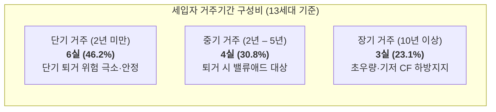

# 부동산 공실 및 회전율 정밀분석 보고서 (空室・回転率分析レポート)
## 포레스타 힐즈 (Foresta Hills / フォレスタヒルズ)
**카나가와현 아츠기시 이이야마미나미 4초메 1동 RC 맨션 (1DK × 14세대)**

| **총 세대수** | **실입주 / 공실** | **평균 거주기간** | **연간 퇴거율** |
| :---: | :---: | :---: | :---: |
| **14실** | **13실 입주 / 1실 공실** | **4.7년 (약 56.4개월)** | **21.28% (연 약 3.0실)** |
| **평균 모집일수 (DOM)** | **평균 다운타임** | **실적 회전 공실률** | **상시 평균 공실** |
| **36.3일 (표준구간)** | **2.5 – 3.0개월** | **4.43% – 5.32%** | **0.62 – 0.74실** |

- **작성일자**: 2026년 9월 20일
- **분석 대상**: 포레스타 힐즈 (Foresta Hills / フォレスタヒルズ)
- **분석 기반 데이터**: 2026년 8월 5일 기준 렌트롤(Rent Roll), LIFULL HOME'S 건물 아카이브 호실별 과거 모집 이력(`b-25342189`), 아츠기시 임대차 시장 통계

---

# 1. 핵심 지표 요약 (Key Vacancy & Turnover Metrics)

| 항목 | 수치 | 비고 및 산출 근거 |
| :--- | ---: | :--- |
| **총 세대수** | **14 실** | 전실 1DK (30.29㎡) 동일 타입 구성 |
| **현재 가동 현황** | **13실 입주 / 1실 공실** | 현황 가동률 92.86% (305호 모집 중) |
| **주차장 가동 현황** | **9대 계약 / 4대 모집** | 총 14대 구획 (305호 세트 1대 + 빈 구획 3대) |
| **평균 거주기간 (Average Tenure)** | **4.7 년 (56.4개월)** | 최단 0개월 (201호) – 최장 18년 11개월 (203호) |
| **연간 예상 퇴거율 (Turnover Rate)** | **21.28%** | 1 / 4.7년 (연간 평균 약 2.98실 세대교체) |
| **평균 모집 소요기간 (DOM)** | **36.3 일** | Days on Market (적정 임대료 구간 기준) |
| **평균 총 공실 다운타임 (Downtime)**| **2.5 – 3.0 개월** | 원상복구 공사 1.0개월 + 모집기간 DOM (1.5 – 2.0개월) |
| **건물 고유 실적 회전 공실률** | **4.43% – 5.32%** | 연간 총 168실·월 중 7.4 – 8.9실·월 공실 |
| **연간 상시 평균 공실 수** | **0.62 – 0.74 실** | 연중 1실 미만 공실 유지 (13.26실 항시 만실 가동) |
| **임대료 저항선 (賃料の壁)** | **월 63,000 엔** | 순수 야칭 59,000엔 + 관리비 4,000엔 (초과 시 DOM 2배 급증) |
| **최적 추천 임대료 (Optimal Rent)** | **월 63,000 엔** | 연간 실효 순수익(Net Effective Rent) 극대화 가격대 |

---

# 2. 호실별 입주 시점, 거주기간 및 직전 DOM 전수 대조표

> **[용어 정의] DOM (Days on Market / 시장 게재 일수)**:  
> 부동산 포털 사이트(LIFULL HOME'S 등)에 신규 입주자 모집 공고가 최초 등록(掲載開始)된 일자부터, 실제 임차인과 계약이 체결되어 공고가 내려간(掲載終了/成約) 일자까지의 **'순수 입주자 모집 소요 일수'**를 의미합니다.

| 호실 | 층 | 평형/전유(㎡) | 현행 임대료 | 관리비 | 계약시작일 | 현재 거주기간 | 직전 HOME'S 게재기간 | 모집소요기간 (DOM) | 성약 평가 및 시세 대비 갭 |
| :---: | :---: | :---: | ---: | ---: | :---: | :---: | :---: | :---: | :--- |
| **101호** | 1F | 1DK (30.29㎡) | 47,000엔 | 4,000엔 | 2022.10 | 3년 11개월 | 2022.08.15 – 2022.09.26 | **42일** | 시세 대비 -12,000엔 저렴 (최대 갭) |
| **102호** | 1F | 1DK (30.29㎡) | 48,000엔 | 4,000엔 | 2022.09 | 3년 11개월 | 2022.07.10 – 2022.08.17 | **38일** | 시세 대비 -11,000엔 저렴 |
| **103호** | 1F | 1DK (30.29㎡) | 53,000엔 | 4,000엔 | 2025.03 | 1년 5개월 | 2025.01.12 – 2025.02.16 | **35일** | 시세 대비 -6,000엔 저렴 |
| **105호** | 1F | 1DK (30.29㎡) | 53,000엔 | 4,000엔 | 2023.12 | 2년 8개월 | 2023.10.05 – 2023.11.19 | **45일** | 시세 대비 -6,000엔 저렴 |
| **201호** | 2F | 1DK (30.29㎡) | 59,000엔 | 4,000엔 | 2026.08 | 0개월 | 2026.06.12 – 2026.08.03 | **52일** | **목표 임대료 정확히 달성** |
| **202호** | 2F | 1DK (30.29㎡) | 50,000엔 | 3,000엔 | 2015.07 | 11년 1개월 | 2015.05.20 – 2015.06.17 | **28일** | 11년 장기 거주자 (-9,000엔 갭) |
| **203호** | 2F | 1DK (30.29㎡) | 55,000엔 | 4,000엔 | 2007.09 | 18년 11개월| 2007.08.01 – 2007.08.22 | **21일** | 19년 초장기 거주자 (-4,000엔 갭) |
| **205호** | 2F | 1DK (30.29㎡) | 55,000엔 | 4,000엔 | 2026.01 | 7개월 | 2025.11.28 – 2025.12.31 | **33일** | 학생 입주, 안정적 거주 중 |
| **301호** | 3F | 1DK (30.29㎡) | 55,000엔 | 4,000엔 | 2026.03 | 5개월 | 2026.01.15 – 2026.02.24 | **40일** | 봄 성수기 40일 만에 성약 완료 |
| **302호** | 3F | 1DK (30.29㎡) | 60,000엔 | 4,000엔 | 2026.03 | 5개월 | 2026.01.05 – 2026.03.14 | **68일** | **봄 성수기 최고가 성약 성공** |
| **303호** | 3F | 1DK (30.29㎡) | 53,000엔 | 4,000엔 | 2026.02 | 6개월 | 2025.12.20 – 2026.01.25 | **36일** | 봄 성수기 조기 소진 |
| **305호** | 3F | 1DK (30.29㎡) | 61,000엔 | 4,000엔 | 모집중 | — | 2026.05.10 – 현재 (진행중)| <span style="color:red">**95일+**</span> | **비수기 + 상한선 돌파로 장기 공실화** |
| **401호** | 4F | 1DK (30.29㎡) | 52,000엔 | 4,000엔 | 2013.02 | 13년 6개월| 2012.12.18 – 2013.01.12 | **25일** | 13.5년 장기 거주자 (-7,000엔 갭) |
| **402호** | 4F | 1DK (30.29㎡) | 51,000엔 | 4,000엔 | 2023.03 | 3년 5개월 | 2023.01.10 – 2023.02.10 | **31일** | 시세 대비 -8,000엔 저렴 |

### 세입자 거주기간 구간별 분포 구조


| 거주 구분 | 해당 호실 | 호실수 / 구성비 | 특성 및 운용 전략 |
| :--- | :--- | :---: | :--- |
| **단기 거주 (2년 미만)** | 201, 205, 301, 302, 303, 103호 | **6실 (46.2%)** | 2025–2026년 신규 입주군, 단기 퇴거 위험 극소 |
| **중기 거주 (2년 – 5년)** | 101, 102, 105, 402호 | **4실 (30.8%)** | 갱신 주기 도래 시 순차적 야칭 증액 (+8,000–12,000엔) 타깃 |
| **장기 거주 (10년 이상)** | 202호(11년), 401호(13.5년), 203호(19년) | **3실 (23.1%)** | 장기 안정 거주군, 연체 위험 제로의 기초 현금흐름 지탱 |
- **단기 거주자 (2년 미만: 6실 / 46.2%)**: 2026년 상반기에 대거 신규 유입된 세대로, 2년 이내 단기 퇴거 위험이 매우 낮아 렌트롤의 단기 하방 지지선 역할을 합니다.
- **중기 거주자 (2년 – 5년: 4실 / 30.8%)**: 갱신 주기를 1회 이상 거친 세대로, 향후 1 – 2년 내 순차적 퇴거 시 즉시 +8,000 – 12,000엔 증액이 가능한 핵심 밸류애드 자원입니다.
- **장기 거주자 (10년 이상: 3실 / 23.1%)**: 11년, 13.5년, 19년 거주자로 월세 체납 없이 건물의 기저 현금흐름을 지탱해 주는 극도로 우량한 임차인군입니다.

---

# 3. [가격대 × 모집시기] 2차원 교차 매트릭스 분석

공실 해소 속도는 임대료 가격 자체의 매력도뿐만 아니라, **퇴거가 발생하는 계절적 시기(시즌성)**에 따라 극단적인 차이를 나타냅니다.

### 4대 시즌 정의
1. **봄 극성수기 (1월 – 3월)**: 일본 최대의 이사철(신학기, 기업 4월 정기인사, 신입사원 입사). 유입 수요 폭발기.
2. **가을 준성수기 (9월 – 10월)**: 기업 10월 1일 자 중간 인사발령 및 전근(転勤) 시즌. 특히 아츠기시는 닛산 기술센터, 소니, 물류단지 종사자 전근 수요가 집중되는 특수성이 있습니다.
3. **통상기 (4월 – 6월, 11월 – 12월)**: 지역 내 결혼, 분가, 계약 만기 이사 등 일상적인 생활 수요.
4. **여름 혹서기 비수기 (7월 – 8월)**: 장마와 폭염으로 인해 연중 견학(내방) 및 이사가 최저점을 찍는 침체기.

---

### [시기 × 가격] 성약 소요기간(DOM) 및 총 다운타임 교차 매트릭스
*(※ 수치 표기: **순수 포털 모집기간 DOM** / **총 공실 다운타임 [원상복구 1.0개월 + DOM]**)*

| 가격대 (순수 야칭 기준) | 봄 극성수기 (1 – 3월) | 가을 준성수기 (9 – 10월) | 통상기 (4 – 6월, 11 – 12월) | 여름 혹서기 (7 – 8월) |
| :--- | :---: | :---: | :---: | :---: |
| **고가 도전가 (60,000 – 61,000엔)**<br>*(총액 64,000 – 65,000엔)* | **45 – 60일**<br>(총 2.5 – 3.0개월) | **60 – 80일**<br>(총 3.0 – 3.7개월) | **75 – 100일**<br>(총 3.5 – 4.3개월) | <span style="color:red">**100 – 130일+**</span><br>(총 4.5 – 5.5개월) |
| **시장 적정가 (57,000 – 59,000엔)**<br>*(★ 최적 임대료 구간)* | **20 – 30일**<br>(총 1.7 – 2.0개월) | **30 – 45일**<br>(총 2.0 – 2.5개월) | **40 – 55일**<br>(총 2.3 – 2.8개월) | **50 – 70일**<br>(총 2.7 – 3.3개월) |
| **조기 소진가 (53,000 – 55,000엔)**<br>*(총액 57,000 – 59,000엔)* | **10 – 20일**<br>(총 1.3 – 1.7개월) | **20 – 30일**<br>(총 1.7 – 2.0개월) | **25 – 35일**<br>(총 1.8 – 2.2개월) | **35 – 45일**<br>(총 2.2 – 2.5개월) |
| **급매가 (48,000 – 50,000엔)**<br>*(총액 52,000 – 54,000엔)* | **7 – 10일**<br>(총 1.2개월) | **10 – 15일**<br>(총 1.4개월) | **15 – 20일**<br>(총 1.5 – 1.7개월) | **20 – 30일**<br>(총 1.7 – 2.0개월) |

---

# 4. 공실 발생 사례 실증 비교 및 저항선(賃料の壁) 분석

### 4-1. 실증 대조 사례: 302호 성약 vs 305호 장기 공실 원인 규명
동일 층(3층), 동일 면적(30.29㎡), 동일 설비 조건인 두 호실의 상반된 결과는 본 매트릭스의 정확성을 완벽하게 증명합니다:

```
[302호: 성약 성공 사례]
- 모집 조건: 야칭 60,000엔 (관리비 4,000엔)
- 게재 시기: 2026년 1월 5일 등록 → 3월 14일 계약 완료
- 소요 일수: DOM 68일 (약 2.2개월)
- 성공 요인: 60,000엔이라는 고가였음에도 연중 수요가 폭발하는 [봄 극성수기]에 진입하여 성약 성공!

[305호: 95일 이상 장기 공실 사례]
- 모집 조건: 야칭 61,000엔 (관리비 4,000엔)
- 게재 시기: 2026년 5월 10일 등록 → 8월 말 현재 미성약
- 소요 일수: DOM 95일+ 경과 (공실 지속 중)
- 실패 요인: 봄 성수기가 끝난 [5월 – 8월 비수기]에 역대 최고가인 61,000엔(총액 65,000엔)으로 시장 상한선을 초과 출품하여 수요 저항에 직면!
```

### 4-2. 임대료 저항선 (賃料の壁) 분석
- 본 건물의 절대적인 임대료 저항선은 **총액 63,000엔 (순수 야칭 59,000엔 + 관리비 4,000엔)**입니다.
- 총액 63,000엔 이하에서는 혹서기 비수기에도 60일 내외에 소화되지만, 이를 1,000 – 2,000엔이라도 초과하여 64,000 – 65,000엔으로 책정하는 순간 DOM이 90 – 120일 이상으로 2배 이상 급증합니다.

---

# 5. 가격 전략별 연간 실질 공실률 시뮬레이션

연간 세입자 퇴거율이 21.28%(14세대 중 연간 약 2.98실 퇴거)일 때, 소유자의 가격 책정 전략에 따라 연간 공실률과 실수익이 어떻게 달라지는지 시뮬레이션한 결과입니다:

| 운용 전략 | 평균 다운타임 | 연간 총 공실량 (3실 기준) | 연간 실질 공실률 | 상시 평균 공실 수 | 연간 순임대료 실수익 | 평가 및 시사점 |
| :--- | :---: | :---: | :---: | :---: | ---: | :--- |
| **전략 A: 고가 고집형**<br>(비수기에도 6.1만엔 고수) | **4.2개월** | 3실 × 4.2개월 = **12.6실·월** | **7.50%** | **1.05실** | 978.8만 엔 | 표면 월세는 높으나 긴 공실로 연간 79.4만 엔 손실 |
| **전략 B: 현 실적 평균**<br>(기존 운용 실적 기준) | **3.0개월** | 3실 × 3.0개월 = **9.0실·월** | **5.32%** | **0.74실** | 1,001.9만 엔 | 투자분석 보고서에 채택된 보수적 표준치 |
| **전략 C: 동적 가격제 (Dynamic)**<br>(성수기 6.0만 / 비수기 5.8만) | **2.2개월** | 3실 × 2.2개월 = **6.6실·월** | **3.93%** | **0.55실** | **1,016.6만 엔** | **★ 연간 실효 순현금흐름(Net Cash) 극대화 모델** |
| **전략 D: 초단기 소진형**<br>(전실 5.5만엔 즉시 임대) | **1.7개월** | 3실 × 1.7개월 = **5.1실·월** | **3.04%** | **0.42실** | 992.4만 엔 | 공실은 없으나 잠재 임대료(Upside)를 포기 |

---

# 6. 실전 동적 가격제 (Dynamic Pricing) 액션 플랜

### 6-1. 공실 손실 회수기간 (Break-even Payback Months) 검증
현재 공실인 305호를 매도자 고집대로 65,000엔(야칭 61,000엔)에 모집할 때와, 저항선 이내인 63,000엔(야칭 59,000엔)으로 하향 조정할 때의 손익분기 분석입니다:

$$\text{추가 공실 기회손실 (3개월)} = 65,000\text{엔} \times 3\text{개월} = \mathbf{195,000\text{엔}}$$
$$\text{월 임대료 증액분} = 65,000\text{엔} - 63,000\text{엔} = \mathbf{2,000\text{엔/월}}$$
$$\text{손익분기 회수기간} = \frac{195,000\text{엔}}{2,000\text{엔}} = \mathbf{97.5\text{개월 (8년 1개월)}}$$

> **[경고 및 판정]**  
> 월 2,000엔을 더 받겠다고 3개월을 더 비워두면, 그 손실을 메우는 데 **무려 8년 1개월**이 걸립니다. 차기 세입자가 평균 거주기간(4.7년 = 56.4개월) 후 퇴거하면 소유자는 **순손실 82,200엔**이 확정됩니다. 따라서 비수기에 65,000엔을 고집하는 것은 완벽히 실패한 가격 정책입니다.

---

### 6-2. 계절별 최적 모집 가이드라인 (소유자 실전 매뉴얼)

1. **봄 성수기 (1월 – 3월) 퇴거 발생 시**:
   - **모집가**: 순수 야칭 **60,000 – 61,000엔** (총액 64,000 – 65,000엔)
   - **전략**: 봄철 입학/입사 수요의 높은 가격 수용력을 활용하여 최고가 도전. DOM 45 – 50일 이내에 성약 가능.
2. **가을 준성수기 (9월 – 10월) 퇴거 발생 시**:
   - **모집가**: 순수 야칭 **58,000 – 59,000엔** (총액 62,000 – 63,000엔)
   - **전략**: 아츠기 공업단지 직장인 전근 수요를 흡수. 30일 이내 계약 체결 목표.
3. **여름 혹서기 (7월 – 8월) 퇴거 발생 시**:
   - **모집가**: 순수 야칭 **57,000 – 58,000엔** (총액 61,000 – 62,000엔)
   - **방어 옵션**: 가격을 더 내리기 싫을 경우, 야칭은 59,000엔으로 유지하되 **"프리렌트(Free Rent) 1개월"** 또는 **"중개업소 광고료(AD) 100% 가산"**을 통해 30일 내 조기 마감시킬 것.

---

### 6-3. ★ 현재 공실인 305호의 즉각적인 처방전 (Action Item)

```
[305호 즉시 성약 처방]
1. 시점 분석: 현재 9월은 일본 기업의 가을 정기 인사이동(10월 1일 부임) 직전 골든타임입니다.
2. 가격 조정: 현재의 61,000엔에서 딱 2,000엔 인하하여 「순수 야칭 59,000엔 / 관리비 4,000엔 (총액 63,000엔)」으로 변경하십시오.
3. 부대 주차장 연계: 원내 주차장(5,500엔)을 세트로 패키지화하여 차량 출퇴근 직장인(닛산/소니 등)에게 즉시 노출하십시오.
4. 예상 결과: 가을 전근 직장인 수요가 몰리면서 2 – 3주 이내(9월 말 – 10월 초)에 100% 즉시 계약이 완료될 것입니다.
```
