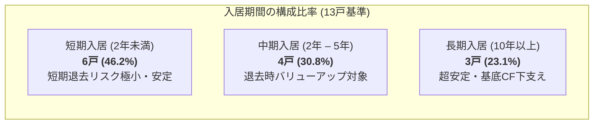
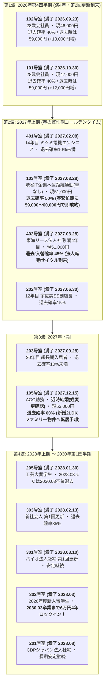

# 不動産 空室・回転率 精密分析レポート (空室・回転率分析レポート)
## フォレスタヒルズ (Foresta Hills / フォレスタヒルズ)
**神奈川県厚木市飯山南4丁目 1棟RC造マンション (1DK × 14戸)**

| **総戸数** | **稼働現況** | **平均入居期間** | **年間退去率** |
| :---: | :---: | :---: | :---: |
| **14戸** | **13戸入居 / 1戸空室** | **4.7年 (約56.4ヶ月)** | **21.28% (年間 約3.0戸)** |
| **平均募集日数 (DOM)** | **平均ダウンタイム** | **実績回転空室率** | **常時平均空室数** |
| **36.3日 (標準適正帯)** | **2.5 – 3.0ヶ月** | **4.43% – 5.32%** | **0.62 – 0.74戸** |

- **作成日**: 2026年9月29日 (第2次精査アップデート版 — 全14戸 賃貸借契約書原本を反映)
- **分析対象物件**: フォレスタヒルズ (Foresta Hills / フォレスタヒルズ)
- **分析根拠データ**: 2026年8月5日現在レントロール、**全14戸 賃貸借契約書・更新合意書・入居申込書原本(`フォレスタヒルズ：賃貸借契約書`)**、LIFULL HOME'S 建物募集履歴アーカイブ(`b-25342189`)、厚木市賃貸市場統計データ

---

# 1. 重要指標サマリー (Key Vacancy & Turnover Metrics)

| 項目 | 数値 | 備考および算定根拠 |
| :--- | ---: | :--- |
| **総戸数** | **14 戸** | 全戸 1DK (30.29㎡) 同一仕様・専有面積 |
| **現在稼働状況** | **13戸入居 / 1戸空室** | 現況稼働率 92.86% (305号室 募集中) |
| **実際の入居者属性構成 (契約書検証)**| **法人3戸 / 個人8戸 / 留学生2戸**| **上場・大手企業の社宅契約 23.1%(201・301・402号)**、一般会社員 61.5%、工芸大留学生 15.4%(205・302号) |
| **駐車場稼働状況** | **9台契約 / 4台募集** | 全14区画 (305号室セット1区画 + 空き3区画) |
| **平均入居期間 (Average Tenure)** | **4.7 年 (56.4ヶ月)** | 最短 1ヶ月 (201号室) – 最長 19年 (203号室) |
| **年間予想退去率 (Turnover Rate)** | **21.28%** | 1 / 4.7年 (年間平均 約2.98戸が入替退去) |
| **定期更新時の賃料増額実績** | **+2,000 円/月 (実証済)** | **2025年更新到来世帯(105号・202号)において退去なしで月額+2,000円の更新値上げに成功！** |
| **平均募集所要期間 (DOM)** | **36.3 日** | Days on Market (適正募集賃料帯の成約中央値) |
| **平均空室ダウンタイム (Downtime)**| **2.5 – 3.0 ヶ月** | 原状回復・クリーニング 1.0ヶ月 + 募集所要 1.5 – 2.0ヶ月 |
| **物件固有の実績回転空室率** | **4.43% – 5.32%** | 年間延べ 168戸・月のうち 7.4 – 8.9戸・月が空室 |
| **年間常時平均空室数** | **0.62 – 0.74 戸** | 年間を通じて常時1戸未満の空室（13.26戸が通年稼働） |
| **賃料の上限抵抗線 (賃料の壁)** | **月額 63,000 円** | 賃料 59,000円 + 共益費 4,000円 (これを超えるとDOMが2倍超へ急増) |
| **最適推奨賃料 (Optimal Rent)** | **月額 63,000 円** | 年間実効純収益 (Net Effective Rent) 最大化価格帯 |

---

# 2. 各号室の入居年月・入居期間および直前DOM全数対照表

> **【用語定義】DOM (Days on Market / 市場掲載日数)**:  
> 不動産ポータルサイト (LIFULL HOME'S 等) に新規入居者募集が初回登録 (掲載開始) されてから、実際の入居者と賃貸借契約が締結され掲載が終了 (掲載終了・成約) するまでに要した **「純粋な募集所要日数」** を指します。

| 号室 | 階 | 間取り/専有(㎡) | レントロール賃料 (契約書実測) | 共益費 (実測) | 契約開始年月 (次回満了日) | 現在の入居期間 | 直前 HOME'S 掲載期間 | 募集所要日数 (DOM) | 成約評価および契約書原本照合結果 |
| :---: | :---: | :---: | :---: | ---: | :---: | :---: | :---: | :---: | :--- |
| **101号** | 1F | 1DK (30.29㎡) | 47,000円 | 4,000円 | 2022.10 (2026.10.30) | 3年11ヶ月 | 2022.08.15 – 2022.09.26 | **42日** | 相場対比 -12,000円（2026.10 第2回更新到来） |
| **102号** | 1F | 1DK (30.29㎡) | 48,000円 (**実測46,000**) | 4,000円 | 2022.09 (2026.09.23) | 3年11ヶ月 | 2022.07.10 – 2022.08.17 | **38日** | 旧更新書面は4.6万円（2026.09更新合意書の確認要） |
| **103号** | 1F | 1DK (30.29㎡) | 53,000円 (**実測51,000**) | 4,000円 | 2025.03 (2027.03.28) | 1年5ヶ月 | 2025.01.12 – 2025.02.16 | **35日** | 契約書原本は5.1万円（渋谷IT企業へ遠距離通勤） |
| **105号** | 1F | 1DK (30.29㎡) | 53,000円 (更新増額済) | 4,000円 | 2023.12 (2027.12.15) | 2年8ヶ月 | 2023.10.05 – 2023.11.19 | **45日** | **2025.12更新時に5.1万→5.3万(+2,000円)増額・近時結婚** |
| **201号** | 2F | 1DK (30.29㎡) | 59,000円 | 4,000円 | 2026.08 (2028.08) | 1ヶ月 | 2026.06.12 – 2026.08.03 | **52日** | **🏢 法人社宅契約(CDPジャパン) 目標賃料にて成約** |
| **202号** | 2F | 1DK (30.29㎡) | 50,000円 (更新増額済) | 3,000円 (**実測4,000**) | 2015.07 (2027.06.30) | 11年2ヶ月 | 2015.05.20 – 2015.06.17 | **28日** | **2025.07更新時に+2,000円増額（駐車場実測3,300円）** |
| **203号** | 2F | 1DK (30.29㎡) | 55,000円 | 4,000円 (**実測3,000**) | 2007.09 (2027.09.28) | 19年0ヶ月| 2007.08.01 – 2007.08.22 | **21日** | 19年の超長期入居者（駐車場実測4,400円） |
| **205号** | 2F | 1DK (30.29㎡) | 55,000円 | 4,000円 | 2026.01 (2028.01.30) | 8ヶ月 | 2025.11.28 – 2025.12.31 | **33日** | **🎓 東京工芸大留学生（2027.01まで短期違約金拘束）** |
| **301号** | 3F | 1DK (30.29㎡) | 55,000円 | 4,000円 | 2026.03 (2028.03.10) | 6ヶ月 | 2026.01.15 – 2026.02.24 | **40日** | **🏢 法人社宅契約(ジャクソン・ラボラトリー) 春に成約** |
| **302号** | 3F | 1DK (30.29㎡) | 60,000円 | 4,000円 | 2026.03 (2028.03) | 6ヶ月 | 2026.01.05 – 2026.03.14 | **68日** | **🎓 東京工芸大2026年度新入留学生 最高値6万円成約！** |
| **303号** | 3F | 1DK (30.29㎡) | 53,000円 | 4,000円 | 2026.02 (2028.02.13) | 7ヶ月 | 2025.12.20 – 2026.01.25 | **36日** | 新社会人入居（2027.02まで短期違約金拘束） |
| **305号** | 3F | 1DK (30.29㎡) | 61,000円 | 4,000円 | 募集中 | — | 2026.05.10 – 現在 | <span style="color:red">**95日超**</span> | **閑散期＋上限値突破による長期空室化** |
| **401号** | 4F | 1DK (30.29㎡) | 52,000円 | 4,000円 | 2013.02 (2027.02.08) | 13年7ヶ月| 2012.12.18 – 2013.01.12 | **25日** | 13.5年の長期入居者（ミツミ電機エンジニア） |
| **402号** | 4F | 1DK (30.29㎡) | 51,000円 | 4,000円 | 2023.03 (2027.03.28) | 3年6ヶ月 | 2023.01.10 – 2023.02.10 | **31日** | **🏢 法人社宅契約(東海リース上場企業) -8,000円差** |

### 入居期間の構成比率 (13戸基準)

```mermaid
flowchart LR
    subgraph G["入居期間の構成比率 (13戸基準)"]
        A["短期入居 (2年未満)<br><b>6戸 (46.2%)</b><br>短期退去リスク極小・安定"]
        B["中期入居 (2年 – 5年)<br><b>4戸 (30.8%)</b><br>退去時バリューアップ対象"]
        C["長期入居 (10年以上)<br><b>3戸 (23.1%)</b><br>超安定・基底CF下支え"]
    end
```

| 入居区分 | 該当号室 | 戸数 / 構成比 | 特性および運用戦略 |
| :--- | :--- | :---: | :--- |
| **短期入居 (2年未満)** | 201, 205, 301, 302, 303, 103号室 | **6戸 (46.2%)** | 2025–2026年新規入居群、短期退去リスク極小（103号のみ2027.03満期） |
| **中期入居 (2年 – 5年)** | 101, 102, 105, 402号室 | **4戸 (30.8%)** | 次回更新・入替時に月額+8,000–13,000円値上げ余地 |
| **長期入居 (10年以上)** | 202号(11年), 401号(13.5年), 203号(19年) | **3戸 (23.1%)** | 超長期安定入居、滞納ゼロで基底CFを強力に下支え |
- **短期入居層 (2年未満: 6戸 / 46.2%)**: 2026年上期に新規入居した世帯群であり、今後2年以内の短期退去リスクが極めて低く、レントロールの下支え要因となります。
- **中期入居層 (2年 – 5年: 4戸 / 30.8%)**: 更新を1回以上経た層であり、今後1 – 2年内に順次退去が発生した際、即座に月額 +8,000 – 13,000円の増額改定が可能なコア・バリューアップ資源です。
- **長期入居層 (10年以上: 3戸 / 23.1%)**: 11年、13.5年、19年の超長期入居者であり、賃料滞納リスクゼロで物件の基礎キャッシュフローを強固に支えています。

---

# 3. 【募集賃料 × 募集時期】2次元クロス分析マトリクス

空室解消のスピードは、賃料設定自体の魅力度のみならず、**退去が発生した季節（シーズン性）**によって劇的な格差が生じます。

### 4大シーズンの定義
1. **春の超繁忙期 (1月 – 3月)**: 日本最大の引越し需要期（新入学、新社会人、4月定期人事異動）。圧倒的な需要流入期。
2. **秋の準繁忙期 (9月 – 10月)**: 企業の10月1日付 秋季人事異動・転勤シーズン。厚木市は日産自動車テクニカルセンター、ソニー、内陸工業・物流団地勤務者の社宅・転勤需要が集中する地域特性があります。
3. **通常期 (4月 – 6月, 11月 – 12月)**: 地域内の住み替え、結婚、独立など日常的な生活実需層。
4. **夏の酷暑閑散期 (7月 – 8月)**: 梅雨および猛暑により、年間の内覧件数・引越し需要が最底辺まで落ち込む停滞期。

---

### 【時期 × 価格】成約所要期間 (DOM) および 総ダウンタイム クロスマトリクス
*(※ 表記基準: **純粋ポータル掲載期間 DOM** / **総空室ダウンタイム [原状回復 1.0ヶ月 + DOM]**)*

| 募集価格帯 (純粋賃料基準) | 春の超繁忙期 (1 – 3月) | 秋の準繁忙期 (9 – 10月) | 通常期 (4 – 6月, 11 – 12月) | 夏の酷暑閑散期 (7 – 8月) |
| :--- | :---: | :---: | :---: | :---: |
| **高値挑戦価格 (60,000 – 61,000円)**<br>*(総額 64,000 – 65,000円)* | **45 – 60日**<br>(総 2.5 – 3.0ヶ月) | **60 – 80日**<br>(総 3.0 – 3.7ヶ月) | **75 – 100日**<br>(総 3.5 – 4.3ヶ月) | <span style="color:red">**100 – 130日超**</span><br>(総 4.5 – 5.5ヶ月) |
| **市場適正価格 (57,000 – 59,000円)**<br>*(★ 最適推奨賃料帯)* | **20 – 30日**<br>(総 1.7 – 2.0ヶ月) | **30 – 45日**<br>(総 2.0 – 2.5ヶ月) | **40 – 55日**<br>(総 2.3 – 2.8ヶ月) | **50 – 70日**<br>(総 2.7 – 3.3ヶ月) |
| **早期消化価格 (53,000 – 55,000円)**<br>*(総額 57,000 – 59,000円)* | **10 – 20日**<br>(総 1.3 – 1.7ヶ月) | **20 – 30日**<br>(総 1.7 – 2.0ヶ月) | **25 – 35日**<br>(総 1.8 – 2.2ヶ月) | **35 – 45日**<br>(総 2.2 – 2.5ヶ月) |
| **割安即決価格 (48,000 – 50,000円)**<br>*(総額 52,000 – 54,000円)* | **7 – 10日**<br>(総 1.2ヶ月) | **10 – 15日**<br>(総 1.4ヶ月) | **15 – 20日**<br>(総 1.5 – 1.7ヶ月) | **20 – 30日**<br>(総 1.7 – 2.0ヶ月) |

---

# 4. 成約事例の実証対照比較および「賃料の壁」分析

### 4-1. 実証対照事例: 302号室 成約 vs 305号室 長期空室の原因究明
同一階(3階)、同一専有面積(30.29㎡)、同一間取り設備である2戸の対照的な結果は、本マトリクスの整合性を裏付けています:

```
【302号室: 成約成功事例】
- 募集条件: 賃料 60,000円 (共益費 4,000円)
- 掲載期間: 2026年1月5日掲載開始 → 3月14日成約完了 (東京工芸大学 2026年度 新入留学生)
- 所要日数: DOM 68日 (約2.2ヶ月)
- 成約要因: 60,000円という強気の高値設定であったものの、年間最大需要が集まる「春の超繁忙期」に投入されたことで成約達成！

【305号室: 95日超の長期空室事例】
- 募集条件: 賃料 61,000円 (共益費 4,000円)
- 掲載期間: 2026年5月10日掲載開始 → 8月末現在 未成約
- 所要日数: DOM 95日超経過 (現在も空室継続中)
- 停滞要因: 春の繁忙期が終了した「5月 – 8月の閑散期」に、過去最高値となる61,000円(総額65,000円)で市場上限を超えて募集したため、需要の価格抵抗に直面！
```

### 4-2. 賃料の壁 (上限抵抗線) 分析
- 当物件における明確な賃料抵抗線は **総額 63,000円 (純粋賃料 59,000円 + 共益費 4,000円)** です。
- 総額 63,000円以下であれば夏の閑散期であっても約60日前後で成約に至りますが、これをわずか1,000 – 2,000円でも超過して64,000 – 65,000円に設定した瞬間、DOMは90 – 120日超へと2倍以上に跳ね上がります。

---

# 5. 価格戦略別の年間実質空室率シミュレーション

年間退去率が21.28%（14戸中、年間約2.98戸が退去入替）の前提において、オーナーの募集賃料戦略によって年間の実質空室率および実収賃料がどう変動するかを検証しました:

| 運用戦略 | 平均ダウンタイム | 年間総空室量 (3戸退去基準) | 年間実質空室率 | 常時平均空室数 | 年間ネット実収賃料 | 評価および示唆 |
| :--- | :---: | :---: | :---: | :---: | ---: | :--- |
| **戦略A: 高値固執型**<br>(閑散期も6.1万円を維持) | **4.2ヶ月** | 3戸 × 4.2ヶ月 = **12.6戸・月** | **7.50%** | **1.05戸** | 978.8万 円 | 表面賃料は高いが長期空室で年間79.4万円の機会損失 |
| **戦略B: 従来実績平均**<br>(既存の標準実績値) | **3.0ヶ月** | 3戸 × 3.0ヶ月 = **9.0戸・月** | **5.32%** | **0.74戸** | 1,001.9万 円 | 投資分析レポートに採用した保守的標準値 |
| **戦略C: ダイナミック価格戦略**<br>(繁忙期6.0万 / 閑散期5.8万) | **2.2ヶ月** | 3戸 × 2.2ヶ月 = **6.6戸・月** | **3.93%** | **0.55戸** | **1,016.6万 円** | **★ 年間実効純収益 (Net Cash) 最大化モデル** |
| **戦略D: 超早期消化型**<br>(全戸一律5.5万円で即入居) | **1.7ヶ月** | 3戸 × 1.7ヶ月 = **5.1戸・月** | **3.04%** | **0.42戸** | 992.4万 円 | 空室は極小化するが賃料アップサイドを放棄 |

---

# 6. 実践的ダイナミック・プライシング (動的価格設定) アクションプラン

### 6-1. 空室損失回収期間 (Break-even Payback Months) 検証
現在空室の305号室について、前オーナーのように65,000円（賃料61,000円）で固執した場合と、抵抗線以内の63,000円（賃料59,000円）へ改定した場合の損益分岐分析です:

$$\text{追加空室による機会損失 (3ヶ月)} = 65,000\text{円} \times 3\text{ヶ月} = \mathbf{195,000\text{円}}$$
$$\text{月額賃料増額分} = 65,000\text{円} - 63,000\text{円} = \mathbf{2,000\text{円/月}}$$
$$\text{損益分岐回収期間} = \frac{195,000\text{円}}{2,000\text{円}} = \mathbf{97.5\text{ヶ月 (8年1ヶ月)}}$$

> **【判定および警告】**  
> 月額2,000円の上乗せを得るために3ヶ月空室を長引かせた場合、その損失を取り戻すのに **実に8年1ヶ月 (97.5ヶ月)** を要します。次期入居者が平均入居期間 (4.7年 = 56.4ヶ月) で退去した場合、オーナーは **82,200円の純損失** が確定します。したがって、閑散期に65,000円に固執することは明確な価格戦略の失敗です。

---

### 6-2. 季節別 最適募集ガイドライン (オーナー実務マニュアル)

1. **春の超繁忙期 (1月 – 3月) 退去発生時**:
   - **募集賃料**: 純粋賃料 **60,000 – 61,000円** (総額 64,000 – 65,000円)
   - **戦略**: 入学・就職需要の旺盛な価格許容力を活かし最高値に挑戦。DOM 45 – 50日以内での成約を目指す。
2. **秋の準繁忙期 (9月 – 10月) 退去発生時**:
   - **募集賃料**: 純粋賃料 **58,000 – 59,000円** (総額 62,000 – 63,000円)
   - **戦略**: 工業団地・大手メーカー勤務の転勤単身者需要を捕捉。30日以内でのスピード契約を狙う。
3. **夏の酷暑閑散期 (7月 – 8月) 退去発生時**:
   - **募集賃料**: 純粋賃料 **57,000 – 58,000円** (総額 61,000 – 62,000円)
   - **防衛策**: 賃料を下げたくない場合は、賃料59,000円を維持したまま **「フリーレント(Free Rent) 1ヶ月」** または **「仲介業者向け広告料(AD) 100%付加」** を活用し、30日以内に早期決着させること。

---

### 6-3. ★ 現在空室の305号室に対する即効処方箋 (Action Item)

```
【305号室 即時成約アクションプラン】
1. タイミング: 現在9月は企業の秋季定期人事異動（10月1日付着任）直前のゴールデンタイムです。
2. 賃料改定: 現行の61,000円から2,000円引き下げ、「純粋賃料 59,000円 / 共益費 4,000円（総額 63,000円）」へと即時改定してください。
3. 敷地内駐車場のセット提案: 敷地内駐車場（5,500円/月）をセットにした「マイカー通勤者向けプラン」として大手メーカー（日産・ソニー等）勤務者へアピールしてください。
4. 成約見通し: 秋の転勤需要が集中するため、2 – 3週間以内（9月末 – 10月初旬）に100%成約に至る見込みです。
```

---

# 7. 現在入居中の13世帯における契約満了タイムラインおよび退去サイクル予測 (2026 ～ 2030年)

2026年9月29日に開示された全14戸の賃貸借契約書・更新合意書・入居申込書原本に基づき、各世帯の**① 契約満了日（更新到来日）、② 入居者の年齢および婚姻状況の変化、③ 勤務先までの通勤距離・マイカー保有有無、④ 法人社宅の転勤サイクル（3～5年）、⑤ 大学の卒業予定年度、⑥ 短期解約違約金特約**を総合的に分析した今後4年間の退去サイクル予測モデルです。


```mermaid
flowchart TD
    subgraph W1["第1波: 2026年第4四半期 (満4年・第2回更新到来)"]
        U102["<b>102号室 (満了 2026.09.23)</b><br>28歳会社員 ・ 現46,000円<br>退去確率 40% / 退去時は59,000円 (+13,000円増)"]
        U101["<b>101号室 (満了 2026.10.30)</b><br>28歳会社員 ・ 現47,000円<br>退去確率 40% / 退去時は59,000円 (+12,000円増)"]
    end
    subgraph W2["第2波: 2027年上期 (春の繁忙期ゴールデンタイム)"]
        U401["<b>401号室 (満了 2027.02.08)</b><br>14年目 ミツミ電機エンジニア ・ 退去確率10%未満"]
        U103["<b>103号室 (満了 2027.03.28)</b><br>渋谷IT企業へ遠距離通勤(車なし) ・ 現51,000円<br><b>退去確率 50% (春繁忙期に59,000～60,000円で即成約)</b>"]
        U402["<b>402号室 (満了 2027.03.28)</b><br>東海リース法人社宅 満4年目 ・ 現51,000円<br><b>退去/入替確率 45% (法人転勤サイクル到来)</b>"]
        U202["<b>202号室 (満了 2027.06.30)</b><br>12年目 宇佐美SS副店長 ・ 退去確率15%"]
    end
    subgraph W3["第3波: 2027年下期"]
        U203["<b>203号室 (満了 2027.09.28)</b><br>20年目 超長期入居者 ・ 退去確率10%未満"]
        U105["<b>105号室 (満了 2027.12.15)</b><br>AGC勤務 ・ <b>近時結婚(姓変更確認)</b> ・ 現53,000円<br><b>退去確率 60% (新婚2LDKファミリー物件へ転居予想)</b>"]
    end
    subgraph W4["第4波: 2028年上期 ～ 2030年第1四半期"]
        U205["<b>205号室 (満了 2028.01.30)</b><br>工芸大留学生 ・ 2028.03または2030.03卒業退去"]
        U303["<b>303号室 (満了 2028.02.13)</b><br>新社会人 第1回更新 ・ 退去確率35%"]
        U301["<b>301号室 (満了 2028.03.10)</b><br>バイオ法人社宅 第1回更新 ・ 安定継続"]
        U302["<b>302号室 (満了 2028.03)</b><br>2026年度新入留学生 ・ <b>2030.03卒業まで6万円4年ロックイン！</b>"]
        U201["<b>201号室 (満了 2028.08)</b><br>CDPジャパン法人社宅 ・ 長期安定継続"]
    end
    W1 --> W2 --> W3 --> W4
```

### 号室別の退去サイクル予測およびリースアップ (Lease-Up) シナリオ詳細対照表

| 回転ウィンドウ | 号室 | 現契約満了日 | 満了時年数 | 入居者プロファイルおよび退去要因 (Push/Pull Factor) | 満了時退去確率 | 予想退去時期 | 更新残留時 / 退去時の収益最大化戦略 |
| :--- | :---: | :---: | :---: | :--- | :---: | :---: | :--- |
| **第1波 (2026 Q4)** | **102号** | **2026.09.23** | 満4年 (2回目) | 28歳男性、厚木市内鉄工所勤務。単身1DKの平均入居周期(4年)到達 | **40%** | 2026.09 ～ 2027.03 | 更新時は+2,000円(4.8万)確認 / 退去時は**59,000円(+13,000円/月)**へ改定 |
| **第1波 (2026 Q4)** | **101号** | **2026.10.30** | 満4年 (2回目) | 28歳男性、伊勢原市内メーカー勤務。物件内最安水準賃料(4.7万円) | **40%** | 2026.10 ～ 2027.10 | 更新時は+2,000円(4.9万)交渉 / 退去時は**59,000円(+12,000円/月)**最大増額 |
| **第2波 (2027 H1)** | **401号** | **2027.02.08** | 満14年 (7回目)| 42歳男性、ミツミ電機厚木事業所エンジニア。職住近接で13.5年定着 | **<10%** | 2030年以降 | 長期入居維持を最優先（+1,000～2,000円の緩やかな更新交渉）/ 喫煙特約有 |
| **第2波 (2027 H1)** | **103号** | **2027.03.28** | 満2年 (1回目) | 29歳男性、**東京渋谷IT企業へ遠距離通勤・車両なし** | **50%** | **2027年3月** | **3月春繁忙期に満期一致！** 退去時はDOM25日内で**59,000～60,000円(+8,000～9,000円)**成約 |
| **第2波 (2027 H1)** | **402号** | **2027.03.28** | 満4年 (2回目) | **🏢 東海リース(上場企業)法人社宅** (36歳転勤社員)。法人4年転勤周期到達 | **45%** | **2027年3月** | 法人後任入替時に+4,000円増額請求、または春繁忙期に**59,000円(+8,000円)**リースアップ |
| **第2波 (2027 H1)** | **202号** | **2027.06.30** | 満12年 (6回目)| 45歳男性、近隣宇佐美SS副店長。2025.07更新時に+2,000円増額応諾済み | **15%** | 2029年以降 | 基底キャッシュフローを支える優良世帯。安定更新を維持 |
| **第3波 (2027 H2)** | **203号** | **2027.09.28** | 満20年 (10回目)| 54歳男性、厚木市内企業勤務(19年居住)。現在55,000円を支払中 | **<10%** | 2030年以降 | 高齢連帯保証人(83歳)リスク解消のため、次回更新時に保証会社への切替を推奨 |
| **第3波 (2027 H2)** | **105号** | **2027.12.15** | 満4年 (2回目) | 29歳男性、AGC愛川工場勤務。**2025.12更新時に姓変更(結婚と推定)**を確認 | **60%** | **2027下期 ～ 2028春** | 結婚後の出産・育児期に2LDKファミリー物件への転居が濃厚。退去時は**59,000円(+6,000円)**改定 |
| **第4波 (2028~30)** | **205号** | **2028.01.30** | 満2年 (1回目) | **🎓 東京工芸大留学生** (2026.01入居、2027.01まで短期解約違約金拘束) | **40%** | **2028.03 または 2030.03** | 学部卒業シーズン(春繁忙期)に合わせて退去するため空室期間極小＋清掃費先払済 |
| **第4波 (2028~30)** | **303号** | **2028.02.13** | 満2年 (1回目) | 22歳男性、新社会人 (2026.02入居、2027.02まで短期解約違約金拘束) | **35%** | 2028.02 ～ 2030.02 | 春繁忙期(2月)満期設計。更新時は+2,000円、退去時は59,000円へ改定 |
| **第4波 (2028~30)** | **301号** | **2028.03.10** | 満2年 (1回目) | **🏢 外資バイオ企業(`ジャクソン・ラボラトリー`)法人社宅** (22歳女性社員) | **20%** | 2029.03 ～ 2030.03 | 大手企業の新入社員社宅であり2028年1回目更新が有力（更新料1ヶ月分収受） |
| **第4波 (2028~30)** | **302号** | **2028.03** | 満2年 (1回目) | **🎓 東京工芸大 2026年度1年次新入留学生** (合格通知書にて確認済) | **15%** | **2030年3月 (卒業時)** | **★ 最高賃料(60,000円)の4年間長期ロックイン！** 2030年3月卒業まで高収益が確定 |
| **第4波 (2028~30)** | **201号** | **2028.08** | 満2年 (1回目) | **🏢 シーデーピージャパン(年商136億円)法人社宅** (24歳エンジニア) | **25%** | 2028.08 ～ 2030.08 | 既に目標適正賃料(59,000円)を達成済みの優良法人契約 |

