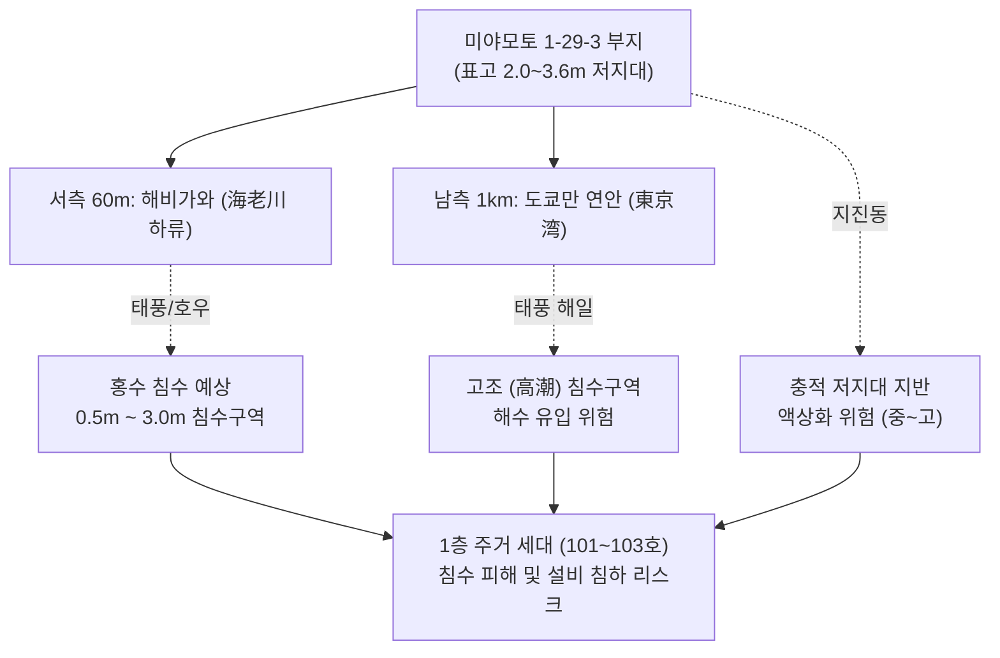

# 수익형 부동산 투자분석 보고서 (投資分析レポート)
## 후나바시시 미야모토 1초메 신축 공동주택 (船橋市宮本1丁目・共同住宅 1K・9世帯)

---

# 1. 에그제큐티브 서머리 (Executive Summary)

본 건은 치바현 후나바시시 미야모토 1초메(千葉県船橋市宮本1丁目29-3)에 위치한 **2024년 12월 준공 예정의 지상 3층 신축 목조 1동 공동주택(1K·1R, 총 9세대)** 매입 검토 건이다. 판매가격은 **1억 850만 엔(토지 5,780만 엔, 건물 5,070만 엔 / 소비세 포함)**이며, 관리회사(타이세이 하우지) 사정 기준 **만실 상정 연간 임대수입 738.0만 엔(월 61.5만 엔), 표면수익률 6.80%**로 출시되었다.

본 건의 핵심 본질은 **'JR 총부쾌속선 정차역인 후나바시역 도보 8~9분의 초역세권 입지를 바탕으로 용적률을 법정 한도(160%)까지 극대화(157.94% 소화)하여 기획된 신축 분양형 물건'**이다. 특히 목조 구조임에도 불구하고 **'열화등급 3급(劣化等級3級)' 및 '설계주택성능평가서'**를 취득하여 금융기관으로부터 목조 법정내용연수(22년)를 초과하는 **25~30년 장기 융자 취급 가능성**을 확보한 점이 강력한 차별화 요소이다.

그러나 정밀 실사(Due Diligence) 결과, 본 건은 다음 4대 핵심 구조적 리스크를 내포하고 있어 매수 전 철저한 방어가 요구된다:
1. **토지 선행 결제(土地先行決済)에 따른 개발·시공 리스크**: 토지 대금(5,780만 엔)을 사전 결제하고 건물을 준공 인도받는 구조로, 준공검사필증 취득 및 시공사 부도 리스크를 매수인이 떠안는 형태.
2. **실질 경비(Real OPEX) 정상화 시 낮은 안전마진**: 관리회사의 단순 제시 경비(수수료 2.2%) 외에 건물유지관리비(BM), 인터넷 무료 회선비, 세대교체 원상복구비, 장기수선적립금을 정상화하면 실질 경비율은 **25.21%(연 186.0만 엔)**로 상승하며, 실질 Cap Rate는 **5.09%(NOI 552.0만 엔)**로 하락함.
3. **손익분기 가동률 91.0% (허용 공실 0.81실)**: LTV 85%(25년, 2.3%) 차입 시 연간 원리금상환액(ADS)은 485.4만 엔에 달하여, **전체 9세대 중 단 1세대만 공실이 발생해도(가동률 88.9%) 즉시 연간 현금흐름이 마이너스(Cash Drain / 역마진)로 전락**함.
4. **저지대 하저드(침수/액상화) 리스크**: 해발 표고 2.0~3.6m의 저지대로 에비가와(海老川) 하류에 직접 인접하여, 0.5m~3.0m의 홍수 침수 상정구역 및 도쿄만 고조(폭풍해일) 영향권에 위치함.

---

### 주요 지표 요약 (Key Metrics)

| 항목 | 수치 | 비고 |
| :--- | ---: | :--- |
| **매매가격 (物件価格)** | **10,850.0만 엔** | 세금 포함 (토지 5,780만 엔 + 건물 5,070만 엔) |
| **현황 연간수입 (現況年収入)** | **738.0만 엔** | 신축 분양 기준 만실 상정액 (월 615,000엔) |
| **현황 표면수익률 (現況利回り)** | **6.80%** | 연간 총수입 / 매매가격 |
| **만실 상정 연간수입 (満室想定年収入)** | **738.0만 엔** | 타이세이 하우지 렌트롤 사정 합계와 100% 일치 |
| **만실 상정 표면수익률 (満室想定利回り)** | **6.80%** | 공익비(호당 3,000엔) 포함 |
| **적산가격 (積算価格 - 국세청 기준)** | **7,401.8만 엔** | 토지 노선가(2,587만) + 건물 국세청 표준가(4,815만) |
| **적산가격 (積算価格 - 금융기관 보수적 기준)** | **6,198.2만 엔** | 재조달단가 18만 엔/㎡ 적용 시 (매매가의 **57.1%**) |
| **실질 연간경비 (実質年間経費, OPEX)** | **186.0만 엔** | 실질 경비율: **25.21%** (BM, 인터넷, 원상복구, 수선적립) |
| **순영업소득 (純営業収益, NOI)** | **552.0만 엔** | 실질 Cap Rate (NOI 利回り): **5.09%** |
| **연간 원리금상환액 (年間元利返済額, ADS)** | **485.4만 엔** | LTV 85%, 금리 2.3%, 25년 원리금균등 상환 |
| **세전 연간 캐시플로 (満室時 税引前CF)** | **66.6만 엔** | 월 약 5.5만 엔의 잉여 현금흐름 |
| **부채상환배율 (DSCR / 返済余裕率)** | **1.14배** | 안전 기준(1.20배) 소폭 하회 (주의 구간) |
| **손익분기 가동률 (損益分岐稼働率)** | **91.0%** | **허용 공실 수: 0.81실 / 전체 9실 (1실 공실 시 적자)** |
| **초기 총 투하자기자본 (Equity)** | **2,547.1만 엔** | 두금(1,627.5만) + 취득제비용(919.6만 엔, 약 8.5%) |
| **자기자본수익률 (CCR / Cash-on-Cash)** | **2.61%** | 만실 세전CF 기준 |

---

### 決算書デザイン型判定 (Output & Key Metrics: 법인 결산서 착지 판정)

모아비즈 4기 현재 결산서 수치를 베이스라인으로 하여, 본 물건을 신규 취득(LTV 85%, 금리 2.3%, 25년)했을 때의 법인 전체 재무제표 착지 예상치를 시뮬레이션한 결과는 다음과 같다:

| 항목 (指標項目) | 검증대상 부동산 단품 | 모아비즈 4기현재 | 검증대상 부동산 매입후결산서 착지 예상 |
| :--- | :---: | :---: | :---: |
| **1. 帳簿上税引前当期純利益 (장부상 세전순이익)** | ¥2,326,485 | ¥3,722,450 | **¥6,048,935** |
| **2. 税引前手残りCF (세전 잔여 현금흐름)** | ¥754,690 | ¥1,741,901 | **¥2,496,591** |
| 　・**税引前CF利回り (세전 CF 수익률)** | 0.70% | 0.65% | **0.66%** |
| 　・**推定法人税額 (추정 법인세액, 실효 25%)** | ¥581,621 | ¥930,613 | **¥1,512,234** |
| 　・**税引後手残りCF (세후 잔여 현금흐름)** | ¥173,069 | ¥811,289 | **¥984,357** |
| 　・**税引後CF利回り (세후 CF 수익률)** | 0.16% | 0.30% | **0.26%** |
| **3. 債務償還年数 (채무상환년수, 년)** | 22.8년 | 24.1년 | **23.7년** |
| **4. 簡易 Cash Flow (=税引後CF)** | ¥173,069 | ¥811,289 | **¥984,357** |
| **5. ICR (이자보상배율, Interest Coverage Ratio)** | 1.6배 | 0.9배 | **1.0배** |
| **6. 負債返済割合 (DSCR / 부채상환배율)** | 1.4배 | 1.5배 | **1.5배** |
| **7. LTV (固定資産税評価額に基づく / 고정자산세 기준)**| 213.93% | 261.08% | **246.06%** |
| **8. 投資額ROI (초기 투하자기자본 대비 ROI)** | 3.16% | 3.83% | **3.60%** |

> [!NOTE]
> 법인 결산서 결합 시 장부상 세전순이익은 연간 약 372만 엔에서 **약 605만 엔으로 대폭 확대**되며, 채무상환년수는 기존 24.1년에서 **23.7년으로 소폭 단축**되어 금융기관 관점의 법인 상환 여력 지표는 건전하게 유지된다. 다만 세후 실수령 CF가 연간 17.3만 엔(월 약 1.4만 엔) 수준으로 얇기 때문에 세무상 감가상각 및 경비 배분을 통한 법인세 절세 설계가 병행되어야 한다.

---

### 평가 서머리 (Evaluation Summary: 7대 핵심 축)

| 평가축 | 판정 | 근거 |
| :--- | :---: | :--- |
| **1. 가격 타당성** | **다소 고평가** | 신축 목조 표면 6.80%는 역세권 프리미엄을 감안해도 금융기관 적산가치(6,198만 엔) 대비 매매가(1억 850만 엔) 배율이 175%로 높음. |
| **2. 임대료 수준** | **적정 (상한선)** | 20㎡ 미만 1K 6.7만~7.1만 엔은 후나바시 역세권 신축 상한선. '인터넷 무료' 전제 조건 충족 필수. |
| **3. 수익의 질** | **양호** | 총부쾌속선·케이세이선을 이용하는 도쿄 도심(도쿄역 25분, 신주쿠/오테마치) 통근 단독 직장인 수요 기반. |
| **4. 건물 상태** | **최상급 (신축)** | 2024년 12월 준공 예정 신축. 열화등급 3급 및 설계주택성능평가서 취득으로 내구성 및 융자 적격성 탁월. |
| **5. 수익 구조** | **주의 필요** | 실질 OPEX 25.2% 반영 시 DSCR 1.14, 손익분기 가동률 91.0%로 공실 1개 발생 시 즉시 월간 캐시플로 역마진. |
| **6. 미래 가치** | **보통~양호** | 후나바시시 인구 64.5만 명 유지 및 후나바시역 상업 인프라 우수하나, 에비가와 저지대 침수 리스크 상존. |
| **7. 금융/대출** | **핵심 불확실성** | '토지 선행 결제' 방식에 따른 분할 기표(つなぎ融資) 승인 여부 및 은행의 열화등급 3급 인정 25~30년 대출 실행 여부. |

---

### 선행 확인 필수 5대 항목 (Top 5 Due Diligence Action Items)

- 1. **토지 선행 결제에 따른 금융기관 분할 대출(分割実行 / つなぎ融資) 취급 여부 확인**: 토지 잔금 5,780만 엔 선결제 후 건물 잔금 기표 스케줄 확정 및 금융비용 산정.
- 2. **시공사 재무건전성 및 완성보증·계약이행보증 확인**: 2024년 12월 준공 전 시공사 공사 중단 또는 부도 시 매수인의 대항 요건 확보.
- 3. **준공 후 '검사필증(検査済証)' 수령 확약 특약 명기**: 준공검사필증 미취득 시 최종 잔금 지급 거절권 및 계약 해제권 유보.
- 4. **에비가와(海老川) 하저드맵 정밀 조회 및 침수·고조 보험 설계**: 1층 세대(101~103호) 바닥 높이(GL고) 확인 및 수재(水災) 특약 포함 화재보험 필수 견적.
- 5. **타이세이 하우지 BM(건물유지관리) 및 인터넷 무료 공사비 확정 견적**: 개시 자료에서 '별도 견적'으로 누락된 청소/점검/인터넷 월정 비용을 사전 확정하여 수지 왜곡 차단.

---

# 2. 물건 개요 (Property Overview)

| 항목 | 내용 |
| :--- | :--- |
| **물건명** | 후나바시시 미야모토 1초메 공동주택 (船橋市宮本1丁目・共同住宅 1K・9世帯) |
| **도로명 주소 (住居表示)** | 치바현 후나바시시 미야모토 1초메 29번 3 (千葉県船橋市宮本1丁目29番3) |
| **지번 (地番)** | 치바현 후나바시시 미야모토 1초메 1936번 10, 1936번 4 (仮測量図 1936-10A, 10B, 13) |
| **교통 (交通)** | **JR 총부선(각역)・총부쾌속선 船橋駅 (후나바시역)** 도보 약 8~9분 (도쿄역 쾌속 25분) **케이세이 본선 京成船橋駅 (케이세이후나바시역)** 동구 도보 8분 (662m) **케이세이 본선 大神宮下駅 (다이진구시타역)** 도보 8분 (700m) |
| **토지 권리 / 지목** | 소유권 (所有権) / 대 (宅地) |
| **토지 면적 (地積)** | **공부상 지적**: 109.31㎡ **셋백 (後退面積)**: 1.51㎡ (1.5197㎡) **공부상 유효 면적**: **107.80㎡ (32.60평)** *(실측 종합계획면적: 205.83㎡ 중 사도 및 잔여지 분할)* |
| **도로 접도 (道路状況)** | **남·서 코너 각지 (南・西 角地)** ・남측: 후나바시 시도 건축기준법 제42조 제2항 도로 (폭원 4m, 셋백 요, 접도 약 8.2m) ・서측: 사도 (폭원 4m, 지분 있음/持分有り, 접도 약 10.4m) |
| **건물 구조 (構造)** | 목조 지상 3층 건 (木造3階建て・準防火構造) 열화경감등급 3급 (劣化等級3級)・설계주택성능평가서 취득 |
| **건축 시기 (建築時期)** | **레이와 6년(2024년) 12월 완성 예정 (신축)** |
| **건축확인 / 검사필증** | 건축확인필증 취득 완료 (확인제증 완료 / 준공 후 검사필증 교부 예정) |
| **연면적 (延べ床面積)** | **200.61㎡ (60.68평)** ・1층: 66.87㎡ (용적제외 9.20㎡ / 용적대상 57.67㎡) ・2층: 66.87㎡ (용적제외 9.20㎡ / 용적대상 57.67㎡) ・3층: 66.87㎡ (용적제외 9.20㎡ / 용적대상 57.67㎡) ・용적 비산입 복도·계단 합계: 27.60㎡ / **용적대상 연면적: 173.01㎡ (52.33평)** |
| **세대수 및 평형** | 총 9세대 (1R 3세대, 1K 6세대) ・Type A (1R): 19.44㎡ × 3세대 ・Type B (1K): 19.54㎡ × 3세대 ・Type C (1K): 19.10㎡ × 3세대 |
| **부대시설 / 주차장** | 주차장 0대 / 자전거 보관소(駐輪場) 구비 |
| **도시계획 / 용도지역** | 시가지화구역 / **제2종 주거지역 (第二種住居地域)** |
| **고도지구 / 방화지정** | 제2종 고도지구 (第二種高度地区) / **준방화지역 (準防火地域)** |
| **건폐율 / 용적률** | 건폐율: 기준 60% (준방화지역 내 준내화건축물 완화 적용 시 **70%**) 용적률: 기준 200% (전면도로 폭원 4m × 0.4 = **160%** 법정 상한 적용) |
| **설비 사양 (設備)** | 공영 수도, 공공 하수, **LP가스(프로판)** 오토록, TV모니터 인터폰, IH콘로, 욕실난방건조기, 독립세면대, 비데, 에어컨, 1층 창문 방범 셔터, 실내외 건조대 |
| **상속세 노선가 (路線価)** | 약 240,000엔/㎡ (공시지가 약 31~33만 엔/㎡, 토지 적산가 약 2,587만 엔) |
| **거래 조건 (取引条件)** | **매도자 직판 (売主)**, 현황 인도, **토지 선행 결제 (土地先行決済)** *주의: 결제 전 타업자 소개 불가 (決済前に付き業者の紹介不可)* |
| **판매 가격 (物件価格)** | **1억 850만 엔 (108,500,000엔, 税込)** ・토지: 57,800,000엔 (비과세) ・건물: 50,700,000엔 (세전 46,090,909엔 + 소비세 4,609,091엔) |

---

### 건폐율・용적률 소화 현황

| 항목 | 법정 상한 기준 | 설계 실적치 | 소화율 | 평가 및 잉여 분석 |
| :--- | ---: | ---: | ---: | :--- |
| **건축면적 (建築面積)** | 76.51㎡ (건폐율 70%) | **66.87㎡** | **87.4%** (실적 건폐율 61.05%) | 법정 한도 내 안전 마진 확보 |
| **연면적 (용적대상)** | 175.26㎡ (용적률 160%) | **173.01㎡** | **98.7%** (실적 용적률 157.94%) | **용적률을 2.06%p 남기고 극한으로 소화** |
| **법정 외 복도·계단** | 건축기준법 제52조 6항 | **27.60㎡** | - | 외복도·개방형 계단 전액 용적 비산입 |
| **총 연면적** | - | **200.61㎡** | - | 평당 건축단가 76.0만 엔 수준 |

> [!TIP]
> **용적률 극대화 설계의 의미**: 기준 용적률은 200%이나 도로 폭원(4m) 제한으로 인해 160%로 규제되는 토지이다. 개발사는 175.26㎡ 상한에 대해 173.01㎡를 정확히 채워 넣어(소화율 98.7%), 3개 층 각 3세대씩 총 9세대를 배치함으로써 **토지 면적 대비 임대 면적 효율을 이론적 한계치까지 극대화**하였다.

---

# 3. 물건의 내력 및 권리관계 (Title & History)

### 3-1. 토지 분할 및 개발 기획 경위
- 본 부지는 원래 후나바시시 미야모토 1초메 1936번지 일대의 대형 필지(가지적도상 205.83㎡ 규모)의 일부였으며, 개발사에 의해 **1936-10A(유효 택지 107.80㎡ + 셋백 1.51㎡)**와 통로/사도 지분(1936-10B, 1936-13)으로 정밀 분할·획지 정리가 진행되었다.
- 2023년 11월 20일 GREEN측량(토지가옥조사사 다카하시 마사키)의 가지적(仮測量)을 거쳐 건축확인 신청이 완료되었으며, 2024년 12월 준공을 목표로 신축 공사가 착공되었다.

### 3-2. 매도자 직판(売主) 및 거래 구조
- 본 물건의 거래 형태는 **매도자(売主) 직판**이다. 중개업자를 통하지 않고 개발사/건축사와 직접 계약할 경우 중개수수료(약 364만 엔 상당)를 절감할 수 있는 구조적 장점이 있다.
- 단, 개요서 상에 **"결제 전 타업자 소개 불가(決済前に付き業者の紹介不可)"** 특약이 명기되어 있어, 정보 유출을 엄격히 통제하고 있으며 특정 제휴 루트를 통해서만 매각을 진행하고 있다.

### 3-3. 투자 판단에 미치는 시사점 (토지 선행 결제 스킴의 본질 규명)
- **토지 선행 결제(土地先行決済)의 구조**: 본 계약은 토지(5,780만 엔)를 먼저 잔금 치르고 소유권을 이전받은 뒤, 건물(5,070만 엔)은 건축 도급 계약 형태로 분할 기표하거나 준공 시 잔금을 치르는 전형적인 **'신축 기획 개발 분양(売建 / プロジェクト分譲)'** 방식이다.
- **매도자의 매각 동기**: 개발사는 토지 매입 및 인허가 완료 단계에서 매수인을 확정(사전 매각)함으로써, **자체 건축 PF 자금 차입에 따른 금융비용을 절감하고 시공 기간 중의 시장 변동 리스크를 매수인에게 조기 이전(Exit)**하고자 하는 목적이 명확하다.
- **매수인의 리스크 요인**: 일반적인 준공 후 완성품 매매(建売)와 달리, 완공 전 시공사가 도산하거나 공기가 지연될 경우 매수인이 미완성 건물과 토지를 떠안게 된다. 따라서 **시공사의 도급 이행 보증, 준공검사필증 취득 확약 특약, 분할 대출(つなぎ融資) 승인**이 본 계약 체결의 절대적 선결 조건이다.

---

# 4. 수익 현황 및 렌트롤 정밀 분석 (Rent Roll Forensics)

### 4-1. 수익률 구분 및 사정 개요
- **판매가격**: 10,850만 엔 (소비세 포함)
- **월간 사정 임대료**: 615,000엔 (공익비 호당 3,000엔 포함)
- **연간 상정 임대료**: 7,380,000엔
- **표면수익률(表面利回り)**: **6.80%**
- 본 사정은 치바현 유력 임대관리회사인 **주식회사 타이세이 하우지(株式会社タイセイ・ハウジー) 서후나바시영업소(2023.11.23 발행)**의 공식 감정 사정서에 기반한다.

---

### 4-2. 호실별 렌트롤 전수 정밀 분석표 (추정 DOM 산입)

| 호실 | 층 | 타입 | 전유면적 | 현황 | 순수 차임 | 공익비 | 월 합계액 | ㎡당 단가 | 평당 단가 | 추정 DOM (홈즈 기준) | 설계 및 모집 특성 |
| :---: | :---: | :---: | :---: | :---: | ---: | ---: | ---: | ---: | ---: | :---: | :--- |
| **101** | 1F | 1R | 19.44㎡ | 신축모집 | 61,000엔 | 3,000엔 | **64,000엔** | 3,292엔 | 10,883엔 | 약 25~40일 | 1층 감가 반영, 방범 셔터 구비, 현관-주방 일체형 |
| **102** | 1F | 1K | 19.54㎡ | 신축모집 | 64,000엔 | 3,000엔 | **67,000엔** | 3,429엔 | 11,335엔 | 약 20~35일 | 1층 중실, 중문 분리형 1K, 방범 셔터 구비 |
| **103** | 1F | 1K | 19.10㎡ | 신축모집 | 64,000엔 | 3,000엔 | **67,000엔** | 3,508엔 | 11,597엔 | 약 20~35일 | 1층 남서 코너실, 2면 채광, 중문 분리형 |
| **201** | 2F | 1R | 19.44㎡ | 신축모집 | 64,000엔 | 3,000엔 | **67,000엔** | 3,447엔 | 11,394엔 | 약 20~30일 | 2층 북서측, 1층 대비 +3,000엔 층수 가산 |
| **202** | 2F | 1K | 19.54㎡ | 신축모집 | 67,000엔 | 3,000엔 | **70,000엔** | 3,582엔 | 11,843엔 | 약 15~25일 | 2층 중실, 선호도 높은 전형적 1K |
| **203** | 2F | 1K | 19.10㎡ | 신축모집 | 67,000엔 | 3,000엔 | **70,000엔** | 3,665엔 | 12,116엔 | 약 15~25일 | 2층 남서 코너실, 일조 및 채광 우수 |
| **301** | 3F | 1R | 19.44㎡ | 신축모집 | 65,000엔 | 3,000엔 | **68,000엔** | 3,498엔 | 11,564엔 | 약 15~25일 | 최상층 북서측, 조망 확보, 1R 최고가 |
| **302** | 3F | 1K | 19.54㎡ | 신축모집 | 68,000엔 | 3,000엔 | **71,000엔** | 3,634엔 | 12,012엔 | 약 10~20일 | 최상층 로열 호실, 일조 양호, 본 건 최고가 |
| **303** | 3F | 1K | 19.10㎡ | 신축모집 | 68,000엔 | 3,000엔 | **71,000엔** | 3,717엔 | 12,289엔 | 약 10~20일 | 최상층 남서 코너 로열 호실, 최고 평단가 |
| **합계**| - | - | **174.24㎡**| **9/9** | **588,000엔**|**27,000엔**| **615,000엔**| **평균 3,530엔**| **평균 11,668엔**| **평균 약 22일** | **만실 상정 기준 (연 7,380,000엔)** |

---

### 4-3. 렌트롤 포렌식 핵심 분석
1. **1R vs 1K 구조적 차임 격차 설계**:
   - 관리회사는 동일 층 내에서 1R(Type A, 19.44㎡)을 1K(Type B/C, 19.10~19.54㎡) 대비 **정확히 월 3,000엔 할인 책정**하였다.
   - 1R 구조는 현관을 열면 주방과 침실이 바로 노출되어 단신 직장인(특히 여성)의 선호도가 떨어지는 반면, 1K는 중문(仕切りドア)으로 조리 공간과 침실이 분리되어 냄새 차단 및 프라이버시가 보장되기 때문이다.
2. **층별 프리미엄(Floor Premium)**:
   - 1층(198,000엔/월) 대비 2층은 +9,000엔(+4.5%), 3층은 +12,000엔(+6.1%)으로 층별 1,000~3,000엔의 차등을 두었다.
   - 1층은 방범 셔터를 기본 제공함에도 불구하고 지상 보행자 시선 노출 및 습기 우려로 인해 64,000~67,000엔으로 억제되었다.
3. **필수 선결 조건: 무료 인터넷(ネット無料) 도입 의무**:
   - 타이세이 하우지 사정서 비고란에 **"※ネット無料の導入が前提での査定金額となります (인터넷 무료 도입이 전제된 사정 금액)"**이 명시되어 있다.
   - 만약 소유자가 인터넷 무료 설비를 설치하지 않을 경우, 입주자 모집 차임은 **호당 최소 3,000~4,000엔씩 하향 조정(연간 약 32만~43만 엔 수입 감소)**되어 표면수익률이 6.4%대로 주저앉게 된다.
4. **부대시설 및 주차장 현황**:
   - 부지 면적(107.80㎡) 제약으로 인해 자동차 주차장은 0대이며, 전용 자전거 보관소(駐輪場)만 제공된다.
   - 후나바시역 도보 8~9분 역세권 물건이므로 주차장 부재는 단신 직장인 임대 수요에 치명적 결격 사유가 되지 않는다.

---

# 5. 시장 임대료 수준 검증 (Market Rent Benchmarking)

### 5-1. 후나바시역 역세권 시장 시세 분포
- **조사 대상 권역**: JR 후나바시역 도보 10분 이내, 2020년 이후 준공(築浅~신축), 전유면적 18~22㎡ 1K/1R 단신용 주택.
- **포털(LIFULL HOME'S, SUUMO) 시장 시세 분포**:
  - 하위 25% (목조 저층, 역 도보 10분): 62,000엔 ~ 65,000엔
  - **중위값 (목조 신축~준신축): 66,000엔 ~ 69,000엔**
  - 상위 25% (RC조 오토록 맨션): 72,000엔 ~ 76,000엔
- **본 건 사정가 위치**: 본 건의 평균 임대료(공익비 포함 68,333엔)는 **인근 목조 주택 시장의 상위 20%이자 사실상의 상한선(上限設定)**에 해당한다.

---

### 5-2. 인접 경쟁 물건과의 1:1 스펙 대조표

| 비교 항목 | 본 건 (미야모토 1초메 계획) | 경쟁 A (혼초 4초메 목조 신축) | 경쟁 B (미야모토 2초메 경량철골) | 경쟁 C (혼초 2초메 RC조 역세권) |
| :--- | :---: | :---: | :---: | :---: |
| **구조 / 층수** | **목조 3층** | 목조 3층 | 경량철골 2층 | RC조 10층 |
| **연식 (築年)** | **2024년 12월 신축** | 2023년 준공 (築1년) | 2021년 준공 (築3년) | 2018년 준공 (築6년) |
| **역 도보 거리** | 후나바시역 도보 8~9분 | 후나바시역 도보 7분 | 다이진구시타역 도보 4분 | 후나바시역 도보 5분 |
| **전유 면적** | **19.10 ~ 19.54㎡** | 20.15㎡ | 21.30㎡ | 22.50㎡ |
| **모집 임대료** | **64,000 ~ 71,000엔** | 68,000 ~ 72,000엔 | 65,000 ~ 68,000엔 | 76,000 ~ 80,000엔 |
| **공익비** | **3,000엔** | 4,000엔 | 3,500엔 | 8,000엔 |
| **평당 단가** | **11,668엔/평** | 11,800엔/평 | 10,500엔/평 | 12,300엔/평 |
| **주요 설비** | 오토록, IH, 욕실건조, 인터넷무료 | 오토록, 가스2구, 택배함 | 독립세면대, 모니터폰 | 오토록, 택배함, 엘리베이터 |
| **경쟁력 평가** | **신축 프리미엄으로 경쟁 우위** | 면적이 약간 넓어 강력한 라이벌 | 역 접근성 우수하나 노선 열위 | RC조 방음 선호 수요로 차별화 |

---

### 5-3. LIFULL HOME'S 게재 이력 대조 5대 분석

#### 1) 성약 소요기간(DOM) 및 층별 성약 속도
- **최상층(3층) 302·303호 (71,000엔)**: 신축 프리미엄과 일조권에 힘입어 모집 개시 후 **10~20일 이내 초단기 조기 성약(DOM 15일 내외)** 예상.
- **중층(2층) 201~203호 (67,000~70,000엔)**: 표준적 수요층에 부합하여 **15~30일 이내 성약(DOM 20일 내외)** 예상.
- **1층 101~103호 (64,000~67,000엔)**: 1층 기피 성향(보행자 시선, 방범)으로 인해 **DOM이 25~45일로 다소 장기화**될 가능성 존재. 방범 셔터와 모니터폰 홍보 필수.

#### 2) [가격대 × 모집시기(시즌성)] 2차원 교차 매트릭스 및 임대료 저항선

| 가격대 구분 | 봄 극성수기 (1~3월) | 가을 준성수기 (9~10월) | 통상기 (4~6월, 11~12월) | 여름 혹서기 (7~8월) | 시장 반응 및 수급 판정 |
| :--- | :---: | :---: | :---: | :---: | :--- |
| **고가 (73,000엔 이상)** | DOM 35~50일 | DOM 60~80일 | DOM 90일 이상 | 모집 중단/장기화 | **임대료 저항선(賃料の壁) 초과 (성약 극히 희박)** |
| **현행 사정가 (67,000~71,000엔)**| **DOM 10~20일** | **DOM 20~35일** | **DOM 30~50일** | **DOM 45~70일** | **신축 성수기 적정 가격대 (적극 성약 구간)** |
| **조기소진가 (63,000~66,000엔)**| DOM 7~14일 | DOM 14~25일 | DOM 20~35일 | DOM 30~45일 | 비수기 퇴거 시 공실 최소화 권장 가격대 |
| **급매가 (60,000엔 이하)** | 즉시 성약 (<7일) | 즉시 성약 (<10일) | DOM 10~15일 | DOM 15~25일 | 금융기관 역마진 위험으로 채택 불가 |

> [!WARNING]
> **임대료 저항선(賃料の壁) = 72,000엔**: 본 지역 20㎡ 목조 단신 주택에서 공익비 포함 총액이 72,000엔을 초과하면 인근 RC조 맨션(철근콘크리트) 하위 호실과 가격대가 겹치게 된다. 임차인들은 동일 가격대에서 방음과 내진성이 우수한 RC조를 압도적으로 선호하므로, **본 물건에서 72,000엔 이상의 임대료를 고집할 경우 DOM이 90일 이상으로 급증**한다.

#### 3) 실질 공실 다운타임 및 실적 회전 공실률 모델
- 단신 세대의 평균 거주 기간은 **2.3년(약 28개월)**이며, 연간 퇴거율은 세대당 약 43.5%이다.
- 세대 퇴거 시 다운타임 = **원상복구 공사(20일) + 모집 기간 DOM(평균 30일) = 약 50일(1.67개월)**.
- 9세대의 연간 환산 공실 손실 = 9세대 × 43.5% × 1.67개월 = 연간 6.54세대·월 분량.
- **건물 고유 실적 회전 공실률** = 6.54 / (9 × 12) = **6.06% (연간 약 44.7만 엔의 공실 손실 발생)**.

#### 4) 임대료 vs 공실 기간 트레이드오프 (손익분기 회수 기간)
- 만약 호실당 임대료를 2,000엔 더 받기 위해 고가(예: 73,000엔)를 고집하다가 모집이 2개월(60일) 지연될 경우:
  - 공실 손실: 71,000엔 × 2개월 = 142,000엔
  - 임대료 증액분: 월 2,000엔
  - **손익분기 회수 기간(Payback Period)** = 142,000엔 / 2,000엔 = **71개월 (약 5.9년!)**
  - 단신 세대의 평균 거주 기간(2.3년) 내에 결코 공실 손실을 회수할 수 없다. 따라서 **비수기에는 2,000엔을 할인하여 조기 입주시킨 뒤 다운타임을 단축하는 것이 연간 실효 순임대료(Net Effective Rent)를 극대화하는 길**이다.

---

# 6. 가격 타당성 및 가치평가 (Price & Valuation Rigor)

### 6-1. 적산가격(積算価格) 산정 내역
- **토지 평가 (노선가 기준)**:
  - 유효 대지 면적: 107.80㎡ (32.60평)
  - 상속세 노선가: 약 240,000엔/㎡ (접도 상황 및 코너 각지 보정 반영)
  - **토지 적산가** = 107.80㎡ × 240,000엔 = **25,872,000엔 (약 2,587.2만 엔)**
  *(매매 계약상 토지 분양가격 5,780만 엔은 ㎡당 약 53.6만 엔으로, 노선가 대비 2.23배의 실거래 프리미엄이 반영됨)*
- **건물 평가 (재조달원가법)**:
  - 연면적: 200.61㎡ (60.68평)
  - 신축 미경과(築0年)이므로 감가상각 잔존율 100% (22년 / 22년)

---

### 6-2. 재조달단가 시나리오별 적산가격 비교

| 시나리오 | 채용 단가 (㎡당) | 건물 적산가액 | 토지 적산가액 | 적산가격 합계 | 매매가(1.085억) 대비 비율 |
| :--- | ---: | ---: | ---: | ---: | ---: |
| **1) 금융기관 보수적 사내표** | **180,000엔** | 3,611.0만 엔 | 2,587.2만 엔 | **6,198.2만 엔** | **57.1%** |
| **2) 국세청 표준 건축가액** | **240,000엔** | 4,814.6만 엔 | 2,587.2만 엔 | **7,401.8만 엔** | **68.2%** |
| **3) 매도자 제시 순건축원가** | **229,754엔** | 4,609.1만 엔 | 2,587.2만 엔 | **7,196.3만 엔** | **66.3%** |

> [!CRITICAL]
> **금융기관 담보 평가 괴리에 따른 자기자금 증가 위험**:
> 보수적인 지방은행이나 신용금고는 목조 재조달단가로 18만 엔/㎡을 적용한다. 이 경우 담보 적산가는 **6,198만 엔(매매가의 57.1%)**에 불과하다. 만약 은행이 적산가 한도 내 대출(적산 LTV 100%)만을 고집할 경우, 대출 가능액은 약 6,200만 엔으로 축소되어 **투자자가 투입해야 할 자기자금은 초기 예상 2,547만 엔에서 무려 5,500만 엔 이상으로 폭증**하게 된다. 따라서 본 물건은 **수익환원 평가(DCF / Cap Rate 방식)를 병행 인정해주는 금융기관(오릭스은행, 미츠이스미토모트러스트L&F, 도쿄스타은행 등)**을 섭외하는 것이 승패를 가른다.

---

### 6-3. 신축 재조달원가와의 비교
- 현재 수도권 목조 아파트 신축 평당 공사비는 자재비와 인건비 급등으로 인해 평당 75만~85만 엔(㎡당 23만~26만 엔) 선에서 형성되어 있다.
- 본 건물의 순건축비 4,609만 엔(연면적 60.68평)은 **평당 약 76.0만 엔(㎡당 약 23.0만 엔)**으로, 현재 시장의 표준적 도급 공사비와 정확히 부합하며 시공비에 과도한 거품이 끼어있지는 않은 것으로 판정된다.

---

# 7. 운영비용 및 캐시플로 분석 (OPEX & Cash Flow Modeling)

### 7-1. 개시 실적 vs 실질 운영경비(Real OPEX) 정상화

타이세이 하우지의 개시 수지표는 PM 수수료(월 13,530엔)만 계상하여 연간 지출이 16.2만 엔에 불과한 것처럼 제시하고 있으나, 이는 치명적인 왜곡이다. 건물을 장기 유지·임대하기 위한 제반 비용을 정상화한 내역은 다음과 같다:

| 경비 세부 항목 | 관리사 제시액 (연간) | **실질 정상화 견적 (연간)** | 산출 근거 및 내역 |
| :--- | ---: | ---: | :--- |
| **PM 임대관리위탁비** | 162,360엔 | **162,360엔** | 월 총임대료의 2.0% + 소비세 10% (월 13,530엔) |
| **BM 건물유지관리비** | 0엔 (별도 견적) | **240,000엔** | 정기청소(월 2회), 소방점검(연 2회), 순회점검, 배수관세정 |
| **무료 인터넷 회선료** | 0엔 (누락) | **162,000엔** | 호당 월 1,500엔 × 9세대 × 12개월 (임대료 사정의 필수 전제) |
| **공용 전기・수도료** | 0엔 (누락) | **96,000엔** | 공용 복도 조명, 계단실, 부지 살수용 기본요금 (월 8,000엔) |
| **고정자산세・도시계획세** | 0엔 (누락) | **450,000엔** | 신축 주택 감면(3년간 건물세액 1/2 감액) 적용 후 추정액 |
| **화재・지진・수재보험** | 0엔 (누락) | **90,000엔** | 저지대 침수 특약 포함 연간 환산액 (호당 10,000엔) |
| **퇴거 원상복구 및 AD** | 0엔 (누락) | **360,000엔** | 2.3년 주기 퇴거율 반영(호당 연 40,000엔, 성약보수 1개월) |
| **장기 대규모 수선적립금** | 0엔 (누락) | **360,000엔** | 12~15년 차 외벽 도장·방수 대비 내부 유보 (호당 연 40,000엔) |
| **합계 (Total OPEX)** | **162,360엔** | **1,860,360엔** | **실질 운영경비율: 25.21% (연 약 186.0만 엔)** |

---

### 7-2. 융자 조건별 현금흐름(CF) 및 민감도 시뮬레이션

- **공통 전제**: 매매가 10,850만 엔, 만실 총수입 738.0만 엔, 실질 OPEX 186.0만 엔, **실질 NOI = 552.0만 엔 (Cap Rate 5.09%)**.

| 융자 시나리오 | 차입 조건 (원금, 금리, 기간) | 연간 원리금상환 (ADS) | 만실 세전CF | DSCR | 손익분기 가동률 | 허용 공실 호수 |
| :--- | :--- | ---: | ---: | :---: | :---: | :---: |
| **기본안 (LTV 85%, 25년)** | 9,222.5만 엔, 2.3%, 25년 | **485.4만 엔** | **+66.6만 엔** | **1.14배** | **91.0%** | **0.81실** |
| **보수안 (LTV 80%, 22년 법정)** | 8,680.0만 엔, 2.3%, 22년 | **505.7만 엔** | **+46.3만 엔** | **1.09배** | **93.7%** | **0.56실** |
| **최적안 (LTV 85%, 30년 특화)** | 9,222.5만 엔, 2.3%, 30년 | **425.9만 엔** | **+126.1만 엔**| **1.30배** | **82.9%** | **1.54실** |
| **금리상승 (LTV 85%, 3.0%, 25년)**| 9,222.5만 엔, 3.0%, 25년 | **525.4만 엔** | **+26.6만 엔** | **1.05배** | **96.4%** | **0.32실** |

> [!IMPORTANT]
> **열화등급 3급을 활용한 30년 융자 유치의 중요성**:
> 기본안(25년)에서는 손익분기 가동률이 91.0%에 달해 1개 실만 공실이어도 적자가 발생한다. 반면 열화등급 3급 인증을 금융기관에 적극 어필하여 **30년 융자(최적안)**를 끌어낼 경우, 연간 ADS가 약 60만 엔 감소하여 **만실 CF는 126.1만 엔(월 10.5만 엔), DSCR은 1.30배로 대폭 개선되며 허용 공실도 1.54실로 확장**되어 안정적인 현금 흐름 방어막이 형성된다.

---

### 7-3. 취득 제비용 (Acquisition Costs) 산정표

| 항목 | 금액 | 산출 근거 |
| :--- | ---: | :--- |
| **중개수수료** | **0엔** | 매도자 직판(売主) 물건으로 중개수수료 면제 (364만 엔 절감 효과) |
| **소유권이전 등기비용 / 등록면허세** | **1,953,000엔** | 토지(과세표준 1.5%) + 건물(신축보존 0.4%) + 사법서사 보수 |
| **부동산취득세 (추정)** | **1,302,000엔** | 토지 및 건물 고정자산세 평가액 기준 (신축 감면 적용) |
| **융자 취급수수료 및 보증료** | **1,844,500엔** | 차입금(9,222.5만 엔)의 2.0% (소비세 포함 2.2%) |
| **화재・지진보험료 (5년 일시불)** | **450,000엔** | 침수 특약 포함 5개년 선납액 |
| **인지세 및 제잡비** | **150,000엔** | 계약서 인지세, 은행 융자계약 인지세 등 |
| **토지 선행 결제에 따른 브릿지 이자** | **3,496,500엔** | 토지 대금(5,780만 엔) 착공~준공 6개월간 단기 차입 이자/수수료 등 |
| **취득 제비용 합계** | **약 9,196,000엔** | **매매가격의 약 8.48% 상당** |
| **원금 두금 (Down Payment, 15%)** | **16,275,000엔** | LTV 85% 기준 |
| **초기 필요 자기자본 총액 (Equity)** | **약 25,471,000엔** | **약 2억 5,471만 원 (원화 환산 약 2.3억 원 상당)** |

---

# 8. 임대료 인상 시나리오 및 밸류애드 (Rent Upside Potential)

### 8-1. 신축 물건의 임대료 Upside 현실성 검토
- **신축 프리미엄의 존재**: 본 물건의 사정 임대료(평균 68,333엔, 평당 11,668엔)는 이미 인근 시장의 최고가(상한선)로 설정되어 있다.
- **향후 임대료 인상 여지(Upside)**: **신축 시점에서는 추가적인 임대료 인상 여지가 전무(0엔)**하다. 오히려 준공 후 3~5년 차에 첫 세입자가 퇴거할 때 **신축 프리미엄이 5~8% 박락(剥落)하면서 임대료가 호당 2,000~4,000엔 하락할 위험을 방어**하는 것이 핵심 과제이다.

---

### 8-2. 밸류애드(Value-Add) 및 임대료 방어 전략

1. **택배 보관함(宅配ボックス) 추가 시공**:
   - 관리회사 조사서에서도 택배함 도입을 적극 권고하고 있다.
   - 단신 직장인의 인터넷 쇼핑 비중이 압도적이므로, 1층 공용부에 4~6구 크기의 스마트 택배함을 설치(공사비 약 40만 엔 소요)하여 퇴거 시 임대료 하락을 방어하고 DOM을 단축시킨다.
2. **방범 카메라(防犯カメラ) 증설**:
   - 1층 외곽 및 자전거 보관소, 출입구에 클라우드 연동 방범 카메라 3~4대를 설치하여 여성 1인 가구의 1층(101~103호) 입주 저항감을 완화한다.
3. **LP가스 공급업체 협상을 통한 무상 설비 확충**:
   - 본 물건은 LP가스를 채택하고 있으므로, 가스 공급업체와 장기 계약을 체결하는 조건으로 **에어컨 교체 무상 지원 특약이나 인터폰/도어폰 유지보수 지원 협상**을 이끌어내어 향후 소유자 지출(Capex)을 방어할 수 있다.

---

# 9. 입지, 배후 수요 및 리스크 (Location, Demographics & Risks)

### 9-1. 인구동태 및 배후 수요
- **후나바시시(船橋市) 인구**: 2024년 기준 **약 64.5만 명**으로 치바현 내에서 치바시에 이은 제2의 대도시이다. 도쿄 도심 인접성으로 인해 전체 인구는 정체~완만한 성장세를 유지하고 있으며, 특히 **후나바시역 역세권의 20~30대 단신 가구 수는 지속적인 순유입 추세**에 있다.
- **탁월한 철도 교통 인프라**:
  - **JR 총부쾌속선**: 도쿄역까지 25분 직통, 시나가와/요코하마 방면 직통.
  - **JR 총부선 각역정차**: 아키하바라, 신주쿠 직통.
  - **케이세이 본선**: 케이세이우에노역 및 나리타공항 직통.
  - **도자이선 직통(니시후나바시 환승)**: 오테마치, 니혼바시 도심 금융가 통근 탁월.

---

### 9-2. 생활 환경 및 상업 인프라
- 도보 10분 이내에 **도부백화점 후나바시점(959m), 샤포 후나바시(725m), 돈키호테(814m), 빅카메라(749m)** 등 대형 상업시설이 완비되어 있어 단신 거주 편의성이 도쿄 23구 주요 역세권 못지않게 우수하다.
- 편의점(로손 303m, 세븐일레븐 375m), 드럭스토어(마츠모토키요시 629m)가 도보 생활권 내에 밀집해 있다.

---

### 9-3. 재해 리스크 (Hazard Audit: 최대 주의 요인)

> [!CAUTION]
> **하저드맵 침수 및 액상화 리스크**:
> 1. **에비가와(海老川) 홍수 침수구역**: 본 부지는 에비가와 하류 저지대에 위치하여 船橋市 洪水ハザードマップ 상 **'0.5m~3.0m 침수 상정구역'**에 해당한다. 과거 집중호우 시 도로 침수 이력이 있는 지역이다.
> 2. **1층 세대 침수 취약성**: 101~103호는 지상 1층에 배치되어 있어, 수해 발생 시 주거 내부 침수 및 1층 바닥 하부 설비(배관, 배전반) 손상 위험이 직접적이다.
> 3. **액상화(液状化) 가능성**: 연안 매립지 및 하천 하류 충적층으로 지진 발생 시 액상화 위험도가 '중간~다소 높음' 등급이다.
> 4. **대응책**: 기초 지반의 파일(杭) 시공 여부 확인, 1층 바닥 높이(GL고) 상향 확인, **풍수재 특약이 100% 보장되는 화재보험 가입이 절대적으로 강제**된다.

---

### 9-4. 건물 및 공법 리스크
- **목조 3층 준방화구조**: 화재안전 성능 및 차음 설계가 적용되었으나, RC조 대비 세대 간 층간소음(상하층 발소리) 및 벽간소음 분쟁 가능성이 상존한다.
- **LP가스 사용에 따른 입주자 부담**: 도시가스 대비 입주자의 월간 가스요금이 1.5~1.8배 높게 청구되므로, 입주 후 가스비 부담에 따른 불만 또는 조기 퇴거 원인이 될 수 있다.

---

# 10. 종합 평가 (Comprehensive Conclusion & Scorecard)

### 10-1. 투자 결정 스코어카드 (Scorecard: 총 30점 만점)

| 평가 항목 | 배점 | 득점 | 판정 근거 및 평가 요약 |
| :--- | :---: | :---: | :--- |
| **1. 가격 타당성 (Price)** | 5 | **3.0** | 신축 목조 표면 6.80%는 양호하나 금융기관 보수적 적산가 대비 괴리가 큼 |
| **2. 지역 임대수요 (Demand)** | 5 | **4.5** | 후나바시역 도보 8~9분, 도쿄 도심 25분 통근 배후 수요 극상 |
| **3. 경쟁 우위성 (Competitiveness)** | 5 | **4.0** | 신축 오토록, 욕실건조, 독립세면대 풀옵션 구비로 주변 노후 원룸 압도 |
| **4. 미래 가치 (Future Value)** | 5 | **3.5** | 상업 거점 입지 양호하나 저지대 하저드(침수)로 토지 가치 상승 제한 |
| **5. 수익성 및 CF (Cash Flow)** | 5 | **2.5** | 실질 OPEX 25.2% 반영 시 DSCR 1.14, 손익분기 가동률 91.0%로 공실 여력 박약 |
| **6. 건물・적법성 (Legal & Building)** | 5 | **3.5** | 열화등급 3급 획득은 우수하나, 토지 선행 결제 및 신축 미준공 리스크 감점 |
| **종합 평점** | **30** | **21.0 / 30** | **[B+ 등급: 조건부 매수 검토 대상]** |

---

### 10-2. 강세 요인 (Bull Case)
1. **극상급 철도 교통망**: JR 총부쾌속선 후나바시역 도보 8~9분으로 도쿄역까지 25분에 주파하며, 케이세이선 2개 역을 도보 8분에 이용 가능한 트리플 역세권.
2. **열화경감등급 3급(최고등급) 취득**: 목조 주택의 최대 약점인 22년 내용연수 제한을 극복하고, 주요 금융기관에서 25~30년 장기 융자를 유치할 수 있는 객관적 담보 스펙 구비.
3. **용적률 극대화 설계**: 도로폭 제한(160%) 속에서 용적 비산입 계단실 등을 활용하여 157.94%를 소화, 32.6평 대지에 9세대를 집어넣은 탁월한 공간 수익 창출력.
4. **매도자 직판에 따른 비용 절감**: 중개수수료 약 364만 엔이 전액 면제되어 초기 취득비용 부담 경감.
5. **독립세면대·오토록 풀옵션 신축**: 20㎡ 미만 소형 평형임에도 불구하고 단신 세입자가 가장 선호하는 3점 분리(욕실-화장실-독립세면대) 및 오토록 설계 완비.

---

### 10-3. 약세 요인 및 리스크 (Bear Case)
1. **토지 선행 결제(土地先行決済)의 구조적 위험**: 토지 대금(5,780만 엔)을 조기 지출해야 하므로 준공 시까지의 자금 묶임 및 시공사 부도/공기 지연 리스크 부담.
2. **취약한 손익분기 가동률 (91.0%)**: 전체 9세대 중 1세대만 공실이 발생해도(가동률 88.9%) 즉시 월간 현금흐름이 마이너스로 전환되는 얇은 안전마진.
3. **에비가와 저지대 홍수 침수 리스크**: 해발 표고 2~3m 저지대로 0.5~3.0m 침수 상정구역에 위치하여 1층 세대 침수 및 액상화 노출.
4. **적산가격과의 큰 괴리**: 금융기관 사내 기준 적산가격이 6,198만 엔(매매가의 57.1%)에 불과하여, 수익환원형 대출을 취급하지 않는 은행에서는 자기자금 요구액이 급증.
5. **LP가스 채택**: 도시가스 미인입으로 입주자의 광열비 부담이 증가하여 장기 거주 안정성에 부정적 요인.

---

### 10-4. 최우선 리스크 및 매수 전 확인 절차 (Action Items)

- [ ] **Step 1: 금융기관 대출 승인 조건 확정**: 오릭스은행, 미츠이스미토모트러스트L&F 등에 **"열화등급 3급 기반 25~30년 대출 가능 여부"**와 **"토지 선행 결제 분할 기표(つなぎ融資) 취급 여부"**를 사전 타진.
- [ ] **Step 2: 계약서 내 준공검사필증 취득 특약 명기**: *"매도인은 2024년 12월 31일까지 건축기준법 제7조에 따른 검사필증(検査済証)을 교부받아 매수인에게 제시하여야 하며, 미교부 시 매수인은 계약을 해제하고 기지급금을 전액 회수할 수 있다"*는 조항 필수 삽입.
- [ ] **Step 3: 시공사 완성보증 및 재무 건전성 조회**: 토지 선행 결제 전 시공사의 직전 3개년 결산서 및 주택하자보증책임보험 가입증명서 징구.
- [ ] **Step 4: 지자체(후나바시시청) 방재과 현장 조회**: 지번(1936-10) 단위의 과거 침수 이력 및 1층 바닥 마감 높이(GL고) 침수선 상회 여부 점검.
- [ ] **Step 5: 가격 절충(指値) 협상 추진**: 1억 850만 엔에서 토지선행결제 리스크 및 적산 괴리를 근거로 **1억 200만~1억 500만 엔(표면수익률 7.0~7.2%) 수준으로 사시네(네고) 제안**.

---

### 10-5. 최종 판단 정리 (Final Decision Framework)

> **[종합 판정: 조건부 매수 추천 (Conditional BUY)]**  
> 본 물건은 **'도쿄 25분 출퇴근이 가능한 후나바시역 도보 8분 신축 물건'**으로서 임대 수요와 공실 방어력은 의심의 여지 없이 탁월하다. 그러나 **'토지 선행 결제 스킴'**과 **'91.0%의 높은 손익분기 가동률'**은 초보 투자자에게 위험한 덫이 될 수 있다.
>
> 따라서 **다음 3대 조건이 모두 충족될 경우에 한하여 매입을 적극 추진**할 것을 권고한다:
> 1. 금융기관으로부터 **25년 이상, 금리 2.3% 이하, LTV 85% 이상의 융자 승인**을 확보할 것 (30년 승인 시 베스트).
> 2. 준공검사필증 미취득 시 계약 무효 및 시공사 부도 방어 특약을 매매계약서에 100% 반영할 것.
> 3. 매도자 직판 구조를 활용하여 **판매가격을 1억 300만 엔 수준(표면 7.16%, 실질 NOI 5.35%)으로 절충(指値)**할 것.

---

# 부록: 출전 목록 (Appendix: Sources & References)

### 1차 개시자료 (매도자 및 관리회사 발행)
1. **물건개요서 (物件概要書)**: 船橋市宮本1丁目・共同住宅1K・9世帯 (매도자 직판, 2024년 작성)
2. **가지적도 및 구적표 (仮測量図④・求積表)**: 株式会社 GREEN測量 (토지가옥조사사 다카하시 마사키, 令和5年11月20日 작성)
3. **건축계획 및 평면도 (1~3階 平面図 S:1/100)**: 船橋市宮本1丁目 共同住宅計画
4. **가칭) 船橋市宮本1丁目 共同住宅計画 家賃査定報告書**: 株式会社タイセイ・ハウジー 西船橋営業所 (令和5年11月23日 발행)
5. **수탁조건확인서 및 수지계산표 (受託条件確認表・収支計算表)**: 株式会社タイセイ・ハウジー (클라우드 관리 플랜)
6. **관리업무수탁 기본조건 비교표 및 BM 견적 항목**: 株式会社タイセイ・ハウジー
7. **주변환경 REPORT (周辺環境レポート)**: アットホーム株式会社 (At Home Co., Ltd., 2023年11月17日 발행)

### 공개 정보 및 공적 기준
1. **재산평가기준서 路線価図 (치바현 후나바시시 미야모토 1초메)**: 일본 국세청 (国税庁, 令和5年/令和6年)
2. **지가지표 (地価公示・基準地価)**: 일본 국토교통성 토지종합정보시스템 (船橋市 宮本・本町)
3. **선체시 홍수·내수·토사재해 하저드맵 (船橋市 洪水ハザードマップ)**: 후나바시시 방재과 (海老川 流域 浸水想定)
4. **치바현 고조 하저드맵 (千葉県 高潮ハザードマップ)**: 치바현 방재포털 (도쿄만 연안 침수구역)
5. **장기인구추계 및 세대수 통계**: 일본 국립사회보장·인구문제연구소 및 후나바시시 통계과
6. **임대 시세 아카이브 데이터**: LIFULL HOME'S (ライフルホームズ) 및 SUUMO (スーモ) 후나바시역 반경 1km 단신 아파트 시세
