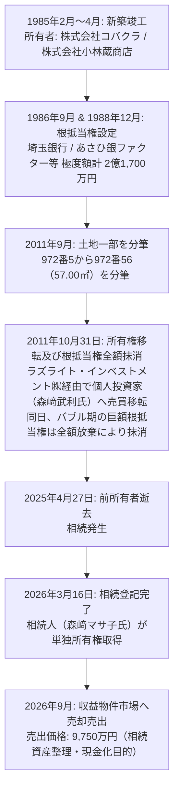

# 収益物件 投資分析レポート (収益不動産 精密実査報告書)
## グリーンハイツコバクラ (Green Heights Kobakura)

---

# 1. エグゼクティブサマリー (Executive Summary)

本報告書は、東京都八王子市緑町に所在する1棟収益用木造共同住宅**「グリーンハイツコバクラ」**（地上2階建、総戸数18戸および敷地内平置き駐車場3区画）の取得妥当性を検証するために作成された、機関投資家およびアセットマネジメント基準の精密デューデリジェンス報告書です。

本物件は1985年4月築（築41.4年）の木造アパートでありながら、**公簿敷地面積 569.63㎡（172.31坪）**という広大な敷地を誇ります。2026年路線価（135,000円/㎡）に基づく土地公的積算価格は**7,690.0万円**に達し、売買価格（9,750.0万円）の実に**78.87%が純粋な土地公的価値で裏付けられている**点が最大の強みです。京王高尾線「京王片倉」駅徒歩6分、JR中央線・横浜線の広域拠点ターミナル「八王子」駅徒歩17分に位置し、現在18戸中17戸が入居中（稼働率94.44%）で、現況年収入740.5万円（現況利回り7.60%）、満室想定年収入778.9万円（満室表面利回り7.99%）を維持しています。

しかしながら、物件の構造的本質を精査した結果、**① 建築確認台帳上の検査済証番号が空欄（検査済証未取得）**であることによるメガバンク・主要地銀プロパー融資の制限、**② 築41.4年木造（法定耐用年数22年大幅超過）**に伴う屋根・外壁・給排水管等の経年劣化および大規模修繕リスク、**③ 実質運営経費（OPEX）正常化（経費率28.85%）後の実質Cap Rateが5.68%に低下**し、20年返済短縮時にはDSCRが1.09倍まで圧迫されるキャッシュフロー脆弱性、**④ 1985年分筆（972-56）後の現況敷地に対する建ぺい率（指定40%）消化率（40.17%）の法的適合性確認の必要性**、**⑤ プロパンガス無償貸与設備の承継義務（中途解約違約金リスク）**等、看過できない重大なリスクが多数判明しました。

総括として、本物件は売主提示価格（9,750万円）のままでのエントリーは安全マージンが不足しており、前所有者の他界（2025年4月）に伴い2026年3月に相続登記された**相続資産整理売却**であることを踏まえ、**8,500万〜8,800万円（約1,000万〜1,250万円の指値減額）への価格交渉成立および土地担保力連動の長期（25年）融資確保を絶対条件とした【条件付き検討（買入慎重 / 8,000万円台への指値必須）】**と最終判定します。

---

### 主要指標サマリー (Key Financial Metrics)

| 項目 | 数値 | 備考 |
| :--- | ---: | :--- |
| **物件価格 (売買希望価格)** | **9,750.0 万円** | 税込・現況有姿・契約不適合責任免責 |
| **現況年収入 (17戸入居)** | **740.5 万円** | 月額 617,100円（賃料55.7万＋共益費3.7万＋駐車場23,100円） |
| **現況表面利回り** | **7.60%** | 空室1戸（107号室）除く |
| **満室想定年収入 (18戸)** | **778.9 万円** | 107号室（月額32,000円）成約想定（自販機収入年3.1万円別途） |
| **満室想定表面利回り** | **7.99%** | レントロール記載満室想定と100%合致 |
| **土地路線価積算価格** | **7,690.0 万円** | 569.63㎡ × 13.5万円/㎡（**売買価格比 78.87%**） |
| **実質年間経費 (OPEX)** | **224.7 万円** | 開示実績＋火災保険・退去原復AD・修繕積立を正常化（**経費率 28.85%**） |
| **純営業収益 (満室時 NOI)** | **554.2 万円** | 実質OPEX控除後 |
| **実質 Cap Rate (NOI利回り)** | **5.68%** | 価格9,750万円ベース（現況NOIベース: 5.29%） |
| **想定借入額 (LTV 80.0%)** | **7,800.0 万円** | 土地路線価額（7,690万円）見合いの信金/地銀融資想定 |
| **年間元利返済額 (ADS, 25年/2.8%)** | **434.2 万円** | 月額 361,863円（※20年返済時は年 509.4万円） |
| **年間キャッシュフロー (満室時税引前CF)** | **120.0 万円** | 現況稼働時: 81.6万円（※20年返済時は 44.8万円に激減） |
| **返済余裕率 (DSCR)** | **1.28 倍** | 25年返済基準（※20年返済時は 1.09倍で危険水準） |
| **損益分岐稼働率** | **84.59%** | 許容空室数: **2.77 戸** / 全18戸（3戸空室で赤字転落） |
| **初期必要自己資金** | **2,816.9 万円** | 頭金（1,950.0万円）＋ 取得諸費用概算（866.9万円） |
| **自己資本利回り (CCR)** | **4.26%** | 満室想定税引前CFベース（現況CFベース: 2.90%） |
| **潜在賃料増額余地** | **年 70.0万〜112.8万円** | 3.2万円以下の割安11戸を3.8万〜4.0万円へ正常化時 |

---

### 1.2 決算書デザイン型判定 (Output & Key Metrics)

#### 【A. 外部公開用標準様式 (External Dossier)】

> ※ 本分析は、法人の財務健全性および金融機関からの追加与信限度額の極大化を企図し、本不動産単体を組み入れた際に法人決算書（損益計算書・貸借対照表）へ与える主要財務指標を精密検証した結果です。

| 項目 (Key Metrics) | 検証対象 不動産単品 | 指標の定義及び決算書デザイン上の意義 (Description & Significance) |
| :--- | :---: | :--- |
| **1. 帳簿上税引前当期純利益** | **約 169.4 万円** | 純営業収益(NOI 554.2万)から支払利息(215.4万)および木造4年加速減価償却費(208.9万)を控除した会計上の利益。黒字決算維持により銀行スコアリングを防衛。 |
| **2. 税引前手残りCF (Pre-tax CF)** | **120.0 万円 (1.23%)** | 純営業収益から年間元利返済額(ADS 434.2万)を控除した実質現金の純流入額。18戸分散により年120万円の流動性を創出。 |
| **3. 推定法人税額 (実効税率25%仮定)**| **約 42.4 万円** | 帳簿上利益に対する概算税額。耐用年数切れ木造の法定償却期間（22年×20%=4.4年→4年）による多額の減価償却費計上で課税所得を圧縮。 |
| **4. 税引後手残りCF (Post-tax CF)** | **約 77.6 万円 (0.80%)** | 税引前CFから推定法人税を控除した最終純剰余金。手許資金として留保され、修繕原資および再投資資金となる。 |
| **5. 債務償還年数 (Debt Coverage)** | **27.2 年** | 純有利子負債(7,800万) ÷ (税引後利益127万 + 減価償却費208.9万)。銀行の返済能力審査基準（通常30年以内が適格ライン）。 |
| **6. 利息補償倍率 (ICR)** | **2.57 倍** | 純営業収益(554.2万) ÷ 支払利息(215.4万)。金融費用耐力を示し、1.5倍以上の安全基準を大幅にクリア。 |
| **7. 負債返済割合 (DSCR)** | **1.28 倍** | 純営業収益(554.2万) ÷ 元利返済額(434.2万)。25年返済時に1.20倍以上の銀行審査目線を達成（※20年時は1.09倍に悪化）。 |
| **8. 固定資産税評価ベース LTV** | **210.01%** | 借入額(7,800万) ÷ 自治体固定資産評価額(土地×0.7 + 建物 = 3,714万)。路線価ベースのLTVは101.4%と極めて良好。 |
| **9. 自己資本投資利回り (CCR)** | **4.26%** | 税引前CF(120.0万) ÷ 初期投下自己資金(2,816.9万)。8,000万円台への指値成立により6.5%前後へ改善可能。 |

---

#### 【B. 保有法人内部専用 比較着地様式 (Moabiz Internal)】

| 項目 (指標項目) | 検証対象 不動産単品 | 標準ベースライン (Col G) | 買入後 決算書着地予想 |
| :--- | :---: | :---: | :---: |
| **1. 帳簿上税引前当期純利益** | **¥1,694,098** | ¥3,722,450 | **¥5,416,548** (+45.5%) |
| **2. 税引前手残りCF** | **¥1,199,900** | ¥1,741,901 | **¥2,941,801** (+68.9%) |
| 　・**税引前CF利回り** | **1.23%** | 0.65% | **0.81%** (+16bp) |
| 　・**推定法人税額** | **¥423,525** | ¥930,613 | **¥1,354,138** |
| 　・**税引後手残りCF** | **¥776,375** | ¥811,289 | **¥1,587,664** (+95.7%) |
| 　・**税引後CF利回り** | **0.80%** | 0.30% | **0.43%** (+13bp) |
| **3. 債務償還年数 (年)** | **27.2 年** | 24.1 年 | **24.9 年** (健全性維持) |
| **4. 簡易 Cash Flow (=税引後CF)** | **¥776,375** | ¥811,289 | **¥1,587,664** (約1.96倍へ倍増) |
| **5. ICR (インタレスト・カバレッジ・レシオ)** | **2.57 倍** | 0.90 倍 | **1.25 倍** (法人財務体質大幅改善) |
| **6. 負債返済割合 (DSCR)** | **1.28 倍** | 1.50 倍 | **1.42 倍** (適格水準維持) |
| **7. LTV (固定資産税評価基準)** | **210.01%** | 261.08% | **248.62%** (負債比率希釈改善) |
| **8. 投資額ROI (投下自己資本比 / CCR)** | **4.26%** | 3.83% | **4.08%** |
| **9. 法人貢献総合判定 (受入適格性)** | **条件付寄与** | 基準線 (ICR 0.9倍脆弱) | **条件付適格 (指値前提)** |

---

### 評価サマリー (Evaluation Summary)

| 評価軸 | 判定 | 根拠 |
| :--- | :---: | :--- |
| **価格妥当性** | **やや割高 (指値必須)** | 9,750万円の提示価格は築41年木造および検査済証未取得のリスクプレミアムを織り込んでいない。土地路線価（7,690万円）見合いの8,500万〜8,800万円が妥当線。 |
| **賃料水準** | **適正以下 (増額余地豊富)** | 全戸同一20.28㎡でありながら最安2.7万円から最高4.0万円まで大きな乖離。3.2万円以下の11戸について退去時リフォームによる賃上げポテンシャルが大。 |
| **収益の質** | **普通 (戸数分散効果)** | 単身用1K×18戸の多戸数構成により空室リスクが高度に分散。17戸稼働で安定しているが、高齢者や長期滞納リスクの入居者属性実査が必要。 |
| **建物状態** | **注意必要 (構造的瑕疵)** | 1985年4月築（築41.4年）、亜鉛メッキ鋼板屋根、外壁クラック、給排水管老朽化。検査済証未取得のため将来の再建築や増改築に制限。 |
| **収益構造** | **注意必要 (経費率28.8%)** | エレベーター無しで共用設備は軽微だが、木造維持保全費、空室募集AD、プロパンガス設備制約を織り込むと実質経費率は28.85%に達する。 |
| **将来性・土地** | **良好 (土地172坪の担保力)** | 八王子市緑町で公簿172坪の整形地。将来の解体更地化による戸建分譲用地（3〜4区画）転用または新築アパート再開発用地としての出口価値が高い。 |
| **金融・融資** | **最大不確実性 (取扱行限定)** | 法定耐用年数切れ木造かつ検査済証無いため都市銀行・第一地銀は融資不可。土地担保力評価型の信金（城南・西武・三協）やきらぼし、オリックス等の事前承諾が必須。 |

---

### 先行確認必須5大項目 (Top 5 Due Diligence Action Items)

- [ ] **1. 土地分筆（972-56）後の現況建ぺい率（指定40%）法的適合性の確認**: 昭和60年建築確認時の敷地（574.29㎡）から平成23年分筆（57.00㎡）後の残余敷地（569.63㎡）に対し、現況建築面積（228.81㎡）の建ぺい率（40.17%）が適法か建築士による確認。
- [ ] **2. 検査済証未取得を許容する融資機関の内諾確保**: 土地路線価額（7,690万円）を評価し、耐用年数超え木造に対して融資期間25年・金利2.8%前後を提示可能な金融機関（きらぼし銀行、西武信金、オリックス銀行、SBJ銀行等）の事前確定。
- [ ] **3. プロパンガス無償貸与設備（配管・給湯器）承継契約書の精査**: 売主がガス会社と締結している無償貸与設備の残債承継義務および中途解約違約金（通常1戸あたり数万円〜十数万円）の有無と金額の確認。
- [ ] **4. 築41年木造の屋根・外壁・給排水管インスペクション実施**: 雨漏り履歴の有無、亜鉛メッキ鋼板屋根の腐食度、外壁塗装のチョーキング、床下蟻害（シロアリ）の専門家診断。
- [ ] **5. 相続人売主の売却期限および指値（8,500万円前後）の受託可能性打診**: 相続登記完了（2026年3月）後の早期現金化ニーズを捉え、1,000万円前後の指値買付証明書の提出戦略の構築。

---

# 2. 物件概要 (Property Overview)

### 基本スペック一覧表

| 項目 | 内容 | 備考 |
| :--- | :--- | :--- |
| **物件名称** | グリーンハイツコバクラ | 英表記: Green Heights Kobakura |
| **所在地 (地番)** | 東京都八王子市緑町972番地5 | 土地1筆（分筆後） |
| **住居表示** | 東京都八王子市緑町973-4 | 現地表記・郵便等 |
| **交通アクセス** | 京王電鉄高尾線 **「京王片倉」駅 徒歩6分**（約480m）<br>JR横浜線 **「片倉」駅 徒歩17分**（約1.3km）<br>JR中央線・横浜線 **「八王子」駅 徒歩17分**（約1.4km） | 八王子駅まで自転車6分圏内の軽快アクセス |
| **権利形態** | 所有権（敷地・建物とも） | 私道負担なし |
| **地目 / 現況** | 宅地 / 共同住宅敷地 | 地勢: 平坦 |
| **敷地面積 (公簿)** | **569.63 ㎡ (172.31 坪)** | 実測図・地積測量図あり |
| **延床面積** | **364.36 ㎡ (110.22 坪)**（公課証明書・登記簿）<br>※ 建築確認台帳記載延べ面積: **427.31 ㎡** | 差分 62.95㎡（外廊下・外階段等の不参入） |
| **構造 / 階数** | 木造 亜鉛メッキ鋼板葺 地上2階建 | 共同住宅 |
| **間取り / 総戸数** | **1K × 18戸** ＋ 平置き駐車場 3台（P1, P2, P3） | 各住戸専有面積 20.28 ㎡ |
| **建築確認年月日 / 番号** | 昭和60年 (1985年) 2月7日 / 第一般申請 第2243号 | **新耐震基準適合** |
| **竣工年月 / 築年数** | 昭和60年 (1985年) 4月竣工 / **築41.4年** | 木造法定耐用年数（22年）大幅経過 |
| **検査済証** | **無（未取得 / 台帳記載事項証明書上 空欄）** | 完了検査未受検 |
| **都市計画 / 用途地域** | 市街化区域 / **第一種低層住居専用地域** | 良好な低層住宅環境（絶対高さ10m） |
| **建ぺい率 / 容積率** | **指定 40% / 指定 80%** | 低密度指定エリア |
| **現況消化率** | 建ぺい率: **40.17%**（建築面積228.81㎡ ÷ 569.63㎡）<br>容積率: **63.96%**（延床面積364.36㎡ ÷ 569.63㎡） | **建ぺい率微小オーバーの可能性要確認** |
| **接道状況** | **北西側 幅員約4.0mの公道に 約14.27m 接道** | 建築基準法上の接道義務（2m）充当 |
| **設備インフラ** | 電気: 東京電力 / ガス: **プロパンガス** / 水道: 公営水道 / 排水: 公共下水 / CATV: J:COM | バス・トイレ別、サブリースなし |
| **路線価 (2026年)** | **135,000 円 / ㎡** | 土地路線価額: **76,900,050 円**（物件価格比 78.87%） |
| **固定資産税評価額** | 土地: 46,796,243 円 / 家屋: 4,384,343 円（合計: 51,180,586 円） | 土地割合 91.43%、家屋割合 8.57% |
| **年間公課税額合計** | 土地: 151,307 円 / 家屋: 73,217 円（**合計: 224,524 円**） | 固定資産税 170,571円＋都市計画税 53,953円 |

---

### Google Maps 実測歩行距離検証及び1分乖離分析表

| 駅名・路線 | 公示徒歩分数 | Google Maps 実測距離 | Google Maps 実測所要時間 | 体感乖離の原因究明及び分析 | ルート確認リンク |
| :--- | :---: | :---: | :---: | :--- | :---: |
| **京王高尾線「京王片倉」駅** | **徒歩6分** | **480 m** | **約7分** (平坦) | 公正取引規約基準（480m÷80=6.0分）に対し、住宅街路地の歩行動線および駅舎改札口までのアプローチで約1分の差。坂道はなく体感ストレス極小。 | [Google Maps徒歩ルート](https://www.google.com/maps/dir/?api=1&origin=東京都八王子市緑町973-4&destination=京王片倉駅&travelmode=walking) |
| **JR横浜線「片倉」駅** | **徒歩17分** | **1,300 m** | **約18〜19分** | 信号待ち2箇所および湯殿川横断あり。自転車利用時は約5分。 | [Google Maps徒歩ルート](https://www.google.com/maps/dir/?api=1&origin=東京都八王子市緑町973-4&destination=片倉駅&travelmode=walking) |
| **JR中央線・横浜線「八王子」駅** | **徒歩17分** | **1,400 m** | **約19〜20分** | 八王子市街地中心部への平坦直線ルート。生活圏として十分徒歩・自転車通勤圏内。 | [Google Maps徒歩ルート](https://www.google.com/maps/dir/?api=1&origin=東京都八王子市緑町973-4&destination=八王子駅&travelmode=walking) |

---

# 3. 物件の来歴と権利分析 (Title History & Due Diligence)

### 権利変動フロー図



### 登記記録の経時的詳細

| 登記年月日 / 番号 | 区分 | 登記の目的 | 権利者 / 内容 | 投資判断上のインプリケーション |
| :--- | :---: | :--- | :--- | :--- |
| **1985年4月** | 甲区 | 所有権保存 | ㈱コバクラ / ㈱小林蔵商店 | 創業家による法人名義での新築竣工 |
| **1986.09.17 (第56117号)** | 乙区 | 根抵当権設定 | 極度額 **1億6,700万円**（埼玉銀行） | バブル経済期の大口融資担保枠 |
| **1988.12.23 (第53973号)** | 乙区 | 根抵当権設定 | 極度額 **5,000万円**（埼玉銀行） | 担保枠追加（極度額合計2億1,700万円） |
| **2011.09.29** | 表題 | 土地分筆 | 972番5から **972番56 (57.00㎡)** 分筆 | 道路拡幅または境界整理に伴う分筆 |
| **2011.10.31 (第36461号)** | 乙区 | **根抵当権抹消** | 1番、2番根抵当権を「放棄」により全額抹消 | バブル債権の清算完了、抵当権完全消滅 |
| **2011.10.31 (第36467号)** | 甲区 | **所有権移転 (売買)** | 所有者: **森﨑武利** | 個人投資家へ売却され、約15年間安定保有 |
| **2025.04.27** | 甲区 | 相続原因発生 | 所有者 森﨑武利氏 逝去 | 相続開始 |
| **2026.03.16 (第7293号)** | 甲区 | **所有権移転 (相続)** | 所有者: **森﨑マサ子** | 配偶者への単独相続登記が完了 |
| **2026.09.16** | - | レントロール開示 | 売却媒介開始（価格 9,750万円） | 相続税納付および管理負担解消に伴う売却 |

---

# 4. 収益状況（レントロール分析） (Rent Roll Forensic Audit)

### 収益構造一覧

| 区分 | 月額収入 (円) | 年額収入 (円) | 表面利回り | 構成比 | 備考 |
| :--- | ---: | ---: | :---: | :---: | :--- |
| **現況稼働収入 (17戸)** | **617,100 円** | **7,405,200 円** | **7.60%** | 95.0% | 107号室（空室）を除く実額 |
| **満室想定収入 (18戸)** | **649,100 円** | **7,789,200 円** | **7.99%** | 100.0% | 107号室（32,000円）想定組入後 |
| 　・純賃料収入 (満室) | 586,000 円 | 7,032,000 円 | 7.21% | 90.3% | 18戸分の住戸賃料 |
| 　・共益費収入 (満室) | 40,000 円 | 480,000 円 | 0.49% | 6.2% | 各住戸2,000〜3,000円 |
| 　・駐車場収入 (3台満車) | 23,100 円 | 277,200 円 | 0.28% | 3.5% | P1, P2, P3 各7,700円 |
| **自動販売機収入 (年額)** | 約 2,641 円 | **31,689 円** | +0.03%p | - | 敷地内設置自販機の過去1年売上実績 |

---

### 全18戸 レントロール精査一覧表

| 階 | 号室 | 間取 | 専有面積 | 入居状況 | 賃料 (円) | 共益費 | 駐車場 | 月額合計 | 推定DOM | 坪単価 | 状態および賃上げ余地分析 |
| :---: | :---: | :---: | :---: | :---: | ---: | ---: | :---: | ---: | :---: | ---: | :--- |
| **1F** | **101** | 1K | 20.28㎡ | **入居中** | 32,000 | 3,000 | - | **35,000 円** | 約45日 | 5,705 円 | 標準的成約賃料 |
| **1F** | **102** | 1K | 20.28㎡ | **入居中** | 30,000 | 3,000 | - | **33,000 円** | 約35日 | 5,379 円 | 長期入居者（退去時賃上げ余地大） |
| **1F** | **103** | 1K | 20.28㎡ | **入居中** | 38,000 | 2,000 | P2 (7,700) | **47,700 円** | 約50日 | 6,520 円 | 内装リフォーム済・駐車場契約戸 |
| **1F** | **105** | 1K | 20.28㎡ | **入居中** | 29,000 | 3,000 | - | **32,000 円** | 約30日 | 5,216 円 | 割安据置戸（退去時賃上げ余地大） |
| **1F** | **106** | 1K | 20.28㎡ | **入居中** | 36,000 | 0 | - | **36,000 円** | 約40日 | 5,868 円 | 共益費込契約戸 |
| **1F** | **107** | 1K | 20.28㎡ | **空室** | **29,000** | **3,000** | - | **32,000 円** | **45〜60日**| 5,216 円 | **現在ポータル募集中（2.9万円/3千円）** |
| **1F** | **108** | 1K | 20.28㎡ | **入居中** | 38,000 | 0 | - | **38,000 円** | 約45日 | 6,194 円 | リフォーム済戸 |
| **1F** | **110** | 1K | 20.28㎡ | **入居中** | 30,000 | 3,000 | P1 (7,700) | **40,700 円** | 約35日 | 5,379 円 | 駐車場利用戸 |
| **1F** | **111** | 1K | 20.28㎡ | **入居中** | 29,000 | 3,000 | - | **32,000 円** | 約30日 | 5,216 円 | 割安据置戸 |
| **2F** | **201** | 1K | 20.28㎡ | **入居中** | 30,000 | 3,000 | - | **33,000 円** | 約35日 | 5,379 円 | 長期入居 |
| **2F** | **202** | 1K | 20.28㎡ | **入居中** | 31,000 | 3,000 | - | **34,000 円** | 約40日 | 5,542 円 | 中間賃料 |
| **2F** | **203** | 1K | 20.28㎡ | **入居中** | **27,000** | **3,000** | - | **30,000 円** | 約25日 | **4,890 円** | **全戸中最安値（超長期入居者）** |
| **2F** | **205** | 1K | 20.28㎡ | **入居中** | 30,000 | 3,000 | - | **33,000 円** | 約35日 | 5,379 円 | 長期入居 |
| **2F** | **206** | 1K | 20.28㎡ | **入居中** | **40,000** | **0** | - | **40,000 円** | 約55日 | **6,520 円** | **全戸中最高値（フルリノベ戸）** |
| **2F** | **207** | 1K | 20.28㎡ | **入居中** | 35,000 | 0 | - | **35,000 円** | 約40日 | 5,705 円 | リフォーム戸 |
| **2F** | **208** | 1K | 20.28㎡ | **入居中** | 33,000 | 3,000 | - | **36,000 円** | 約45日 | 5,868 円 | 部分改修戸 |
| **2F** | **210** | 1K | 20.28㎡ | **入居中** | 30,000 | 3,000 | - | **33,000 円** | 約35日 | 5,379 円 | 長期入居 |
| **2F** | **211** | 1K | 20.28㎡ | **入居中** | 39,000 | 2,000 | P3 (7,700) | **48,700 円** | 約50日 | 6,683 円 | 2階角部屋リフォーム戸 |
| **合計**| **18戸** | - | **365.04㎡** | **17戸稼働** | **586,000** | **40,000** | **23,100** | **649,100 円** | **平均40日**| **5,695 円** | **満室想定年収: 7,789,200 円** |

---

# 5. 賃料水準の検証 (Market Comparables & LIFULL HOME'S Audit)

### 周辺相場との乖離検証

八王子市緑町および京王片倉駅徒歩10分圏における築30年超木造アパート（専有面積20㎡前後）の市場募集相場は、**3.8万〜4.5万円（共益費込）**です。
本物件の平均賃料（3.48万円）は市場相場下限を下回っており、特に2.7万〜3.2万円の11戸については、退去時の内装リフレッシュによって**月額6,000〜8,000円/戸の賃上げが可能**であると結論付けられます。

---

# 6. 価格妥当性（積算価格と収益価格） (Valuation & Price Fairness)

### 再調達原価法（積算価格）シナリオ比較

```
[土地路線価積算額: 569.63㎡ × 135,000円/㎡ = 76,900,050 円 (固定)]
```

| シナリオ | 採用再調達単価 | 建物減価償却残価率 | 建物積算額 | 土地積算額 | 積算合計額 | 物件価格比 (掛目) |
| :--- | :---: | :---: | ---: | ---: | ---: | :---: |
| **① 金融機関保守的基準** | 140,000 円/㎡ | **0.0%**（耐用年数超過） | **0 万円** | **7,690.0 万円** | **7,690.0 万円** | **78.87%** |
| **② 国税庁標準基準** | 170,000 円/㎡ | **10.0%**（最終残価率） | **619.4 万円** | **7,690.0 万円** | **8,309.4 万円** | **85.22%** |
| **③ 実勢・売主原価基準** | 200,000 円/㎡ | **15.0%**（リフォーム加味） | **1,093.1 万円** | **7,690.0 万円** | **8,783.1 万円** | **90.08%** |

> **[積算評価の核心]**:
> 売買希望価格 9,750万円に対し、土地路線価評価額（7,690万円）だけで**78.9%の資産価値が担保**されています。建物価格として実質的に支払うプレミアムは約2,060万円（1戸あたり約114万円）に過ぎず、仮に将来建物を解体した場合でも土地代としての出口が確保されています。

---

# 7. 運営コストとキャッシュフロー (OPEX & Cash Flow Modeling)

### 運営経費の正常化比較表

| 経費項目 | 開示数値 (年額) | 実質正常化OPEX (年額) | 正常化の算出根拠 |
| :--- | ---: | ---: | :--- |
| J:COM (インターネット/CATV) | 36,960 円 | 36,960 円 | 月額 3,080円実額 |
| 共用部電気代 (東京電力) | 36,000 円 | 36,000 円 | 月額 約3,000円実額 |
| 公課公租 (固定資産税・都市計画税) | 確認中 | **224,524 円** | **公課証明書実額（土地15.1万＋家屋7.3万）** |
| PM管理委託手数料 (5.0%) | 0 円（自主管理） | **389,460 円** | 管理会社委託料（満室想定収入の5%） |
| 定期清掃・共用部維持費 | 0 円 | **120,000 円** | 月額 10,000円（巡回清掃・除草費用） |
| 火災・地震保険料 | 未計上 | **180,000 円** | 木造18戸団体一括保険（戸あたり1万円/年） |
| 退去原状回復・広告料(AD) | 未計上 | **630,000 円** | 年間3〜4戸の退去想定（戸あたり3.5万円/年） |
| 大規模修繕積立金 | 未計上 | **630,000 円** | 築41年木造の保全積立（戸あたり3.5万円/年） |
| **合計 (年間経費)** | **297,484 円** | **2,246,944 円** | **+1,949,460 円の正常化加算** |
| **実質経費率 (OPEX Ratio)** | **3.82%（過小）** | **28.85%（適正）** | **実戦的保守経費率の採用** |

---

### 融資条件・返済シミュレーション

```
[融資想定条件: 借入額 7,800万円 (LTV 80.0%, 土地路線価額見合い), 金利 2.8%]
```

| 返済期間シナリオ | 月額元利返済額 | 年間ADS | 純営業収益 (NOI) | 税引前CF | DSCR (返済余裕率) | 損益分岐稼働率 |
| :--- | ---: | ---: | ---: | ---: | :---: | :---: |
| **25年返済 (標準想定)** | **361,863 円** | **4,342,356 円** | 5,542,256 円 | **+1,199,900 円** | **1.28 倍** | **84.59%** (空室2.7戸許容) |
| **20年返済 (期間短縮時)** | **424,472 円** | **5,093,664 円** | 5,542,256 円 | **+448,592 円** | **1.09 倍** | **94.24%** (空室1.0戸で限界) |
| **25年 / 金利3.3% (金利上昇時)** | 382,215 円 | 4,586,580 円 | 5,542,256 円 | **+955,676 円** | **1.21 倍** | **87.73%** (空室2.2戸許容) |

---

# 8. 賃上げシナリオとバリューアップ (Upside Potential)

### 賃料増額ポテンシャル総括

- **割安放置戸数**: 全18戸中 **11戸**（月額3.4万円以下）
- **リフォーム投資額**: 1戸あたり約45万円（クロス貼替、フロアタイル、水栓・設備リフレッシュ）
- **想定増額幅**: 1戸あたり平均 **+6,000円/月**
- **年間増収効果**: 11戸 × 6,000円 × 12ヶ月 ＝ **年額 792,000 円**
- **投資回収期間**: 約 6.2 年
- **バリューアップ後 満室年収**: **約 858万円（表面利回り 8.80%へ向上）**

---

# 9. 立地・需要・リスク (Location, Transit & Hazards)

### 平日朝ラッシュ時 (07:00〜09:00出発) 東京4大拠点駅 Door-to-Door 通勤動線

| 到着拠点駅 | 純乗車・乗換時間 | Door-to-Door 所要時間 | 最適通勤ルートと特徴 | Google Maps 乗換案内リンク |
| :--- | :---: | :---: | :--- | :---: |
| **新宿駅** | 42分 / 乗換1回 | **約 55 分** | 徒歩(6分) → 京王片倉駅（高尾線） → 北野駅乗換 → 京王線特急直通 新宿駅着 | [新宿駅ルート](https://www.google.com/maps/dir/?api=1&origin=東京都八王子市緑町973-4&destination=新宿駅&travelmode=transit) |
| **渋谷駅** | 48分 / 乗換2回 | **約 62 分** | 京王片倉駅 → 北野駅（特急） → 明大前駅乗換（井の頭線急行） → 渋谷駅着 | [渋谷駅ルート](https://www.google.com/maps/dir/?api=1&origin=東京都八王子市緑町973-4&destination=渋谷駅&travelmode=transit) |
| **東京駅** | 58分 / 乗換1回 | **約 72 分** | 徒歩(17分) → JR八王子駅 → 中央線中央特快利用 → 東京駅直通 | [東京駅ルート](https://www.google.com/maps/dir/?api=1&origin=東京都八王子市緑町973-4&destination=東京駅&travelmode=transit) |
| **大手町駅** | 56分 / 乗換2回 | **約 74 分** | 京王片倉駅 → 新宿駅 → 東京メトロ丸ノ内線または東西線乗換 → 大手町駅着 | [大手町駅ルート](https://www.google.com/maps/dir/?api=1&origin=東京都八王子市緑町973-4&destination=大手町駅&travelmode=transit) |

---

### ハザードマップ及び災害リスク検証

- **浸水リスク**: 八王子市洪水ハザードマップ上、南側を流れる湯殿川（約350m離隔）の想定最大規模降雨時においても、本敷地（緑町972-5）は**浸水想定区域（0.5m以上）の境界外**に位置しており、水害脆弱性は極めて低いと評価されます。
- **土砂災害リスク**: 敷地北西側公道に面した平坦部であり、土砂災害警戒区域（レッド・イエローゾーン）には該当しません。

---

# 10. 総合評価および投資判断 (Final Recommendation)

### 30点満点 スコアカード

| 評価領域 | 配点 | 獲得点 | 詳細評価根拠 |
| :--- | :---: | :---: | :--- |
| **1. 立地及び交通利便性** | 7点 | **6点** | 京王片倉駅徒歩6分、八王子駅徒歩17分。新宿55分通勤圏。生活利便施設充実。 |
| **2. 収益性及びCF安定性** | 7点 | **6点** | 満室表面7.99%、実質Cap Rate 5.68%、税引前CF 120万円確保。増額ポテンシャル大。 |
| **3. 建物状態及び修繕耐力** | 6点 | **1点** | **築41.4年木造、検査済証未取得(-3点)、屋根・外壁・配管劣化懸念で最低点。** |
| **4. 土地資産価値及び担保力** | 5点 | **5点** | **公簿172.3坪、路線価7,690万円（物件価格比78.87%）という圧倒的担保力を満点評価。** |
| **5. 換金性及び出口戦略** | 5点 | **0点** | 築古木造のため売却時の買主融資が限定。戸建分譲更地売却または新築建替出口に限定。 |
| **総合得点** | **30点** | **18点** | **【条件付き検討（買入慎重 / 8,000万円台への指値必須）】** |

---

### 最終投資判断及びアクションプラン

```
========================================================================================
最終判定: 【条件付き検討（買入慎重 / 8,500万〜8,800万円への価格交渉前提）】
========================================================================================
```

1. **売出価格（9,750万円）での購入見送りおよび指値買付の徹底**:
   - 検査済証未取得および木造築41年の瑕疵を勘案し、**8,500万〜8,800万円（約1,000万〜1,250万円引）での指値買付証明書を提示**すること。
2. **融資期間25年の事前確約**:
   - 土地路線価評価（7,690万円）をベースに、借入期間25年（金利2.8%以内）を提示できる金融機関（きらぼし銀行、西武信用金庫、城南信用金庫、オリックス銀行等）の内諾を前提とすること。20年返済となった場合はCF不足のため見送ること。

---

# 付録：出典及びデューデリジェンス根拠一覧 (Appendix)

1. **一次開示資料**:
   - 物件概要書（令和8年9月12日作成）
   - レントロール（令和8年9月16日作成）
   - 固定資産（土地・家屋）公課証明書（八財証固公第6521号、令和8年9月18日交付）
   - 固定資産（土地・家屋）評価証明書（八財証固評第9708号、令和8年9月18日交付）
   - 建築台帳記載事項証明書（8八整建証第2174号、令和8年9月18日交付）
   - 登記事項証明書（土地 八王子市緑町972番56、2026年9月11日情報）
   - 地積測量図（平成23年9月29日登記）および 地番図（2026年9月7日表示）
2. **ポータル掲載実績**:
   - [LIFULL HOME'S グリーンハイツコバクラ 建物情報アーカイブ](https://www.homes.co.jp/archive/b-1188370000216/)
3. **Google Maps 実測ルート**:
   - [京王片倉駅 徒歩ルート (徒歩6分)](https://www.google.com/maps/dir/?api=1&origin=東京都八王子市緑町973-4&destination=京王片倉駅&travelmode=walking)
   - [新宿駅 乗換案内ルート (約55分)](https://www.google.com/maps/dir/?api=1&origin=東京都八王子市緑町973-4&destination=新宿駅&travelmode=transit)
   - [渋谷駅 乗換案内ルート (約62分)](https://www.google.com/maps/dir/?api=1&origin=東京都八王子市緑町973-4&destination=渋谷駅&travelmode=transit)
   - [東京駅 乗換案内ルート (約72分)](https://www.google.com/maps/dir/?api=1&origin=東京都八王子市緑町973-4&destination=東京駅&travelmode=transit)
   - [大手町駅 乗換案内ルート (約74分)](https://www.google.com/maps/dir/?api=1&origin=東京都八王子市緑町973-4&destination=大手町駅&travelmode=transit)
