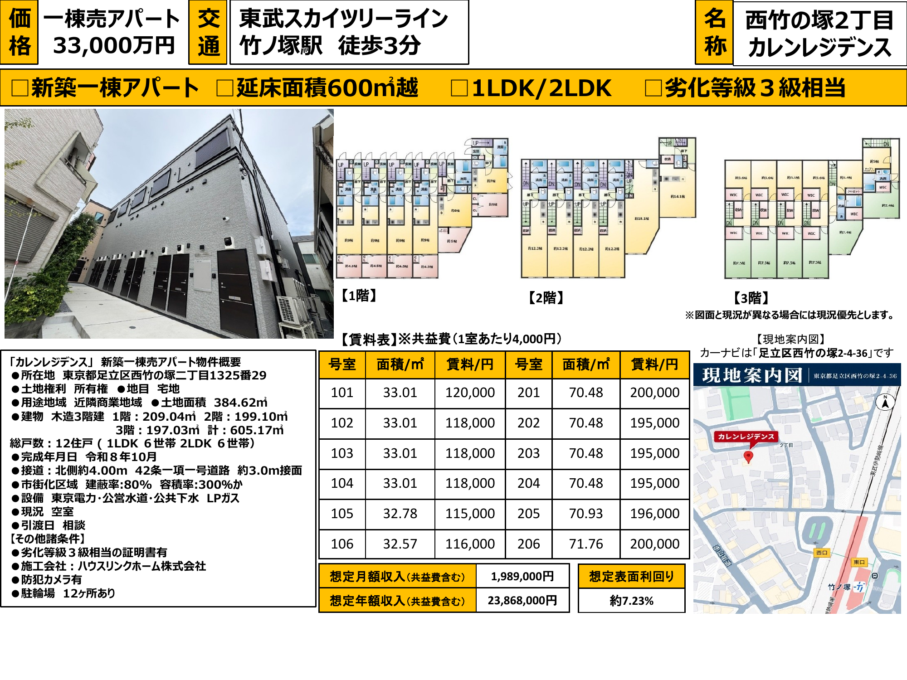
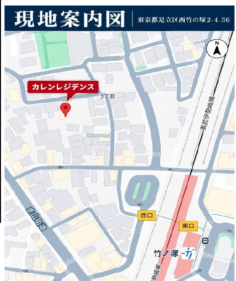
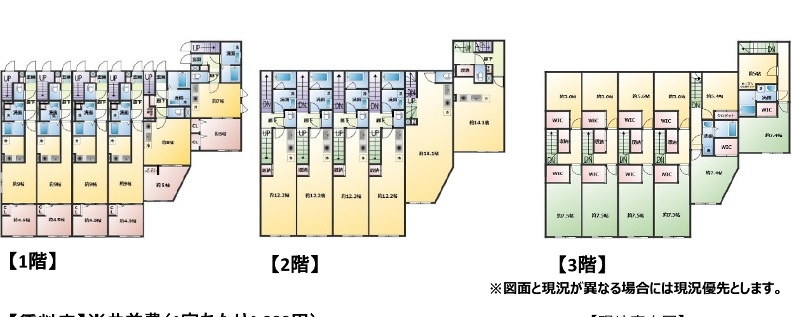

# 🏢 収益物件 投資分析レポート：西竹の塚2丁目 カレンレジデンス (Karen Residence Nishitakenotsuka)

**分析基準日:** 2026年10月5日  
**対象物件:** 東京都足立区西竹の塚二丁目1325番29（住居表示付近：東京都足立区西竹の塚2-4-36）  
**売出価格:** **3億3,000万円（税込）**  
**建物スペック:** 2026年8〜10月新築・木造3階建（延床面積 605.17㎡ ／ 土地面積 384.62㎡［近隣商業地域］）・総戸数12戸（1LDK×6戸＋2LDKメゾネット×6戸）・劣化対策等級3級相当証明書有  
**最終投資判定:** **ランク C+（61 / 100点 ｜ 19.6 / 30点）— 条件付推奨（Conditional Buy：売出3.30億円での購入見送り ／ 2.90億〜2.98億円への指値交渉＋満室引渡［または家賃保証］＋融資期間30年以上の融資特約必須）**

---

## 1. エグゼクティブ・サマリーおよび投資判定 (Executive Summary & Verdict)

> [!CAUTION]
> **🚨 重要フォレンジック監査警告（買付判断前に必読すべき5大リスク要因）**
> 1. **マイソク賃料表の算術誤差（年▲66万円）および賃貸ポータル（SUUMO・HOME'S）での2LDK募集賃料大幅引下げ（1戸あたり月▲1.5万〜2.5万円）の摘発**：
>    - **第1段階（マイソク記載の算術矛盾）**：マイソク下部の集計欄には「想定月額収入 1,989,000円／想定年額収入 23,868,000円（表面利回り 7.23%）」と記載されていますが、マイソク記載の全12戸の賃料（合計 1,886,000円）と共益費（4,000円×12戸＝48,000円）を実際に合算すると**月額 1,934,000円／年額 23,208,000円（表面 7.03%）**にしかなりません。すなわち資料自体に**月額 55,000円（年額 660,000円、利回り▲0.20%p）の過大計上（算術不一致）**が存在します。
>    - **第2段階（現行ポータル募集実績との乖離）**：2026年10月現在、SUUMO・LIFULL HOME'S・タウンハウジング・アエラス等の主要賃貸ポータルで募集中の本物件（『カレンレジデンス』、2026年8月築表記）を調査した結果、**「敷金なし・礼金なし」**の初期費用緩和に加え、マイソク上で月額19.5万〜20.0万円（＋共益費4,000円）と想定されていた**2LDK（70.48〜71.76㎡）が、実際には月額17.5万〜18.0万円（＋管理費4,000円）へと1戸あたり月1.5万〜2.5万円引き下げて募集**されています。ポータル実勢成約水準（1LDK平均11.9万円・2LDK平均18.2万円［共益費込］）を反映した**実質満室GPIは年額 2,167.2万円（月額 180.6万円、売出比表面 6.57%）**となり、マイソク表面値から**年間▲219.6万円（▲9.2%、利回り▲0.66%p）**減少します。
> 2. **東京都建築安全条例（接道規制）回避のための『1階玄関＋専用内階段2ヶ所（1F→2F→3F）重ね長屋・メゾネット』平面設計の死角**：
>    - 本敷地は北側幅員約4.0m道路に**約3.0mしか接道していない路地状敷地（旗竿地）**です。延床面積500㎡超（605.17㎡）の3階建「共同住宅」を建築する場合、東京都建築安全条例第4条・第19条により原則4.0m以上の接道長が求められるため、施工会社（ハウスリンクホーム）は共用廊下・共用階段を廃し、2・3階住戸（`201〜206号室`）の玄関をすべて1階に配置した**『1階専用玄関 → 内階段 → 2階LDK → 内階段 → 3階洋室2室』という3層トリプレット型メゾネット（建築基準法上の「長屋」形態）**として設計しています。
>    - その結果、2LDKの表記面積 `70.48㎡` のうち**約12〜15㎡（専有面積の約18〜20%）が2つの専用内階段およびホールに消費**され、実質的な居室体感面積は55〜58㎡程度にとどまるほか、ベビーカーや幼児を抱えるファミリー層が毎日1階玄関から3階寝室まで昇降する動線負荷が、2LDKの賃料上限（月20万円突破失敗）の直接的原因となっています。
> 3. **東京23区・駅徒歩3分の新築でありながら『LPガス（プロパンガス）』を採用 — 施工会社グループのガス供給モデルと入居者光熱費抵抗**：
>    - 施工会社のハウスリンクホーム(株)は関連会社のハウスリンクマネジメント(株)を通じて建築・賃貸管理・LPガス供給を一気通貫で行う事業モデルを有しています。東京23区内・竹ノ塚駅徒歩3分の近隣商業地域でありながら都市ガスではなく**LPガス**が採用されており、ファミリー向け2LDKでは冬場のガス代が都市ガス比で月5,000〜10,000円以上割高となるため、入居敬遠や早期退去のリスク要因となります（2024年7月・2025年4月施行の改正液石法省令に基づく無償貸与設備の残存債務有無の確認が必須）。
> 4. **全12戸100%空室（新築リーシング中）での引渡リスクと初期キャッシュバーン（Cash Burn）**：
>    - 現況は全12戸が空室（募集中）であるため、満室前に現況引渡しを受けた場合、毎月の元利返済額（約100.2万円/月）および初期募集広告料（AD 1.5〜2.0ヶ月分＝約270万〜380万円）が買主のキャッシュアウトとして直撃します。
> 5. **『劣化等級3級相当の証明書』の金融機関審査リスクおよび23年目の第2次デッドクロス（償却消滅の崖）**：
>    - 登録住宅性能評価機関による正式な『建設住宅性能評価書』ではなく民間機関の『相当証明書』である場合、一部の金融機関では木造法定耐用年数（22年）に融資期間が制限されるリスクがあり、22年融資となった場合は初年度税引後CFが**+15.7万円（利回り0.05%）**へとほぼ消滅します。また30年融資が承認された場合でも、**22年目で木造の減価償却が完全に終了するため、23〜30年目には年間約473万円の減価償却費がゼロとなり法人税が急増する「23年目のデッドクロスの崖」**が到来します。

### 1.1 主要財務・バリュエーション比較総括表（4シナリオ比較）

| 主要指標 (Key Metrics) | ① マイソク表面記載 (3.30億 / 年2,386.8万) | ② マイソク表実合算 (3.30億 / 年2,320.8万) | ③ ポータル実勢賃料反映 (3.30億 / 年2,167.2万) | ④ **指値目標・推奨シナリオ** **(2.95億 / 年2,167.2万)** |
| :--- | :---: | :---: | :---: | :---: |
| **売買価格（税込）** | 3億3,000万円 | 3億3,000万円 | 3億3,000万円 | **2億9,500万円 (▲10.6%)** |
| **満室想定年収 (GPI)** | 2,386.8万円 | 2,320.8万円 (▲66万) | **2,167.2万円 (▲219.6万)** | **2,167.2万円 (実勢基準)** |
| **表面利回り (Gross Yield)** | 7.23% | 7.03% | **6.57%** | **7.35% (実勢基準)** |
| **実効総収入 (EGI、空室5%控除)** | 2,267.5万円 | 2,204.8万円 | 2,058.8万円 | **2,058.8万円** |
| **正規化運営経費 (OPEX、PM・固都税等)** | 377.3万円 (15.81%) | 374.0万円 (16.12%) | 366.4万円 (16.90%) | **366.4万円 (16.90%)** |
| **実効営業純利益 (Effective NOI)** | 1,890.1万円 | 1,830.7万円 | 1,692.5万円 | **1,692.5万円** |
| **実質利回り (Effective Cap Rate)** | 5.73% | 5.55% | **5.13%** | **5.74%** |
| **融資条件 (LTV 80% / 2.2% / 30年)** | 2億6,400万円 | 2億6,400万円 | 2億6,400万円 | **2億3,600万円** |
| **年間元利返済額 (ADS、30年)** | 1,202.9万円 | 1,202.9万円 | 1,202.9万円 | **1,075.3万円** |
| **税引前キャッシュフロー (BTCF)** | +687.2万円 (2.08%) | +627.8万円 (1.90%) | **+489.6万円 (1.48%)** | **+617.2万円 (2.09%)** |
| **推定法人税額 (実効税率25%)** | 210.6万円 | 195.8万円 | 161.2万円 | **189.0万円** |
| **税引後キャッシュフロー (ATCF)** | +476.6万円 (1.44%) | +432.0万円 (1.31%) | **+328.4万円 (1.00%)** | **+428.2万円 (1.45%)** |
| **DSCR（返済余裕率）/ ICR** | 1.57倍 / 2.47倍 | 1.52倍 / 2.36倍 | **1.41倍 / 2.13倍** | **1.57倍 / 2.51倍** |
| **債務償還年数 (Debt Redemption Yrs)** | 23.9年 | 24.9年 | **27.5年 (22年融資時29.5年)** | **22.9年 (優良基準クリア)** |
| **損益分岐稼働率 (BEP Occupancy)** | 66.2% (4.1室余裕) | 68.0% (3.8室余裕) | **72.4% (3.3室余裕)** | **66.5% (4.0室余裕)** |
| **初期必要自己資金 (頭金20%＋諸費用)** | 9,121.9万円 | 9,121.9万円 | 9,121.9万円 | **8,239.2万円** |
| **自己資金配当率 (Pre-tax / Post-tax CCR)** | 7.53% / 5.22% | 6.88% / 4.74% | **5.37% / 3.60%** | **7.49% / 5.20%** |
| **標準銀行積算評価 (路地状補正▲15%反映)** | 2億5,000万円 (75.8%) | 2億5,000万円 (75.8%) | 2億5,000万円 (75.8%) | **2億5,000万円 (84.7%)** |

---

## 2. 物件概要および未開示情報の監査 (Property Overview & Missing Info Audit)

### 2.1 物件基本スペック一覧

| 区分 | 項目 | 詳細内容（マイソクおよび公的データのクロスチェック結果） |
| :--- | :--- | :--- |
| **所在地・交通** | **物件名称** | 西竹の塚2丁目 カレンレジデンス (Karen Residence Nishitakenotsuka) |
| | **所在地（地番）** | 東京都足立区西竹の塚二丁目1325番29 |
| | **住居表示（カーナビ）** | 東京都足立区西竹の塚2-4-36 付近 |
| | **交通アクセス** | 東武スカイツリーライン（東京メトロ日比谷線直通）**「竹ノ塚」駅 西口 徒歩3分（ポータル表記3〜4分、約240〜280m）** |
| **土地情報** | **土地面積・権利** | **384.62㎡（約116.35坪）** ／ 所有権 ／ 地目：宅地 |
| | **都市計画・用途地域** | 市街化区域 ／ **近隣商業地域** |
| | **建蔽率・容積率** | 指定建蔽率 **80%** ／ 指定容積率 **300%**（前面道路幅員約4.0m×0.6＝**基準容積率240%制限**、延床605.17㎡＝**消化容積率157.34%**で適法） |
| | **接道状況（重要）** | **北側 幅員約4.00m 公道（建築基準法第42条1項1号道路）に約3.0m接面（路地状敷地／旗竿地）** |
| **建物情報** | **構造・規模** | **木造地上3階建**・劣化対策等級3級相当の証明書有 |
| | **各階床面積** | 1階：209.04㎡ ／ 2階：199.10㎡ ／ 3階：197.03㎡ → **合計延床面積：605.17㎡（約183.06坪）** |
| | **完成年月・施工会社** | **令和8年（2026年）10月表記**（賃貸ポータル上は2026年8月築として募集中）／ **ハウスリンクホーム株式会社** |
| | **総戸数・間取り内訳** | **全12戸**（`1LDK×6戸`［1階 101〜106号室、32.57〜33.01㎡］＋ `2LDKメゾネット×6戸`［2〜3階 201〜206号室、70.48〜71.76㎡、1階専用玄関含］） |
| | **設備・仕様** | 東京電力・公営水道・公共下水・**LPガス（プロパンガス）**・防犯カメラ・オートロック・宅配BOX・インターネット無料・駐輪場12ヶ所（駐車場無） |
| **取引条件** | **現況・引渡・取引態様** | **空室（全12戸募集中）** ／ 引渡日：相談 ／ 仲介 |

---

## 3. 立地・商圏および主要4大拠点への通勤アクセス検証 (Location, Demographics & Transit Access)

### 3.1 竹ノ塚駅の高架化完了（2022年3月）と商業施設『EQUiA竹ノ塚』（2024年5月開業）のシナジー
- **鉄道高架化と駅前再整備による資産価値の底上げ**：
  - 2022年3月に東武スカイツリーライン竹ノ塚駅付近の連続立体交差事業（高架化）が完了し、長年の課題であった「開かずの踏切」が完全に解消されました。さらに2024年5月23日には高架下商業施設**『EQUiA（エキア）竹ノ塚』（全24店舗）**が開業し、駅周辺の回遊性と生活利便性が劇的に向上しています。
- **西口徒歩3分×近隣商業地域の高い利便性**：
  - 本物件（`西竹の塚2-4-36`）は竹ノ塚駅西口から徒歩3分、24時間営業の大型スーパー「西友（SEIYU）竹の塚店」やドラッグストア、クリニック、飲食店が徒歩2〜4分圏内に揃う平坦な近隣商業地域に位置しており、特に1LDK（単身・DINKs層）の賃貸需要は極めて底堅い立地です。

### 3.2 東京都心主要4大ターミナルへの通勤所要時間

| 主要到達駅 | 利用ルート・乗換回数（竹ノ塚駅発） | 所要時間（乗車時間） | 通勤利便性評価 |
| :--- | :--- | :---: | :--- |
| **① 上野駅** | 東武スカイツリーライン（東京メトロ日比谷線直通）・**乗換なし（0回）** | **約20〜22分** | **最良（当駅始発列車も多く、座って都心へ直通通勤が可能）** |
| **② 大手町・東京駅** | 東武スカイツリーライン → `北千住`駅で東京メトロ千代田線直通へ乗換（1回） | **約32〜35分** | **優秀（北千住駅での対面・同階層乗換で大手町金融街へ直結）** |
| **③ 秋葉原・銀座・六本木** | 東京メトロ日比谷線直通・**乗換なし（0回）** | **秋葉原25分 / 銀座37分 / 六本木46分** | **優秀（乗換ゼロで主要オフィス・商業エリアを網羅）** |
| **④ 新宿駅** | `北千住`駅 → 千代田線・JR山手線/中央線経由 | **約45〜50分** | **標準（城東エリアのため新宿・渋谷方面は45分以上要する）** |

---

## 4. 積算評価（原価法）および土地・建物担保価値の3段階精密査定 (Reproduction Cost & Collateral Valuation)

### 4.1 土地積算価格と路地状敷地（旗竿地：接道3.0m）補正の検証
- **公的価格ベンチマーク（2025〜2026年 足立区西竹の塚 公示地価・基準地価）**：
  - 近隣商業地域の代表基準地価（`足立区西竹の塚2-2-8`、駅徒歩2分）：**675,000円/㎡（坪単価 約223.1万円、前年比+6.64%上昇）**。
  - 近隣住宅地の公示地価（`足立区西竹の塚1-3-23`、2026年）：**403,000円/㎡（前年比+4.95%上昇）**。
  - 本物件（`西竹の塚2-4-36`、駅徒歩3分、近隣商業地域、北側4.0m道路）の整形地ベースの推定公示地価相当額は**約560,000円/㎡**、相続税路線価（公示地価の約80%）は**約450,000円/㎡**と推計されます。
- **路地状敷地（接道約3.0m）の形状減価補正（▲15%）**：
  - 敷地384.62㎡に対し接道間口が約3.0mの旗竿形状であるため、金融機関の担保評価および財産評価基準に基づき**不整形地・路地状敷地補正率 0.85（▲15%）**を適用し、保守的な実効路線価単価を **`382,500円/㎡`（`450,000円 × 0.85`）** と査定します。

### 4.2 積算評価4段階シナリオ比較テーブル（延床 605.17㎡・木造新築・残存22/22年）

| 積算評価シナリオ | 採用土地単価 | 建物再調達単価 | 土地積算価格 (384.62㎡) | 建物積算価格 (605.17㎡) | **積算評価合計** | **売出価格(3.30億)比** | **指値目標(2.95億)比** |
| :--- | :---: | :---: | :---: | :---: | :---: | :---: | :---: |
| **① 銀行保守基準（厳格審査）** | 382,500円/㎡ (補正後) | 150,000円/㎡ | 1億4,711.7万円 | 9,077.6万円 | **2億3,789.3万円** | **72.1%** | **80.6%** |
| **② 標準銀行担保基準（推奨ベース）** | **382,500円/㎡ (補正後)** | **170,000円/㎡** | **1億4,711.7万円** | **1億287.9万円** | **2億4,999.6万円** | **75.8%** | **84.7%** |
| **③ 国税庁・路線価無補正基準** | 450,000円/㎡ (路線価原単価) | 180,000円/㎡ | 1億7,307.9万円 | 1億893.1万円 | **2億8,201.0万円** | **85.5%** | **95.6%** |
| **④ 実勢・公示地価ベース** | 476,000円/㎡ (公示×0.85) | 220,000円/㎡ | 1億8,307.9万円 | 1億3,313.7万円 | **3億1,621.7万円** | **95.8%** | **107.2%** |

---

## 5. レントロール3段階フォレンジック監査および間取り競争力分析 (Rent Roll Forensic Audit)

### 5.1 建築図面フォレンジック：なぜ2LDK（201〜206号室）は70.48㎡で1階玄関なのか？

1. **東京都建築安全条例（接道3.0m制限）をクリアするための「重ね長屋（トリプレット）」構造**：
   - 延床605.17㎡（500㎡超）の建物を接道約3.0mの路地状敷地に建築するため、共用廊下・共用階段を設けず、2・3階住戸（`201〜206号室`）のすべてに**1階地上の専用玄関と1F→2F専用内階段、さらに2F→3F専用内階段**を設けた「長屋（重ね長屋）」形式が採られています。
2. **専有面積70.48㎡の「階段ロス（約12〜15㎡）」とポータル賃料値下げの真相**：
   - 表記上の70.48㎡には2つの内部階段室とホール（計約12〜15㎡、約18〜20%）が含まれており、実質居室面積は55〜58㎡相当です。さらにLPガス採用・駐車場無し・3階層昇降という条件から、ファミリー層が月額20.4万円（共益費込）を支払うには強い賃料抵抗が生じ、結果として現在のSUUMO・HOME'Sでは**月額17.5万〜18.0万円（＋管理費4,000円、敷金0・礼金0）**へ値下げして募集されています。

### 5.2 号室別3段階レントロール比較表（マイソク想定 vs ポータル現行募集 vs 保守成約推計）

| 号室 | 階層・配置形態 | 間取り | 専有面積 | ① マイソク想定総賃料 (賃料＋共益費4千円) | ② ポータル現行募集額 (2026.10 SUUMO等) | ③ 保守成約推計総賃料 (賃料＋共益費4千円) | マイソク比乖離 (③ - ①, 月額) | 坪単価 (③基準) |
| :---: | :--- | :---: | :---: | :---: | :---: | :---: | :---: | :---: |
| **101** | 1階（南西角） | 1LDK | 33.01㎡ | ¥124,000 (120k+4k) | ¥124,000 (120k+4k) | **¥122,000 (118k+4k)** | ▲¥2,000 (-1.6%) | ¥12,211/坪 |
| **102** | 1階（中部屋） | 1LDK | 33.01㎡ | ¥122,000 (118k+4k) | ¥122,000 (118k+4k) | **¥119,000 (115k+4k)** | ▲¥3,000 (-2.5%) | ¥11,911/坪 |
| **103** | 1階（中部屋） | 1LDK | 33.01㎡ | ¥122,000 (118k+4k) | ¥122,000 (118k+4k) | **¥119,000 (115k+4k)** | ▲¥3,000 (-2.5%) | ¥11,911/坪 |
| **104** | 1階（中部屋） | 1LDK | 33.01㎡ | ¥122,000 (118k+4k) | ¥122,000 (118k+4k) | **¥119,000 (115k+4k)** | ▲¥3,000 (-2.5%) | ¥11,911/坪 |
| **105** | 1階（東側中） | 1LDK | 32.78㎡ | ¥119,000 (115k+4k) | ¥119,000 (115k+4k) | **¥117,000 (113k+4k)** | ▲¥2,000 (-1.7%) | ¥11,800/坪 |
| **106** | 1階（北東角） | 1LDK | 32.57㎡ | ¥120,000 (116k+4k) | ¥120,000 (116k+4k) | **¥118,000 (114k+4k)** | ▲¥2,000 (-1.7%) | ¥11,977/坪 |
| **201** | 1F玄関+2・3Fメゾネット | 2LDK | 70.48㎡ | ¥204,000 (200k+4k) | **¥179,000〜184,000** | **¥184,000 (180k+4k)** | **▲¥20,000 (-9.8%)** | ¥8,632/坪 |
| **202** | 1F玄関+2・3Fメゾネット | 2LDK | 70.48㎡ | ¥199,000 (195k+4k) | **¥179,000 (175k+4k)** | **¥181,000 (177k+4k)** | **▲¥18,000 (-9.0%)** | ¥8,491/坪 |
| **203** | 1F玄関+2・3Fメゾネット | 2LDK | 70.48㎡ | ¥199,000 (195k+4k) | **¥179,000 (175k+4k)** | **¥181,000 (177k+4k)** | **▲¥18,000 (-9.0%)** | ¥8,491/坪 |
| **204** | 1F玄関+2・3Fメゾネット | 2LDK | 70.48㎡ | ¥199,000 (195k+4k) | **¥179,000 (175k+4k)** | **¥181,000 (177k+4k)** | **▲¥18,000 (-9.0%)** | ¥8,491/坪 |
| **205** | 1F玄関+2・3Fメゾネット | 2LDK | 70.93㎡ | ¥200,000 (196k+4k) | **¥184,000 (180k+4k)** | **¥182,000 (178k+4k)** | **▲¥18,000 (-9.0%)** | ¥8,482/坪 |
| **206** | 1F玄関+2・3Fメゾネット | 2LDK | 71.76㎡ | ¥204,000 (200k+4k) | **¥184,000〜199,000** | **¥183,000 (179k+4k)** | **▲¥21,000 (-10.3%)** | ¥8,430/坪 |
| **合計** | **全12戸 (延床605.17㎡)** | - | **614.00㎡** | **表合算: ¥1,934,000/月** *(表面記載: ¥1,989,000/月)* | **ポータル実勢: 約¥1,813,000/月** | **保守実勢: ¥1,806,000/月** **(年額 ¥21,672,000)** | **表比 ▲¥128,000/月** *(表面比 ▲¥183,000/月)* | 平均 ¥9,721/坪 |

---

## 6. 運営経費(OPEX)の正規化および純営業収益(NOI)モデリング (Normalized OPEX & NOI Analysis)

| 経費項目 (OPEX Item) | マイソク表面基準 (GPI 2,386.8万円) | ポータル実勢基準 (GPI 2,167.2万円) | 算出根拠および税務・実務検証内容 |
| :--- | :---: | :---: | :--- |
| **1. PM賃貸管理委託手数料 (5.0%)** | ¥1,193,400 | **¥1,083,600** | 集金代行・クレーム対応・精算業務（5.0%基準） |
| **2. 共用部光熱費・定期清掃・無料ネット回線費** | ¥540,000 | **¥540,000** | 定期清掃（月1.8万）＋共用電気・オートロック・防犯カメラ（月0.9万）＋全12戸無料ネットISP（月1.8万）＝月4.5万円 |
| **3. 固定資産税・都市計画税（年間平準化）** | ¥1,320,000 | **¥1,320,000** | 土地（小規模住宅用地1/6・1/3特例後 年約42.9万円）＋新築建物（1〜3年目2LDK減額反映後の平準化 約89.1万円） |
| **4. 火災・地震・施設賠償責任保険（年換算）** | ¥180,000 | **¥180,000** | 木造605.17㎡・劣化対策等級3級想定の年間保険料 |
| **5. 退去時原状回復・再募集AD引当金** | ¥240,000 | **¥240,000** | 年平均2戸回転想定、オーナー負担クリーニング・募集AD引当 |
| **6. 外壁・屋根・設備予防修繕積立金 (CapEx)** | ¥300,000 | **¥300,000** | 1戸あたり月約2,080円（年30万円）の長期修繕留保 |
| **正規化運営経費 (OPEX) 合計** | **¥3,773,400 (15.81%)** | **¥3,663,600 (16.90%)** | **対EGI経費率：16.65% 〜 17.79%** |
| **実効営業純利益 (Effective NOI、95%稼働)** | **¥18,901,200 (Cap 5.73%)** | **¥16,924,800 (Cap 5.13%)** | **満室(100%)基準NOI：¥20,094,600 ／ ¥18,008,400** |

---

## 7. 融資ストラクチャー・キャッシュフローおよび資産管理法人決算書着地分析

### 7.1 固定資産税評価額比率による土地・建物按分と減価償却構造
- **推定固定資産税評価額比率**：土地 **¥128,727,506（68.46%）** ／ 建物 **¥59,306,660（31.54%）**
- **木造法定耐用年数（22年）と初年度元金返済逆転の診断**：
  - 劣化対策等級3級相当証明書により金融機関から**最長30年融資**を引ける可能性がありますが、税務上の減価償却期間は**木造法定耐用年数22年（償却率0.046）**が適用されます。
  - 仮に金融機関審査で民間の『相当証明書』が認められず**法定耐用年数22年融資**となった場合、年間元利返済額（ADS）が**1,514.8万円**へ急増し、**税引後キャッシュフローは年+15.7万円（利回り0.05%）へとほぼ消滅**します。したがって30年融資承認が買付の絶対条件となります。

### 7.2 シナリオ別 法人単体決算書着地比較テーブル

| 財務・銀行格付指標 | ① マイソク表面基準 (3.30億 / 30年 / 年2,386.8万) | ② ポータル実勢＋30年融資 (3.30億 / 30年 / 年2,167.2万) | ③ ポータル実勢＋22年融資(ストレス) (3.30億 / 22年 / 年2,167.2万) | ④ **目標指値 2.95億＋30年** **(2.95億 / 30年 / 年2,167.2万)** |
| :--- | :---: | :---: | :---: | :---: |
| **取得価格 ／ 借入金額 (LTV 80%)** | ¥330.0M / ¥264.0M | ¥330.0M / ¥264.0M | ¥330.0M / ¥264.0M | **¥295.0M / ¥236.0M** |
| **実効総収入 (EGI：95%稼働)** | ¥22,674,600 | ¥20,588,400 | ¥20,588,400 | **¥20,588,400** |
| **正規化運営経費 (OPEX)** | ¥3,773,400 | ¥3,663,600 | ¥3,663,600 | **¥3,663,600** |
| **実効営業純利益 (Effective NOI)** | ¥18,901,200 | ¥16,924,800 | ¥16,924,800 | **¥16,924,800** |
| **年間元利返済額 (ADS、2.2%)** | ¥12,028,923 | ¥12,028,923 | **¥15,148,131 (急増)** | **¥10,753,128** |
| **1. 帳簿上 税引前当期純利益 (EBT)** | ¥8,425,258 | ¥6,448,858 | ¥6,480,503 | **¥7,559,943** |
| **2. 税引前キャッシュフロー (BTCF)** | +¥6,872,277 (2.08%) | +¥4,895,877 (1.48%) | **+¥1,776,669 (0.54%)** | **+¥6,171,672 (2.09%)** |
| 　・推定法人税額 (実効税率25%) | ¥2,106,314 | ¥1,612,214 | ¥1,620,126 | **¥1,889,986** |
| 　・**税引後キャッシュフロー (ATCF)** | +¥4,765,963 (1.44%) | +¥3,283,663 (1.00%) | **+¥156,543 (0.05% 枯渇!)** | **+¥4,281,686 (1.45%)** |
| **3. 債務償還年数 (Debt Redemption Yrs)** | 23.9年 | 27.5年 | 27.5年 (22年融資超過!) | **22.9年 (優良基準クリア)** |
| **4. ICR (インタレスト・カバレッジ)** | 2.47倍 | 2.13倍 | 2.14倍 | **2.51倍** |
| **5. DSCR (負債返済余裕率)** | 1.57倍 | 1.41倍 | **1.12倍 (警戒)** | **1.57倍 (安全)** |
| **6. 固定資産税評価ベース LTV** | 176.69% | 176.69% | 176.69% | **157.95% (健全)** |
| **7. 初期自己資金配当率 (Pre-tax CCR)** | 7.53% | 5.37% | **1.95%** | **7.49%** |

---

## 8. 指値交渉（Price Negotiation）シナリオおよび10年保有イグジット（Exit）試算

| 取得価格シナリオ | 売買価格 | 実勢表面利回り (マイソク表面) | 実効Cap Rate (95%稼働) | 借入額 (LTV 80%) | 初期必要自己資金 (頭金＋諸費用) | 年間税引前CF (BTCF) | 年間税引後CF (ATCF) | DSCR / 債務償還年数 | 投資判定 |
| :--- | :---: | :---: | :---: | :---: | :---: | :---: | :---: | :---: | :---: |
| **売出価格 (Asking)** | **3億3,000万円** | 6.57% (7.23%) | 5.13% | 2億6,400万円 | 9,121.9万円 | +489.6万円 | +328.4万円 | 1.41倍 / 27.5年 | ❌ **見送り（2LDK値下げ未反映）** |
| **第1妥協ライン (▲6.1%)** | **3億1,000万円** | 6.99% (7.70%) | 5.46% | 2億4,800万円 | 8,617.5万円 | +562.5万円 | +385.5万円 | 1.50倍 / 24.8年 | ⚠️ **満室引渡保証時のみ検討可** |
| **目標指値 (▲10.6%)** | **2億9,500万円** | **7.35% (8.09%)** | **5.74%** | **2億3,600万円** | **8,239.2万円** | **+617.2万円** | **+428.2万円** | **1.57倍 / 22.9年** | ✅ **条件付買付推奨 (Target Buy)** |
| **積極指値 (▲13.6%)** | **2億8,500万円** | **7.60% (8.37%)** | **5.94%** | **2億2,800万円** | **7,987.0万円** | **+653.6万円** | **+456.7万円** | **1.62倍 / 21.6年** | 🏆 **最優先買付ライン (Strong Buy)** |

---

## 9. ハザード（荒川浸水想定）・建築安全条例・LPガスおよび金利ストレステスト

### 9.1 足立区洪水ハザードマップ（荒川・綾瀬川氾濫リスク）
- 足立区公式「洪水・内水・高潮ハザードマップ（2026年最新版）」において、西竹の塚2丁目付近は荒川氾濫時に**最大浸水深 0.5m〜3.0m未満（1階床上浸水相当）**の区域に指定されています。1階住戸（`101〜106`）および2・3階住戸の1階玄関が浸水リスクに晒されるため、火災保険における**水災補償特約の付帯が必須**です。

### 9.2 金利上昇および空室複合ストレステスト（ポータル実勢GPI 2,167.2万円基準）

| ストレスシナリオ | 売出価格 3.30億円 (借入2.64億 / 30年) 税引前CF / 税引後CF / DSCR | **目標指値 2.95億円 (借入2.36億 / 30年)** **税引前CF / 税引後CF / DSCR** | 財務耐性評価 |
| :--- | :---: | :---: | :--- |
| **ベース (金利2.2% / 稼働95%)** | +489.6万 / +328.4万 / 1.41倍 | **+617.2万 / +428.2万 / 1.57倍** | 売出価格では自己資金利回り(税引後3.6%)が低迷 |
| **金利 +0.5%p上昇 (2.7% / 稼働95%)** | +321.5万 / +192.6万 / 1.24倍 | **+467.0万 / +306.9万 / 1.38倍** | 指値2.95億なら金利2.7%でも税引後年307万円の黒字確保 |
| **金利 +1.0%p上昇 (3.2% / 稼働95%)** | +144.8万 / +49.9万 / 1.09倍 | **+309.0万 / +179.3万 / 1.22倍** | 売出価格はDSCR 1.09倍へ悪化 ／ 指値ならDSCR 1.22倍維持 |
| **複合危機 (金利3.0%＋稼働85%［2室空室］)** | +1.7万 / **▲52.0万 (税引後赤字)** / 1.00倍 | **+160.3万 / +65.4万 (税引後黒字)** / 1.12倍 | **売出価格では税引後赤字転落 ／ 指値2.95億なら黒字防衛！** |

---

## 10. 総合意思決定スコアカードおよび買付（LOI）・DD実行ガイド (Decision Scorecard & Playbook)

### 10.1 6大領域 意思決定スコアカード（30点満点 ／ 100点換算）

| 評価領域 (Evaluation Pillar) | 配点 | 得点 | 100点換算 | 評価根拠 (Conservative Institutional Standard) |
| :--- | :---: | :---: | :---: | :--- |
| **1. 価格妥当性・担保評価力** | 5.0 | **2.8** | 9.3 / 16.7 | 近隣商業地域116.35坪・延床183坪により積算比率（75.8%）は新築木造として良好だが、ポータル実勢表面6.57%であり売出3.30億円は約3,500万円割高 |
| **2. 立地・賃貸需要の底堅さ** | 5.0 | **3.9** | 13.0 / 16.7 | 竹ノ塚駅徒歩3分（高架化完了・エキア開業・日比谷線直通）・西友隣接で1LDK需要は極めて強いが、竹ノ塚での月20万円超2LDK需要層は限定的 |
| **3. 建物仕様・間取り競争力** | 5.0 | **2.9** | 9.7 / 16.7 | 2026年新築・劣化3級・オートロック・無料ネットは魅力だが、**LPガス採用**および**2LDKの1F〜3F内階段2ヶ所（階段ロス約18%）**がファミリー層に不利 |
| **4. 将来資産価値・出口戦略** | 5.0 | **3.6** | 12.0 / 16.7 | 駅徒歩3分・近隣商業地域384.62㎡の土地価値が出口価格を下支えするが、北側3.0m接道の路地状敷地が将来の大型再開発売却時のディスカウント要因 |
| **5. キャッシュフロー・決算書適合性** | 5.0 | **3.3** | 11.0 / 16.7 | 30年融資承認時は単体債務償還年数（22.9〜23.9年）および税務LTV（158〜177%）は良好だが、全空リーシングリスクと23年目の償却消滅の崖に要注意 |
| **6. 法規・ハザード・コンプライアンス** | 5.0 | **3.1** | 10.3 / 16.7 | 荒川浸水想定0.5〜3.0m区域、東京都建築安全条例（接道3.0m）に伴う長屋確認構造、およびLPガス供給契約内容の精査が必須 |
| **総合スコア (Total Score)** | **30.0** | **19.6点** | **61 / 100点** | **判定ランク：C+（条件付推奨 Conditional Buy — 指値・特約必須）** |

### 10.2 買付申込書（LOI）提出条件および必須4大特約条項
1. **指値目標価格**：**2億9,000万円 〜 2億9,500万円**（ポータル実勢GPI 2,167.2万円基準で表面利回り **7.35% 〜 7.47%**）。
2. **必須特約条項**：
   - **① 融資特約**：劣化対策等級3級証明書に基づき、**融資金額2億3,600万円（LTV 80%）以上・融資期間30年以上・金利年2.25%以下**の融資承認を条件とする白紙解除特約。
   - **② 満室引渡または12ヶ月間サブリース家賃保証特約**：決済時までに最低10戸以上の実入居成約（フリーレント1ヶ月以内）または12ヶ月間の実勢賃料保証（募集ADは売主負担）を付帯すること。
   - **③ LPガス無償貸与債務不存在保証特約**：給湯器・エアコン・配管・ネット設備等に買主へ承継される無償貸与残存債務や解約違約金が一切存在しないことを売主が保証すること。
   - **④ 検査済証・劣化対策等級3級証明書原本の引渡特約**。
