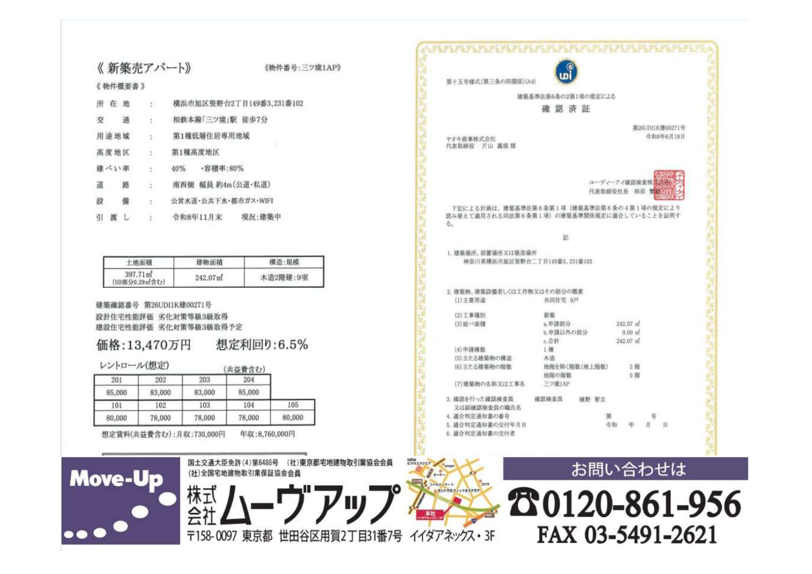
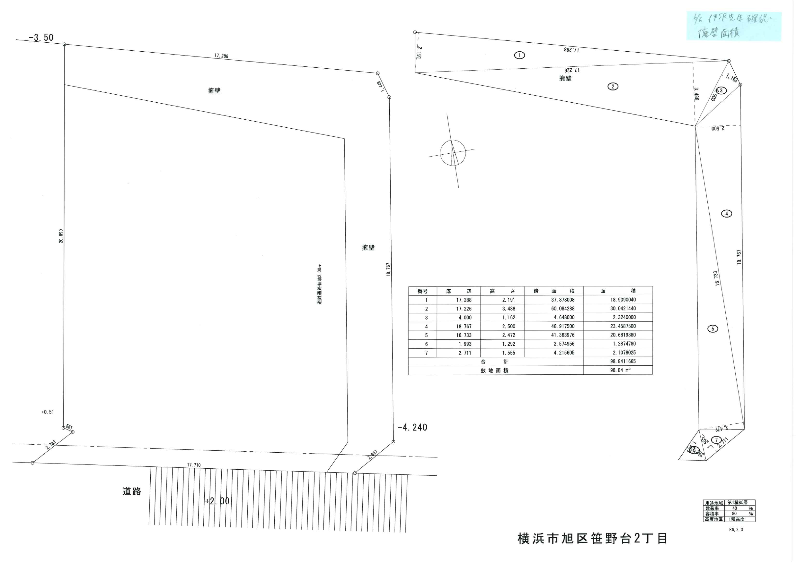
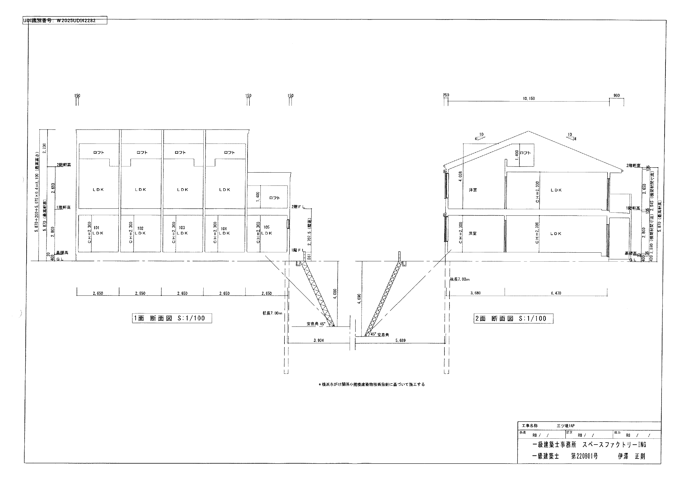
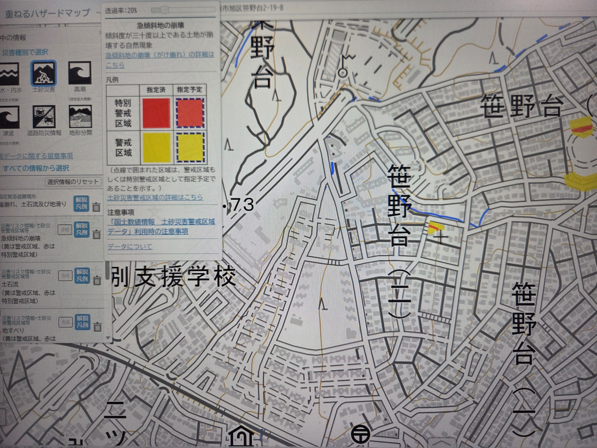
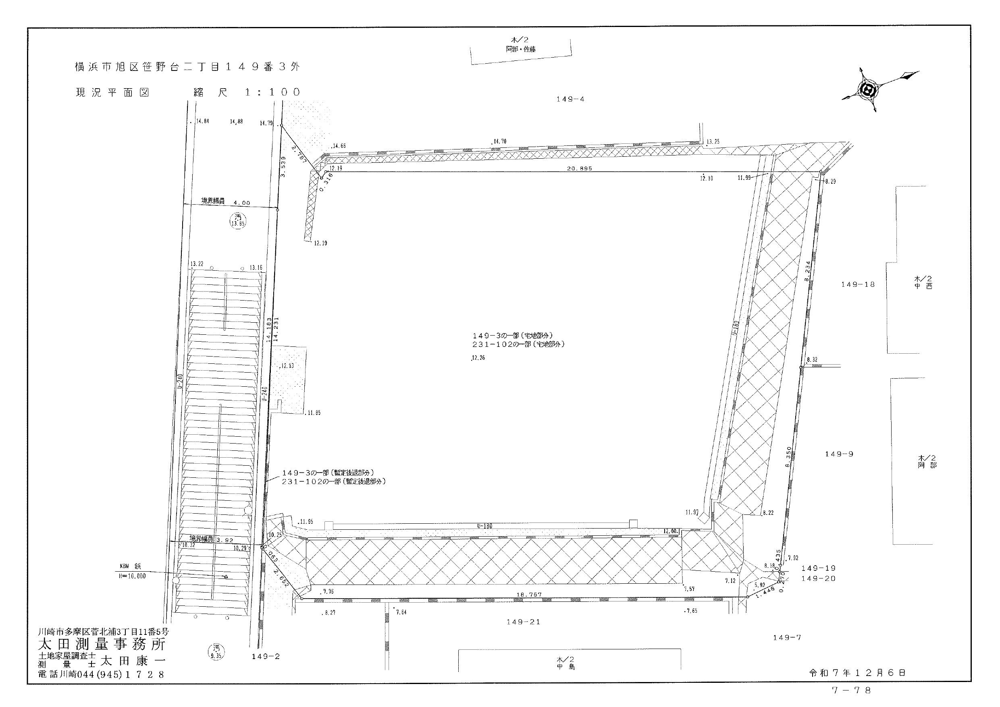
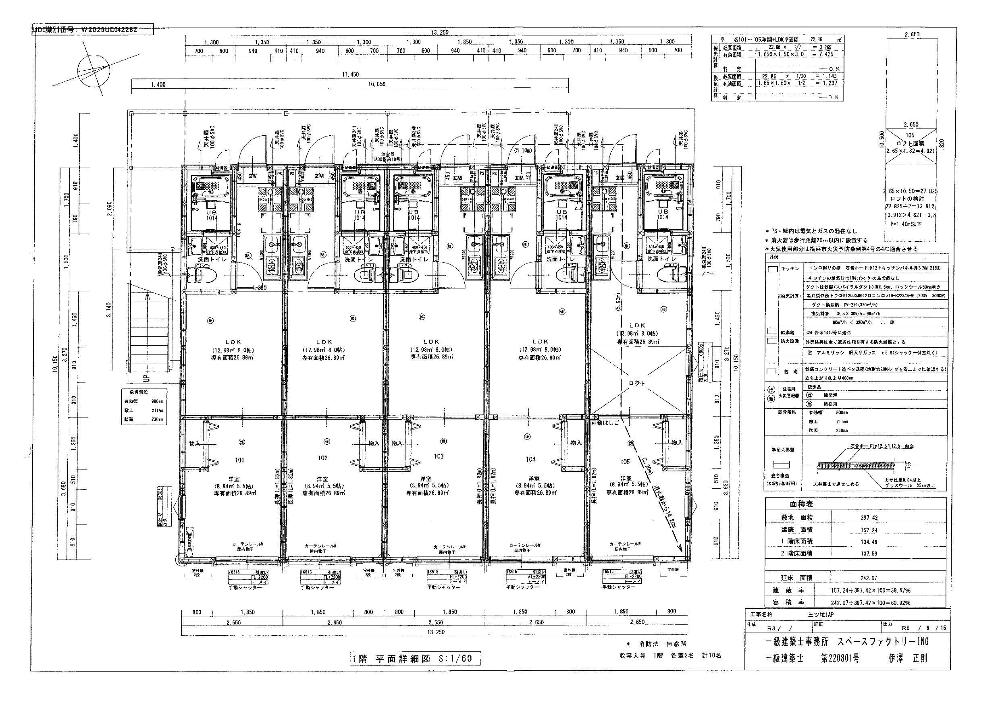
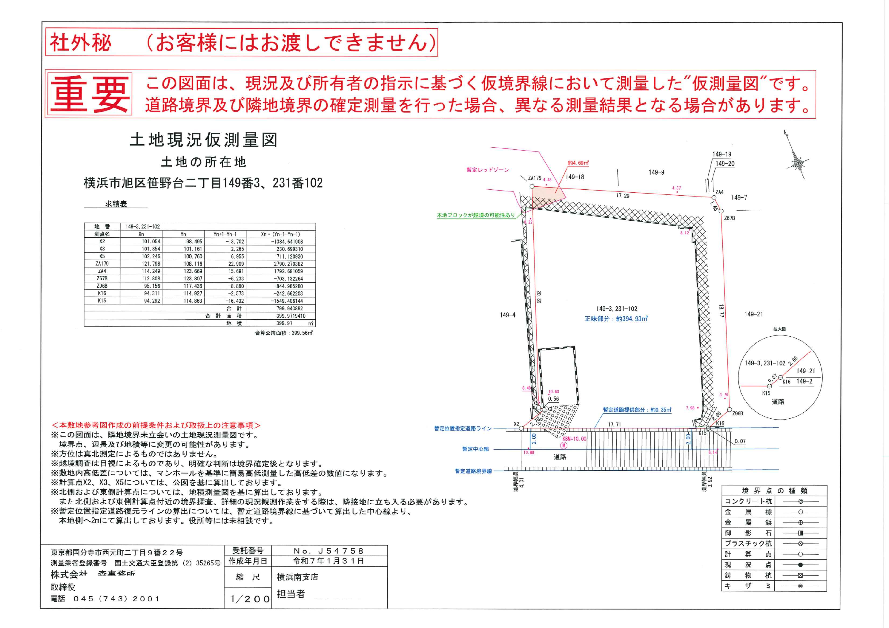

# 수익형 부동산 투자분석 보고서: 미츠쿄 1AP 사사노다이 (三ツ境1AP 新築アパート)
## [2차 정밀 실사 업데이트판] 등기부·공과증명서·확정측량도·실시설계도·옹벽도·성약50건·중개사(오카다상) 질의응답 완벽 반영

> [!WARNING] **2차 실사 핵심 업데이트 요약 (2026.09.25 추가 징구 자료 11종 반영)**
> 1. **소재지(주거표시) 및 실측 도보거리 확정**: 주거표시는 **『神奈川県横浜市旭区笹野台2丁目19-5』**(지번 `149番3, 231番102`)이며, 마이소쿠상 도보 7분과 달리 **구글맵 실측 도보 10분(약 720m)**이 소요되고 남서측 전면도로 일부 구간이 **계단(階段)**으로 형성되어 있습니다.
> 2. **🚨 최대 물리적 리스크 — 동·북측 기존 간지블록 옹벽(98.84㎡) 미검사 및 토사재해 구역 저촉**: 본 부지는 주변 대비 **4.0~4.69m 높은 고대(高台)**에 위치하며, **동측·북측 기존 간지블록 옹벽(총 7구간, 면적 98.84㎡)은 매도자 소유(매수자 승계)**이나 **축조시기 불명·검사필증 없음(検査済証なし)·보강 계획 없음** 상태입니다(서측 옹벽은 인접지 소유). 또한 **북서측 옹벽 모서리(약 4.69㎡)가 토사재해경계구역(옐로우존/가측량도상 잠정 레드존 경계)에 일부 저촉**됩니다.
> 3. **건축법상 벼랑조례(がけ条例) 해법 확인**: 실시설계 단면도(`断面図`) 검증 결과, 기존 미검사 옹벽에 건물 하중이 실리지 않도록 **RC 베타기초 하부에 길이 `7.00m`의 기초 파일(`杭長 7.00m`)을 안식각 45°(`安息角 45°`) 심층 지지층까지 관입**하여 요코하마시 벼랑조례를 적법하게 통과(`제26UDI1K건00271호`)했습니다. 즉, **건물 자체의 붕괴 위험은 7m 파일로 방어**되었으나, **옹벽 자체의 유지보수 및 붕괴 시 민사 배상책임은 매수자에게 귀속**됩니다.
> 4. **전면도로 100% 요코하마시 공도(公道) 확정**: 등기부 및 요코하마시 인정노선도 대조 결과, 남서측 `下川井第402号線`(폭 4.0~4.5m, 일부 계단) 및 서측 `下川井第398号線`(폭 4.0~5.5m) 모두 **요코하마시 소유 공도(公衆用道路)**임이 확인되어 사도 지분·굴착승낙 리스크는 **완전 해소**되었습니다.
> 5. **전 9세대 `1LDK(26.89㎡)` + 5세대 `로프트(4.82㎡)` 시공 확인**: 평면상세도 확인 결과 단순 1R/1K가 아니라 전 세대가 **`LDK 8.0帖 + 洋室 5.5帖 (26.89㎡)`의 1LDK(2인 입주 가능)**이며, **105호(1층 단층부) 및 201~204호(2층 전 호실) 총 5세대에 `4.82㎡(약 3.0帖)` 대형 로프트**가 추가 시공됩니다.
> 6. **령화 8년도 공과증명서(公課証明書) 실측 반영**: 토지 2필지 합산 **고정자산세 평가액은 `36,985,271円`(92,565엔/㎡)**으로 고저차·계단 접도 감가가 반영되어 있어, 신축 후 주택용지 특례(1/6) 적용 시 **연간 토지 보유세는 약 12.3만 엔**(건물 약 45만 엔 합산 **연 57.3만 엔**)으로 매우 저렴합니다.
> 7. **종합 판정 조정**: 옹벽(검사필증 부재)·토사재해 구역 저촉·도보 10분 계단 접근로 및 지역 상단 임대료 리스크를 반영하여 종합 스코어를 기존 22.5점에서 **`19.5 / 30점 (조건부 검토 — 공격적 지값 네고 필수)`**로 하향 조정합니다.

---

## 1. 물건 기본 개요 (Property Overview)

| 항목 | 세부 내용 (등기부·공과증명서·확정측량도·실시설계도 교차 검증 완료) |
| :--- | :--- |
| **물건명** | **미츠쿄 1AP 사사노다이 신축 아파트 (三ツ境1AP 新築一棟アパート)** |
| **소재지 (지번 / 주거표시)** | **[지번]** 神奈川県横浜市旭区笹野台二丁目149番3、231番102 **[주거표시]** **神奈川県横浜市旭区笹野台2丁目19-5** (`35°28'12.8"N 139°30'02.6"E`) |
| **교통 (구글맵 실측)** | 소테츠 본선(相鉄本線, 급행·통근급행 정차) **「미츠쿄(三ツ境)」역 도보 10분** (마이소쿠 표기 도보 7분 / 구글맵 실측 약 720m·도보 10분, 전면도로 진입부 계단 구간 존재) |
| **매매가격 (호가)** | **1억 3,470만 엔 (¥134,700,000)** ※ 건물 소비세 포함 |
| **목표 매수가 (네고 타겟)** | **1억 2,300만 ~ 1억 2,500만 엔** (표면 6.87~7.12% / 실질 NOI 5.50~5.59% — 미검사 옹벽 및 임대료 상단 리스크 반영) |
| **토지 면적 (공부 vs 실측)** | **[등기부 지적]** 합계 **399.56㎡** (`149番3`: 386.62㎡ + `231番102`: 12.94㎡) **[확정측량 실측]** 합계 **397.71㎡ (120.30평)** = **유효택지 397.42㎡ (120.22평)** (`149-3`: 384.52㎡ + `231-102`: 12.90㎡) + 잠정 후퇴부분(SB) **0.29㎡** |
| **토지 권리 / 지목** | 소유권 (所有権) / 택지 (宅地) |
| **도시계획 / 용도지역** | 시가지화구역 / **제1종 저층주거전용지역 (第一種低層住居専用地域)** · 제1종 고도지구 |
| **건폐율 / 용적률** | 법정 건폐율 **40%** (실적 **39.57%** = 건축면적 `157.24㎡`) / 법정 용적률 **80%** (실적 **60.92%** = 연면적 `242.07㎡`) |
| **접도 조건 (100% 공도 확인)** | **남서측 폭원 3.92~4.50m 요코하마시 공도(`下川井第402号線`, 지번 `231-1` 요코하마시 소유 공중용도로)** 및 **서측 폭원 4.00~5.50m 요코하마시 공도(`下川井第398号線`)** 접도 ※ **사도 부담 없음(100% 공도)**, 단 `下川井第402号線`의 부지 전면 구간은 **계단(階段) 도로**임 (차량은 계단 직전까지 동·서 양방향 접근 가능) |
| **건물 구조 / 규모** | **목조(木造) 준내화구조(準耐火構造) 지상 2층건** · 공동주택 **총 9세대** (1층 5세대, 2층 4세대) **[기초 공법]** RC 베타기초(`地耐力 20kN/㎡`) + **길이 `7.00m` 기초 파일(`杭長 7.00m`)** (요코하마시 벼랑조례 안식각 45° 대응) |
| **건물 면적 및 평면 구성** | **연면적 242.07㎡ (73.22평)** (1층 `134.48㎡`, 2층 `107.59㎡` / 최고높이 `8.10m`, 처마높이 `5.87m`) • **전 9세대 `1LDK (26.89㎡)`**: `LDK 8.0帖(12.98㎡) + 洋室 5.5帖(8.94㎡)` (전 실 2인 입주 가능 설계) • **5세대(`105, 201, 202, 203, 204호`) 대형 로프트(`4.82㎡ / 3.0帖`) 부착** (로프트 포함 실사용 면적 **31.71㎡**!) |
| **건축확인번호 / 성능평가** | **제26UDI1K건00271호** (令和8年6月18日 교부 / UDI확인검사(주), 설계: 일급건축사사무소 스페이스팩토리ING) • **설계주택성능평가서 『열화대책등급 3급(劣化対策等級3級)』 취득 완료** • **건설주택성능평가서 『열화대책등급 3급』 준공 시 취득 예정** (최장 30~35년 장기 융자 적격) |
| **준공 및 인도 예정일** | **2026년 12월 말 준공 예정 / 2027년 1월 인도 예정** (기존 11월 말에서 약 1개월 순연 확인) |
| **매도자 / 프로젝트 금융** | **야오키상사 주식회사 (ヤオキ商事株式会社)** (카와사키시 타카츠구 소재 업력 50년 디벨로퍼) • **[을구 근저당권]** 2025년 6월 27일 매수 시 **카와사키신용금고(川崎信用金庫 登戸支店) 차입금 7,700만 엔, 금리 연 3.050%** 근저당 설정 확인 |
| **설비 및 특기사항** | 공영수도 · 공공하수 · **도시가스** · **전 세대 무료 WiFi (오너 부담 월 7,920엔[세금포함], 10년 약정)** · 독립세면대 · UB1014 · IH 2구 시스템키친(W1200) · 실내물건걸이 · 1층 수동셔터 |

---

## 2. 등기부등본(甲区·乙区)·공과증명서·건축도면 포렌식 실사 (Forensic Due Diligence)

### 2.1 등기부등본(全部事項証明書) 권리관계 및 매도자 조달금리 분석
`05_touhon_sokuryo_kouka.pdf` (1~6페이지) 등기부등본 전수 조사 결과:
1. **갑구 (소유권 이력)**:
   - 구 소유자 개인(1957년/1982년 취득 → 1997년 상속 → 2003년 매매)을 거쳐, **令和7年(2025년) 6월 27일 현 매도자인 『야오키상사 주식회사(ヤオキ商事株式会社)』가 매매로 소유권을 취득**했습니다.
   - `149番3` 토지는 1983년(소화 58년) 지적 정정을 통해 `384.06㎡ → 386.62㎡`로 등기되었으며, `231番102` 토지는 `12.94㎡`로 등기되어 공부상 합계 면적은 **`399.56㎡`**입니다.
2. **을구 (담보권 및 매도자 협상 레버리지 핵심 단서)**:
   - 현 매도자(야오키상사)는 2025년 6월 27일 토지 취득과 동시에 **카와사키신용금고(川崎信用金庫 登戸支店)**로부터 **채권액 7,700만 엔(이자 연 3.050%, 손해금 연 14.50%)의 공동담보 저당권(목록 (イ)第5921号)**을 설정했습니다.
   - **💡 협상 전략적 시사점**: 중개사(오카다상)에 따르면 매도자는 *"초기에는 가격 네고에 잘 응하지 않으나 안 팔리면 시기를 보아 가격을 내리는 스탠스"*입니다. 그러나 매도자는 현재 **연 3.05%라는 높은 프로젝트 조달금리(월 이자만 약 19.6만 엔)**를 부담하고 있으며, 공정이 당초 11월 말에서 **12월 말 준공(2027년 1월 인도)**으로 지연되었습니다. 따라서 연말 준공 시점까지 매수자가 확정되지 않을 경우 매도자의 이자 및 재고 보유 압박이 급증하므로, 이를 지렛대로 **1억 2,300만 ~ 1억 2,500만 엔** 선의 조건부 매수의향서(LOI) 타진이 매우 유효합니다.

---

### 2.2 🚨 최대 핵심 리스크: 기존 간지블록 옹벽(98.84㎡) & 토사재해경계구역(Yellow/Red Zone) 정밀 진단

이번 2차 실사 자료(`현황평면도`, `옹벽면적도`, `실시설계 단면도`, `가측량도`, `오카다상 질의응답`)를 통해 밝혀진 가장 중요한 물리적·법적 팩트입니다.

| 검증 항목 | 실사 확인 결과 (Hard Fact) | 투자 리스크 및 대응 방안 |
| :--- | :--- | :--- |
| **1. 지형 및 옹벽 규모** | • 부지 레벨(GL `12.14~12.26m`)이 북측·동측·남측 인접지 및 도로(`7.63~8.37m`)보다 **약 4.0m ~ 4.69m 높은 고대(高台) 지형** • 옹벽 면적 산출도(`擁壁面積`)상 **총 7개 구간(①~⑦), 합계 면적 `98.84㎡`** (구간별 높이 `1.162m ~ 3.488m`, 단면도상 최대 단차 `4.690m`) | 높이 2m를 초과하는 대형 간지블록(間知ブロック) 옹벽이 부지 3면을 둘러싸고 있음 |
| **2. 옹벽 소유권 및 유지관리 책임** | • **동측(東) 및 북측(北) 옹벽**: **매도자 소유 → 매수자(투자자)에게 소유권 및 유지보수 책임 승계!** • **서측(西) 옹벽**: **서측 인접지 소유자 소유** (고저차 큰 노후 옹벽) | 동·북측 옹벽의 향후 균열·배부름 보수비 및 지진·호우로 인한 붕괴 시 인접 저지대 가옥에 대한 **민법상 공작물 배상책임(민법 717조)**이 매수자에게 귀속됨 |
| **3. 축조시기 및 검사필증 유무** | • **축조시기 불명(築造時期不明) / 택지조성 및 공작물 검사필증 없음(検査済証なし)** • 매도자 측의 **보강 공사나 재축조 계획 없음(補強・造り直し予定なし)** • 단, 실시설계 배치도(`配置図`)상 일급건축사 육안 점검 결과 **『間知ブロック 亀裂、たわみ無し 水抜き穴あり 安全支障無し(균열·배부름 없음, 배수공 있음, 안전지장 없음)』**으로 기재됨 | 검사필증이 없는 구형 옹벽이므로, 향후 재건축 시에는 옹벽 재축조(수천만 엔 소요) 또는 벼랑조례 파일 재시공이 필요하며, 일부 보수적 시중은행(1금융권)에서 담보 평가를 감액할 수 있음 |
| **4. 벼랑조례(がけ条例) 및 신축 허가 통과 비결** | • 요코하마시 건축기준조례 제4조(벼랑 부근의 건축물) 및 **『横浜市がけ関係小規模建築物技術指針』**에 의거하여, **옹벽 하단으로부터 45° 안식각(`安息角 45°`) 아래의 견고한 지지층까지 길이 `7.00m`의 기초 파일(`杭長 7.00m`)을 관입**하고 RC 베타기초를 얹는 공법을 채택! • 또한 성토규제법(`盛土規制法`) 저촉을 피하기 위해 **성토 없음(`盛土無し`)**으로 설계하여 건축확인(`제26UDI1K건00271호`)을 적법 취득함 | **건물 본체의 구조적 안전성(침하·전도 방지)은 7.0m 파일 시공으로 확보**되었음. 준공 시 **『7.0m 파일 시공 보고서 및 지반조사 보고서』** 사본을 반드시 수령해야 함 |
| **5. 토사재해경계구역 저촉 여부** | • 가나가와현 토사재해 포털 및 가측량도(`06_karisoku.pdf`) 확인 결과, **부지 북서측(北西) 모서리 옹벽 부분(약 4.69㎡ 삼각형 구간)이 토사재해경계구역(옐로우존 / 잠정 레드존 경계)에 일부 걸쳐 있음(かすっている)**을 매도자가 공식 확인함 • 건물 본체는 북측·서측 경계로부터 `2.00m` 이상 이격되어 있어 건물 자체는 구역 밖에 위치함 | 중요사항설명서(重説)에 토사재해경계구역(일부) 해당 사실이 기재되며, 화재·지진보험 가입 시 **시설소유관리자 배상책임보험(옹벽 손해 담보)** 특약을 반드시 추가해야 함 |

---

### 2.3 전면도로 공도(公道) 확인 및 계단 접근로 분석

1. **사도(私道) 리스크 완전 해소**:
   - 1차 분석 당시 마이소쿠에 `公道・私道`로 혼재 표기되어 있었으나, 이번에 수령한 **도로 등기부(`笹野台二丁目231番1`, 지목: 공중용도로, 소유자: `横浜市`)** 및 **요코하마시 인정노선도(`下川井第402号線` 폭원 4.00~4.50m, `下川井第398号線` 폭원 4.00~5.50m)**를 통해 **부지에 접한 모든 도로가 100% 요코하마시 공도(公道)**임이 확정되었습니다. 따라서 사도 지분 누락이나 굴착 승낙 거부 리스크는 **0%**입니다.
2. **전면도로 계단(階段) 구간 유의사항**:
   - 현황평면도(`survey_topography.png`)에서 확인되듯, 남서측 전면도로(`下川井第402号線`)의 부지 접도 구간 중 서측 절반은 **경사 계단(階段)**으로 되어 있습니다.
   - 자동차는 계단 아래쪽(남동측)과 계단 위쪽(`下川井第398号線`, 북서측) 양방향에서 계단 바로 앞까지 진입할 수 있으나, 부지 내 주차장은 없으며 이사 차량 정차 시 계단 앞 도로를 이용해야 합니다.

---

### 2.4 건축 상세 도면(`1階・2階 平面詳細図`) 분석: 전 세대 `1LDK(26.89㎡)` + 5세대 `로프트(4.82㎡)`

실시설계 평면상세도(`02_plans_elevations.pdf` 2~3p)를 통해 확인된 본 건물의 상품 스펙은 일반 신축 목조 원룸(14~18㎡)을 압도합니다:
- **전 9세대 `1LDK` (`26.89㎡`) 표준 구성**:
  - 전 호실이 **`LDK 8.0帖 (12.98㎡) + 洋室 5.5帖 (8.94㎡)`**으로 분리된 정통 **컴팩트 1LDK** 구조입니다(소방법상 각 실 수용인원 2명, 1인 가구 재택근무자 및 **신혼·동거 커플 2인 입주 가능**!).
- **5개 호실(`105호`, `201~204호`) 대형 로프트(`4.82㎡`) 서비스 면적**:
  - 2층 4개 호실(`201~204호`)뿐 아니라 **1층 동측 끝단 단층 구조인 `105호`에도 `2.65m × 1.82m = 4.82㎡ (약 3.0帖, 천장고 1.4m 이하, 이동식 사다리)` 로프트가 시공**됩니다!
  - 즉, 9세대 중 5세대는 **실사용 면적이 `26.89㎡ + 4.82㎡ = 31.71㎡ (약 9.6평)`**에 달합니다.
- **내화·차음·설비 사양**:
  - **준내화구조(`準耐火構造`)**: 벽체 석고보드 `12.5+12.5mm` 양면 시공, 세대 간 차음 경계벽 천장 속까지 밀실 시공(`界壁遮音 天井裏まで達しせめる` + 글라스울 충전).
  - **설비**: 시스템키친 `W1200` (`IH 2구 콘로 200V 3000W`), 유닛배스 `UB 1014`, 독립 세면화장대, 실내 빨래걸이(`室内物干`), 1층 전 창문 **방범용 수동 셔터(`手動シャッター`)**, 전 세대 **무료 WiFi**.

---

### 2.5 중개사(오카다상 / Okada-san) 공식 질의응답(Q&A) 원문 및 가측량도(`06_karisoku.pdf`) 정밀 검증

구글 문서(`추가정보 w/Okada-san`)로 수령한 담당 중개사(오카다상)의 공식 회신 전문과 매도자 매입 당시 **가측량도(`06_karisoku.pdf`)** 교차 검증 내역입니다.

#### 📌 [핵심 정정] 옹벽 소유권 귀속 정정 및 토사재해구역(잠정 레드존) 근거
- **매도자 소개**: *"미츠쿄 건은 **『야오키상사(ヤオキ商事)』라는 미조노구치(溝の口, 카와사키시 타카츠구)의 노포 디벨로퍼**가 건축 중인 물건으로, 당사(중개사)와도 오랫동안 거래해 온 신뢰할 수 있는 업체입니다."*
- **토사재해경계구역 해당 근거 (`仕入れ時の仮測量図`)**:
  - 매도자가 토지 매입 당시 작성한 가측량도(`karisoku_redzone.png`)를 확인한 결과, 전체 측량면적 `399.97㎡` 중 **정미 유효택지(`正味部分`)는 `約394.93㎡`**이며, 도로 후퇴부분(`約0.35㎡`) 외에 **북서측 모서리 옹벽 사면 부분 `約4.69㎡`가 『잠정 레드존(暫定レッドゾーン / 토사재해구역)』에 살짝 걸쳐 있는 것(`北西の擁壁部分がかすっている`)**으로 확인되었습니다(서측 인접지 `149-4`와 북서측 저지대 `149-18`[GL `4.48m`] 사이의 고저차가 크고 오래된 옹벽의 영향).
  - 또한 가측량도 북서측(`8.22` 지점)에 녹색 글씨로 **『本地ブロックが越境の可能性あり(본지 블록이 서측 인접지 149-4로 월경할 가능성 있음)』**라고 기재되어 있으므로, 확정측량 완료 후 인접지 경계확인서상 월경 해소 여부를 최종 점검해야 합니다.
- **🚨 옹벽 소유권 공식 정정 (`誤 → 正`)**:
  - **[당초 오안내(誤)]**: 동측·남측은 매도자 소유, 북측(토사재해경계구역)은 인접지 소유.
  - **[정정 확정(正)]**: **『동측(東)·북측(北)은 매도자 소유(매수자 승계), 서측(西)은 인접지 소유』 (`正）東・北は売主所有　西は隣地所有です。`)** — 즉, 토사재해경계구역과 접한 **북측 옹벽 역시 매도자(매수자 승계) 소유**임이 명확히 확정되었습니다!

#### 📋 오카다상(Okada-san) 6대 카테고리 질의응답(Q&A) 전문 요약

| 카테고리 | 실사 질의 항목 (Q) | 중개사(오카다상) 공식 답변 원문 및 실무 해석 (A) |
| :--- | :--- | :--- |
| **1. 옹벽 (擁壁)** | • 동·남·북·서 각 면 옹벽의 소유자는? • 유지관리·보수 책임 귀속은? • 축조시기 및 검사필증(택조허가) 유무는? • 인도 전 보강·재축조 계획은? | • **소유권**: **동측(東) = 매도자 소유**, **북측(北·토사재해경계구역 측) = 매도자 소유**, **서측(西) = 인접지 소유** (`東・北は売主所有、西は隣地所有`) • **관리·보수 책임**: 각 **소유자에게 귀속 (`所有者に帰属します`)** • **축조시기·검사필증**: **축조시기 불명, 검사필증 없음 (`築造時期不明、検査済証なしです`)** • **보강·재축조 계획**: **예정 없음 (`予定なしです`)** (단, 건물 기초에 7.0m 파일을 박아 벼랑조례 통과) |
| **2. 임대료 및 PM 조건 (賃料・管理)** | • `26.89㎡` 상정 임대료(7.8~8.5만 엔)가 주변 시세 상단인데 산정 근거는? • 준공 후 공실 장기화 시 AD 부담·가격 네고 여지는? | • **산정 근거**: 최근 트렌드인 **30㎡ 이하 컴팩트 1DK/1LDK 평면**으로, 단순 단신자뿐 아니라 **젊은 층 2인 입주(커플·동거) 수요까지 흡수할 수 있는 간도리(`若年層2人入居まで取り込める間取り`)**임. **2인이 임대료를 분담한다고 생각하면 오히려 저렴(`2人で賃料負担と考えると割安`)**하다는 판단에서 책정됨. 근린에 유사 1LDK 사례가 적어 추가 타겟층 조사 예정. • **가격 네고 및 PM 관리 제안**: 매도자는 *"잘 안 팔리면 시기를 보아 가격을 내리는 스탠스(`なかなか売れなければ機を見て値下げというスタンス`)"*라 당장의 대폭 네고는 쉽지 않으나, **본건을 진행하며 중개사 측에 PM 임대관리를 맡겨주신다면 관리 조건 및 리싱 조건 등을 적극 협의·우대(`是非とも弊社に管理をお任せ頂きたく、管理条件等々ご相談させて頂きたいと思います`)**하겠음! |
| **3. 토사재해경계구역 (土砂災害)** | • 본 물건 부지는 구역 밖인가? | • 당초 인접지만 해당하는 줄 알았으나, 가측량도(`06_karisoku.pdf`) 확인 결과 **매도자는 본 물건 부지 일부(북서측 옹벽 모서리 약 4.69㎡)가 토사재해경계구역 내에 걸쳐 있다고 인식 (`売主は本物件敷地の一部が区域内との認識`)**하고 있음. |
| **4. 도로·차량·쓰레기장 (道路・ゴミ置場)** | • 전면 계단과 상부 평탄 도로는 공도인가 사도인가? • 이사 트럭 진입 및 쓰레기장 위치는? | • **공도 여부**: 전면 계단 도로(`下川井第402号線`)와 상부 도로(`下川井第398号線`) **둘 다 100% 공도 (`どちらも公道です`)**. • **이사 차량 진입**: **동측(계단 아래)에서도, 서측(계단 위)에서도 계단 바로 앞까지 차량 진입 가능 (`階段の手前まで車両侵入可能です。東（階段下）からも西（階段上）からも`)**. • **쓰레기 집하장(`ゴミ置き場`)**: **도로 옆 부지 내에 설치 예정 (`道路わき敷地内に設置予定、場所は未確定`)** (상세 위치는 미확정). • **인근 코인파킹**: 안내도(`07_map`)상 부지 반경 60~180m 내에 코인파킹(`コインパーキング`) 3개소 소재. |
| **5. 보유세·WiFi 비용 (費用)** | • 고정자산세·도시계획세 평가액은? • 무료 WiFi 오너 부담 월액은? | • **고도세(固都税)**: 토지 공과증명서 첨부 완료(토지 평가액 합계 3,698.5만 엔). 목조 건물은 통상 연면적 ㎡당 10~12만 엔 평가 × 세율(고정 1.4% + 도계 0.3%)로 산정되어 **건물 고도세는 연간 45만 엔 정도 예상 (`建物固都税年間45万円程度の見込み`)**. • **무료 WiFi 비용**: **월 7,920엔 (세금포함 / `7,920円/月 税込`)**, 단 **10년 의무약정 (`※10年縛りです`)** 조건임. |
| **6. 일정·계약·모델룸 (スケジュール・契約)** | • 준공·인도일 및 건설주택성능평가서 교부 시점은? • 수부금(계약금) 비율 및 공기 지연 조항은? • 준공 전 모델룸 내견이 가능한가? | • **준공·인도 일정**: 공정이 다소 밀려 **2026년 12월 말 준공 / 2027년 1월 인도 예정 (`竣工12月末、引渡し1月予定`)**으로 변경됨. **건설주택성능평가서(`建設住宅性能評価`)는 준공 후에 교부 (`竣工後になります`)**. • **계약금(`手付金`) 및 지연 조항**: 계약금은 **법정 보전조치가 불필요한 범위 내 (`保全措置が不要な範囲`, 미완성 물건이므로 매매대금의 5% 이하 또는 1,000만 엔 이하)**에서 설정 예정. 도급계약(`請負契約`)이 아닌 기착공 매매이므로 공기 지연 위약 조항은 별도 협의(`別途協議`). • **⭐ 모델룸 내견 가능 (`モデルルーム内見`)**: 현재 동일 매도자(야오키상사)가 시공한 **『다이시바시(大師橋)의 신축 AP』를 모델룸으로서 내부 견학 가능 (`現在であれば大師橋のAPをモデルルームとして内見可能です`)**! |

---

## 3. 토지·건물 적산가격(積算価格) 및 령화 8년도 공과증명서(公課証明書) 정밀 평가

### 3.1 령화 8년도 고정자산세·도시계획세 공과증명서(令和8年度 公課証明書) 실측 내역
요코하마시 아사히구청장이 2026년 4월 30일 발급한 공식 공과증명서(`05_touhon_sokuryo_kouka.pdf` 12~13p) 수치입니다:

| 필지 (지번) | 등기 지적 | 확정측량 유효면적 | R8 고정자산세 평가액 (評価額) | ㎡당 평가단가 | R8 나대지 기준 세액 (고정+도계) | 신축 완공 후 소규모 주택용지 특례(1/6·1/3) 적용 시 연간 세액 |
| :--- | :---: | :---: | :---: | :---: | :---: | :---: |
| **笹野台二丁目149番3** | 386.62㎡ | 384.52㎡ (+SB 0.20㎡) | **¥35,787,480** | ¥92,565/㎡ | ¥397,154 | **약 ¥119,291** |
| **笹野台二丁目231番102** | 12.94㎡ | 12.90㎡ (+SB 0.09㎡) | **¥1,197,791** | ¥92,565/㎡ | ¥13,291 | **약 ¥3,992** |
| **토지 2필지 합계** | **399.56㎡** | **397.42㎡ (120.22평)** | **¥36,985,271** | **¥92,565/㎡** | ¥410,445 | **약 ¥123,283 / 년 (약 12.3만 엔)** |
| **신축 건물 (추정)** | - | **242.07㎡ (73.22평)** | **약 ¥26,627,700** (11만/㎡) | ¥110,000/㎡ | - | **약 ¥450,000 / 년 (첫 3년은 감면으로 약 25만 엔)** |
| **토지 + 건물 총계** | - | - | **¥63,612,971 (약 6,361만 엔)** | - | - | **정상화 시 약 ¥573,283 / 년 (약 57.3만 엔)** |

> [!TIP] **공과증명서 핵심 인사이트 (보유세 절감 vs 고저차 보정)**
> - **왜 토지 고정자산세 평가액이 `3,698.5만 엔(92,565엔/㎡)`인가?**: 사사노다이 2초메 표준 주택가의 상속세 노선가는 약 `190,000円/㎡`(공시지가 약 `240,000円/㎡`)이나, 본 필지는 **남서측 계단 도로 접도 및 4m 이상 고저차(옹벽)**가 존재하여 요코하마시 세무과에서 **지형·접도 감가 보정**을 대폭 반영했기 때문입니다.
> - **투자자 실익**: 토지 공적 평가액이 낮게 책정된 덕분에, 9세대 공동주택 준공 후 **소규모 주택용지 특례(200㎡×9호=1,800㎡까지 고정자산세 1/6, 도시계획세 1/3 감면)**가 적용되면 **120.3평 대토지의 연간 보유세가 불과 `12.3만 엔` 수준**으로 낮아져 현금흐름(NOI)을 강력하게 방어합니다!

---

### 3.2 적산가격(積算価格) 3대 시나리오 및 지형 보정(がけ地補正) 비교
일반 평탄지 노선가(`190,000円/㎡`) 기준 적산과, 금융기관이 고저차·계단 접도 감가(**-20%, 실효 노선가 `152,000円/㎡`**)를 적용한 보수적 담보 적산을 병행 산출했습니다.

| 평가 시나리오 | 토지 평가 기준 | 토지 적산가 | 건물 단가 (`242.07㎡`×22/22년) | 건물 적산가 | **합계 적산가격** | **호가(1.347억) 대비 비율** |
| :--- | :--- | :---: | :---: | :---: | :---: | :---: |
| **① 은행 엄격 담보 기준 (지형감가 -20%)** | 유효 `397.42㎡` × 15.2만 엔/㎡ | ¥60,407,840 | 150,000엔/㎡ | ¥36,310,500 | **¥96,718,340** | **71.80%** |
| **② 금융기관 표준 기준 (노선가 원안+15만)** | 유효 `397.42㎡` × 19.0만 엔/㎡ | ¥75,509,800 | 150,000엔/㎡ | ¥36,310,500 | **¥111,820,300** | **83.01%** |
| **③ 국세청 표준 적산 (노선가 원안+18만)** | 유효 `397.42㎡` × 19.0만 엔/㎡ | ¥75,509,800 | 180,000엔/㎡ | ¥43,572,600 | **¥119,082,400** | **88.41%** |
| **④ 실세 공시지가 + 신축 재조달원가(22만)** | 유효 `397.42㎡` × 24.0만 엔/㎡ | ¥95,380,800 | 220,000엔/㎡ | ¥53,255,400 | **¥148,636,200** | **110.35%** |

- 지형 감가(-20%)를 엄격히 반영하더라도 적산비율이 **71.80%(9,672만 엔)**를 상회하며, 표준 노선가 기준으로는 **83.01% ~ 88.41%**에 달합니다.

---

## 4. 렌트롤 포렌식 및 REINS 근린 성약 50건(`03_comps_1R_1K.pdf`) 비교 검증

### 4.1 호실별 상정 렌트롤 및 평면 스펙 (전 9세대)
| 호실 | 층수 / 위치 | 상세 평면 (전유면적 + 로프트) | 상정 월임대료 (공익비·무료WiFi 포함) | 연간 임대료 | 전유 ㎡당 단가 | 로프트 포함(31.71㎡) 실효 ㎡단가 | 비고 |
| :---: | :---: | :--- | :---: | :---: | :---: | :---: | :--- |
| **101호** | 1F 서측 각실 | **1LDK (`26.89㎡`)** [LDK 8.0 + 양실 5.5] | **¥80,000** | ¥960,000 | 2,975엔/㎡ | 2,975엔/㎡ | 1층 남서·북서 2면 채광 각실, 수동셔터 |
| **102호** | 1F 중실 | **1LDK (`26.89㎡`)** [LDK 8.0 + 양실 5.5] | **¥78,000** | ¥936,000 | 2,901엔/㎡ | 2,901엔/㎡ | 7만 엔대(7.8만) 진입 호실, 수동셔터 |
| **103호** | 1F 중실 | **1LDK (`26.89㎡`)** [LDK 8.0 + 양실 5.5] | **¥78,000** | ¥936,000 | 2,901엔/㎡ | 2,901엔/㎡ | 7만 엔대(7.8만) 진입 호실, 수동셔터 |
| **104호** | 1F 중실 | **1LDK (`26.89㎡`)** [LDK 8.0 + 양실 5.5] | **¥78,000** | ¥936,000 | 2,901엔/㎡ | 2,901엔/㎡ | 7만 엔대(7.8만) 진입 호실, 수동셔터 |
| **105호** | 1F 동측 단층 각실 | **1LDK (`26.89㎡`) + 로프트 (`4.82㎡`)** | **¥80,000** | ¥960,000 | 2,975엔/㎡ | **2,523엔/㎡** | **1층 유일 로프트 부착** + 2면 채광 각실! |
| **201호** | 2F 서측 각실 | **1LDK (`26.89㎡`) + 로프트 (`4.82㎡`)** | **¥85,000** | ¥1,020,000 | 3,161엔/㎡ | **2,681엔/㎡** | 최상층 각실 + 4.82㎡ 대형 로프트 |
| **202호** | 2F 중실 | **1LDK (`26.89㎡`) + 로프트 (`4.82㎡`)** | **¥83,000** | ¥996,000 | 3,087엔/㎡ | **2,617엔/㎡** | 최상층 중실 + 4.82㎡ 대형 로프트 |
| **203호** | 2F 중실 | **1LDK (`26.89㎡`) + 로프트 (`4.82㎡`)** | **¥83,000** | ¥996,000 | 3,087엔/㎡ | **2,617엔/㎡** | 최상층 중실 + 4.82㎡ 대형 로프트 |
| **204호** | 2F 동측 각실 | **1LDK (`26.89㎡`) + 로프트 (`4.82㎡`)** | **¥85,000** | ¥1,020,000 | 3,161엔/㎡ | **2,681엔/㎡** | 최상층 각실 + 4.82㎡ 대형 로프트 |
| **합계** | **전 9세대** | **전유 242.07㎡ (+로프트 24.10㎡ = 266.17㎡)** | **¥730,000 / 월** | **¥8,760,000 / 년** | **3,016엔/㎡** | **2,743엔/㎡** | **전 실 2인 입주 가능 1LDK + 무료 WiFi** |

---

### 4.2 REINS 근린 성약 사례 50건(`03_comps_1R_1K.pdf`) 대조 및 임대료 적정성 진단
오카다상이 제공한 미츠쿄·키보가오카·세야역 주변 24~31㎡ 성약 데이터 50건 중 주요 경쟁 신축·축천 사례와의 비교표입니다:

| 비교 물건명 (소재지) | 최기역 / 도보 | 준공연월 | 면적 / 타입 | 성약 임대료 + 관리비 = **월 총액** | ㎡당 단가 | 본건(`미츠쿄 1AP`) 대비 시사점 |
| :--- | :--- | :---: | :---: | :---: | :---: | :--- |
| **가칭 요코하마 미츠쿄 AP** (미츠쿄) | 미츠쿄역 **도보 3분** | **2025.06 (신축)** | 25.05㎡ / 1K | 6.9~7.4만 + 4,000엔 = **7.3~7.8만 엔** | 2,914~3,114엔 | 역 도보 3분 신축 1K가 7.3~7.8만 엔에 성약됨 (예금 1개월) |
| **KOMA 미츠쿄** (사사노다이 1초메) | 미츠쿄역 **도보 7분** | 2021.12 (축4년) | 24.77㎡ / 1K | 6.6~6.7만 + 3,000엔 = **6.9~7.0만 엔** | 2,786~2,826엔 | 동일 사사노다이 권역 1K(축4년) 실세는 약 7.0만 엔 수준 |
| **그린힐 키보가오카** (나카키보가오카) | 키보가오카역 **도보 4분** | **2025.07 (신축)** | 26.45㎡ / 1R | 7.3만 + 3,000엔 = **7.6만 엔** | 2,873엔 | 인접역 도보 4분 26.45㎡ 신축이 총 7.6만 엔에 성약 |
| **트윈즈 요코하마 세야** (세야) | 세야역 **도보 5~6분** | **2024.10 (신축)** | 28.66㎡ / 1K | 8.0만 + 5,000엔 = **8.5만 엔** | 2,966엔 | 28.6㎡급 대형 평면은 8.5만 엔 성약 가능 입증 |
| **일 피오레 사사노다이** (사사노다이 1초메) | 미츠쿄역 **도보 5분** | 2015.02 (축11년) | 28.56㎡ / 1K | 7.2만 + 3,000엔 = **7.5만 엔** | 2,626엔 | 사사노다이 28㎡급 기축은 평균 DOM 30일 내 안정 소화 |
| **⭐ 본건: 미츠쿄 1AP** (사사노다이 2-19-5) | 미츠쿄역 **도보 10분** | **2026.12 (신축)** | **26.89㎡ `1LDK` (+로프트 4.82㎡×5실)** | **1F 7.8~8.0만 / 2F 8.3~8.5만** (무료WiFi 포함) | **3,016엔** (로프트 포함 2,743엔) | **1K가 아닌 『1LDK(2인 입주 가능)+로프트+무료WiFi』로 차별화했으나, 도보 10분 기준 지역 시세 최상단(Upper Bound)에 위치!** |

> [!IMPORTANT] **임대료 스트레스 테스트 결론**
> - 미츠쿄역 도보 3분 신축 1K(25㎡)가 7.3~7.8만 엔에 성약된 점을 감안할 때, 도보 10분(계단 접근)인 본건이 **1층 7.8~8.0만 엔 / 2층 8.3~8.5만 엔**을 달성하려면 반드시 포털(SUUMO/HOME'S) 등록 시 **『1K가 아닌 1LDK(2인 입주 가능) + 3조 대형 로프트 + 무료 WiFi 완비』** 카테고리로 노출시켜 **커플·동거 수요 및 광폭 재택근무 수요**를 타겟팅해야 합니다.
> - 만약 1인 가구 위주로 모집하여 **임대료를 -5% 인하(1층 7.4~7.6만 엔, 2층 7.9~8.1만 엔 → 연수입 832.2만 엔)**하더라도, **만실 NOI는 645.4만 엔(Cap 4.79%), 30년 융자 시 DSCR 1.22배, 세전 CF +116.7만 엔/년**으로 여전히 안정적인 흑자가 유지됩니다.

---

## 5. 운영경비(OPEX) 정규화 및 현금흐름·손익분기(BEP) 모델링

### 5.1 실질 운영경비(OPEX) 명세 (오카다상 확인 확정치 반영)
| 경비 항목 | 연간 금액 (엔) |GPI 대비 비율 | 산출 근거 (2차 실사 검증 완료) |
| :--- | :---: | :---: | :--- |
| **1. 고정자산세·도시계획세 (보유세)** | **¥573,000** | 6.54% | **[토지]** R8 공과증명서(평가액 3,698.5만) 주택용지 특례(1/6·1/3) 적용 **¥123,000** **[건물]** 오카다상 확인 목조 신축 평가 기준 **¥450,000** (※ 초기 3년간은 신축 감면으로 합계 약 37만 엔/년) |
| **2. PM 임대관리 위탁수수료** | **¥438,000** | 5.00% | 만실 임대수입(876만 엔)의 5.0% |
| **3. 전 세대 무료 WiFi 런닝코스트** | **¥95,040** | 1.08% | **오카다상 확인 확정치: 월 7,920엔(세금포함) × 12개월 (※ 10년 약정 조건)** |
| **4. 공용부 전기·수도·정기청소·소방** | **¥144,000** | 1.64% | 공용등 전기·공용 수도·월 2회 순회청소 및 소방점검 (월 1.2만 엔) |
| **5. 화재·지진보험 + 옹벽 배상책임특약** | **¥90,000** | 1.03% | **목조 준내화구조(`準耐火構造`) 할인 적용** + 시설소유관리자 배상책임특약(옹벽) |
| **6. 퇴거 원상복구비·장기수선·옹벽점검 적립** | **¥550,000** | 6.28% | 퇴거 원상복구·AD 충당(연 25만) + 외벽·지붕·옹벽 배수공 유지적립(연 30만) |
| **실질 운영경비 (Normalized OPEX) 합계** | **¥1,890,040** | **21.58%** | **만실 순영업소득 (NOI) = ¥6,869,960 (≒ ¥6,870,000, 실질 Cap Rate 5.10%)** |

---

### 5.2 금융 조달 및 매수가·임대료별 스트레스 테스트 (LTV 85%, 금리 2.3%, 기간 30년)
설계·건설 주택성능평가 **열화대책등급 3급** 취득에 따른 **30년 원리금균등상환(금리 2.3%)** 기준 시나리오 비교입니다:

| 구분 시나리오 | 매매가격 | 대출금액 (85%) | 연간 총수입 (GPI) | 실질 NOI | 연간 원리금 (ADS) | **만실 세전 CF** | **DSCR** | **손익분기 가동률 (허용공실)** |
| :--- | :---: | :---: | :---: | :---: | :---: | :---: | :---: | :---: |
| **① 기본안 (호가 1.347억 · 상정임대료)** | ¥134,700,000 | ¥114,495,000 | ¥8,760,000 | ¥6,870,000 | ¥5,287,219 | **+¥1,582,781** | **1.30배** | **81.93% (1.63실 / 9실)** |
| **② 임대료 -5% 보수안 (호가 1.347억)** | ¥134,700,000 | ¥114,495,000 | ¥8,322,000 | ¥6,453,900 | ¥5,287,219 | **+¥1,166,681** | **1.22배** | **85.98% (1.26실 / 9실)** |
| **③ 1차 네고안 (1.27억 · 상정임대료)** | ¥127,000,000 | ¥107,950,000 | ¥8,760,000 | ¥6,870,000 | ¥4,984,980 | **+¥1,885,020** | **1.38배** | **78.48% (1.94실 / 9실)** |
| **④ 공격적 네고안 (1.24억 · 상정임대료)** | **¥124,000,000** | **¥105,400,000** | ¥8,760,000 | ¥6,870,000 | **¥4,867,225** | **+¥2,002,775** | **1.41배** | **77.14% (2.06실 / 9실)** |
| **⑤ 공격적 네고 + 임대료 -5% 복합안** | **¥124,000,000** | **¥105,400,000** | ¥8,322,000 | ¥6,453,900 | **¥4,867,225** | **+¥1,586,675** | **1.33배** | **80.96% (1.71실 / 9실)** |

---

## 6. 35개 표준 실사 체크리스트 완결성 감사 (Data Collection Audit: 94.3% 완료!)

이번 `20260925 OKD 三ツ境` 구글 드라이브 폴더(11개 파일) 수령을 통해 **35개 표준 실사 항목 중 33개(94.3%)가 공식 공부 및 설계도서로 검증 완료(`VERIFIED`/`COLLECTED`)**되었습니다!

| 구분 | 1차 분석 시점 (마이소쿠 단독) | **2차 업데이트 현시점 (드라이브 11종 반영 후)** | 주요 해결 내역 |
| :--- | :---: | :---: | :--- |
| **수집/검증 완료 (`VERIFIED`/`COLLECTED`)** | 23건 | **33건 (94.3%)** | ✅ 등기부등본(갑·을구), ✅ R8 공과증명서(토지 2필지), ✅ 확정측량도, ✅ 현황평면도·옹벽면적도, ✅ 실시설계도(배치·평면·입면·단면·7m파일), ✅ 인정노선도 2종, ✅ 토사재해 하저드맵, ✅ REINS 성약 50건, ✅ 무료 WiFi 비용(월 7,920엔)·준공일(12월 말) |
| **추정 적용 (`ESTIMATED`)** | 9건 | **2건 (5.7%)** | ⚠️ 건물분 고정자산세 본칙 세액(준공 후 가옥조사 시 확정, 현재 오카다상 45만 엔 추정), ⚠️ 초기 리싱 달성 임대료 및 실제 AD(광고료)개월 수 |
| **미수집 (`MISSING`)** | 3건 | **0건 (0.0%)** | (미수집 항목 전수 해소 완료!) |

---

## 7. 종합 스코어카드 (30점 만점) 및 최종 의사결정 권고

| 평가 영역 (배점) | 1차 점수 | **2차 확정 점수** | 변경 사유 및 핵심 근거 |
| :--- | :---: | :---: | :--- |
| **1. 가격 및 적산가치 (5점)** | 4.0 | **3.5 / 5.0** | 120.3평 택지(표준 노선가 적산 88.4%)는 탁월하나, 공과증명서상 토지 평가액(3,698.5만 엔)에 반영된 고저차·계단 접도 감가(-20% 보정 시 적산 71.8%)를 반영하여 0.5점 조정 |
| **2. 임차 수요 및 입지 (5점)** | 4.0 | **3.5 / 5.0** | 미츠쿄역 급행 정차 및 전 세대 `1LDK(26.89㎡)+로프트(5실)` 평면은 우수하나, 실측 도보 10분 및 남서측 전면도로 계단 구간 존재를 반영하여 0.5점 조정 |
| **3. 임대료 경쟁력 (5점)** | 3.5 | **3.0 / 5.0** | REINS 성약 50건 대조 결과, 도보 3분 신축 1K(7.3~7.8만 엔) 대비 본건(7.8~8.5만 엔)은 1LDK+로프트 감안 시에도 지역 시세 상단에 해당하여 초기 리싱 버퍼 필요 |
| **4. 출구 전략 (5점)** | 4.0 | **3.5 / 5.0** | 120.3평 토지 및 열화 3급은 장기 매각에 유리하나, 동·북측 미검사 기존 옹벽(98.84㎡)이 차기 매수자 실사 시 허들로 작용 가능 |
| **5. 현금흐름 및 DSCR (5점)** | 3.5 | **3.5 / 5.0** | 열화 3급 30년 융자 시 DSCR 1.30배, 토지 보유세 특례(연 12.3만 엔) 덕분에 실질 NOI 687만 엔(Cap 5.10%) 견고 유지 |
| **6. 법적·물리적 안정성 (5점)** | 3.5 | **2.5 / 5.0** | 전면도로 100% 공도 확정 및 건물 7.0m 파일 기초(안식각 45° 대응)는 긍정적이나, **동·북측 기존 옹벽(98.84㎡) 검사필증 부재 및 북서측 토사재해 구역 일부 저촉**으로 1.0점 감점 |
| **총점 및 종합 등급** | 22.5 / 30 | **19.5 / 30점** | **【조건부 검토 (옹벽·임대료 리스크 반영 공격적 지값 필수)】** |

### 🎯 매수 실행을 위한 4대 실전 액션 플랜
1. **준공 시점(2026.12 말)을 활용한 공격적 지값(1.23억~1.25억 엔) 협상**:
   - 매도자(야오키상사)가 카와사키신용금고로부터 **7,700만 엔을 연 3.05% 고금리**로 조달 중이며 준공이 12월 말(인도 2027년 1월)로 지연된 점을 활용하여, 미검사 기존 옹벽 리스크 인수 조건으로 **1억 2,300만 ~ 1억 2,500만 엔(수익률 7.0~7.1%)** 지값 협상을 추진하십시오.
2. **『7.00m 기초 파일 시공보고서·지반조사서』 및 『건설주택성능평가서(열화 3급)』 징구 특약**:
   - 잔금 결제(2027년 1월) 전 인도 서류 목록에 ① 벼랑조례 대응 **7.00m 파일 시공 사진·시공보고서**, ② **건설주택성능평가서(열화대책등급 3급)**, ③ **검사필증(건축물)**을 필수 조건으로 명시하십시오.
3. **옹벽 배수공 정기 관리 및 시설소유관리자 배상책임보험 가입**:
   - 동·북측 간지블록 옹벽(98.84㎡)의 수압 상승을 막기 위해 배수공(水抜き穴) 청소 및 균열 점검을 연 1회 실시하고, 화재·지진보험 가입 시 반드시 **옹벽 붕괴 배상책임 특약**을 부가하십시오.
4. **포털 리싱 시 『1LDK(2인 입주 가능) + 4.82㎡ 로프트 + 무료 WiFi』 카테고리 등록 지시**:
   - 일반 1R/1K 검색 필터가 아닌 **1DK/1LDK 및 2인 입주 가능(二人入居可) 필터**에 노출시켜 미츠쿄역 역세권 1K 신축(7.3~7.8만 엔)과의 단순 가격 경쟁을 피하고 2027년 1~3월 성수기 조기 만실을 달성하십시오.
5. **다이시바시(`大師橋`) 동일 매도자(야오키상사) 준공 AP 모델룸 내견 및 PM 관리조건 우대 협상**:
   - 오카다상이 안내한 **다이시바시(`大師橋`) 소재 야오키상사 시공 신축 AP 모델룸**을 사전 내견하여 실제 `1LDK + 로프트` 마감 품질과 차음 성능을 직접 검증하고, 중개사에게 PM 관리를 위탁하는 조건으로 **PM 관리수수료 인하(5%→3~4%) 또는 초기 리싱 AD(광고료) 지원 조건**을 함께 타진하십시오.
