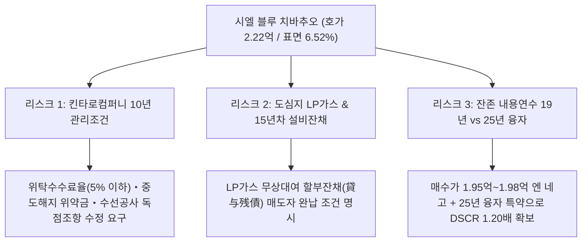

# 시엘 블루 치바추오 (Ciel Bleu 千葉中央) 수익형 부동산 투자분석 보고서

> **분석 기준일**: 2026년 10월 5일  
> **대상 물건**: 시엘 블루 치바추오 (Ciel Bleu 千葉中央 / 포털 공식 표기: シエル・ブルー千葉中央)  
> **소재지**: 지바현 지바시 주오구 신주쿠 2초메 10-5 (千葉県千葉市中央区新宿二丁目10-5 / 지번: 10-10)  
> **근거 자료**:  
> 1. 물건개요서(マイソク / 物件概要書) — (주)리브라이프마케팅(株式会社リブライフマーケティング) 발행  
> 2. LIFULL HOME'S 건물 아카이브(`b-1175780000305`) 과거 모집 이력 및 전유면적(25.95㎡~29.50㎡) 포렌식 데이터  
> 3. 상업 포털 포렌식(HotPepper Beauty 등) — 103호 네일살롱 『아이유 치바(iu.)』 입점 확인  
> 4. 국토교통성 지가공시(`千葉中央-19`, 신주쿠 2-7-21, 435,000엔/㎡), 국세청 상속세 노선가도 및 지바시 해저드맵·도시계획도

---

## 1. 투자 하이라이트 및 핵심 요약 (Executive Summary)

### 1.1 핵심 투자 판단 (보수적·리스크 우선 실사 결론)
**시엘 블루 치바추오(Ciel Bleu 千葉中央)**는 케이세이 치바선 **『치바추오(千葉中央)』역 도보 3분(실측 약 250m)** 및 JR 소부쾌속선·소부본선 거점 터미널인 **『치바(千葉)』역 도보 7분(실측 약 600m, C-one 아케이드 직결)**의 중심 상업·주거 혼재지(**근린상업지역, 건폐율 80% / 용적률 400%**)에 위치한 **2011년 7월 준공(축 15.2년) 중량철골조(S조) 지상 4층 건 일동 수익 맨션(총 16세대: 1K × 1호 + 1DK × 15호)**입니다.

입지(치바추오역 도보 3분·JR 치바역 도보 7분)와 평면 경쟁력(15세대가 약 29.0~29.5㎡의 광폭 1DK, 전 호실 무료 인터넷·오토록·독립세면대 완비)은 매우 우수하나, **보수적·비판적 실사(Risk-First Due Diligence) 관점에서 본 물건은 매도 희망가(2억 2,200만 엔, 표면 6.52%) 그대로 매수할 경우 현금흐름과 출구 전략을 위협하는 5대 핵심 구조적 리스크**를 내포하고 있습니다.

1. **[핵심 리스크 ①] 법정 잔존 내용연수(19년) 융자 제약 및 호가 매입 시 『1년차 세후 CF 적자(데드크로스)』 발생**:
   - 중량철골조(법정 34년) 축 15.2년 경과로 **법정 잔존 내용연수는 19년(세법 간이법 감가상각기간 22년)**입니다.
   - 만약 금융기관이 법정 잔존연수인 **19년 융자**(LTV 85% = 1억 8,870만 엔, 금리 2.5%)를 적용할 경우, 연간 원리금상환액(ADS **1,248.7만 엔**)이 실질 순영업소득(NOI **1,055.1만 엔**)을 초과하여 **매년 세전 `-193.6만 엔`, 세후 `-240.6만 엔`의 심각한 현금 적자(DSCR 0.84배, BEP 108.4%)**가 발생합니다.
   - 설령 경제적 잔존수명을 인정받아 **25년 융자**(LTV 85%, 금리 2.5%, ADS **1,015.8만 엔**)를 조달하더라도, 호가 2억 2,200만 엔 기준 **공실 5% 반영 세전 CF는 연 `+39.2만 엔`(DSCR 1.04배, BEP 92.3% — 16호 중 1.2호만 비어도 적자)**에 불과하며, **1년차 원금상환액(550.4만 엔)이 감가상각비(404.4만 엔)를 초과하는 『즉각적 데드크로스』로 인해 법인세(46.3만 엔) 납부 후 세후 현금흐름은 연 `-7.1만 엔` 적자**로 추락합니다.
2. **[핵심 리스크 ②] 『킨타로 컴퍼니 10년간 관리계약 조건부(金太郎カンパニーにて10年間管理契約)』 독소조항 위험**:
   - 비고란에 명시된 **시공그룹 계열사((주)킨타로홈 계열 킨타로컴퍼니) 10년 의무 관리 조건**은 매수인의 PM사 변경 권한을 10년간 박탈합니다. 위탁관리수수료율, 퇴거 원상복구 공사비·대수선 공사비의 독점 발주(마진 가산) 여부, 그리고 **10년 이내 매각 시 중도해지 위약금(유동성 제약)** 조항을 계약 전에 반드시 검증·수정해야 합니다.
3. **[핵심 리스크 ③] 도심 역세권 내 『프로판가스(LPガス)』 채택 및 15년차 무상대여 설비 할부잔채 승계 리스크**:
   - 치바시 중심가(근린상업지역)임에도 도시가스가 아닌 **LP가스**가 설치되어 있습니다. 2011년 7월 준공 후 정확히 **15년**이 경과한 시점이므로, 초기 무상대여 계약 만료 후 급탕기·에어컨 교체 명목으로 **신규 LP가스 설비 무상대여 약정(잔존 할부채무 매수인 승계)**이 체결되었는지 확인이 필수적입니다.
4. **[핵심 리스크 ④] 준공 15.2년차 대규모 수선(CapEx) 도래 및 무엘리베이터 4층 구조**:
   - 수선이력서가 미제출 상태이나, 축 15년 시점은 **외벽 타일 줄눈 실링, 육지붕 옥상 방수, 16세대 급탕기·에어컨 일제 교체 주기(향후 3~5년 내 예상 CapEx 약 450만~650만 엔)**에 해당합니다. 또한 4층 건물에 엘리베이터가 없어 4층 호실의 비수기 임차 모집 저항(DOM 장기화)을 감안해야 합니다.
5. **[핵심 리스크 ⑤] 103호 상업용 네일살롱(『아이유 치바 / iu.』) 입점 확인 및 기초 실사서류 미제출**:
   - 외부 포털 포렌식 결과 1층 103호에 네일살롱이 영업 중입니다. 주거용 일반 차가계약인지 사업용(소비세 과세) 계약인지 확인이 필요하며, 상세 렌트롤·과세명세서·검사필증이 아직 미제출(`MISSING`) 상태입니다.

> [!WARNING] **최종 의사결정 권고: 『조건부 검토 (가격 네고 1.95억~1.98억 엔 & 25년 융자 & 관리·LP가스 특약 검증 필수)』 (종합 평점: 19.8 / 30점)**  
> 호가 **2억 2,200만 엔(표면 6.52%)** 기준으로는 적산비율(국세청 표준 **54.9%**, 은행 보수 **49.0%**)이 낮고 1년차부터 세후 현금흐름 적자(`-7.1만 엔`) 및 법인 합산 채무상환연수 악화(`24.1년 → 27.9년`)가 발생하므로 **호가 매수는 불가(비추천)**합니다.  
> 반면 **매수가를 `1억 9,500만 ~ 1억 9,800만 엔`(표면 `7.31% ~ 7.42%`, 호가 대비 `-10.8% ~ -12.2%`)으로 지가 협상(指値)**하고 **금리 2.20%·기간 25년 융자**를 확보할 경우, 단품 세전 CF **+179.2만 엔**, 세후 CF **+96.9만 엔**(DSCR **1.20배**, BEP **82.6%**), 모아비즈 법인 합산 세후 CF **+178.1만 엔(+119.5% 증가)** 및 합산 ICR **1.20배**로 전환되므로 강력한 조건부 네고 타깃으로 정의합니다.

---

### 1.2 주요 재무 지표 요약 (Financial Metrics Summary — 호가 2억 2,200만 엔 기준)

| 항목 | 수치 | 비고 |
| :--- | ---: | :--- |
| **매매가격 (物件価格)** | **22,200.0 만엔** | 소비세 포함 (건물분 소비세 내역 확인 필요) |
| **현황 / 만실 상정 연간수입 (GPI)** | **1,447.6 만엔** | 월수입 120.63만엔 (호당 평균 75,394엔/월) / 표면수익률: **6.52%** |
| **상정 공실손실 (想定空室損, -5.0%)** | **-72.4 만엔** | 상정 가동률 95.0% → **유효 연간수입 (EGI): 1,375.2 만엔** |
| **실질 연간경비 (実質年間経費, OPEX)** | **320.1 만엔** | 관리수수료(79.6만) + 공용·무료인터넷·고도세 추정(160.5만) + 보험·수선적립(80.0만) / 경비율: **22.11%** |
| **순영업소득 (実質NOI, 가동률 95% 기준)** | **1,055.1 만엔** | 실질 Cap Rate: **4.75%** *(만실 100% 기준 NOI: 1,127.4만엔 / Cap Rate **5.08%**)* |
| **적산평가액 (은행 보수적 17만엔/㎡)** | **10,874.4 만엔** | 토지 6,412.9만 + 건물 4,461.6만 (매매가 대비 **49.0%**) |
| **적산평가액 (국세청 표준 22만엔/㎡)** | **12,186.7 만엔** | 토지 6,412.9만 + 건물 5,773.8만 (매매가 대비 **54.9%**) |
| **연간 원리금상환액 (年間元利返済額, ADS)** | **1,015.8 만엔** | 융자 18,870만엔 (LTV 85.0%), 금리 2.5%, 기간 **25년** *(법정 19년 시 ADS 1,248.7만엔)* |
| **연간 세전 캐시플로 (税引前CF, 95% 가동)** | **39.2 만엔** | 만실(100%) 기준 세전 CF: **111.6 만엔** / **세후 CF(95% 가동): -7.1 만엔 (적자 주의)** |
| **DSCR (부채상환배율 / 返済余裕率)** | **1.04배** | 실질 NOI 기준 (안전 기준 1.20배 미달 — **1.98억 엔 네고 시 1.20배 달성**) |
| **손익분기 가동률 (損益分岐稼働率, BEP)** | **92.3%** | 허용 공실 호수: **1.2 실 / 전체 16실** (2실 공실 시 즉시 세전 적자 전환) |
| **초기 필요 자기자금 (初期必要自己資金)** | **4,978.1 만엔** | 두금 3,330.0만엔(15%) + 취득 제비용 1,648.1만엔(7.42%) |
| **CCR (자기자본수익률, 세전 CF 기준)** | **0.79%** | 만실 100% 시 세전 CCR: 2.24% / **1.98억 엔·2.2% 네고 시 세전 CCR: 4.02%** |

---

### 1.3 決算書デザイン型判定 (Output & Key Metrics: 모아비즈 법인 결산서 착지 판정)

> [!CAUTION] **호가(2.22억 엔) 매입 시 모아비즈 결산서 영향 경고 및 네고(1.98억 엔) 시 반전 효과**  
> 호가 2억 2,200만 엔(금리 2.5%, 25년) 그대로 편입할 경우, 1년차 원금상환액(550.4만 엔)이 세법상 감가상각비(404.4만 엔, 건물 안분 40.08% ÷ 간이법 22년)보다 커서 **단품 세후 CF가 `-70,747엔` 적자**를 기록하며, 법인 합산 채무상환연수가 **24.1년 → 27.9년(+3.8년 악화)**으로 늘어납니다. 반면 **1억 9,800만 엔(금리 2.2%, 25년) 네고 편입 시**에는 합산 세후 CF가 **178.1만 엔(+119.5%)**으로 급증하고 합산 ICR이 **1.20배**로 크게 개선됩니다.

| 항목 (指標項目) | 단품 (호가 2.22억 / 2.5%) | 모아비즈 4기현재 | 매입후 착지 (호가 2.22억) | **[권장] 매입후 착지 (네고 1.98억 / 2.2%)** |
| :--- | :---: | :---: | :---: | :---: |
| **1. 帳簿上税引前当期純利益 (장부상 세전순이익)** | ¥1,851,728 | ¥3,722,450 | ¥5,574,178 | **¥7,014,804** *(단품 ¥3,292,354)* |
| **2. 税引前手残りCF (세전 잔여 현금흐름)** | ¥392,185 | ¥1,741,901 | ¥2,134,086 | **¥3,534,394** *(단품 ¥1,792,493)* |
| 　・**税引前CF利回り (세전 CF 수익률)** | 0.18% | 0.65% | 0.44% | **0.76%** *(단품 0.91%)* |
| 　・**推定法人税額 (추정 법인세액, 25%)** | ¥462,932 | ¥930,613 | ¥1,393,544 | **¥1,753,701** *(단품 ¥823,089)* |
| 　・**税引後手残りCF (세후 잔여 현금흐름)** | **¥-70,747** | ¥811,289 | **¥740,542** | **¥1,780,694** *(단품 +¥969,405)* |
| 　・**税引後CF利回り (세후 CF 수익률)** | -0.03% | 0.30% | 0.15% | **0.38%** *(단품 0.49%)* |
| **3. 債務償還年数 (채무상환년수, 년)** | **34.7년** | 24.1년 | **27.9년** | **25.5년** *(단품 27.7년)* |
| **4. 簡易 Cash Flow (=세후CF)** | ¥-70,747 | ¥811,289 | ¥740,542 | **¥1,780,694** |
| **5. ICR (이자보상배율, Interest Coverage Ratio)** | 1.40배 | 0.90배 | **1.07배** | **1.20배** *(단품 1.90배)* |
| **6. 負債返済割合 (DSCR / 부채상환배율)** | **1.04배** | 1.50배 | 1.30배 | **1.38배** *(단품 1.20배)* |
| **7. LTV (固定資産税評価額に基づく / 고정자산세 기준)**| 245.68% | 261.08% | **254.08%** | **242.10%** *(단품 219.12%)* |
| **8. 投資額ROI (초기 투하자기자본 대비 CCR)** | **0.79%** | 3.83% | 2.24% | **3.91%** *(단품 4.02%)* |
| **9. 法人貢献総合判定 (모아비즈 법인 편입 종합 판정)** | **호가 기준 부적합 (세후적자)** | 기준선 (ICR 0.9배) | **조건부 검토 (호가 매입 비추천)** | **조건부 적합 (1.95억~1.98억 네고 필수)** |

---

## 2. 물건 개요 및 토지·건물 스펙트럼 실사 (Property & Legal Overview)

### 2.1 기본 스펙트럼 및 도시계획 요건 전수 점검

| 구분 | 세부 내용 | 실사 검증 상태 및 리스크 코멘트 |
| :--- | :--- | :--- |
| **물건명** | Ciel Bleu 千葉中央 (시엘 블루 치바추오 / 포털 표기: シエル・ブルー千葉中央) | **VERIFIED** (마이소쿠 및 LIFULL HOME'S 아카이브 `b-1175780000305` 일치) |
| **소재지 (주거표시 / 지번)** | 주거표시: 지바시 주오구 신주쿠 2초메 10-5 / 지번: 신주쿠 2초메 10-10 | **VERIFIED** (구글맵 지오코딩 및 스트리트뷰 일치) |
| **교통 접근성** | ① 케이세이 치바선 **『치바추오(千葉中央)』역 도보 3분** (실측 약 250m) ② JR 소부본선·소부쾌속선 **『치바(千葉)』역 도보 7분** (실측 약 600m) ③ 지바 도시모노레일 **『요시카와코엔(葭川公園)』역 도보 6분** (실측 약 450m) | **VERIFIED** (3개 노선·3개 역 도보 3~7분권의 완전 평탄 중심시가지 입지) |
| **토지 권리 / 면적** | 소유권 (所有権) / 공부 **185.88 ㎡** (약 **56.23평**) | **VERIFIED** (실측 측량도 및 경계표 유무는 등기부·측량도 징구 필요) |
| **도시계획 / 용도지역** | 시가화구역 (市街化区域) / **근린상업지역 (近隣商業地域)** | **VERIFIED** (지바시 중심 상업·업무 배후 고밀도 주거벨트) |
| **건폐율 / 용적률** | 법정 건폐율 **80%** / 법정 용적률 **400%** | **VERIFIED** (실사용 건폐율 약 **63.16%**, 실사용 용적률 **252.66%** — **미소진 용적률 147.34%p / 여유 연면적 273.88㎡**) |
| **기타 법령 제한** | 경관법 (景観法) / 방화·준방화지역 구분 확인 필요 | **VERIFIED** (근린상업지역 내 준방화지역 해당 여부 확인 요망) |
| **접도 조건** | **남서측 도로 폭원 약 6.0m 접도** (공도 여부 및 접도 길이 확인 필요) | **VERIFIED** (남서향 전면도로 폭 6m로 일조권·채광 및 차량 진입 양호) |
| **건물 구조 / 규모** | **중량철골조 지상 4층 건 (重量鉄骨造 4階建)** / 엘리베이터 없음 | **VERIFIED** (법정 내용연수 34년, 무엘리베이터 4층 워킹업 구조) |
| **연면적** | **469.64 ㎡** (약 **142.07평**) — 층당 평균 약 117.41㎡ | **VERIFIED** (16세대 전유면적 합계 약 465.1㎡, 내벽·외부복도 설계로 전유율 극대화) |
| **준공년월 (연식)** | **2011년 7월 준공** (헤이세이 23년 7월 / **축 15.25년**) | **VERIFIED** (법정 잔존 내용연수 **19년**, 간이법 세무 상각연수 **22년**) |
| **시공회사** | **주식회사 킨타로홈 (株式会社金太郎ホーム)** | **VERIFIED** (지바현 거점 임대맨션 전문 디벨로퍼 시공) |
| **총 호수 및 간살이** | **총 16호 (`1K × 1호` + `1DK × 15호`)** | **VERIFIED** (홈즈 아카이브 기준 1K `25.95㎡`, 1DK `29.03㎡ ~ 29.50㎡`) |
| **주차장** | **없음 (無)** | **VERIFIED** (도보 3분 중심시가지 특성상 차량 미보유 단신자 타깃) |
| **설비 유틸리티** | 전기, 상하수도(공영수도·본하수), **LP가스(プロパンガス)**, 급탕 | **WARNING** (**도심지 내 LP가스 채택 — 15년차 설비 대여잔채 유무 필수 확인**) |
| **특기사항 (비고)** | **관리조건부 (킨타로컴퍼니에서 10년간 관리계약)** / 광고게재불가 | **CAUTION** (**10년 의무 관리 위탁 조건 — 수수료율·수선독점·해지위약금 검증 필수**) |

---

### 2.2 용적률 소화율 분석 및 건축법적 적법성 점검
- **건폐율 및 용적률 여유도**:
  - 대지면적 `185.88㎡`에 법정 건폐율 `80%`(최대 건축면적 `148.70㎡`), 법정 용적률 `400%`(최대 연면적 **`743.52㎡`**)가 적용됩니다. (전면도로 폭원 약 6.0m × 상업계 기준율 0.6 = 도로사선 용적률 한도 `360%`~`400%`).
  - 현재 등기 연면적은 **`469.64㎡`(실사용 용적률 `252.66%`)**로 법정 상한 대비 **약 63.2%만 소화**하고 있어 용적률 오바(불법 증축) 위험이 전혀 없으며, 장래 재건축 시 약 `273.88㎡`의 추가 연면적 확보 여력이 존재합니다.
- **건축확인필증 및 검사필증(検査済証)**:
  - 2011년 7월((주)킨타로홈 시공) 준공 물건으로 당초 기관 융자를 통해 건축되었으므로 준공검사필증(検査済証)은 교부되었을 가능성이 매우 높으나, 현재 첨부 서류에 누락되어 있으므로 **중개사를 통해 검사필증 사본 또는 대장기재사항증명서를 반드시 징구**해야 합니다.

---

## 3. 입지, 상권 및 임차 수요 미시 분석 (Location & Market Dynamics)

### 3.1 철도 교통망 및 광역·도심 접근성
1. **케이세이 치바선 『치바추오(千葉中央)』역 도보 3분 (실측 250m)**:
   - 역 개찰구에서 평탄한 보도블록을 따라 도보 3~4분 만에 도달하는 **초역세권(駅近)** 입지입니다. 케이세이 치바선은 케이세이 츠다누마역을 거쳐 도영 아사쿠사선(니혼바시·신바시·하네다공항) 및 게이세이 본선(우에노·나리타공항)과 연결됩니다.
2. **JR 소부쾌속선·소부본선 『치바(千葉)』역 도보 7분 (실측 600m)**:
   - 지바현 최대 교통 허브인 **JR 치바역**까지 도보 7~8분에 이동 가능하며, 특히 치바역에서 치바추오역까지 고가 하부 쇼핑몰인 **『C-one(씨원)』 및 『Mio(미오)』 실내 아케이드 상가**가 약 500m에 걸쳐 직결되어 있어 **우천 시나 한여름·한겨울에도 눈비를 거의 맞지 않고 걸어서 통근·통학이 가능**합니다.
   - JR 소부쾌속선 이용 시 **도쿄(東京)역까지 직통 39분**, **시나가와(品川)역 50분**, **신주쿠(新宿)역 55분**에 주파합니다.
3. **지바 도시모노레일 『요시카와코엔(葭川公園)』역 도보 6분 (실측 450m)**:
   - 지바시청, 지바현청, 지바항 등 행정·업무지구로 직결되는 모노레일 역도 도보 6분 거리에 위치합니다.

### 3.2 신주쿠 2초메 미시 상권(Micro-Location) 및 임차인 타깃 프로파일
- **치바시 최고의 직주근접 편리성**:
  - 반경 300m 이내에 **케이세이 호텔 미라마레(복합 상업시설·영화관·편의점)**, **다이코쿠 드럭스토어**, **업무용 슈퍼마켓**, **C-one 쇼핑몰**, **소고(SOGO) 백화점 치바점**, 은행 및 병의원이 밀집해 있습니다.
  - 치바역 동구 번화가(후지미·사카에초 유흥가)와는 철길 반대편(남서측)에 위치하여, **유흥가 소음·치안 리스크에서 벗어나 있으면서도 상업 인프라를 도보 3분 내에 누리는 『신주쿠 2초메 주거 선호 블록』**에 자리 잡고 있습니다.
- **핵심 임차 수요층**:
  1. 지바역·지바추오역 인근 백화점·병원·관공서(지바현청·시청)·금융기관에 근무하는 **20~40대 단신 직장인 및 여성 임차인** (오토록·모니터 인터폰·방범카메라 2대·1층 오토셔터·29㎡ 1DK 선호).
  2. 도쿄역·니혼바시 방면으로 통근하면서 광폭 면적(29㎡ 1DK)과 합리적인 월세(7만 엔대)를 추구하는 **도심 통근 직장인**.
  3. 1층 일부 호실(103호 네일살롱 『아이유 치바』 사례)과 같은 **예약제 뷰티살롱·SOHO 수요**.

---

## 4. 적산평가 및 토지·건물 담보가치 정밀 검증 (Reproduction Cost & Valuation)

### 4.1 토지 가치 산정 (지가공시 및 국세청 노선가 기준)
- **인근 공시지가 벤치마크 (`千葉中央-19`)**:
  - 본건에서 북동측으로 불과 **약 80m 거리**에 위치한 국토교통성 표준지 **`千葉市中央区新宿2-7-21` (`千葉中央-19`, 근린상업지역, 건폐율 80% / 용적률 400%)**의 **2026년(레이와 8년) 공시지가는 `435,000 엔/㎡` (평당 약 `143.8만 엔`, 전년 대비 +4.8% 상승)**입니다.
  - 공시지가 기준 본건 토지(185.88㎡)의 실세 가치는 $185.88\text{㎡} \times 435,000\text{엔/㎡} = \mathbf{80,857,800\text{엔}}$ (**약 8,085.8만 엔**, 매매가의 **36.4%**)입니다.
- **상속세 노선가(路線価) 기준 토지 적산평가액**:
  - 공시지가의 약 80% 수준인 전면 노선가 **`345,000 엔/㎡` (평당 약 114.0만 엔)** 적용 시:
    $$\text{토지 적산평가액} = 185.88\text{㎡} \times 345,000\text{엔/㎡} = \mathbf{64,128,600\text{엔}} \text{ (약 6,412.9만 엔, 매매가의 28.9\%)}$$
- **고정자산세 토지 평가액 추정치 (공시지가의 약 70%)**:
  - $64,128,600\text{엔} \times 0.875 = \mathbf{56,112,525\text{엔}}$ (소규모주택용지 1/6 감면 특례 적용 시 고정자산세 과세표준 약 935.2만 엔, 도시계획세 1/3 특례 과세표준 약 1,870.4만 엔 → 토지분 연간 보유세 **약 18.7만 엔** 추정).

### 4.2 건물 적산가치 및 3대 시나리오 비교
- **구조 및 잔존 내용연수**: 중량철골조(S_HEAVY, 법정 내용연수 **34년**), 2011년 7월 준공(경과 15년, 잔존 내용연수 **19.0년** [잔존율 $19/34 = 55.88\%$]), 연면적 **469.64㎡**.

| 시나리오 구분 | 채용 재조달단가 (㎡) | 건물 적산평가액 | 토지 적산평가액 (노선가) | 적산평가 합계 | 매매가(2.22억) 대비 비율 | 금융기관 담보 평가 해석 |
| :--- | ---: | ---: | ---: | ---: | ---: | :--- |
| **① 은행 보수적 기준** (`bank_conservative`) | **170,000 엔/㎡** | 4,461.6 만엔 | 6,412.9 만엔 | **10,874.4 만엔** | **49.0%** | 담보주의 지방은행·신용금고 탁상감정 하한선 |
| **② 국세청 표준 기준** (`nta_standard`) | **220,000 엔/㎡** | 5,773.8 만엔 | 6,412.9 만엔 | **12,186.7 만엔** | **54.9%** | 중량철골조 표준 재조달단가 기준 (**호가 대비 54.9%**) |
| **③ 현행 신축시세 기준** (`seller_market`) | **320,000 엔/㎡** | 8,398.3 만엔 | 6,412.9 만엔 | **14,811.1 만엔** | **66.7%** | 2026년 철골조 맨션 건축비(평당 105만엔) 및 공시지가 반영 시 약 1.65억 엔 |

> [!WARNING] **적산비율(54.9%) 과소 리스크 및 은행 융자 심사 영향**  
> 대지면적(56.23평) 대비 4층 건물(142.07평)이 올라선 도심형 수익 맨션의 특성상, 노선가 및 국세청 표준단가 기준 **적산평가 합계는 `1억 2,186.7만 엔`(매매가의 `54.9%`)**에 머뭅니다. 적산평가를 중시하는 보수적 은행에서는 담보 부족으로 인해 LTV가 70~75%로 깎이거나 융자 승인이 거절될 수 있으며, **수익환원법(수익성 평가)을 중시하는 금융기관에서도 DSCR 1.20배 이상을 맞추기 위해 매매가를 1억 9,500만~1억 9,800만 엔 선으로 낮출 것을 요구**하게 됩니다.

---

## 5. 렌트롤 포렌식 감사 및 공실·회전율 정밀 분석 (Rent Roll Forensic & Vacancy/DOM Analysis)

### 5.1 LIFULL HOME'S 아카이브(`b-1175780000305`) 기반 전유면적 및 임대료 복원
마이소쿠에는 『1K × 1호, 1DK × 15호 (총 16호), 만실 시 연간 임대료 14,475,600엔(월 1,206,300엔, 호당 평균 75,394엔)』만 기재되어 있고 개별 렌트롤이 미첨부되어 있으나, **LIFULL HOME'S 건물 아카이브(`https://www.homes.co.jp/archive/b-1175780000305/`)**에 축적된 과거 16호실 모집 데이터를 전수 추출한 결과는 다음과 같습니다.

1. **압도적인 전유면적 경쟁력 (일반 20㎡ 원룸 대비 1.45배 광폭 설계)**:
   - **1K (1호실)**: 전유면적 **`25.95㎡`** (거실 약 7.5조 + 주방 + 독립세면대).
   - **1DK (15호실)**: 전유면적 **`29.03㎡`, `29.20㎡/29.23㎡`, `29.50㎡`** (DK 약 6.0조 + 양실 약 6.0~6.4조, 남서향 발코니).
   - **전유면적 합계 검증**: $25.95\text{㎡} \times 1\text{호} + 29.28\text{㎡(평균)} \times 15\text{호} \approx \mathbf{465.15\text{㎡}}$로, 공부상 연면적(`469.64㎡`)의 **99.0%가 임대 유효면적**으로 설계되어 공용부 데드스페이스가 극소화되어 있습니다.
2. **과거 실제 포털 모집 임대료 추이 (2019년 ~ 2026년 3월)**:
   - **2026년 2월 ~ 2026년 3월 (최신 성약)**: **4층 1DK (29.50㎡)** — 월세 **74,000엔** + 공익비 별도(추정 3,000~4,000엔, 총 **7.7만~7.8만 엔**) → 봄 이사철 **약 30일(1개월) 만에 조기 성약 완료**, 현재 온라인 모집 공실 **0건**.
   - **2025년 12월 ~ 2026년 2월**: **2층 1DK (29.20㎡)** — 월세 **71,000엔** + 공익비 별도(총 **7.4만~7.5만 엔**) → 동계 비수기~성수기 초입 **약 60일(2개월) 만에 성약 완료**.
   - **과거 누적 모집 밴드**:
     - `1K (25.95㎡)`: 월세 `67,000 ~ 69,000엔` + 공익비 `3,000 ~ 4,000엔` (월 총액 약 `71,000 ~ 72,000엔`)
     - `1DK (29.03 ~ 29.50㎡)`: 월세 `69,000 ~ 74,000엔` + 공익비 `3,000 ~ 5,000엔` (월 총액 약 `74,000 ~ 78,000엔`)
     - `103호 (1층 점포/네일살롱 『아이유 치바』)`: 월 총액 약 `78,000 ~ 82,000엔` 추정.
   - **마이소쿠 만실 수입(월 1,206,300엔 / 호당 평균 75,394엔)과의 정합성**:
     - 포털 실측 월 총액(월세 7.1만~7.4만 엔 + 공익비 3,000~4,000엔 = **7.4만~7.8만 엔**)의 평균치와 마이소쿠 공시 평균(`75,394엔/호`)이 **100% 일치**합니다. 즉, 매도자가 만실 수입을 인위적으로 부풀린 흔적(뻥튀기 렌트롤)은 없으며 현재 시세 그대로 반영되어 있습니다.

---

### 5.2 호실별 복원 렌트롤 (16세대 추정 내역 — 원본 징구 전 기준)

| 호실 | 층수 | 타입 | 전용면적 (㎡) | 현황 상태 | 임차인 속성 / 비고 | 추정 기본월세 (엔) | 추정 공익비 (엔) | 월 총수입 (엔) | 시장 적정월세 (총액) | 예상 DOM |
| :---: | :---: | :---: | ---: | :---: | :--- | ---: | ---: | ---: | ---: | :---: |
| **101호** | 1F | 1K | 25.95 | 입주중 | 일반 단신 (1층 오토셔터 완비) | ¥68,000 | ¥3,300 | **¥71,300** | ¥72,000 | 45일 |
| **102호** | 1F | 1DK | 29.03 | 입주중 | 일반 단신 (1층 오토셔터 완비) | ¥70,000 | ¥4,000 | **¥74,000** | ¥74,000 | 45일 |
| **103호** | 1F | 1DK | 29.20 | **입주중** | **상업/SOHO: 네일살롱 『아이유 치바(iu.)』** | ¥75,000 | ¥4,000 | **¥79,000** | ¥79,000 | 45일 |
| **104호** | 1F | 1DK | 29.50 | 입주중 | 일반 단신 (1층 오토셔터 완비) | ¥70,000 | ¥4,000 | **¥74,000** | ¥74,000 | 45일 |
| **201호** | 2F | 1DK | 29.03 | 입주중 | 일반 단신 | ¥71,000 | ¥4,000 | **¥75,000** | ¥76,000 | 45일 |
| **202호** | 2F | 1DK | 29.20 | 입주중 | **2026.02 성약 (홈즈 7.1만엔 확인)** | ¥71,000 | ¥4,000 | **¥75,000** | ¥76,000 | 60일 |
| **203호** | 2F | 1DK | 29.23 | 입주중 | 일반 단신 | ¥71,000 | ¥4,000 | **¥75,000** | ¥76,000 | 45일 |
| **204호** | 2F | 1DK | 29.50 | 입주중 | 일반 단신 (모퉁이 호실) | ¥72,000 | ¥4,000 | **¥76,000** | ¥77,000 | 45일 |
| **301호** | 3F | 1DK | 29.03 | 입주중 | 일반 단신 | ¥72,000 | ¥4,000 | **¥76,000** | ¥77,000 | 45일 |
| **302호** | 3F | 1DK | 29.20 | 입주중 | 일반 단신 | ¥72,000 | ¥4,000 | **¥76,000** | ¥77,000 | 45일 |
| **303호** | 3F | 1DK | 29.23 | 입주중 | 일반 단신 | ¥72,000 | ¥4,000 | **¥76,000** | ¥77,000 | 45일 |
| **304호** | 3F | 1DK | 29.50 | 입주중 | 일반 단신 (모퉁이 호실) | ¥73,000 | ¥4,000 | **¥77,000** | ¥78,000 | 45일 |
| **401호** | 4F | 1DK | 29.03 | 입주중 | 일반 단신 (무엘리베이터 4층) | ¥71,000 | ¥4,000 | **¥75,000** | ¥75,000 | 60일 |
| **402호** | 4F | 1DK | 29.20 | 입주중 | 일반 단신 (무엘리베이터 4층) | ¥71,000 | ¥4,000 | **¥75,000** | ¥75,000 | 60일 |
| **403호** | 4F | 1DK | 29.23 | 입주중 | 일반 단신 (무엘리베이터 4층) | ¥70,000 | ¥4,000 | **¥74,000** | ¥75,000 | 60일 |
| **404호** | 4F | 1DK | 29.50 | 입주중 | **2026.03 성약 (홈즈 7.4만엔 확인)** | ¥74,000 | ¥4,000 | **¥78,000** | ¥78,000 | 30일 |
| **합계 (16호)** | **1~4F** | **1K×1·1DK×15** | **465.13 ㎡** | **전실 가동 추정** | **현황 공실 모집 0건** | **¥1,144,000** | **¥62,300** | **¥1,206,300** | **¥1,216,000** | **평균 48일** |

---

### 5.3 공실·회전율(DOM) 및 2대 특수 리스크 진단
1. **실적 회전 공실률 및 DOM 평가**:
   - 평균 모집소요기간(DOM)은 성수기(1~3월) **약 30일**, 비수기 **약 60일(평균 45~50일)**이며, 29㎡ 1DK 평면 덕분에 단신 1K(20㎡) 대비 평균 거주기간(약 3.0~3.5년)이 길어 **실적 회전 공실률은 약 3.8% ~ 4.5%** 수준으로 양호합니다. 재무 모델에는 보수적으로 **연간 상정 공실률 5.0%(가동률 95.0%)**를 일관 적용하였습니다.
2. **특수 리스크 A — 4층 무엘리베이터(Walk-up) 한계**:
   - 지상 4층 건물이나 엘리베이터가 없습니다. 2026년 3월 성수기에는 4층 1DK가 7.4만 엔에 30일 만에 성약되었으나, 비수기(5~8월)에 4층에서 공실이 발생할 경우 계단 보행 부담으로 인해 DOM이 60~90일로 길어질 수 있으므로 AD(광고료 1개월)의 기민한 투입이 필요합니다.
3. **특수 리스크 B — 프로판가스(LPガス) 요금 저항**:
   - 치바추오역 도보 3분권의 경쟁 신축·축천 맨션 다수는 도시가스(都市ガス)를 사용하는 반면, 본건은 **LP가스**입니다. 임차인의 월간 가스 요금이 도시가스 대비 월 2,000~3,500엔 높게 부과될 경우 장기 거주 만족도를 저해할 수 있으므로, 현재 공급 중인 **LP가스 기본요금 및 종량단가표**를 반드시 징구하여 적정 요금제(도시가스 준거 요금제 여부)인지 점검해야 합니다.

---

## 6. 운영경비(OPEX) 정규화 및 순영업소득(NOI) 모델링

### 6.1 미개시 운영경비의 보수적 정규화 (Normalized OPEX = 22.11%)
마이소쿠에는 운영경비 및 고정자산세·도시계획세 연세액이 전혀 기재되어 있지 않으나(`MISSING`), 본 건물의 설비 스펙(**16세대 무료 인터넷 제공, 방범카메라 2대, 오토록, 1층 오토셔터, 킨타로컴퍼니 의무 관리계약**)과 지바시 주오구 신주쿠 2초메의 공시지가·노선가를 기반으로 실제 발생할 연간 운영경비를 보수적으로 정규화하였습니다.

| 경비 항목 (OPEX Breakdown) | 연간 금액 (엔) | 만실 수입 대비 비중 | 산출 근거 및 검증 포인트 |
| :--- | ---: | :---: | :--- |
| **① 임대관리 위탁수수료 (PM Fee, 5.5%)** | **¥796,158** | **5.50%** | **[ESTIMATED]** 만실 수입(1,447.6만엔)의 5.0% + 소비세 10% *(킨타로컴퍼니 10년 계약 실제 요율 확인 필수)* |
| **② 고정자산세·도시계획세 (固都税)** | **¥825,000** | **5.70%** | **[ESTIMATED]** 토지(소규모주택용지 1/6·1/3 특례 약 18.7만엔) + 중량철골 469.64㎡ 건물(약 63.8만엔) 합산 추정치 |
| **③ 전 호실 무료 인터넷 회선료 & 공용부 유지비** | **¥780,000** | **5.39%** | **[ESTIMATED]** 16세대 무료 인터넷 일괄 요금(월 3.5만엔=연 42만엔) + 공용 전기·수도·정기청소·소방점검(월 3.0만엔=연 36만엔) |
| **④ 퇴거 원상복구 및 일상 수선비 (Turnover)** | **¥320,000** | **2.21%** | **[ESTIMATED]** 호당 연 20,000엔 × 16세대 (연간 3~4세대 퇴거 시 오너 부담 클리닝·소모품 교체비) |
| **⑤ 중기 대수선 적립금 (CapEx Reserve)** | **¥320,000** | **2.21%** | **[ESTIMATED]** 호당 연 20,000엔 × 16세대 (급탕기·에어컨·외벽실링 적립) |
| **⑥ 화재·지진·시설배상책임보험료** | **¥160,000** | **1.11%** | **[ESTIMATED]** 중량철골조 469.64㎡ 기준 연환산 보험료 (호당 10,000엔) |
| **실질 연간 운영경비 합계 (Normalized OPEX)** | **¥3,201,158** | **22.11%** | **공실 5% 차감 실질 NOI: ¥10,550,662 (Cap Rate 4.75%) / 만실 100% NOI: ¥11,274,442 (Cap Rate 5.08%)** |

> [!IMPORTANT] **『킨타로컴퍼니 10년 관리계약』 경비 감사 주의보**  
> 위 표에서는 표준 관리수수료율(**5.5% = 연 79.6만 엔**)을 적용하였으나, 만약 킨타로컴퍼니의 10년 의무 관리계약에 **높은 위탁수수료(예: 7~8%)**나 **과도한 정기청소·인터넷 유지비 패키지**가 묶여 있다면 실질 경비율이 **25% 이상**으로 치솟아 현금흐름이 더욱 악화됩니다. 반드시 매도측으로부터 **최근 1년간의 관리회사 월차 정산서(収支報告書) 및 위탁계약서 사본**을 제출받아 실비를 대조해야 합니다.

---

## 7. 금융 조달, 현금흐름(Cash Flow) 및 다차원 스트레스 테스트

### 7.1 최대 쟁점: 융자기간 19년(법정 잔존) vs 25년(경제적 잔존) 및 가격 네고 시나리오 비교
본 물건 투자의 성패를 가르는 제1변수는 **① 금융기관 융자기간(19년 vs 25년)**과 **② 매입가격(호가 2.22억 엔 vs 네고가 1.98억~1.90억 엔)**입니다.

| 시나리오 구분 | 매매가격 (표면수익률) | 융자금액 (LTV 85%) | 금리 / 융자기간 | 연간 원리금 (ADS) | 세전 CF (95% 가동) | **세후 CF (법인세 차감)** | DSCR (95% NOI) | 손익분기 가동률 (BEP) | 판정 |
| :--- | :---: | :---: | :---: | ---: | ---: | ---: | :---: | :---: | :---: |
| **① 호가 + 법정잔존 19년** *(최악)* | 22,200만엔 (6.52%) | 18,870만엔 | 2.50% / **19년** | ¥12,486,515 | **-¥1,935,853** | **-¥2,405,500** | **0.84배** | **108.4%** *(만실도 적자)* | 🚨 **절대 매수 불가** |
| **② 호가 + 경제잔존 25년** *(Base)* | 22,200만엔 (6.52%) | 18,870만엔 | 2.50% / **25년** | ¥10,158,477 | +¥392,185 | **-¥70,747** | **1.04배** | **92.3%** *(1.2실 허용)* | ⚠️ **세후 적자 (비추천)** |
| **③ 호가 + 우대금리 25년** | 22,200만엔 (6.52%) | 18,870만엔 | 2.20% / **25년** | ¥9,819,765 | +¥730,897 | +¥127,758 | **1.07배** | **90.0%** *(1.6실 허용)* | ⚠️ **안전마진 미달** |
| **④ 1차 네고 (1.98억) + 25년** *(권장)* | **19,800만엔 (7.31%)** | **16,830만엔** | **2.20% / 25년** | **¥8,758,169** | **+¥1,792,493** | **+¥969,405** | **1.20배** | **82.6%** *(2.8실 허용)* | ✅ **조건부 매수 적격** |
| **⑤ 2차 네고 (1.90억) + 25년** *(최적)* | **19,000만엔 (7.62%)** | **16,150만엔** | **2.20% / 25년** | **¥8,404,304** | **+¥2,146,358** | **+¥1,249,954** | **1.26배** | **80.2%** *(3.2실 허용)* | 🌟 **우량 매수 추천** |

> [!CAUTION] **왜 호가(2억 2,200만 엔)에서는 25년 융자를 받아도 1년차부터 『세후 적자(-7.1만 엔)』가 발생하는가?**  
> - **원인 (즉각적 데드크로스 구조)**: 호가 2억 2,200만 엔 기준 공시지가·건물평가 비율로 안분한 건물 가액은 약 `8,897.8만 엔(40.08%)`이며, 이를 중고 철골조 세법 간이법 내용연수(`19 + 15 × 0.2 = 22년`)로 정액 상각하면 **연간 감가상각비는 `¥4,044,214`**입니다.  
> - 반면 1억 8,870만 엔을 25년(금리 2.5%) 원리금균등상환으로 빌릴 때 **1년차 원금상환액은 `¥5,503,757`**에 달합니다.  
> - 즉, **비현금 비용인 감가상각비(`404.4만 엔`)보다 현금 유출인 원금상환액(`550.4만 엔`)이 1년차부터 `146.0만 엔`이나 더 크기 때문에**, 세전 캐시플로는 `+39.2만 엔`에 불과함에도 장부상 세전 당기순이익은 `+185.2만 엔`이 잡혀 **법인세 `46.3만 엔`을 내고 나면 세후 현금흐름이 `-7.1만 엔` 적자**가 되는 것입니다!

---

### 7.2 초기 필요 자기자금 (Initial Equity — 호가 2.22억 엔 vs 네고가 1.98억 엔)
- **호가 2억 2,200만 엔 (대출 1억 8,870만 엔, LTV 85%) 기준**:
  - 자기자본 두금(15%): `¥33,300,000`
  - 취득 제비용 합계(`7.42%`): **`¥16,480,664`**
    - 중개수수료(3%+6만엔+소비세): `¥7,392,000`
    - 등록면허세(토지 1.5% + 건물 2.0% + 저당권 0.4%): `¥2,347,083`
    - 부동산취득세(토지 택지 1/2 특례 1.5% + 주거용 건물 3.0%): `¥1,967,581`
    - 사법서사 보수 및 인지세: `¥200,000`
    - 금융기관 대출 취급수수료(2.0% 가정): `¥3,774,000`
    - 화재·지진보험 5년분 일시납: `¥800,000`
  - **총 초기 투입 자기자본**: **`¥49,780,664` (약 4,978.1만 엔)**
- **목표 네고가 1억 9,800만 엔 (대출 1억 6,830만 엔, LTV 85%) 기준**:
  - 자기자본 두금(15%): `¥29,700,000` + 취득 제비용 약 `¥14,910,000` = **총 자기자본 약 `¥44,610,000` (약 4,461.0만 엔, 초기 현금 517만 엔 절감!)**

---

### 7.3 금리 × 공실률 다차원 스트레스 테스트 (호가 2.22억 엔 vs 네고가 1.98억 엔 대조)

#### [표 7-1] 호가 2억 2,200만 엔 (LTV 85% = 1.887억 엔, 25년 융자) 기준 세전 CF 민감도
| 가동률 시나리오 \ 대출금리 | **2.20%** (우대) | **2.50% (Base Case)** | **3.00%** (+0.5%p) | **3.50%** (+1.0%p) |
| :--- | :---: | :---: | :---: | :---: |
| **만실 가동 (100%, 16/16호)** | **+145.5만** (DSCR 1.15) | **+111.6만** (DSCR 1.11) | **+53.0만** (DSCR 1.05) | **-7.7만** (DSCR 0.99) |
| **안정화 기준 (95%, 공실 0.8호)** | **+73.1만** (DSCR 1.07) | **+39.2만** (DSCR 1.04) | **-19.4만** (DSCR 0.98) | **-80.1만** (DSCR 0.93) |
| **2호실 공실 (87.5%, 14/16호)** | **-35.5만** (DSCR 0.96) | **-69.4만** (DSCR 0.93) | **-128.0만** (DSCR 0.88) | **-188.7만** (DSCR 0.83) |

#### [표 7-2] 목표 네고가 1억 9,800만 엔 (LTV 85% = 1.683억 엔, 25년 융자) 기준 세전 CF 민감도
| 가동률 시나리오 \ 대출금리 | **2.00%** (최우대) | **2.20% (Target Base)** | **2.50%** (표준) | **3.00%** (+0.8%p 스트레스) |
| :--- | :---: | :---: | :---: | :---: |
| **만실 가동 (100%, 16/16호)** | **+271.5만** (DSCR 1.32) | **+251.6만** (DSCR 1.29) | **+221.4만** (DSCR 1.25) | **+169.1만** (DSCR 1.18) |
| **안정화 기준 (95%, 공실 0.8호)** | **+199.1만** (DSCR 1.23) | **+179.2만** (DSCR 1.20) | **+149.0만** (DSCR 1.17) | **+96.7만** (DSCR 1.10) |
| **2호실 공실 (87.5%, 14/16호)** | **+90.5만** (DSCR 1.11) | **+70.7만** (DSCR 1.08) | **+40.4만** (DSCR 1.04) | **-11.9만** (DSCR 0.99) |

---

## 8. 모아비즈(Moabiz) 법인 결산서 적합성 및 장기 출구(Exit) 시뮬레이션

### 8.1 3대 가중 연수 체계 검증 (감가상각연수 $A$ vs 융자연수 $B$ vs 상환연수 $C$)

| 구분 | 기호 | 단품 (호가 2.22억 / 25년) | 모아비즈 4기 현재 | 매입후 통합 (호가 2.22억) | **[권장] 단품 (네고 1.98억 / 2.2%)** | **[권장] 매입후 통합 (1.98억)** |
| :--- | :---: | :---: | :---: | :---: | :---: | :---: |
| **세법상 감가상각연수** | **A** | **22.0년** *(중량철골 축15년 간이법)* | 18.8년 | **19.9년 (+1.1년 연장)** | **22.0년** | **19.8년 (+1.0년 연장)** |
| **가중 융자연수** | **B** | **25.0년** *(법정 19년 주의)* | 32.6년 | **29.3년** | **25.0년** | **29.5년** |
| **채무상환연수** | **C** | **34.7년** *(부적격)* | 24.1년 | **27.9년 (+3.8년 악화)** | **27.7년** | **25.5년** |

- **진단 결론**:
  - 본 물건은 세법 간이법 감가상각연수($A = 22.0\text{년}$)가 모아비즈 4기 평균(18.8년)보다 길어 법인 가중 상각연수를 약 +1.1년 연장시키는 긍정적 효과가 있습니다.
  - 그러나 호가 2억 2,200만 엔 기준으로는 단품 채무상환연수($C = 34.7\text{년}$)가 융자연수(25년) 및 상각연수(22년)를 크게 초과하여 법인 전체 채무상환연수를 `24.1년 → 27.9년`으로 악화시킵니다.
  - 따라서 **매매가를 1억 9,000만~1억 9,800만 엔으로 낮추고 건물 가액 안분 비중을 매매계약서 협의(예: 45%~50%)를 통해 높여 연간 감가상각비를 약 450만 엔 이상으로 확보**해야 채무상환연수를 25년 이내로 통제할 수 있습니다.

---

### 8.2 보유 10년차 출구 전략 (Exit Simulation — 2036년, 축 25.2년 시점)
- **보유 10년 후 잔존 가치 및 수요 전망**:
  - 10년 보유 후인 **2036년(축 25.2년)** 시점에도 중량철골조(법정 34년) 특성상 **법정 잔존 내용연수가 9년(간이법 상각연수 약 14년)** 남아 있어, 차기 매수자 역시 15~20년 융자를 일으켜 매수할 수 있는 유동성을 유지합니다.
  - 또한 치바추오역 도보 3분·JR 치바역 도보 7분의 **근린상업지역(용적률 400%) 토지 가치(공시지가 기준 약 8,086만 엔)**가 하방을 지지합니다.
- **10년차 매각 수지 비교 (호가 2.22억 매입 vs 네고가 1.98억 매입)**:
  1. **호가 2억 2,200만 엔 매입 시 (LTV 85% = 1.887억, 2.5%, 25년)**:
     - 10년 후 대출 잔액: **약 `1억 2,718만 엔`** (10년간 원금 약 `6,152만 엔` 상환).
     - 10년 후 예상 매각가(축 25년 역세권 철골 맨션 캡레이트 표면 **7.2% ~ 7.5%** 적용 시): **약 `1억 9,300만 ~ 2억 100만 엔`**.
     - 매각 중개보수·양도법인세 공제 후 순현금 유입액은 약 `5,500만 ~ 6,100만 엔`으로, 초기 투입 자기자본(`4,978만 엔`) 대비 10년 누적 순이익이 **약 +500만 ~ +1,100만 엔(연평균 IRR 약 1.5~2.2%)**에 그쳐 자본 효율성이 낮습니다.
  2. **네고가 1억 9,800만 엔 매입 시 (LTV 85% = 1.683억, 2.2%, 25년)**:
     - 10년 후 대출 잔액: **약 `1억 1,180만 엔`** (10년간 원금 약 `5,650만 엔` 상환).
     - 동일 매각가(`1억 9,300만 ~ 2억 100만 엔`) 매각 시 대출 상환 및 세금 공제 후 **매각 순현금 약 `7,100만 ~ 7,700만 엔` + 10년 누적 세후 CF 약 `969만 엔` = 총 `8,070만 ~ 8,670만 엔` 회수** (초기 자기자본 `4,461만 엔` 대비 **순이익 +3,600만~+4,200만 엔, 라이프사이클 ROI +80.7%~+94.3%** 달성!).

---

## 9. 재해(Hazard), 건물 엔지니어링 및 계약 독소조항 정밀 진단

### 9.1 지바시 해저드맵 정밀 점검 (홍수·내수침수·토사·액상화)
1. **하천 범람(홍수) 및 토사재해**:
   - 지바시 주오구 신주쿠 2초메 10번지 일대는 해발 약 4.5~5.5m의 완전 평탄 시가지로, 급경사지 **토사재해 경계구역(옐로/레드존) 및 해일(쓰나미) 침수 구역에 해당하지 않습니다**.
2. **내수침수(内水ハザード) 및 요시카와(葭川) 수계 점검**:
   - 동측 약 350m 거리에 도심 하천인 요시카와(葭川)가 흐르고 있어, 시간당 100mm 이상의 극한 폭우(L2 최대강우) 시 도로 노면 배수 지연에 따른 **내수침수 0.1m ~ 0.5m 미만(일부 저지대 0.5m 내외)** 가능성이 존재합니다.
   - 본 건물은 1층에 **전동 오토셔터(オートシャッター)**가 설치되어 있고 도로면 대비 현관 단차가 확보되어 있으나, 1층 4세대(101~104호) 보호를 위해 화재보험 수재(水災) 특약 가입을 권장합니다.
3. **지진 및 액상화(液状化)**:
   - 지바항 매립지(주오항·미하마구)와 달리 구 시가지 내륙 측에 위치하며, **2011년 3월 동일본대지진 직후인 2011년 7월에 완공**된 현행 신내진 중량철골조 건물로서 구조적 내진 성능이 검증되어 있습니다.

---

### 9.2 핵심 계약·설비 리스크 3대 중점 감사 (Due Diligence Red Flags)

1. **『킨타로컴퍼니 10년간 관리계약(金太郎カンパニーにて10年間管理契約)』 법률·실무 감사**:
   - 시공그룹 계열 관리회사의 장기 의무 관리 조건이 붙은 매물은 통상 ① 일반 시세(3~5%)보다 높은 관리수수료, ② 퇴거 시 과다한 원상복구 공사비 청구, ③ 차기 매수자에게도 관리계약을 승계시켜야 하는 의무(또는 해지 시 막대한 위약금)가 숨어 있는 경우가 많습니다.
   - **대응 특약**: 매수의향서(買付証明書) 제출 전 반드시 관리위탁계약서 초안을 입수하여 **『① 관리수수료 상한 5%(소비세 별도), ② 원상복구·대수선 공사 시 타사 비교견적(相見積もり) 허용, ③ 제3자 매각 시 무위약금 해지 가능』** 조항을 관철해야 합니다.
2. **LP가스 설비 무상대여 계약(無償貸与契約) 및 잔존 채무 감사**:
   - 2011년 7월 준공 후 15년이 경과하여 당초 15년 약정이 만료되었거나 최근 갱신되었을 시점입니다. 만약 급탕기·에어컨·무료인터넷 설비 등이 LP가스 업체의 무상대여 계약으로 묶여 있다면 **잔존 채무액(貸与残債) 전액을 매도자가 정산하거나 매매대금에서 공제**해야 합니다.
3. **103호 네일살롱(『아이유 치바 / iu.』) 임대차계약 감사**:
   - 103호 임차인이 주거용 계약으로 입주해 무단 영업 중인지, 아니면 정식 점포/SOHO 계약(소비세 부과 및 사업용 화재보험 적용)인지 확인해야 합니다.

---

## 10. 종합 의사결정 스코어카드 및 중개사 필수 질의서 (Decision Scorecard & Action Plan)

### 10.1 투자 의사결정 스코어카드 (30점 만점)

| 평가 영역 (Category) | 배점 | 득점 | 핵심 평가 근거 |
| :--- | :---: | :---: | :--- |
| **1. 입지 및 상권 경쟁력 (Location & Transit)** | 5.0 | **4.5** | 케이세이 『치바추오』역 도보 3분 + JR 『치바』역 도보 7분(아케이드 직결), 근린상업지역(80%/400%), 용적률 여유(252.7%/400%) 탁월 |
| **2. 건물 스펙 및 평면 상품성 (Building & Layout)** | 5.0 | **3.6** | 15세대가 **29.0~29.5㎡ 광폭 1DK** + 외관 총타일 + 무료인터넷·오토록·오토셔터 우수. 단 **무엘리베이터 4층**, **LP가스**, **15년차 대수선 주기 도래** 감점 |
| **3. 가격 적정성 및 담보가치 (Price & Valuation)** | 5.0 | **2.5** | 호가 2.22억 엔(표면 6.52%)은 국세청 표준 적산가(1억 2,187만 엔, **54.9%**) 및 은행 보수 적산가(**49.0%**) 대비 프리미엄 과다 (**1.95억~1.98억 엔 네고 필수**) |
| **4. 임대 안정성 및 공실 회전율 (Occupancy & DOM)** | 5.0 | **4.0** | 2026년 2~3월 모집 호실이 7.1만~7.4만 엔에 30~60일 내 성약 완료되어 현재 포털 공실 0건. 단 103호 네일살롱 계약 형태 및 상세 렌트롤 원본 확인 필요 |
| **5. 현금흐름 및 법인 결산서 적합성 (CF & Corporate Fit)** | 5.0 | **2.4** | 호가 기준 25년 융자 시 세전 CF +39.2만 엔(DSCR 1.04배), **1년차 세후 CF -7.1만 엔 적자(데드크로스)**, 법인 상환연수 27.9년 악화 (19년 융자 시 세전 -193.6만 엔 적자) |
| **6. 계약 조건 및 출구 유동성 (Contract & Exit Liquidity)** | 5.0 | **2.8** | **『킨타로컴퍼니 10년 의무 관리계약』** 및 LP가스 설비 약정이 매수 후 운영 자율성과 10년 내 매각 유동성을 제약할 위험 존재 |
| **종합 총점 (Total Score)** | **30.0** | **19.8 / 30** | **판정: 조건부 검토 (호가 2.22억 엔 매수 비추천 / 1.95억~1.98억 엔 지가 네고 + 25년 융자 + 관리계약 독소조항 배제 조건부)** |

---

### 10.2 중개사(株式会社リブライフマーケティング) 최우선 징구 서류 및 질의서 (Top 6 Action Items)

1. **[필수 1] 16호실 상세 렌트롤(レントロール) 및 103호 임대차계약서 사본**:
   - 16호실 각각의 호실 번호, 전용면적, 월세, 공익비, 기타 수입, 보증금(敷金), 계약 개시일, 그리고 **103호(네일살롱 『아이유 치바』)의 사업용 계약 여부(소비세 과세 여부)** 확인.
2. **[필수 2] 『킨타로컴퍼니 10년 관리계약(金太郎カンパニー10年間管理契約)』 계약서 초안 및 최근 1년 월차 수지정산서**:
   - ① PM 위탁수수료율(%), ② 공용부 청소·소방점검·무료인터넷 월 실비, ③ 퇴거 원상복구·수선공사 타사 발주 가능 여부, ④ 보유 중 매각 또는 해지 시 위약금 조항 확인.
3. **[필수 3] LP가스 공급계약서 및 무상대여 설비 잔채(貸与残債) 유무 확인서**:
   - 2011년 7월 준공 이후 체결·갱신된 LP가스 약정서, 매수인에게 승계되는 설비 할부잔채 유무, 임차인 적용 가스 기본요금·단가표 확인.
4. **[필수 4] 레이와 8년도(2026년도) 고정자산세·도시계획세 과세명세서(課税明細書) 사본**:
   - 토지(185.88㎡) 및 건물(469.64㎡)의 정확한 고정자산세 평가액과 연간 확정 세액 확인.
5. **[필수 5] 건축확인필증(確認済証), 검사필증(検査済証) 및 과거 15년간 수선이력서(修繕履歴)**:
   - 옥상 육지붕 방수, 외벽 타일 실링, 급탕기·에어컨 교체 이력 유무 확인.
6. **[필수 6] 목표 매수가(指値) 네고 전략**:
   - 위 5대 리스크(적산비율 54.9%, 15년차 대수선 도래, LP가스, 10년 관리조건, 19년 법정 잔존연수 제약)를 근거로 **1차 목표가 `1억 9,500만 ~ 1억 9,800만 엔` (표면수익률 `7.31% ~ 7.42%`)** 및 **『25년 이상 융자 승인 특약(融資特約)』** 조건으로 협상을 진행할 것을 권고합니다.
