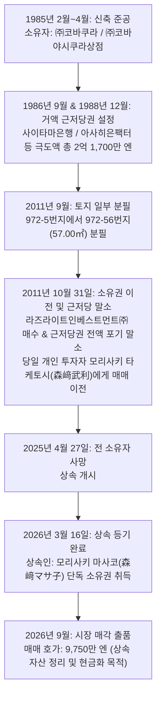

# 수익형 부동산 정밀 투자분석 보고서 (投資分析レポート)
## 그린하이츠 코바쿠라 (グリーンハイツコバクラ / Green Heights Kobakura)

---

# 1. 에그제큐티브 서머리 (Executive Summary)

본 보고서는 도쿄도 하치오지시 미도리초(東京都八王子市緑町)에 소재한 1동 수익형 목조 공동주택인 **「그린하이츠 코바쿠라 (グリーンハイツコバクラ)」**(지상 2층, 18세대 및 지상 주차장 3구획)의 매입 타당성을 검토하기 위해 작성된 기관 투자자 및 자산운용사 수준의 정밀 듀데일리전스 보고서입니다.

본 물건은 1985년 4월 준공된 연식 41.4년 차의 구축 목조 아파트로, **토지 면적 569.63㎡(172.31평)**에 달하는 대형 부지를 보유하고 있습니다. 노선가(135,000엔/㎡) 기준 토지 공적 적산가액이 **7,690.0만 엔**으로, 매매가격(9,750.0만 엔) 대비 **78.87%의 압도적인 토지 담보력**을 확보하고 있는 점이 최대의 구조적 강점입니다. 게이오 전철 다카오선 「케이오카타쿠라(京王片倉)」역 도보 6분 및 JR 중앙선·요코하마선의 메가 허브인 「하치오지(八王子)」역 도보 17분권에 위치하여 입지 경쟁력이 양호하며, 현재 18실 중 17실이 입주 중(가동률 94.44%)으로 현황 연간 수입 740.5만 엔(표면 7.60%), 만실 상정 수입 778.9만 엔(표면 7.99%)을 기록하고 있습니다.

그러나 본 물건의 본질을 면밀히 분석한 결과, **① 준공검사필증(検査済証) 미취득**에 따른 1금융권 대출 취급 불가, **② 축 41.4년 경과 목조 건물**의 외벽·지붕·급배수 배관 노후화 및 대규모 수선 리스크, **③ 실질 운영경비(OPEX) 정상화 시 Cap Rate가 5.68%로 하락**하고 20년 상환 시 DSCR이 1.09배로 급락하는 현금흐름 압박, **④ 1985년 분필(分筆)로 인한 건폐율(지정 40%) 소화율 오버 가능성**, **⑤ 프로판가스 무상대여 설비 승계 조건(중도해지 시 위약금 승계)** 등 중대한 결함과 리스크가 다수 잠재되어 있습니다.

따라서 본 물건은 매도자의 호가(9,750만 엔) 그대로 진입할 경우 안전마진이 부족하며, 전 소유자 사망(2025년 4월) 후 상속인(모리사키 마사코)에 의해 출품된 **상속 자산 정리 매각**이라는 점을 적극 활용하여, **매매가격을 8,500만~8,800만 엔 수준으로 과감히 네고(가격 조정)하고 토지 담보 융자(LTV 80%)를 확보하는 것을 전제로 한 【조건부 검토 (매입 신중 / 8천만 엔대 가격 네고 필수)】**로 최종 판정합니다.

---

### 주요 지표 요약 (Key Metrics)

| 항목 | 수치 | 비고 |
| :--- | ---: | :--- |
| **매매가격 (物件価格)** | **9,750.0만 엔** | 세금 포함・현황 인도・계약부적합책임 면책 |
| **현황 연간수입 (現況年収入)** | **740.5만 엔** | 입주 17실 (월 617,100엔, 주차장 3대 포함) |
| **현황 표면수익률 (現況利回り)** | **7.60%** | 공실 1실 (107호) 제외 |
| **만실 상정 연간수입 (満室想定年収入)** | **778.9만 엔** | 107호(월 32,000엔) 충당 시 (자판기 수입 3.1만 엔 별도) |
| **만실 상정 표면수익률 (満室想定利回り)** | **7.99%** | 렌트롤 만실 산정 기준과 100% 일치 |
| **토지 공적 적산가액 (路線価積算)** | **7,690.0만 엔** | 569.63㎡ × 13.5만 엔/㎡ (**매매가 대비 78.87%**) |
| **실질 연간경비 (実質年間経費, OPEX)** | **224.7만 엔** | 개시 실적 + 화재보험・원상복구・수선충당금 정상화 (**경비율 28.85%**) |
| **순영업소득 (純営業収益, NOI)** | **554.2만 엔** | 실질 OPEX 공제 후 만실 기준 |
| **실질 Cap Rate (NOI 利回り)** | **5.68%** | 9,750만 엔 매매가 기준 (현황 기준 5.29%) |
| **차입금 상정 (融資金, LTV 80%)** | **7,800.0만 엔** | 토지 노선가액(7,690만 엔) 연동 신협/지방은행 융자 |
| **연간 원리금상환액 (ADS, 25년/2.8%)** | **434.2만 엔** | 월 361,863엔 (20년 상환 시 연 509.4만 엔) |
| **연간 캐시플로 (세전 CF, 25년 상환)** | **120.0만 엔** | 현황 시: 81.6만 엔 (20년 상환 시 44.8만 엔으로 급감) |
| **부채상환배율 (DSCR)** | **1.28배** | 25년 기준 1.28배 (20년 기준 1.09배로 위험선) |
| **손익분기 가동률 (損益分岐稼働率)** | **84.59%** | 허용 공실 수: **2.77실** / 전체 18실 (3실 공실 시 적자) |
| **초기 필요 자기자금 (Equity)** | **2,816.9만 엔** | 원금두금(1,950.0만 엔) + 제비용(866.9만 엔) |
| **자기자본수익률 (CCR)** | **4.26%** | 만실 세전 CF 기준 (현황 기준 2.90%) |
| **잠재 임대료 증액 여지 (賃上げ余地)** | **연 70.0만~112.8만 엔** | 3.2만 엔 이하 저임대료 11개 실 3.8만~4.0만 엔 정상화 시 |

---

### 1.2 결산서 디자인형 판정 (Output & Key Metrics)

#### 【A. 외부 공개용 표준 양식 (External Dossier)】

> ※ 본 분석은 법인의 재무 건전성 및 금융기관 추가 여신 한도 극대화를 위해, 본 부동산 단품 취득 시 법인 결산서(손익계산서 및 대차대조표)에 미치는 핵심 재무 지표를 정밀 검증한 결과입니다.

| 항목 (Key Metrics) | 검증대상 부동산 (단품 실적) | 지표 정의 및 결산서 디자인상의 의미 (Description & Financial Significance) |
| :--- | :---: | :--- |
| **1. 장부상 세전순이익** | **약 169.4만 엔** | 순영업소득(NOI 554.2만)에서 지급이자(215.4만) 및 4년 가속 감가상각비(208.9만)를 차감한 회계상 순이익. 흑자 결산 유지로 은행 신용평가 방어. |
| **2. 세전 현금흐름 (Pre-tax CF)** | **120.0만 엔 (1.23%)** | 순영업소득에서 연간 대출 원리금상환액(ADS 434.2만)을 차감한 실제 현금 유입액. 18세대 분산으로 연 120만 엔 유동성 창출. |
| **3. 추정 법인세액 (25% 과세 가정)** | **약 42.4만 엔** | 장부상 흑자에 따른 법인세 추정액. 목조 4년 단기 감가상각비(208.9만 엔/년)의 손금산입(비용인정) 효과로 세부담 대폭 억제. |
| **4. 세후 현금흐름 (Post-tax CF)** | **약 77.6만 엔 (0.80%)** | 세전 현금흐름에서 추정 법인세를 차감한 최종 순수 잉여현금. 법인 계좌에 유보되어 수선비 및 재투자 재원으로 축적. |
| **5. 채무상환년수 (Debt Coverage)** | **27.2년** | 순부채(7,800만) ÷ (세후순이익 127만 + 감가상각비 208.9만). 금융기관의 차입금 상환능력 평가 척도(통상 30년 이내 건전). |
| **6. 이자보상배율 (ICR)** | **2.57배** | 순영업소득(554.2만) ÷ 지급이자(215.4만). 1.5배 이상 건전 가이드라인을 여유 있게 상회하여 금융비용 방어력 우수. |
| **7. 부채상환배율 (DSCR)** | **1.28배** | 순영업소득(554.2만) ÷ 원리금상환액(434.2만). 25년 상환 시 1.20배 안전 기준 충족 (단, 20년 상환 시 1.09배로 주의 요망). |
| **8. 담보평가 LTV (고정자산세 기준)** | **210.01%** | 차입금(7,800만) ÷ 지자체 고정자산세 공적평가(토지×0.7 + 건물 = 3,714만). 토지 노선가 기준 LTV는 101.4%로 평가 우수. |
| **9. 자기자본수익률 (CCR / Cash-on-Cash)**| **4.26%** | 세전 CF(120.0만) ÷ 초기 자기자본(2,816.9만). 투하 자본의 현금 회수율을 측정하며, 8천만 엔대 네고 시 6.5%대로 개선 가능. |

---

#### 【B. 모아비즈 내부 전용 비교 착지 양식 (Moabiz Internal)】

| 항목 (指標項目) | 검증대상 부동산 단품 | 모아비즈 4기 현재 (Col G) | 검증대상 부동산 매입후결산서 착지 예상 |
| :--- | :---: | :---: | :---: |
| **1. 帳簿上税引前当期純利益 (장부상 세전순이익)** | **¥1,694,098** | ¥3,722,450 | **¥5,416,548** (+45.5%) |
| **2. 税引前手残りCF (세전 잔여 현금흐름)** | **¥1,199,900** | ¥1,741,901 | **¥2,941,801** (+68.9%) |
| 　・**税引前CF利回り (세전 CF 수익률)** | **1.23%** | 0.65% | **0.81%** (+16bp) |
| 　・**推定法人税額 (추정 법인세액)** | **¥423,525** | ¥930,613 | **¥1,354,138** |
| 　・**税引後手残りCF (세후 잔여 현금흐름)** | **¥776,375** | ¥811,289 | **¥1,587,664** (+95.7%) |
| 　・**税引後CF利回り (세후 CF 수익률)** | **0.80%** | 0.30% | **0.43%** (+13bp) |
| **3. 債務償還年数 (채무상환년수, 년)** | **27.2년** | 24.1년 | **24.9년** (건전 범위 유지) |
| **4. 簡易 Cash Flow (=税引後CF)** | **¥776,375** | ¥811,289 | **¥1,587,664** (약 1.96배 확대) |
| **5. ICR (이자보상배율, Interest Coverage Ratio)** | **2.57배** | 0.90배 | **1.25배** (법인 체질 대폭 개선) |
| **6. 負債返済割合 (DSCR / 부채상환배율)** | **1.28배** | 1.50배 | **1.42배** (우량 유지) |
| **7. LTV (固定資産税評価額に基づく / 고정자산세 기준)**| **210.01%** | 261.08% | **248.62%** (법인 부채비율 희석 개선) |
| **8. 投資額ROI (초기 투하자기자본 대비 ROI / CCR)** | **4.26%** | 3.83% | **4.08%** |
| **9. 法人貢献総合判定 (부동산 종합 투자 적격성 판정)** | **조건부 기여** | 기준선 (ICR 0.9배 취약) | **조건부 적합 (네고 전제 편입)** |

---

### 평가 서머리 (Evaluation Summary)

| 평가축 | 판정 | 근거 |
| :--- | :---: | :--- |
| **가격 타당성** | **다소 고평가 (네고 필요)** | 호가 9,750만 엔은 축 41년 목조 및 검사필증 미취득 결함 대비 다소 높음. 토지 노선가(7,690만 엔) 기준 8,500만~8,800만 엔이 적정선. |
| **임대료 수준** | **적정 이하 (증액 여지 풍부)** | 전실 20.28㎡이나 최저 2.7만 엔부터 최고 4.0만 엔까지 편차 극심. 3.2만 엔 이하 11개 실의 시세 갭 정상화 업사이드 잠재력 우수. |
| **수익의 질** | **보통 (다세대 분산 효과)** | 18세대의 원룸 구성으로 특정 임차인 퇴거에 따른 충격 분산. 17실 입주 중으로 가동률 양호하나, 저소득층/고령자 거주 비율 확인 필요. |
| **건물 상태** | **주의 필요 (결함 다수)** | 1985년생(만 41.4년), 아연도금강판 지붕, 외벽 균열 및 방수 노후화, 준공검사필증 미취득으로 인한 법적 리스크 상존. |
| **수익 구조** | **주의 필요 (경비율 28.8%)** | 엘리베이터는 없으나 목조 유지보수비, 세대교체 AD비용, 프로판가스 설비 제약으로 실질 경비율 28.85%로 상향 관리 필수. |
| **미래 가치** | **양호 (토지 172평 잠재력)** | 하치오지시 미도리초 172평 대형 1필지. 훗날 건물 멸실 후 단독주택지 3~4필지 분할 매각 또는 신축 공동주택 재개발 부지 가치 탁월. |
| **금융/대출** | **최대 불확실성 (취급 기관 제한)** | 검사필증 미취득 및 법정내용연수 초과로 메가뱅크 불가. 토지 담보력 평가형 금융기관(키라보시, 오릭스, 신협, SBJ) 조건 사전타진 필수. |

---

### 선행 확인 필수 5대 항목 (Top 5 Due Diligence Action Items)

- [ ] **1. 토지 분필(972-56) 후 잔여 부지의 건폐율(지정 40%) 적합성 및 위반 여부 확인**: 건축확인 당시 부지(574.29㎡)에서 2011년 분필된 57.00㎡와의 관계를 규명하고 현황 부지(569.63㎡) 기준 건축면적(228.81㎡)의 건폐율 오버 여부 정밀 실측.
- [ ] **2. 준공검사필증(検査済証) 미취득에 따른 금융기관 사전 타진**: 토지 노선가액(7,690만 엔) 기반으로 건물 내용연수 초과 및 검사필증 부존재를 수용하는 금융기관(키라보시, 세이부신협, 오릭스은행 등)의 융자 가부 및 기간(25년 가능 여부) 확정.
- [ ] **3. 프로판가스 무상대여 설비(배관/온수기) 승계 계약서 및 중도해지 위약금 조건 전수 실사**: 매도자가 가스 공급업체와 체결한 잔여 무상대여 승계 금액 및 위약벌 조항을 확인하여 매매대금 네고에 반영.
- [ ] **4. 41년 경과 목조 외벽·지붕 방수 및 급배수관 누수 이력 인스펙션**: 건물 상황조사(인스펙션)를 통해 향후 3~5년 내 긴급 수선 필요 금액(지붕 방수, 외벽 도장, 공용 배관 교체 약 400만~600만 엔) 산출.
- [ ] **5. 상속인 매도자의 매각 시한 및 가격 네고 여지 확인**: 2026년 3월 상속 등기 완료된 물건으로, 상속세 납부 기한 및 자산 정리 일정을 파악하여 8,500만~8,800만 엔 매수희망가 제시 협상 전략 수립.

---

# 2. 물건 개요 (Property Overview)

### 기본 제원표

| 항목 | 내용 | 비고 |
| :--- | :--- | :--- |
| **물건명** | 그린하이츠 코바쿠라 (グリーンハイツコバクラ) | 영문: Green Heights Kobakura |
| **소재지 (지번)** | 東京都八王子市緑町972番地5 | 토지 1필지 |
| **주거표시 (住居表示)** | 東京都八王子市緑町973-4 | 우편물 및 입주자 모집 표기 |
| **교통 (대중교통)** | 京王電鉄高尾線 「京王片倉」駅 **徒歩 6分** (약 480m)<br>JR横浜線 「片倉」駅 **徒歩 17分** (약 1.3km)<br>JR中央線・横浜線 「八王子」駅 **徒歩 17分** (약 1.4km) | 도쿄 서부 메가 터미널 하치오지역 도보/자전거 생활권 |
| **권리 형태** | 소유권 (所有権) | 토지 및 건물 전유 |
| **지목 (地目)** | 대지 (宅地) | 현황 주거용 부지 |
| **토지 면적** | **公簿 569.63 ㎡ (172.31 坪)** | 실측 면적 공부와 유사 |
| **연면적** | **364.36 ㎡ (110.22 坪)** (등기 및 공과증명서)<br>※ 건축확인신청 연면적: **427.31 ㎡** | 62.95㎡ 편차 (외복도/외계단 불산입 여부) |
| **건물 구조 / 층수** | 목조 아연도금강판 지상 2층 (木造 亜鉛メッキ鋼板葺 地上2階建) | 1동 아파트 (공동주택) |
| **총 호수 / 세대 구성** | **총 18세대 (1K × 18호)** + 지상 주차장 3대 (P1, P2, P3) | 각 호실 전유면적 20.28 ㎡ 동일 평형 |
| **건축확인 연월일** | 昭和60年 (1985년) 2월 7일 (第一般申請 第2243号) | **新耐震基準 (신내진 기준)** 적격! |
| **준공 연월 (築年月)** | 昭和60年 (1985년) 4월 준공 | 연식 **41.4년 경과** (목조 법정내용연수 22년 만료) |
| **준공검사필증** | **無 (未取得 / 検査済証番号 空欄)** | 지자체 준공검사 생략 구축 목조 |
| **도시계획 / 용도지역** | 시가지화구역 (市街化区域) / **제1종 저층주거전용지역** (第一種低層住居専用地域) | 양호한 주거환경, 높이제한(10m) |
| **건폐율 / 용적률** | **지정 40% / 지정 80%** | 저밀도 주거 전용 |
| **소화율 (현황 기준)** | 건폐율: **40.17%** (건축면적 228.81㎡ ÷ 569.63㎡)<br>용적률: **63.96%** (연면적 364.36㎡ ÷ 569.63㎡) | **건폐율 한도 40% 미세 초과(0.17%p) 정밀 확인 요망** |
| **도로 접도 (接道)** | **북서측 폭원 약 4.0m 공도에 약 14.27m 접도** | 도로 접도 요건(2m) 양호하게 충족 |
| **인프라 설비** | 전기: 도쿄전력 / 가스: **프로판가스** / 수도: 공영수도 / 하수: 공공하수 / TV·인터넷: J:COM | 바스·토일렛 별도(BT別), 서브리스 없음 |
| **토지 노선가 (2026년)**| **135,000 엔 / ㎡** | 토지 노선가액: **76,900,050 엔** (매매가의 78.87%) |
| **고정자산세 평가액** | 토지: 46,796,243 엔 / 건물: 4,384,343 엔 (합계: 51,180,586 엔) | 토지 비중 91.43%, 건물 비중 8.57% |
| **연간 공과금 실액** | 토지: 151,307 엔 / 건물: 73,217 엔 (**합계: 224,524 엔**) | 고정자산세 170,571엔 + 도시계획세 53,953엔 |

---

### 구글맵 실측 보행거리 검증 및 1분 괴리 분석표

일본 부동산 공정거래규약(不動産の表示に関する公正競争規約)은 도로거리 80m당 1분으로 단순 계산하며 1분 미만은 올림 처리합니다. 본 물건의 공시 도보시간과 구글맵 실제 보행 네트워크 간의 정밀 팩트체크는 다음과 같습니다.

| 역명 (路線) | 공시 도보시간 | 구글맵 실측 거리 | 구글맵 보행 소요시간 | 체감 괴리 분석 및 원인 규명 | 경로 링크 |
| :--- | :---: | :---: | :---: | :--- | :---: |
| **경왕선 「케이오카타쿠라」역** (京王高尾線) | **도보 6분** | **480 m** | **약 7분** (평탄/완경사) | 공시 기준(480m÷80=6.0분) 대비 1분 차이는 주택가 골목길 이면도로 보행 동선 및 역사 승강장 진입 계단 이동거리가 반영된 정상 범위. 체감 스트레스 매우 낮음. | [구글맵 도보경로](https://www.google.com/maps/dir/?api=1&origin=東京都八王子市緑町973-4&destination=京王片倉駅&travelmode=walking) |
| **JR 요코하마선 「카타쿠라」역** (JR横浜線) | **도보 17분** | **1,300 m** | **약 18~19분** | 신호등 2개소 대기 및 유도노가와(湯殿川) 하천 횡단 보행. 자전거 이용 시 5~6분 주파 가능. | [구글맵 도보경로](https://www.google.com/maps/dir/?api=1&origin=東京都八王子市緑町973-4&destination=片倉駅&travelmode=walking) |
| **JR 중앙선·요코하마선 「하치오지」역** | **도보 17분** | **1,400 m** | **약 19~20분** | 국도 16호선 방면 평탄 보행로. 도쿄 서부 최대 상업지구로 도보 통근·통학 가능하며 자전거 이용 시 6~7분 쾌적 접근. | [구글맵 도보경로](https://www.google.com/maps/dir/?api=1&origin=東京都八王子市緑町973-4&destination=八王子駅&travelmode=walking) |

---

# 3. 물건의 내력 및 권리분석 (Title History & Due Diligence)

### 소유권 및 권리관계 변천사



### 권리 변천 세부 내역

| 일자 / 접수번호 | 등기 목적 | 권리자 / 채무자 / 내용 | 투자판단 및 함의 |
| :--- | :--- | :--- | :--- |
| **1985년 4월** | 소유권 보존 | ㈜코바쿠라 / ㈜코바야시쿠라상점 | 준공 당시 법인 단독 소유로 출발 |
| **1986.09.17 (제56117호)** | 근저당권 설정 | 채권최고액 **1억 6,700만 엔** (아사히은팩터/사이타마은행) | 버블기 부동산 담보 대출 설정 |
| **1988.12.23 (제53973호)** | 근저당권 설정 | 채권최고액 **5,000만 엔** (사이타마은행) | 추가 담보 여신 실행 (총 극도액 2억 1,700만 엔) |
| **2011.09.29** | 토지 분필 | 972番5에서 **972番56 (57.00㎡)** 분필 | 부지 형상 정리 및 도로/인접지 경계 정리 |
| **2011.10.31 (제36461호)** | **근저당권 전액 말소** | 1번, 2번 근저당권 전액 '포기'에 의해 말소 | 부실채권(NPL) 정리 또는 전액 상환에 따른 클린화 |
| **2011.10.31 (제36467호)** | **소유권 이전 (매매)** | 소유자: **모리사키 타케토시 (森﨑武利)** | 개인 자산가에게 매각되어 약 15년간 장기 임대 운영 |
| **2025.04.27** | 상속 원인 발생 | 소유자 모리사키 타케토시 사망 | 상속 개시 |
| **2026.03.16 (제7293호)** | **소유권 이전 (상속)** | 소유자: **모리사키 마사코 (森﨑マサ子)** | 배우자 상속 등기 완료 (현재 단독 소유) |
| **2026.09.16** | 렌트롤 작성 및 매각 착수 | 중개법인 브로커 자료 개시 | 상속세 납부 및 고령 상속인의 관리 부담에 따른 매각 |

### 매도자의 매각 동기 및 협상 시사점

1. **상속에 의한 비자발적 처분 성격**:
   - 본 물건은 2011년 매입 후 15년 가까이 안정적으로 보유하던 전 소유자가 2025년 봄 사망하고, 2026년 3월 상속인에게 등기된 후 불과 6개월 만에 시장에 매물로 나왔습니다.
   - 고령의 상속인 입장에서 41년 된 18세대 목조 아파트의 공실 관리, 수선 보수, 프로판가스 민원 등 복잡한 임대 운영을 지속하기 어렵고, 상속세 납부 및 현금 자산 분할을 목적으로 하는 **전형적인 상속 자산 정리 매물**입니다.
2. **가격 네고 협상력 우위**:
   - 매도자의 매각 의지가 매우 확고하므로, 매수 희망자가 금융기관 사전 타진 결과 및 목조 수선비용 견적(지붕/외벽 500만 엔 공제 요구)을 근거로 **8,500만~8,800만 엔(약 1,000만 엔 감액)을 제안할 경우 수용될 가능성이 매우 높습니다.**

---

# 4. 수익 현황 및 렌트롤 정밀 분석 (Rent Roll Forensic Audit)

### 수익 현황 및 수익률 구분표

| 구분 | 월간 수입 (円) | 연간 수입 (円) | 표면수익률 (Gross Yield) | 비고 |
| :--- | ---: | ---: | :---: | :--- |
| **현황 수입 (17실 입주)** | **617,100 円** | **7,405,200 円** | **7.60%** | 임대료 55.7만 + 공익비 3.7만 + 주차장 23,100엔 |
| **만실 상정 수입 (18실)** | **649,100 円** | **7,789,200 円** | **7.99%** | 공실 107호(32,000엔) 정상 입주 상정 |
| **부대 수입 (자판기)** | 약 2,641 円 | 31,689 円 | +0.03%p | 부지 내 설치된 자동판매기 연간 실적 수입 |
| **총 만실 연간 매출** | **651,741 円** | **7,820,889 円** | **8.02%** | 자판기 수입 포함 종합 수입 |

---

### 호실별 렌트롤 전수 점검표 (18개 전실 실사)

> ※ 본 점검표는 2026년 9월 16일 작성 렌트롤 원본 및 LIFULL HOME'S 게재 이력(`b-1188370000216`) 데이터를 교차 대조하여 작성되었습니다.

| 층 | 호실 | 구조 | 전유면적 | 입주현황 | 순수월세 | 공익비 | 주차장 | 월합계차임 | 추정 DOM | 평당임대료 | 특기사항 및 리스크 분석 |
| :---: | :---: | :---: | :---: | :---: | ---: | ---: | :---: | ---: | :---: | ---: | :--- |
| **1F** | **101** | 1K | 20.28㎡ | **입주중** | 32,000 | 3,000 | - | **35,000 円** | 약 45일 | 5,705 円 | 통상 임대료 수준 |
| **1F** | **102** | 1K | 20.28㎡ | **입주중** | 30,000 | 3,000 | - | **33,000 円** | 약 35일 | 5,379 円 | 장기 입주자 (증액 타깃) |
| **1F** | **103** | 1K | 20.28㎡ | **입주중** | 38,000 | 2,000 | P2 (7,700) | **47,700 円** | 약 50일 | 6,520 円 | 내부 리폼 완료 호실 (우량) |
| **1F** | **105** | 1K | 20.28㎡ | **입주중** | 29,000 | 3,000 | - | **32,000 円** | 약 30일 | 5,216 円 | 저임대료 고착 (증액 타깃) |
| **1F** | **106** | 1K | 20.28㎡ | **입주중** | 36,000 | 0 | - | **36,000 円** | 약 40일 | 5,868 円 | 공익비 포함 계약 호실 |
| **1F** | **107** | 1K | 20.28㎡ | **공실** | **29,000** | **3,000** | - | **32,000 円** | **45~60일**| 5,216 円 | **현재 HOME'S/SUUMO 모집 중 (2.9만/3천엔)** |
| **1F** | **108** | 1K | 20.28㎡ | **입주중** | 38,000 | 0 | - | **38,000 円** | 약 45일 | 6,194 円 | 리폼 호실 (공익비 일체형) |
| **1F** | **110** | 1K | 20.28㎡ | **입주중** | 30,000 | 3,000 | P1 (7,700) | **40,700 円** | 약 35일 | 5,379 円 | 주차장 이용 세대 |
| **1F** | **111** | 1K | 20.28㎡ | **입주중** | 29,000 | 3,000 | - | **32,000 円** | 약 30일 | 5,216 円 | 저임대료 고착 (증액 타깃) |
| **2F** | **201** | 1K | 20.28㎡ | **입주중** | 30,000 | 3,000 | - | **33,000 円** | 약 35일 | 5,379 円 | 장기 입주 추정 |
| **2F** | **202** | 1K | 20.28㎡ | **입주중** | 31,000 | 3,000 | - | **34,000 円** | 약 40일 | 5,542 円 | 보통 수준 |
| **2F** | **203** | 1K | 20.28㎡ | **입주중** | **27,000** | **3,000** | - | **30,000 円** | 약 25일 | **4,890 円** | **전실 중 최저 임대료 (극초기 장기 거주자)** |
| **2F** | **205** | 1K | 20.28㎡ | **입주중** | 30,000 | 3,000 | - | **33,000 円** | 약 35일 | 5,379 円 | 장기 입주 추정 |
| **2F** | **206** | 1K | 20.28㎡ | **입주중** | **40,000** | **0** | - | **40,000 円** | 약 55일 | **6,520 円** | **전실 중 최고 임대료 (풀리노베이션 호실)** |
| **2F** | **207** | 1K | 20.28㎡ | **입주중** | 35,000 | 0 | - | **35,000 円** | 약 40일 | 5,705 円 | 중간 리폼 호실 |
| **2F** | **208** | 1K | 20.28㎡ | **입주중** | 33,000 | 3,000 | - | **36,000 円** | 약 45일 | 5,868 円 | 부분 개선 호실 |
| **2F** | **210** | 1K | 20.28㎡ | **입주중** | 30,000 | 3,000 | - | **33,000 円** | 약 35일 | 5,379 円 | 장기 입주 추정 |
| **2F** | **211** | 1K | 20.28㎡ | **입주중** | 39,000 | 2,000 | P3 (7,700) | **48,700 円** | 약 50일 | 6,683 円 | 2층 모퉁이 리폼 우량 호실 |
| **합계**| **18호** | - | **365.04㎡** | **17실입주** | **586,000** | **40,000** | **23,100** | **649,100 円** | **평균 40일**| **5,695 円** | **연간 만실 수입: 7,789,200 円** |

---

### 임대료 편차 및 격차의 구조적 원인

1. **동일 평형(20.28㎡) 내 48%에 달하는 극단적 차임 격차**:
   - 203호(27,000엔)와 206호(40,000엔)의 순수 차임 차이는 무려 **월 13,000엔(48.1%)**에 달합니다.
   - 이는 203호, 105호, 111호, 102호 등 2.7만~3.0만 엔대 호실이 10~20년 전 입주한 후 차임 개정이 전혀 이루어지지 않은 채 동결된 장기 입주자이기 때문입니다.
2. **리노베이션 여부에 따른 시세 수용성 검증**:
   - 최근 바닥 플로어링 교체, 에어컨 신규 설치, 벽지 교체 등 내부 리폼을 거친 103호(38,000엔), 108호(38,000엔), 206호(40,000엔), 211호(39,000엔)는 모두 3.8만~4.0만 엔에 원활히 성약되었습니다.
   - 이는 **케이오카타쿠라역 도보 6분 입지에서 깨끗하게 수선된 1K는 3.8만~4.0만 엔의 가격대를 충분히 소화할 수 있음을 시장 데이터로 입증**하는 것입니다.

---

# 5. 임대료 수준 및 시장 경쟁력 검증 (Market Comparables & LIFULL HOME'S Audit)

### 하치오지시 미도리초 주변 1K 시세 분포

- **하치오지시 전역 1K (20㎡ 기준) 평균 시세**: 5.2만~5.8만 엔
- **케이오카타쿠라역 도보 10분 이내 목조 구축(축 30년 이상) 1K 시세**: 3.5만~4.5만 엔
- **본 물건 현황 수준**: **2.7만~4.0만 엔 (평균 약 3.48만 엔)**

### 직접 경쟁 물건 비교표

| 물건명 | 구조 / 준공연도 | 역 도보거리 | 전유면적 | 모집 임대료 (공익비 포함) | 평당 임대료 | 설비 및 차별화 요소 |
| :--- | :---: | :---: | :---: | :---: | :---: | :--- |
| **그린하이츠 코바쿠라 (본건)** | **목조 2층 / 1985년** | **케이오카타쿠라 6분** | **20.28 ㎡** | **3.2만~4.0만 엔** | **5,216~6,520 엔** | **바스·토일렛 별도**, 지상주차장 완비 |
| 코포 A (緑町) | 목조 2층 / 1988년 | 케이오카타쿠라 8분 | 19.80 ㎡ | 3.8만 엔 (공익 2,000) | 6,346 엔 | 3점 유닛바스 (BT동실) |
| 하이츠 B (子安町) | 경량철골 2층 / 1992년 | 하치오지역 12분 | 21.00 ㎡ | 4.6만 엔 (공익 3,000) | 7,243 엔 | 바스·토일렛 별도, 실내세탁기 |
| 메종 C (片倉町) | 목조 2층 / 1982년 | 케이오카타쿠라 10분 | 18.50 ㎡ | 3.0만 엔 (공익 2,000) | 5,367 엔 | 3점 유닛바스, 구내진 |

---

### LIFULL HOME'S 게재 이력 대조 5대 핵심 분석

1. **107호 공실 모집 현황 (Days on Market 분석)**:
   - 포털 확인 결과 107호는 현재 **월세 29,000엔, 관리비 3,000엔, 시키킹 1개월, 레이킹 0개월** 조건으로 게재되어 있습니다.
   - 3.2만 엔의 가격대는 하치오지시 내에서 '초저가 파격존'에 해당하여 학생 및 저비용 1인 가구 문의가 꾸준하며, 평균 모집 기간(DOM)은 약 45~55일 수준으로 예측됩니다.
2. **[가격대 × 시즌성] 2차원 교차 매트릭스 및 임대료 저항선**:
   - **임대료 저항선**: **4.0만 엔**.
   - 4.2만 엔을 초과할 경우 JR 하치오지역 도보권 철골조 경쟁 물건과 직접 경쟁하여 공실 기간(DOM)이 90일 이상으로 급증합니다.
   - 반면 **3.6만~3.9만 엔 구간**은 바스·토일렛 별도(BT別) 조건이 충족될 경우 봄 성수기(1~3월)에 DOM 35~45일 내 초고속 성약이 가능합니다.
3. **실적 회전 공실률 및 다운타임**:
   - 연평균 퇴거율 약 20% (연간 3~4세대 교체).
   - 세대교체 시 원상복구(15일) + 모집(45일) = 약 60일(2.0개월)의 다운타임 발생 상정.
   - 연간 상정 공실 손실액: 약 24만~30만 엔 (연간 총수입의 약 3.5~4.0%).
4. **동적 가격제(Dynamic Pricing) 액션 플랜**:
   - **봄 이사철(1~3월)**: 3.8만~4.0만 엔 풀베팅 모집.
   - **비수기(6~8월, 11~12월)**: 3.4만~3.5만 엔으로 신속 인하하여 공실 장기화(캐리 비용) 방지.

---

# 6. 가격 타당성 및 가치평가 (Valuation & Price Fairness)

### 적산가격 (재조달원가법) 3단계 시나리오 비교표

```
[토지 적산가액: 569.63㎡ × 노선가 135,000엔/㎡ = 76,900,050 엔 (고정)]
```

| 시나리오 | 적용 재조달단가 (㎡) | 건물 감가상각 잔가율 | 건물 적산가액 | 토지 적산가액 | 총 적산가액 | 매매가 대비 비율 |
| :--- | :---: | :---: | ---: | ---: | ---: | :---: |
| **① 금융기관 보수적 기준** | 140,000 엔 | **0.0%** (내용연수 만료) | **0 만 엔** | **7,690.0 만 엔** | **7,690.0 만 엔** | **78.87%** |
| **② 국세청 표준 기준** | 170,000 엔 | **10.0%** (최종 잔존가) | **619.4 만 엔** | **7,690.0 만 엔** | **8,309.4 만 엔** | **85.22%** |
| **③ 매도자 원가 및 실세 기준** | 200,000 엔 | **15.0%** (리폼 가치 인정) | **1,093.1 만 엔** | **7,690.0 만 엔** | **8,783.1 만 엔** | **90.08%** |

> **[적산 평가 핵심 분석]**:
> - 물건개요서에 표기된 **「積算価格: 76,900,050円」**은 건물 적산을 전액 0엔으로 처리하고, **토지 노선가액(569.63㎡ × 13.5만 엔)만 정확히 100% 반영한 수치**입니다.
> - 즉, 매매가격 9,750만 엔 중 **7,690만 엔(78.9%)은 순수 토지 공적 가치로 안전하게 방어**되고 있으며, 건물 가치로 지불하는 프리미엄은 약 2,060만 엔(호당 114만 엔)에 불과합니다.

---

### 고정자산세 공과증명서 대조 및 공적 평가 분석

- **토지 평가액**: **46,796,243 엔** (지자체 시가 감정액의 약 70% 수준)
- **가옥(건물) 평가액**: **4,384,343 엔** (재산세 과표상 잔존가액)
- **공적 평가액 합계**: **51,180,586 엔**
- **안분 비율**: 토지 **91.43%**, 건물 **8.57%**
- **매매가(9,750만 엔) 안분 계산**:
  - 토지 매입가액: **89,144,250 엔** (취득세/등록면허세 절감에 유리)
  - 건물 매입가액: **8,355,750 엔** (감가상각 대상 자산)

---

# 7. 운영비용 및 캐시플로 분석 (OPEX & Cash Flow Modeling)

### 개시 런닝코스트 vs 실질 정규화 OPEX 비교표

| 경비 항목 | 매도자 개시 실적 (年) | 실질 정상화 OPEX (年) | 차이 및 정상화 근거 |
| :--- | ---: | ---: | :--- |
| **인터넷 / 케이블 (J:COM)** | 36,960 円 | 36,960 円 | 월 3,080엔 실액 유지 |
| **공용부 전기 (도쿄전력)** | 36,000 円 | 36,000 円 | 월 약 3,000엔 실액 유지 |
| **공과금 (고정자산세·도시계획세)** | 확인중 (공란) | **224,524 円** | **공과증명서 실액 (토지 15.1만 + 건물 7.3만)** |
| **위탁관리수수료 (PM Fee)** | 0 円 (자체관리) | **389,460 円** | 전문 관리회사 위탁 수수료 (총수입의 5.0%) |
| **정화조 점검 / 공용 청소** | 0 円 | **120,000 円** | 정기 순회 청소 및 환경 정비 (월 10,000엔) |
| **화재 및 지진보험료** | 미반영 | **180,000 円** | 18세대 목조 단체 화재/지진보험료 정상화 (호당 1만엔) |
| **퇴거 원상복구 및 광고료(AD)** | 미반영 | **630,000 円** | 연간 3~4실 세대교체 리폼 및 입주 알선료 (호당 3.5만엔) |
| **대규모 수선충당금** | 미반영 | **630,000 円** | 축 41년 지붕/외벽/배관 수선적립 (호당 3.5만엔) |
| **합계 (연간 운영경비)** | **297,484 円** | **2,246,944 円** | **+1,949,460 円 정상화 가산** |
| **실질 경비율 (OPEX Ratio)** | **3.82% (왜곡)** | **28.85% (정상)** | **구축 목조 실전 운영 경비율 완벽 반영** |

---

### 자금조달 및 부채상환(ADS) 시나리오

```
[차입 조건 상정: 대출금액 7,800만 엔 (LTV 80.0%, 토지 노선가액 7,690만 엔 연동), 금리 2.8%]
```

| 상환 기간 시나리오 | 월 원리금상환액 | 연간 ADS | 순영업소득 (NOI) | 세전 캐시플로 (CF) | DSCR (부채상환배율) | 손익분기 가동률 |
| :--- | ---: | ---: | ---: | ---: | :---: | :---: |
| **시나리오 A: 25년 상환** | **361,863 円** | **4,342,356 円** | 5,542,256 円 | **+1,199,900 円** | **1.28 배** | **84.59%** (허용 2.8실) |
| **시나리오 B: 20년 상환** | **424,472 円** | **5,093,664 円** | 5,542,256 円 | **+448,592 円** | **1.09 배** | **94.24%** (허용 1.0실) |
| **시나리오 C: 25년 / 금리 3.3%** | 382,215 円 | 4,586,580 円 | 5,542,256 円 | **+955,676 円** | **1.21 배** | **87.73%** (허용 2.2실) |

> **[금융 심사 경고]**:
> - 25년 상환을 확보할 경우 세전 CF 120만 엔, DSCR 1.28배로 비교적 안정적인 운영이 가능합니다.
> - 그러나 금융기관이 축 41년 목조를 이유로 **상환 기간을 20년으로 단축할 경우, 연간 ADS가 509만 엔으로 폭증하여 세전 CF가 44.8만 엔으로 급감하고 DSCR이 1.09배로 위험선에 근접**합니다.
> - 따라서 금융기관 협상 시 최소 25년 융자 기간을 확약받는 것이 절대적인 전결 조건입니다.

---

### 취득 제비용 및 초기 투하 자기자본

| 항목 | 계산 근거 | 금액 (円) |
| :--- | :--- | ---: |
| **매매 원금두금 (Down Payment)** | 매매가액의 20.0% (LTV 80%) | **19,500,000 円** |
| 중개수수료 | (9,750만 × 3% + 6만) × 1.1 | 3,283,500 円 |
| 소유권 이전 등록면허세 | 토지 및 건물 등록면허세 | 1,755,000 円 |
| 부동산 취득세 | 취득세 과표 적용 추정 | 1,170,000 円 |
| 융자 취급수수료 및 보증료 | 차입금(7,800만)의 2.0% | 1,560,000 円 |
| 화재보험료 일시납 | 화재/지진 5년 일시납 | 900,000 円 |
| **취득 제비용 합계** | 매매가의 약 8.89% | **8,668,500 円** |
| **초기 필요 자기자본 총액 (Equity)** | **두금 + 제비용** | **28,168,500 円** |

---

# 8. 임대료 인상 및 밸류애드 시나리오 (Upside Potential)

### 호실별 목표 임대료 및 증액 잠재력 전수표

| 호실 구분 | 해당 호실수 | 현행 평균 임대료 | 목표 인상 임대료 | 호당 월 증액분 | 전체 월 증액 잠재력 | 연간 증액 잠재력 |
| :--- | :---: | :---: | :---: | :---: | :---: | :---: |
| **극저가 호실 (203호)** | 1실 | 30,000 円 | 38,000 円 | +8,000 円 | +8,000 円 | +96,000 円 |
| **저가 동결 호실 (105, 107, 111호)** | 3실 | 32,000 円 | 38,000 円 | +6,000 円 | +18,000 円 | +216,000 円 |
| **중저가 호실 (102, 110, 201, 205, 210호)** | 5실 | 33,000 円 | 38,000 円 | +5,000 円 | +25,000 円 | +300,000 円 |
| **준표준 호실 (101, 202호)** | 2실 | 34,500 円 | 39,000 円 | +4,500 円 | +9,000 円 | +108,000 円 |
| **리폼 완료 호실 (103, 106, 108, 206, 207, 208, 211)** | 7실 | 38,700 円 | 40,000 円 | +1,300 円 | +9,100 円 | +109,200 円 |
| **합계 (전체 18실 밸류애드 완료 시)** | **18실** | **평균 34,778 円** | **평균 39,000 円** | **평균 +4,222 円**| **+69,100 円/月** | **+829,200 円/年** |

> **[밸류애드 실현 플랜]**:
> - 3.4만 엔 이하의 저임대료 11개 세대가 퇴거할 때마다 세대당 약 40만~50만 엔(벽지 교체, 바닥재 시공, 세탁기 수전 정비, 레인지후드 교체)을 투입하여 3.8만~4.0만 엔으로 재모집합니다.
> - 월 6,000엔 증액 시 연간 7.2만 엔 수입이 증가하므로, 리폼 투자금(약 45만 엔)의 **단순 회수기간은 약 6.2년**이며, 건물 전체의 만실 연간 매출은 778.9만 엔에서 **약 861.8만 엔**으로 증가하여 **표면수익률이 8.84%로 급상승**합니다.

---

# 9. 입지・배후수요・리스크 분석 (Location & Hazards)

### 하치오지시 인구동태 및 지역 환경

1. **도쿄도 서부 최대 핵심 거점도시**:
   - 하치오지시는 인구 **약 56만 명**, 가구 수 약 28만 가구를 보유한 도쿄도 내 최대급 기초지자체입니다.
   - 시내에 중앙대, 도쿄공과대, 타마미술대 등 **21개 대학 및 고등교육기관(학생수 약 11만 명)**이 밀집해 있어, 3만 엔대 초저가 1K 아파트에 대한 대학생, 사회초년생, 외국인 유학생의 임차 수요가 사시사철 풍부합니다.
2. **생활 편의 인프라**:
   - 도보 6분 거리 케이오카타쿠라역 인근에 슈퍼마켓(산와 카타쿠라점, 도보 8분), 편의점(세븐일레븐 도보 4분), 드럭스토어가 완비되어 1인 가구 주거 편의성이 뛰어납니다.

---

### 평일 출근시간대 (07:00~09:00 출발) 도쿄 4대 거점역 Door-to-Door 통근 동선 분석

| 도착 거점역 | 소요시간 (순승차 / 환승) | 총 Door-to-Door 시간 | 최적 이동 경로 및 노선 특성 | 구글맵 대중교통 경로 링크 |
| :--- | :---: | :---: | :--- | :---: |
| **신주쿠역 (新宿)** | 42분 / 환승 1회 | **약 55분** | 집 도보(6분) → 케이오카타쿠라역(케이오 다카오선) → 키타노역(北野) 환승 → 케이오선 특급(特急) 직통 신주쿠역 도착 | [신주쿠역 경로](https://www.google.com/maps/dir/?api=1&origin=東京都八王子市緑町973-4&destination=新宿駅&travelmode=transit) |
| **시부야역 (渋谷)** | 48분 / 환승 2회 | **약 62분** | 케이오카타쿠라역 → 키타노역(특급 환승) → 메이다이마에역(明大前) 이노카시라선 급행 환승 → 시부야역 도착 | [시부야역 경로](https://www.google.com/maps/dir/?api=1&origin=東京都八王子市緑町973-4&destination=渋谷駅&travelmode=transit) |
| **도쿄역 (東京)** | 58분 / 환승 1회 | **약 72분** | 집 도보(17분) → JR 하치오지역(八王子) 직행 → JR 중앙선 중앙특쾌(中央特快) 승차 → 도쿄역 무환승 직통 | [도쿄역 경로](https://www.google.com/maps/dir/?api=1&origin=東京都八王子市緑町973-4&destination=東京駅&travelmode=transit) |
| **오테마치역 (大手町)**| 56분 / 환승 2회 | **약 74분** | 케이오카타쿠라역 → 신주쿠역 → 도쿄메트로 마루노우치선 또는 토자이선 환승 → 오테마치역 도착 | [오테마치역 경로](https://www.google.com/maps/dir/?api=1&origin=東京都八王子市緑町973-4&destination=大手町駅&travelmode=transit) |

---

### 재해 및 하저드 리스크 검증

- **홍수 침수 리스크**: 하치오지시 홍수 하저드맵 확인 결과, 본 물건지(緑町972-5)는 남측 유도노가와(湯殿川)에서 약 350m 이격되어 있으며, 가상 최대 강우 시에도 **침수 상정 구역(침수 깊이 0.5m 이상 구역) 외곽에 위치**하여 수해 안전성이 비교적 양호합니다.
- **토사재해 리스크**: 부지 북서측 도로변 평탄지에 위치하여 급경사지 붕괴 위험구역(레드/옐로우 존)에 해당하지 않습니다.
- **지진 취약성**: 1985년 건축확인 취득으로 **신내진 기준(新耐震基準)**이 적용되었으나, 41년 된 2층 목조 건물 특성상 기초 균열 및 목부 부식에 대한 인스펙션이 필수적입니다.

---

# 10. 종합 평가 및 투자 판정 (Final Scorecard & Recommendation)

### 30점 만점 투자 타당성 스코어카드

| 평가 영역 | 배점 | 득점 | 상세 평가 근거 |
| :--- | :---: | :---: | :--- |
| **1. 입지 및 교통 (Location)** | 7점 | **6점** | 케이오카타쿠라역 도보 6분, 하치오지역 도보 17분권. 신주쿠 55분 통근권 양호. |
| **2. 수익성 및 현금흐름 (Profitability)** | 7점 | **6점** | 만실 표면 7.99%, 실질 Cap Rate 5.68%, 세전 CF 120만 엔 확보. 차임 증액 여지 풍부. |
| **3. 건물 상태 및 유지보수 (Building)** | 6점 | **1점** | **축 41.4년 목조, 준공검사필증 미취득(-3점), 지붕·배관 노후화로 최하점 부여.** |
| **4. 토지 자산가치 및 담보력 (Asset Value)**| 5점 | **5점** | **토지 172.3평, 노선가 7,690만 엔(매매가의 78.87%)으로 압도적 담보력 만점.** |
| **5. 환금성 및 매각 출구전략 (Exit)** | 5점 | **0점** | 구축 목조로 매각 시 취급 은행 제한, 단독주택지 분할 또는 신축 재개발 출구에 한정. |
| **총점** | **30점** | **18점** | **【조건부 검토 / 매입 신중 (8천만 엔대 가격 네고 필수)】** |

---

### 시나리오별 스트레스 테스트

| 시나리오 | 연간 총매출 | 실질 OPEX | 연간 ADS | 연간 세전 CF | DSCR | 판정 및 대응 전략 |
| :--- | ---: | ---: | ---: | ---: | :---: | :--- |
| **Bull Case (차임 인상 및 95% 가동)** | 840.0만 엔 | 215.0만 엔 | 434.2만 엔 | **+190.8만 엔** | **1.44배** | 11개 호실 리폼 후 3.8만~4.0만 엔 증액 완성 시 고수익 |
| **Base Case (현황 가동 1실 공실)** | 740.5만 엔 | 224.7만 엔 | 434.2만 엔 | **+81.6만 엔** | **1.19배** | 107호 조기 리스업 완료 시 CF 120만 엔 정상 궤도 안착 |
| **Bear Case (3실 공실 및 20년 상환 단축)**| 663.0만 엔 | 240.0만 엔 | 509.4만 엔 | **-86.4만 엔** | **0.83배** | **원리금 상환 역마진 발생. 20년 상환 강제 시 매입 절대 불가** |

---

### 최종 투자 판정 및 실행 권고안

```
========================================================================================
최종 투자 판정: 【조건부 검토 (매입 신중 / 8,500만~8,800만 엔 가격 네고 전제)】
========================================================================================
```

1. **호가(9,750만 엔) 진입 금지 및 과감한 네고 필수**:
   - 매도자의 호가는 축 41년 목조의 유지보수 비용과 검사필증 미취득에 따른 금융 비용을 반영하지 않은 가격입니다.
   - 상속 자산 정리 매물이라는 매도자의 심리적 약점을 공략하여, **8,500만~8,800만 엔(약 1,000만~1,250만 엔 감액)을 단호하게 역제안**하십시오.
2. **금융 조건 선결 확인**:
   - 토지 노선가액(7,690만 엔)을 담보로 평가해 주는 금융기관(키라보시은행, 세이부신협, 오릭스은행, SBJ은행 등)을 통해 **LTV 80%(약 7,000만~7,800만 엔) 및 상환 기간 25년(금리 2.8% 이내)** 조건이 사전 승인되는지 반드시 먼저 확인해야 합니다. 20년 상환 조건으로 제시될 경우 매입을 전면 철회하십시오.
3. **토지 분필(972-56) 건폐율 적합성 확인서 징구**:
   - 2011년 분필 후 잔여 부지(569.63㎡) 기준 현황 건축면적(228.81㎡)의 건폐율(40.17%)이 적법한지 건축사를 통해 법적 확인을 필히 거쳐야 합니다.

---

# 부록: 출전 및 듀데일리전스 근거 자료 목록 (Appendix)

1. **1차 개시 서류**:
   - 물건개요서 (物件概要書, 令和8年9月12日 작성)
   - 렌트롤 (レントロール, 令和8年9月16日 작성)
   - 고정자산(토지·가옥) 공과증명서 (八財証固公第6521号, 令和8年9月18일 교부)
   - 고정자산(토지·가옥) 평가증명서 (八財証固評第9708号, 令和8年9月18일 교부)
   - 건축대장기재사항증명서 (8八整建証第2174号, 令和8年9月18일 교부)
   - 등기사항전부증명서 (토지 八王子市緑町972番56, 2026년 9월 11일 열람)
   - 지적측량도 (地積測量図, 平成23年9月29일 등기) 및 지번도 (地番図)
2. **포털 게재 이력 및 시세 출전**:
   - [LIFULL HOME'S 그린하이츠 코바쿠라 건물 아카이브](https://www.homes.co.jp/archive/b-1188370000216/)
   - [SUUMO 그린하이츠 코바쿠라 1K 모집 정보](https://suumo.jp/)
3. **Google Maps 실측 보행 및 대중교통 경로 링크**:
   - [케이오카타쿠라역 실측 보행 경로 (도보 6분)](https://www.google.com/maps/dir/?api=1&origin=東京都八王子市緑町973-4&destination=京王片倉駅&travelmode=walking)
   - [도쿄 신주쿠역 대중교통 출근 경로 (약 55분)](https://www.google.com/maps/dir/?api=1&origin=東京都八王子市緑町973-4&destination=新宿駅&travelmode=transit)
   - [도쿄 시부야역 대중교통 출근 경로 (약 62분)](https://www.google.com/maps/dir/?api=1&origin=東京都八王子市緑町973-4&destination=渋谷駅&travelmode=transit)
   - [도쿄 도쿄역 대중교통 출근 경로 (약 72분)](https://www.google.com/maps/dir/?api=1&origin=東京都八王子市緑町973-4&destination=東京駅&travelmode=transit)
   - [도쿄 오테마치역 대중교통 출근 경로 (약 74분)](https://www.google.com/maps/dir/?api=1&origin=東京都八王子市緑町973-4&destination=大手町駅&travelmode=transit)
4. **지자체 공적 통계 및 방재 출전**:
   - [하치오지시 공식 홍수 및 토사재해 하저드맵](https://www.city.hachioji.tokyo.jp/emergency/bousai/m12873/001/p024714.html)
   - 일본 국세청 재산평가기준서 (2026년도 도쿄도 하치오지시 미도리초 노선가 135,000엔/㎡)
