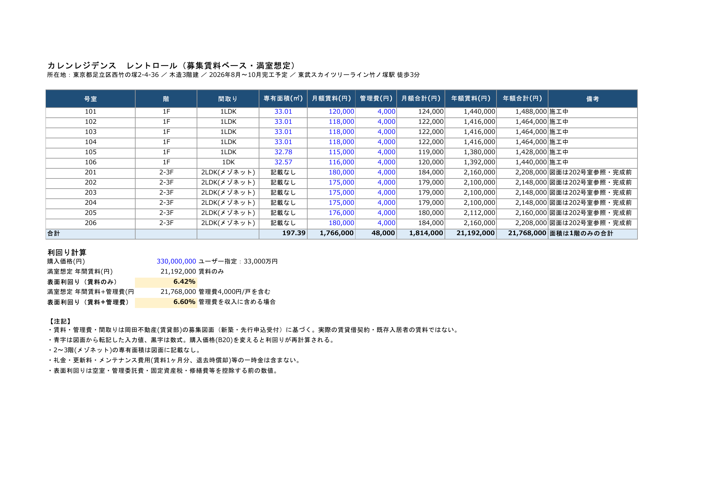
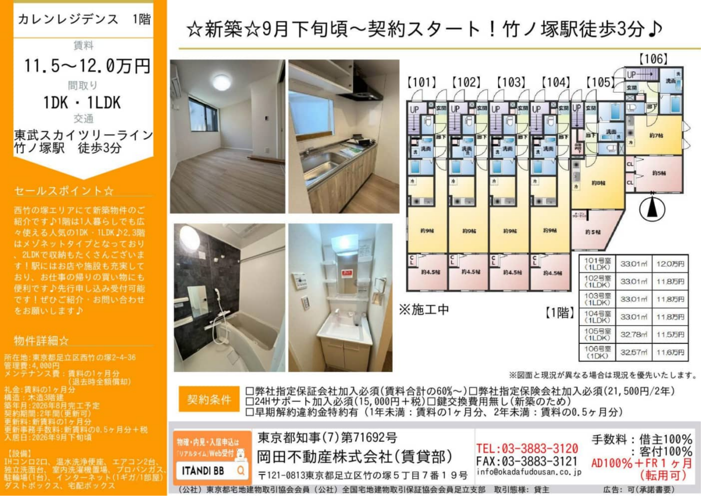
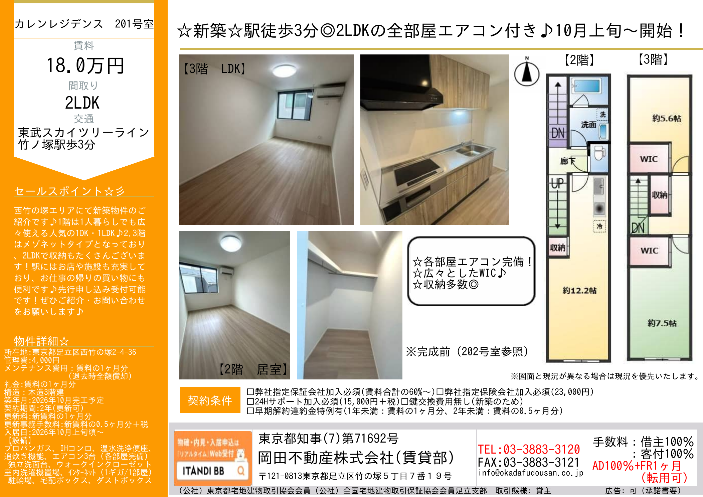
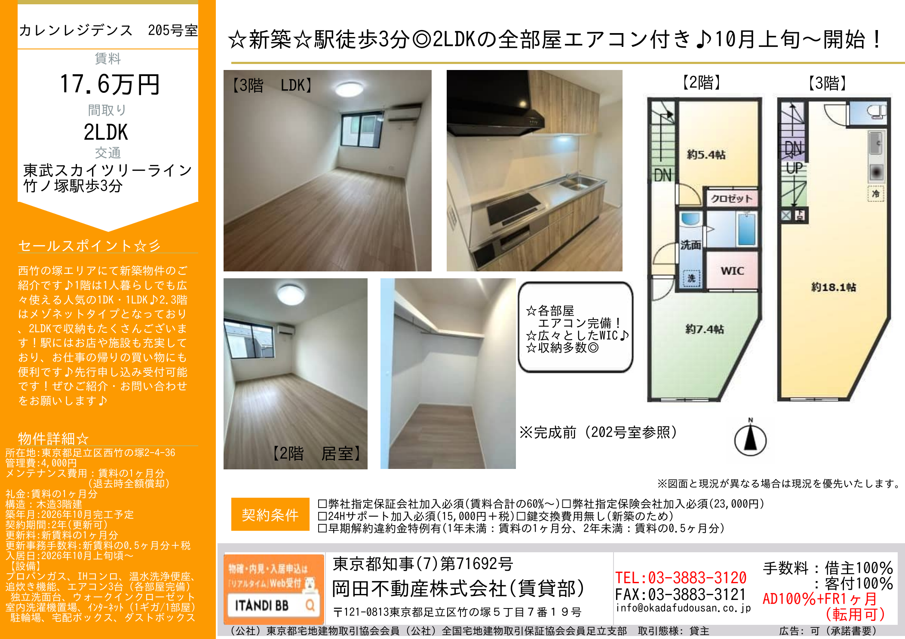

# 🏢 収益物件 投資分析レポート：西竹の塚2丁目 カレンレジデンス (Karen Residence Nishitakenotsuka)

**分析基準日:** 2026年10月5日（**2026年10月7日 最新募集図面・確定レントロール反映アップデート**）  
**対象物件:** 東京都足立区西竹の塚二丁目1325番29（住居表示：東京都足立区西竹の塚2-4-36）  
**売出価格:** **3億3,000万円（税込）**  
**建物スペック:** 2026年8〜10月新築・木造3階建（延床面積 605.17㎡ ／ 土地面積 384.62㎡［近隣商業地域］）・総戸数12戸（1階：1LDK×5戸＋1DK×1戸［計197.39㎡］、2〜3階：2LDKメゾネット×6戸）・劣化対策等級3級相当証明書有  
**確定満室想定年収（岡田不動産 募集図面ベース）:**
- **賃料＋管理費合計:** **年額 21,768,000円（月額 1,814,000円）→ 表面利回り 6.60%**
- **賃料のみ（管理費4,000円/戸除外）:** **年額 21,192,000円（月額 1,766,000円）→ 表面利回り 6.42%**  
**最終投資判定:** **ランク C+（61 / 100点 ｜ 19.6 / 30点）— 条件付推奨（Conditional Buy：売出3.30億円での購入見送り ／ 2.90億〜2.95億円への指値交渉＋満室引渡［または家賃保証］＋融資期間30年以上の融資特約必須）**

---

## 1. エグゼクティブ・サマリーおよび投資判定 (Executive Summary & Verdict)

> [!CAUTION]
> **🚨 重要フォレンジック監査警告（岡田不動産 賃貸部 募集図面［全7枚］・確定レントロール検証による5大リスク要因）**
> 1. **売買マイソク想定年収（2,386.8万円・7.23%）から岡田不動産 募集図面ベース確定年収（2,176.8万円・6.60% ／ 賃料のみ 2,119.2万円・6.42%）への大幅減額が公式資料で完全確定**：
>    - **第1段階（売買マイソク自体の算術誤差 ▲66万円/年）**：売買マイソク下部の集計欄には「想定月額 1,989,000円／想定年額 23,868,000円（表面 7.23%）」と記載されていますが、売買マイソク内の全12戸賃料（1,886,000円）＋共益費（48,000円）を合算すると**月額 1,934,000円／年額 23,208,000円（表面 7.03%）**であり、資料自体に**月額5.5万円（年額66万円）の算術不一致**が存在します。
>    - **第2段階（岡田不動産(株)賃貸部の新築募集図面による確定引き下げ）**：今回入手した貸主・募集元である**岡田不動産株式会社（賃貸部）の公式募集図面（全12戸分）および確定レントロール**により、1階6戸（`101〜106号室`）は売買マイソクと同額（賃料11.5万〜12.0万円＋管理費4,000円）である一方、**2〜3階メゾネット2LDK全6戸（`201〜206号室`）が全室一律で月額▲20,000円引き下げて募集**されていることが確定しました（`201・206号室`：20.0万→**18.0万円**、`202〜204号室`：19.5万→**17.5万円**、`205号室`：19.6万→**17.6万円**、各＋管理費4,000円）。
>    - **確定利回りへのインパクト**：売出価格3億3,000万円に対する確定満室想定年収は、**管理費込みで年額 21,768,000円（表面 6.60%、売買マイソク表面比 ▲210.0万円/年・利回り▲0.63%p）**、**賃料のみ（管理費除外）では年額 21,192,000円（表面 6.42%、同 ▲267.6万円/年・利回り▲0.81%p）**まで低下します。
> 2. **東京都建築安全条例（接道規制）回避のための『1階玄関＋専用内階段2ヶ所（1F→2F→3F）重ね長屋・メゾネット』構造と、募集図面における2〜3階面積「記載なし」の真相**：
>    - 本敷地は北側幅員約4.0m公道に**約3.0mしか接道していない路地状敷地（旗竿地）**です。延床面積500㎡超（605.17㎡）の3階建共同住宅は東京都建築安全条例により原則4.0m以上の接道が求められるため、共用廊下・共用階段を廃し、2・3階住戸（`201〜206号室`）の玄関をすべて1階に配置した**3層トリプレット型メゾネット（建築基準法上の「重ね長屋」形態）**として設計されています。
>    - 売買マイソク上の2LDK面積 `70.48〜71.76㎡` には**2つの専用内階段（1F→2F、2F→3F）およびホール（約12〜15㎡、専有面積の約18〜20%）**が含まれており、実質居室面積（55〜58㎡相当）との体感ギャップが大きいため、**岡田不動産の賃貸募集図面では2〜3階全6戸の専有面積が「記載なし」**（各室の帖数のみ表記）で募集されています。
> 3. **募集図面で判明した『取引態様：貸主（岡田不動産）』および『AD100%＋FR1ヶ月（転用可）』の初期リーシングコスト負担**：
>    - 岡田不動産（賃貸部）の募集図面右下には**「取引態様：貸主」「手数料：借主100%・客付100%」「AD100%＋FR1ヶ月（転用可）」**と明記されています。すなわち1戸成約ごとに**広告料（AD）1ヶ月分＋フリーレント（FR）1ヶ月分（ADへの転用可＝実質2ヶ月分のインセンティブ）**が設定されており、全12戸を満室化する際の初期リーシング費用（賃料2ヶ月分相当＝**約353.2万〜388.5万円**）を売主・貸主側が負担するのか買主が負担するのかが極めて重大な交渉焦点となります。
> 4. **東京23区・駅徒歩3分の新築でありながら『プロパンガス（LPガス）』採用**：
>    - 募集図面の設備欄に**「プロパンガス」**と明記されています。竹ノ塚駅徒歩3分の商業地域でありながら都市ガスではなくLPガスが採用されているため、特に2LDKファミリー層における冬場のガス代負担が賃料の上値を抑える要因となっています（無償貸与設備の残存債務有無の確認が必須）。
> 5. **『劣化対策等級3級相当の証明書』の金融機関審査リスクおよび23年目の減価償却消滅の崖**：
>    - 木造法定耐用年数（22年）を超える30年融資の承認が投資成立の絶対条件です（万一22年融資に制限された場合、初年度税引後CFは**+22.1万円［利回り0.07%］**へと枯渇します）。また30年融資承認時も**22年目で建物減価償却（年約473万円）が終了**するため、築10〜15年目での売却（Exit）を前提とした出口戦略が不可欠です。

### 1.1 主要財務・バリュエーション比較総括表（5シナリオ精密比較）

| 主要指標 (Key Metrics) | ① 売買マイソク表面 (3.30億 / 年2,386.8万) | ② 売買マイソク表合算 (3.30億 / 年2,320.8万) | ③ **募集図面確定［管理費込］** **(3.30億 / 年2,176.8万)** | ④ **募集図面確定［賃料のみ］** (3.30億 / 年2,119.2万) | ⑤ **指値目標・推奨シナリオ** **(2.95億 / 年2,176.8万)** |
| :--- | :---: | :---: | :---: | :---: | :---: |
| **売買価格（税込）** | 3億3,000万円 | 3億3,000万円 | **3億3,000万円** | 3億3,000万円 | **2億9,500万円 (▲10.6%)** |
| **満室想定年間収入 (GPI)** | 2,386.8万円 | 2,320.8万円 (▲66万) | **2,176.8万円 (▲210.0万)** | **2,119.2万円 (▲267.6万)** | **2,176.8万円 (募集図面確定)** |
| **表面利回り (Gross Yield)** | 7.23% | 7.03% | **6.60% (管理費4千円/戸込)** | **6.42% (賃料のみ)** | **7.38% (賃料のみ 7.18%)** |
| **実効総収入 (EGI、空室5%控除)** | 2,267.5万円 | 2,204.8万円 | **2,068.0万円** | 2,013.2万円 | **2,068.0万円** |
| **正規化運営経費 (OPEX、PM・固都税等)** | 377.3万円 (15.81%) | 374.0万円 (16.12%) | **366.8万円 (16.85%)** | 364.0万円 (17.17%) | **366.8万円 (16.85%)** |
| **実効営業純利益 (Effective NOI)** | 1,890.1万円 | 1,830.7万円 | **1,701.1万円** | 1,649.3万円 | **1,701.1万円** |
| **実質利回り (Effective Cap Rate)** | 5.73% | 5.55% | **5.15%** | **5.00%** | **5.77%** |
| **融資条件 (LTV 80% / 金利2.2% / 30年)** | 2億6,400万円 | 2億6,400万円 | **2億6,400万円** | 2億6,400万円 | **2億3,600万円** |
| **年間元利返済額 (ADS、30年)** | 1,202.9万円 | 1,202.9万円 | **1,202.9万円** | 1,202.9万円 | **1,075.3万円** |
| **税引前キャッシュフロー (BTCF)** | +687.2万円 (2.08%) | +627.8万円 (1.90%) | **+498.2万円 (1.51%)** | +446.4万円 (1.35%) | **+625.8万円 (2.12%)** |
| **推定法人税額 (実効税率25%)** | 210.6万円 | 195.8万円 | **163.4万円** | 150.4万円 | **191.2万円** |
| **税引後キャッシュフロー (ATCF)** | +476.6万円 (1.44%) | +432.0万円 (1.31%) | **+334.8万円 (1.01%)** | +296.0万円 (0.90%) | **+434.6万円 (1.47%)** |
| **DSCR（返済余裕率）/ ICR** | 1.57倍 / 2.47倍 | 1.52倍 / 2.36倍 | **1.41倍 / 2.14倍** | 1.37倍 / 2.05倍 | **1.58倍 / 2.49倍** |
| **債務償還年数 (Debt Redemption Yrs)** | 23.9年 | 24.9年 | **27.4年** | 28.6年 | **23.7年 (優良基準クリア)** |
| **損益分岐稼働率 (BEP Occupancy)** | 66.2% (4.1室余裕) | 67.9% (3.8室余裕) | **72.1% (3.3室余裕)** | 73.9% (3.1室余裕) | **66.3% (4.0室余裕)** |
| **初期必要自己資金 (頭金20%＋諸費用)** | 9,121.9万円 | 9,121.9万円 | **9,121.9万円** | 9,121.9万円 | **8,239.2万円** |
| **自己資金配当率 (Pre-tax / Post-tax CCR)** | 7.53% / 5.22% | 6.88% / 4.74% | **5.46% / 3.67%** | 4.89% / 3.24% | **7.60% / 5.28%** |
| **標準銀行積算評価 (路地状補正▲15%反映)** | 2億5,000万円 (75.8%) | 2億5,000万円 (75.8%) | **2億5,000万円 (75.8%)** | 2億5,000万円 (75.8%) | **2億5,000万円 (84.7%)** |

---

## 2. 物件概要および岡田不動産『賃貸募集図面（全7枚）』による新規判明事項の監査

### 2.1 物件基本スペック一覧（売買マイソク × 岡田不動産 賃貸募集図面 クロスチェック）

| 区分 | 項目 | 詳細内容（売買マイソクおよび岡田不動産 募集図面の照合結果） |
| :--- | :--- | :--- |
| **所在地・交通** | **物件名称** | 西竹の塚2丁目 カレンレジデンス (Karen Residence Nishitakenotsuka) |
| | **所在地（地番 / 住居表示）** | 地番：東京都足立区西竹の塚二丁目1325番29 ／ **住居表示：東京都足立区西竹の塚2-4-36**（募集図面にて確定） |
| | **交通アクセス** | 東武スカイツリーライン（東京メトロ日比谷線直通）**「竹ノ塚」駅 西口 徒歩3分（実測約270m・平坦）** |
| **土地情報** | **土地面積・権利** | **384.62㎡（約116.35坪）** ／ 所有権 ／ 地目：宅地 |
| | **都市計画・用途地域** | 市街化区域 ／ **近隣商業地域**（建蔽率80%・指定容積率300%［前面道路基準240%制限、消化157.34%］） |
| | **接道状況（重要）** | **北側 幅員約4.00m 公道（建築基準法第42条1項1号道路）に約3.0m接面（路地状敷地／旗竿地）** |
| **建物情報** | **構造・規模** | **木造地上3階建**・劣化対策等級3級相当の証明書有 |
| | **各階床面積** | 1階：209.04㎡ ／ 2階：199.10㎡ ／ 3階：197.03㎡ → **合計延床面積：605.17㎡（約183.06坪）** |
| | **段階的完工・入居時期** | **1階（101〜106号室）：2026年8月完工予定・9月下旬頃〜契約開始（※施工中）** **2〜3階（201〜206号室）：2026年10月完工予定・10月上旬頃〜入居開始（※完成前・202号室写真参照）** |
| | **施工会社 / 賃貸募集貸主** | 施工：**ハウスリンクホーム株式会社** ／ 賃貸募集上の貸主：**岡田不動産株式会社（賃貸部）**［東京都知事(7)第71692号、足立区竹の塚5-7-19］ |
| | **総戸数・確定間取り内訳** | **全12戸**： ・1階：**1LDK×5戸**（`101〜104`：33.01㎡、`105`：32.78㎡）＋ **1DK×1戸**（`106`：32.57㎡）［1階専有面積合計 **197.39㎡**］ ・2〜3階：**2LDKメゾネット×6戸**（`201〜206`：賃貸募集図面では専有面積「記載なし」／売買マイソク上は70.48〜71.76㎡［1階玄関・階段含］） |
| | **各戸設備仕様（募集図面確定）** | **プロパンガス（LPガス）**、IHコンロ（2口）、追焚機能付バス、温水洗浄便座、独立洗面台、室内洗濯機置場、**エアコン全室完備（1階住戸：各2台 ／ 2〜3階住戸：各3台）**、ウォークインクローゼット（2〜3階）、**インターネット無料（1ギガ/1部屋）**、オートロック、防犯カメラ、宅配ボックス、ダストボックス、駐輪場（12台） |
| **賃貸契約条件** | **一時金・保証・違約金特約** | ・**礼金：賃料の1ヶ月分**（※表面利回りには算入せず） ・**メンテナンス費用：賃料の1ヶ月分（退去時全額償却）** ・**契約期間：2年（更新可）** ／ 更新料：新賃料1ヶ月分 ／ 更新事務手数料：新賃料0.5ヶ月分＋税 ・指定保証会社必須（賃料合計の60%〜）、指定火災保険必須（1階21,500円・2〜3階23,000円/2年）、24Hサポート必須（15,000円＋税） ・**早期解約違約金特例有（1年未満：賃料1ヶ月分、2年未満：賃料0.5ヶ月分）** ・**仲介手数料・募集条件：借主100%・客付100% ／ AD100%＋FR1ヶ月（転用可）** |

---

## 3. 立地・商圏および主要4大拠点への通勤アクセス検証 (Location, Demographics & Transit Access)

### 3.1 竹ノ塚駅の高架化完了（2022年3月）と商業施設『EQUiA竹ノ塚』（2024年5月開業）のシナジー
- **鉄道高架化と駅前再整備による資産価値の底上げ**：
  - 2022年3月に東武スカイツリーライン竹ノ塚駅付近の連続立体交差事業（高架化）が完了し、長年の課題であった「開かずの踏切」が完全に解消されました。さらに2024年5月23日には高架下商業施設**『EQUiA（エキア）竹ノ塚』（全24店舗）**が開業し、駅周辺の回遊性と生活利便性が劇的に向上しています。
- **西口徒歩3分×近隣商業地域の高い利便性**：
  - 本物件（`西竹の塚2-4-36`）は竹ノ塚駅西口から徒歩3分、24時間営業の大型スーパー「西友（SEIYU）竹の塚店」やドラッグストア、クリニック、飲食店が徒歩2〜4分圏内に揃う平坦な近隣商業地域に位置しており、特に1階1LDK・1DK（単身・DINKs層）の賃貸需要は極めて底堅い立地です。

### 3.2 東京都心主要4大ターミナルへの通勤所要時間

| 主要到達駅 | 利用ルート・乗換回数（竹ノ塚駅発） | 所要時間（乗車時間） | 通勤利便性評価 |
| :--- | :--- | :---: | :--- |
| **① 上野駅** | 東武スカイツリーライン（東京メトロ日比谷線直通）・**乗換なし（0回）** | **約20〜22分** | **最良（当駅始発列車も多く、座って都心へ直通通勤が可能）** |
| **② 大手町・東京駅** | 東武スカイツリーライン → `北千住`駅で東京メトロ千代田線直通へ乗換（1回） | **約32〜35分** | **優秀（北千住駅での対面・同階層乗換で大手町金融街へ直結）** |
| **③ 秋葉原・銀座・六本木** | 東京メトロ日比谷線直通・**乗換なし（0回）** | **秋葉原25分 / 銀座37分 / 六本木46分** | **優秀（乗換ゼロで主要オフィス・商業エリアを網羅）** |
| **④ 新宿駅** | `北千住`駅 → 千代田線・JR山手線/中央線経由 | **約45〜50分** | **標準（城東エリアのため新宿・渋谷方面は45分以上要する）** |

---

## 4. 積算評価（原価法）および土地・建物担保価値の4段階精密査定 (Reproduction Cost & Collateral Valuation)

### 4.1 土地積算価格と路地状敷地（旗竿地：接道3.0m）補正の検証
- **公的価格ベンチマーク（2025〜2026年 足立区西竹の塚 公示地価・基準地価）**：
  - 近隣商業地域の代表基準地価（`足立区西竹の塚2-2-8`、駅徒歩2分）：**675,000円/㎡（坪単価 約223.1万円、前年比+6.64%上昇）**。
  - 近隣住宅地の公示地価（`足立区西竹の塚1-3-23`、2026年）：**403,000円/㎡（前年比+4.95%上昇）**。
  - 本物件（`西竹の塚2-4-36`、駅徒歩3分、近隣商業地域、北側4.0m道路）の整形地ベースの推定公示地価相当額は**約560,000円/㎡**、相続税路線価（公示地価の約80%）は**約450,000円/㎡**と推計されます。
- **路地状敷地（接道約3.0m）の形状減価補正（▲15%）**：
  - 敷地384.62㎡に対し接道間口が約3.0mの旗竿形状であるため、金融機関の担保評価および財産評価基準に基づき**不整形地・路地状敷地補正率 0.85（▲15%）**を適用し、保守的な実効路線価単価を **`382,500円/㎡`（`450,000円 × 0.85`）** と査定します。

### 4.2 積算評価4段階シナリオ比較テーブル（延床 605.17㎡・木造新築・残存22/22年）

| 積算評価シナリオ | 採用土地単価 | 建物再調達単価 | 土地積算価格 (384.62㎡) | 建物積算価格 (605.17㎡) | **積算評価合計** | **売出価格(3.30億)比** | **指値目標(2.95億)比** |
| :--- | :---: | :---: | :---: | :---: | :---: | :---: | :---: |
| **① 銀行保守基準（厳格審査）** | 382,500円/㎡ (補正後) | 150,000円/㎡ | 1億4,711.7万円 | 9,077.6万円 | **2億3,789.3万円** | **72.1%** | **80.6%** |
| **② 標準銀行担保基準（推奨ベース）** | **382,500円/㎡ (補正後)** | **170,000円/㎡** | **1億4,711.7万円** | **1億287.9万円** | **2億4,999.6万円** | **75.8%** | **84.7%** |
| **③ 国税庁・路線価無補正基準** | 450,000円/㎡ (路線価原単価) | 180,000円/㎡ | 1億7,307.9万円 | 1億893.1万円 | **2億8,201.0万円** | **85.5%** | **95.6%** |
| **④ 実勢・公示地価ベース** | 476,000円/㎡ (公示×0.85) | 220,000円/㎡ | 1億8,307.9万円 | 1億3,313.7万円 | **3億1,621.7万円** | **95.8%** | **107.2%** |

---

## 5. レントロール完全照合監査：岡田不動産（賃貸部）募集図面 全7枚の徹底解剖 (Rent Roll Forensic Audit)

### 5.1 1階（101〜106号室）および2〜3階（201〜206号室）の募集図面・間取りフォレンジック

今回提出された**岡田不動産株式会社（賃貸部）の募集図面（全7ページ）**により、売買マイソクだけでは分からなかった以下の重要事実が完全に裏付けられました。

1. **1階住戸（`101〜106号室`、専有面積合計 197.39㎡）の詳細構成**：
   - `101号室`（33.01㎡、1LDK：LDK約9帖＋洋室約4.5帖）：月額賃料 **120,000円** ＋ 管理費 **4,000円** ＝ **124,000円**
   - `102〜104号室`（各33.01㎡、1LDK：LDK約9帖＋洋室約4.5帖）：月額賃料 **118,000円** ＋ 管理費 **4,000円** ＝ **122,000円**
   - `105号室`（32.78㎡、1LDK：LDK約8帖＋洋室約5帖）：月額賃料 **115,000円** ＋ 管理費 **4,000円** ＝ **119,000円**
   - `106号室`（32.57㎡、**1DK**：DK約7帖＋洋室約5帖）：月額賃料 **116,000円** ＋ 管理費 **4,000円** ＝ **120,000円**（※売買マイソクでは1LDKと記載されていましたが、実際の募集図面ではDK約7帖の**1DK表記**であることが判明）
2. **2〜3階メゾネット住戸（`201〜206号室`）の3タイプ別レイアウトと一律▲2.0万円値下げの確定**：
   - **タイプA（`201・202・203・204号室`）**：1階専用玄関から内階段で2階へ上がると**LDK約12.2帖＋洗面・浴室・トイレ＋収納**があり、さらに内階段で3階へ上がると**洋室約5.6帖＋洋室約7.5帖＋WIC 2ヶ所**が配置された標準メゾネット。募集賃料は`201号室`（端部屋）が**180,000円**、`202〜204号室`（中部屋）が**175,000円**（各＋管理費4,000円）。
   - **タイプB（`205号室`）**：**2階に洋室2室（約5.4帖＋約7.4帖＋WIC＋クローゼット）と水回り（洗面・浴室・トイレ）**を配置し、**3階全体を約18.1帖の大型LDK**とした3階リビング型メゾネット。募集賃料は**176,000円**（＋管理費4,000円）。
   - **タイプC（`206号室`）**：**2階にLDK約14.1帖＋大型収納**を配置し、**3階に洋室約5帖（オープンクローゼット）＋洋室約7.4帖（WIC）＋水回り（洗面・浴室・トイレ）**を配置した角部屋メゾネット。募集賃料は**180,000円**（＋管理費4,000円）。
   - **専有面積「記載なし」の理由**：売買マイソクに記載された`70.48〜71.76㎡`には1F→2Fおよび2F→3Fの2つの階段室・廊下（約12〜15㎡）が含まれるため、賃貸募集図面では面積表記を「記載なし」とし、各部屋の帖数表記のみで募集が行われています。
3. **初期費用・一時金（礼金1ヶ月・メンテナンス費用1ヶ月全額償却）と募集インセンティブ（AD100%＋FR1ヶ月）のトレードオフ**：
   - 募集図面では借主に対し「礼金1ヶ月＋メンテナンス費用1ヶ月（退去時全額償却）」を求めていますが、同時に仲介業者向けに**「AD100%＋FR1ヶ月（転用可）」**を提供しています。実務上、竹ノ塚エリアのLPガス物件で礼金1ヶ月＋償却1ヶ月を満額徴収して早期満室化することは容易ではないため、FR1ヶ月分や礼金免除（ゼロゼロ化）が成約時の交渉カードとして使われる構造となっています。

### 5.2 全12戸 確定レントロール比較表（売買マイソク vs 岡田不動産 募集図面確定値）

| 号室 | 階層 | 間取り (募集図面確定) | 専有面積(㎡) ［売買マイソク］ | ① 売買マイソク 月額合計(賃料+共益費) | ② **募集図面確定** **月額賃料(円)** | ③ **募集図面確定** **管理費(円)** | ④ **募集図面確定** **月額合計(円)** | ⑤ **年額賃料(円)** (賃料のみ) | ⑥ **年額合計(円)** (賃料+管理費) | 売買マイソク比 (④ - ①, 月額) | 備考（募集図面記載） |
| :---: | :---: | :---: | :---: | :---: | :---: | :---: | :---: | :---: | :---: | :---: | :--- |
| **101** | 1F | 1LDK | **33.01** | ¥124,000 (120k+4k) | **120,000** | **4,000** | **124,000** | 1,440,000 | 1,488,000 | ±¥0 | 施工中（LDK9帖+洋4.5帖） |
| **102** | 1F | 1LDK | **33.01** | ¥122,000 (118k+4k) | **118,000** | **4,000** | **122,000** | 1,416,000 | 1,464,000 | ±¥0 | 施工中（LDK9帖+洋4.5帖） |
| **103** | 1F | 1LDK | **33.01** | ¥122,000 (118k+4k) | **118,000** | **4,000** | **122,000** | 1,416,000 | 1,464,000 | ±¥0 | 施工中（LDK9帖+洋4.5帖） |
| **104** | 1F | 1LDK | **33.01** | ¥122,000 (118k+4k) | **118,000** | **4,000** | **122,000** | 1,416,000 | 1,464,000 | ±¥0 | 施工中（LDK9帖+洋4.5帖） |
| **105** | 1F | 1LDK | **32.78** | ¥119,000 (115k+4k) | **115,000** | **4,000** | **119,000** | 1,380,000 | 1,428,000 | ±¥0 | 施工中（LDK8帖+洋5帖） |
| **106** | 1F | **1DK** | **32.57** | ¥120,000 (116k+4k) | **116,000** | **4,000** | **120,000** | 1,392,000 | 1,440,000 | ±¥0 | 施工中（**DK7帖+洋5帖**） |
| **201** | 2-3F | 2LDK(メゾネット) | 記載なし [70.48] | ¥204,000 (200k+4k) | **180,000** | **4,000** | **184,000** | 2,160,000 | 2,208,000 | **▲¥20,000 (-9.8%)** | 図面は202参照・完成前 |
| **202** | 2-3F | 2LDK(メゾネット) | 記載なし [70.48] | ¥199,000 (195k+4k) | **175,000** | **4,000** | **179,000** | 2,100,000 | 2,148,000 | **▲¥20,000 (-10.1%)** | 図面は202参照・完成前 |
| **203** | 2-3F | 2LDK(メゾネット) | 記載なし [70.48] | ¥199,000 (195k+4k) | **175,000** | **4,000** | **179,000** | 2,100,000 | 2,148,000 | **▲¥20,000 (-10.1%)** | 図面は202参照・完成前 |
| **204** | 2-3F | 2LDK(メゾネット) | 記載なし [70.48] | ¥199,000 (195k+4k) | **175,000** | **4,000** | **179,000** | 2,100,000 | 2,148,000 | **▲¥20,000 (-10.1%)** | 図面は202参照・完成前 |
| **205** | 2-3F | 2LDK(メゾネット) | 記載なし [70.93] | ¥200,000 (196k+4k) | **176,000** | **4,000** | **180,000** | 2,112,000 | 2,160,000 | **▲¥20,000 (-10.0%)** | 3F 18.1帖LDK・完成前 |
| **206** | 2-3F | 2LDK(メゾネット) | 記載なし [71.76] | ¥204,000 (200k+4k) | **180,000** | **4,000** | **184,000** | 2,160,000 | 2,208,000 | **▲¥20,000 (-9.8%)** | 2F 14.1帖LDK・完成前 |
| **合計** | **全12戸** | - | **1F計: 197.39㎡** *(全体: 614.00㎡)* | **表合算: 1,934,000** *(表面記載: 1,989,000)* | **1,766,000** | **48,000** | **1,814,000** | **21,192,000** **(表面 6.42%)** | **21,768,000** **(表面 6.60%)** | **表比 ▲120,000/月** *(表面比 ▲175,000/月)* | **2LDK全6戸が一律月▲2万円引下げ確定** |

---

## 6. 運営経費(OPEX)の正規化および純営業収益(NOI)モデリング (Normalized OPEX & NOI Analysis)

| 経費項目 (OPEX Item) | ① 売買マイソク表面基準 (GPI 2,386.8万円) | ② **募集図面確定［管理費込］** **(GPI 2,176.8万円・6.60%)** | ③ **募集図面確定［賃料のみ］** **(GPI 2,119.2万円・6.42%)** | 算出根拠および税務・実務検証内容 |
| :--- | :---: | :---: | :---: | :--- |
| **1. PM賃貸管理委託手数料 (5.0%)** | ¥1,193,400 | **¥1,088,400** | **¥1,059,600** | 集金代行・クレーム対応・精算業務（回収家賃総額の5.0%基準） |
| **2. 共用部光熱費・定期清掃・1ギガ無料ネット費** | ¥540,000 | **¥540,000** | **¥540,000** | 定期清掃（月1.8万）＋共用電気・オートロック・防犯カメラ（月0.9万）＋全12戸無料ネットISP［1ギガ/室］（月1.8万）＝月4.5万円 |
| **3. 固定資産税・都市計画税（年間平準化）** | ¥1,320,000 | **¥1,320,000** | **¥1,320,000** | 土地（小規模住宅用地1/6・1/3特例後 年約42.9万円）＋新築建物（1〜3年目減額後の平準化 約89.1万円） |
| **4. 火災・地震・施設賠償責任保険（年換算）** | ¥180,000 | **¥180,000** | **¥180,000** | 木造605.17㎡・劣化対策等級3級想定の年間保険料 |
| **5. 退去時原状回復・再募集AD引当金** | ¥240,000 | **¥240,000** | **¥240,000** | 年平均2戸回転想定、オーナー負担AD引当（※メンテナンス費用1ヶ月償却により原状回復費は一部カバー可能） |
| **6. 外壁・屋根・設備予防修繕積立金 (CapEx)** | ¥300,000 | **¥300,000** | **¥300,000** | 1戸あたり月約2,080円（年30万円）の長期修繕留保 |
| **正規化運営経費 (OPEX) 合計** | **¥3,773,400 (15.81%)** | **¥3,668,400 (16.85%)** | **¥3,639,600 (17.17%)** | **対EGI（95%稼働）経費率：16.64% 〜 18.08%** |
| **実効営業純利益 (Effective NOI、95%稼働)** | **¥18,901,200 (Cap 5.73%)** | **¥17,011,200 (Cap 5.15%)** | **¥16,492,800 (Cap 5.00%)** | **満室(100%)基準NOI：¥18,099,600（管理費込） ／ ¥17,552,400（賃料のみ）** |

---

## 7. モアビズ（Moabiz）第4期決算書に対する適合性判定および融資ストラクチャー分析

### 7.1 モアビズ第4期決算書ベースラインとの3列着地比較（募集図面確定レントロール反映）

| 決算書デザイン7大指標 | モアビズ第4期ベースライン (現行決算書 C列) | **シナリオA：売出3.30億単体** (募集図面確定GPI 2,176.8万) | **シナリオA 組入後合算着地** (3.30億＋募集図面確定) | **シナリオB：指値2.95億合算着地** (2.95億＋募集図面確定・**推奨**) |
| :--- | :---: | :---: | :---: | :---: |
| **資産総額 ／ 借入金総額** | ¥267.5M / ¥242.7M | ¥330.0M / ¥264.0M | ¥597.5M / ¥506.7M | **¥562.5M / ¥478.7M** |
| **1. 帳簿上 税引前当期純利益 (EBT)** | ¥684,020 | +¥10,652,074 | **+¥11,336,094** | **+¥12,030,050 (大幅黒字)** |
| **2. 税引後手残り Cash Flow (ATCF)** | ¥3,221,079 | +¥2,503,146 (0.76%) | **+¥5,727,420 (0.96%)** | **+¥6,829,726 (1.21%)** |
| **3. 債務償還年数 (Debt Redemption Yrs)** | **33.2年 (要注意)** | 20.8年 (ネゴ時18.5年) | **25.3年 (▲7.9年短縮改善!)** | **23.9年 (▲9.3年短縮改善!)** |
| **4. 簡易 Cash Flow (税引後純益+償却-元金)** | ¥3,221,079 | +¥6,436,075 | **+¥9,660,349** | **+¥10,345,526** |
| **5. ICR (インタレスト・カバレッジ)** | **1.15倍** | 2.17倍 (ネゴ時2.52倍) | **1.72倍 (+0.57倍改善!)** | **1.88倍 (+0.73倍改善!)** |
| **6. DSCR (負債返済余裕率)** | **1.39倍** | 1.76倍 (ネゴ時1.93倍) | **1.61倍 (+0.22倍改善!)** | **1.69倍 (+0.30倍改善!)** |
| **7. 固定資産税評価ベース LTV** | **263.2% (過大)** | 176.7% (ネゴ時157.9%) | **209.7% (▲53.5%p圧縮!)** | **198.1% (▲65.1%p圧縮!)** |

### 7.2 3大加重年数体系の検証（`減価償却年数 A >= 融資年数 B >= 償還年数 C`）
- **加重減価償却年数 (A)**：現行 18.8年 → 組入後 **20.5〜20.6年（+1.7〜1.8年延長）**
- **加重融資年数 (B)**：現行 32.6年 → 組入後 **31.1〜31.2年（▲1.5年短縮）** ※木造法定耐用年数22年に対し30年融資を引くため `A(22年) < B(30年)` の構造的ギャップは残存し、23年目に減価償却消滅の崖が到来します。
- **加重債務償還年数 (C)**：現行 **33.2年（`B < C` 違反）** → 組入後 **23.9〜25.3年（▲7.9〜9.3年短縮改善！）** により **`償還年数(C) <= 融資年数(B)` の健全性基準を達成**します。

---

## 8. 指値交渉（Price Negotiation）シナリオおよび10年保有イグジット（Exit）試算

| 取得価格シナリオ | 売買価格 | 募集図面確定 表面利回り ［管理費込 / 賃料のみ］ | 実効Cap Rate (95%稼働) | 借入額 (LTV 80%) | 初期必要自己資金 (頭金＋諸費用) | 年間税引前CF (BTCF) | 年間税引後CF (ATCF) | DSCR / 債務償還年数 | 投資判定 |
| :--- | :---: | :---: | :---: | :---: | :---: | :---: | :---: | :---: | :---: |
| **売出価格 (Asking)** | **3億3,000万円** | **6.60% / 6.42%** *(売買マイソク 7.23%)* | 5.15% | 2億6,400万円 | 9,121.9万円 | +498.2万円 | +334.8万円 | 1.41倍 / 27.4年 | ❌ **見送り（2LDK一律▲2万円値下げ未反映）** |
| **第1妥協ライン (▲6.1%)** | **3億1,000万円** | **7.02% / 6.84%** | 5.49% | 2億4,800万円 | 8,617.5万円 | +571.1万円 | +391.9万円 | 1.50倍 / 24.7年 | ⚠️ **満室引渡・AD売主負担時のみ検討可** |
| **目標指値 (▲10.6%)** | **2億9,500万円** | **7.38% / 7.18%** | **5.77%** | **2億3,600万円** | **8,239.2万円** | **+625.8万円** | **+434.6万円** | **1.58倍 / 23.7年** | ✅ **条件付買付推奨 (Target Buy)** |
| **積極指値 (▲13.6%)** | **2億8,500万円** | **7.64% / 7.44%** | **5.97%** | **2億2,800万円** | **7,987.0万円** | **+662.3万円** | **+463.2万円** | **1.64倍 / 22.7年** | 🏆 **最優先買付ライン (Strong Buy)** |

---

## 9. ハザード（荒川浸水想定）・建築安全条例・LPガスおよび金利ストレステスト

### 9.1 足立区洪水ハザードマップ（荒川・綾瀬川氾濫リスク）
- 足立区公式「洪水・内水・高潮ハザードマップ（2026年最新版）」において、西竹の塚2丁目付近は荒川氾濫時に**最大浸水深 0.5m〜3.0m未満（1階床上浸水相当）**の区域に指定されています。1階住戸（`101〜106`）および2・3階住戸の1階玄関が浸水リスクに晒されるため、火災保険における**水災補償特約の付帯が必須**です。

### 9.2 金利上昇および空室複合ストレステスト（岡田不動産 募集図面確定GPI 2,176.8万円基準）

| ストレスシナリオ | 売出価格 3.30億円 (借入2.64億 / 30年) 税引前CF / 税引後CF / DSCR | **目標指値 2.95億円 (借入2.36億 / 30年)** **税引前CF / 税引後CF / DSCR** | 財務耐性評価 |
| :--- | :---: | :---: | :--- |
| **ベース (金利2.2% / 稼働95%)** | +498.2万 / +334.8万 / 1.41倍 | **+625.8万 / +434.6万 / 1.58倍** | 売出価格では自己資金利回り(税引後3.67%)が低迷 |
| **金利 +0.5%p上昇 (2.7% / 稼働95%)** | +330.1万 / +199.1万 / 1.25倍 | **+475.6万 / +313.4万 / 1.39倍** | 指値2.95億なら金利2.7%でも税引後年313万円の黒字確保 |
| **金利 +1.0%p上昇 (3.2% / 稼働95%)** | +153.4万 / +56.4万 / 1.10倍 | **+317.6万 / +185.8万 / 1.23倍** | 売出価格はDSCR 1.10倍へ悪化 ／ 指値ならDSCR 1.23倍維持 |
| **複合危機 (金利3.0%＋稼働85%［2室空室］)** | +9.4万 / **▲46.2万 (税引後赤字)** / 1.01倍 | **+168.0万 / +71.2万 (税引後黒字)** / 1.13倍 | **売出価格では税引後赤字転落 ／ 指値2.95億なら黒字防衛！** |

---

## 10. 総合意思決定スコアカードおよび買付（LOI）・DD実行ガイド (Decision Scorecard & Playbook)

### 10.1 6大領域 意思決定スコアカード（30点満点 ／ 100点換算）

| 評価領域 (Evaluation Pillar) | 配点 | 得点 | 100点換算 | 評価根拠 (Conservative Institutional Standard) |
| :--- | :---: | :---: | :---: | :--- |
| **1. 価格妥当性・担保評価力** | 5.0 | **2.8** | 9.3 / 16.7 | 近隣商業地域116.35坪・延床183坪により積算比率（75.8%）は新築木造として良好だが、募集図面確定利回りは6.60%（賃料のみ6.42%）であり売出3.30億円は約3,500万円割高 |
| **2. 立地・賃貸需要の底堅さ** | 5.0 | **3.9** | 13.0 / 16.7 | 竹ノ塚駅徒歩3分（高架化完了・エキア開業・日比谷線直通）・西友隣接で1階1LDK/1DK需要は極めて強いが、2LDKメゾネットは一律▲2万円値下げ（17.5万〜18.0万円）での募集が実態 |
| **3. 建物仕様・間取り競争力** | 5.0 | **2.9** | 9.7 / 16.7 | 2026年新築・劣化3級・全室エアコン（1F 2台/2-3F 3台）・1ギガ無料ネット・追焚・WICは魅力だが、**プロパンガス採用**および**2LDKの1F〜3F内階段2ヶ所（面積非表記）**が弱点 |
| **4. 将来資産価値・出口戦略** | 5.0 | **3.6** | 12.0 / 16.7 | 駅徒歩3分・近隣商業地域384.62㎡の土地価値が出口価格を下支えするが、北側3.0m接道の路地状敷地が将来の大型再開発売却時のディスカウント要因 |
| **5. キャッシュフロー・決算書適合性** | 5.0 | **3.3** | 11.0 / 16.7 | 30年融資承認時はモアビズ償還年数（33.2→23.9年）および税務LTV（263→198〜210%）を大幅改善するが、初期リーシング費用（AD100%＋FR1ヶ月）と23年目の償却消滅の崖に要注意 |
| **6. 法規・ハザード・コンプライアンス** | 5.0 | **3.1** | 10.3 / 16.7 | 荒川浸水想定0.5〜3.0m区域、東京都建築安全条例（接道3.0m）に伴う重ね長屋構造、およびLPガス無償貸与契約内容の精査が必須 |
| **総合スコア (Total Score)** | **30.0** | **19.6点** | **61 / 100点** | **判定ランク：C+（条件付推奨 Conditional Buy — 指値・特約必須）** |

### 10.2 買付申込書（LOI）提出条件および必須4大特約条項
1. **指値目標価格**：**2億9,000万円 〜 2億9,500万円**
   - **指値の明確な根拠（岡田不動産 募集図面エビデンス提示）**：
     - 売出マイソクは表面利回り **7.23%（年額2,386.8万円）** を前提に3億3,000万円の値付けがされていますが、実際の岡田不動産（賃貸部）募集図面では2LDK全6戸が各月▲2.0万円引き下げられており、確定満室想定は **年額2,176.8万円（表面6.60% ／ 賃料のみでは年額2,119.2万円・表面6.42%）** です。
     - 売出マイソクが本来意図していた表面利回り（約7.23%〜7.38%）を、岡田不動産の確定募集賃料（年額2,176.8万円）に当てはめて逆算すると、`2,176.8万円 ÷ 7.23% ＝ 3億108万円`、`2,176.8万円 ÷ 7.38% ＝ 2億9,496万円`（賃料のみ2,119.2万円÷7.23%＝**2億9,311万円**）となり、**2億9,000万〜2億9,500万円こそが募集実態に合致した論理的適正価格**です。
2. **必須特約条項**：
   - **① 融資特約**：劣化対策等級3級証明書に基づき、**融資金額2億3,600万円（LTV 80%）以上・融資期間30年以上・金利年2.25%以下**の融資承認を条件とする白紙解除特約。
   - **② 満室引渡またはサブリース保証＋募集費用（AD100%＋FR1ヶ月）売主負担特約**：募集図面に設定されている「AD100%＋FR1ヶ月（転用可）」（全12戸で約353万〜388万円相当）および初期リーシング完了までの空室リスクをすべて売主（または貸主の岡田不動産）負担とし、決済時までに満室引渡（または12ヶ月間の確定募集賃料保証）を行うこと。
   - **③ LPガス無償貸与債務不存在保証特約**：プロパンガス配管・給湯器・エアコン（計30台）・1ギガインターネット設備等に買主へ承継される無償貸与残存債務や解約違約金が一切存在しないことを売主が保証すること。
   - **④ 検査済証・劣化対策等級3級証明書原本および岡田不動産との賃貸管理・貸主契約関係書類の引渡特約**。
