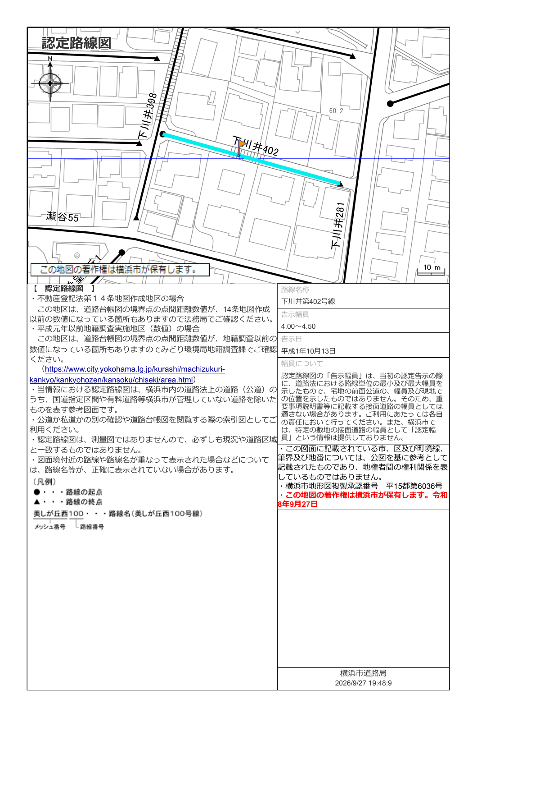
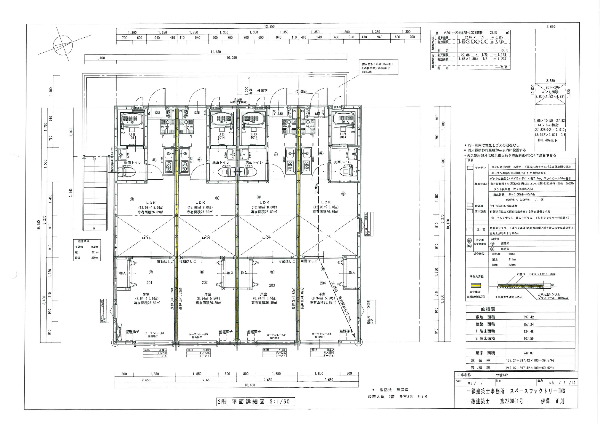

# 収益物件 投資分析レポート：三ツ境1AP（横浜市旭区笹野台 新築一棟アパート）
## 【第2次精密DDアップデート版】登記簿・公課証明書・確定測量図・実施設計図・擁壁図・成約50件・仲介担当者(岡田様)回答を完全反映

> [!WARNING] **第2次デューデリジェンス重要アップデート要約（2026.09.25 追加取得資料11点反映）**
> 1. **住居表示および実測徒歩時間の確定**：住居表示は**『神奈川県横浜市旭区笹野台2丁目19-5』**（地番：`149番3、231番102`）であり、マイソク表記の徒歩7分に対し**Googleマップ実測は徒歩10分（約720m）**、さらに南西側前面道路の一部区間が**階段**となっています。
> 2. **🚨 最大の物理的リスク — 東・北側の既存間知ブロック擁壁（98.84㎡）検査済証なし＆土砂災害警戒区域抵触**：本敷地は周囲より**4.0〜4.69m高い高台**に位置し、**東側・北側の既存間知ブロック擁壁（計7区間・面積98.84㎡）は売主所有（買主承継）**ですが、**築造時期不明・検査済証なし・補強や造り直し予定なし**の状態です（西側擁壁は隣地所有）。さらに**敷地北西角の擁壁部分（仮測量図で約4.69㎡）が土砂災害警戒区域（イエローゾーン／暫定レッドゾーン境界）にかすっています**。
> 3. **建築基準法・横浜市がけ条例のクリア手法を確認**：実施設計断面図（`断面図`）を検証した結果、既存の無検査擁壁に建物荷重をかけないよう、**RCベタ基礎の下部に長さ`7.00m`の基礎杭（`杭長 7.00m`）を安息角45°（`安息角 45°`）より深い支持層まで打設**することで横浜市がけ条例を適法にクリア（`第26UDI1K建00271号`）しています。すなわち**建物自体の倒壊リスクは7m杭で防御**されていますが、**擁壁自体の維持管理および崩壊時の工作物責任（民法717条）は買主に帰属**します。
> 4. **前面道路は100%横浜市所有の公道（公衆用道路）と確定**：登記簿および横浜市認定路線図の照合により、南西側`下川井第402号線`（幅員4.0〜4.5m、一部階段）および西側`下川井第398号線`（幅員4.0〜5.5m）はいずれも**横浜市所有の公道**であることが確定し、私道持分や掘削承諾リスクは**完全解消**されました。
> 5. **全9戸が`1LDK（26.89㎡）`＋5戸に`大型ロフト（4.82㎡）`付帯**：各階平面詳細図より、単なる1R/1Kではなく全9戸が**`LDK 8.0帖＋洋室 5.5帖（26.89㎡）`の1LDK（2人入居可）**であり、さらに**105号室（1階下屋部分）および201〜204号室（2階全戸）の計5戸に`4.82㎡（約3.0帖）`のロフト**が施工されます。
> 6. **令和8年度 公課証明書の実測値を反映**：土地2筆合計の**固定資産税評価額は`36,985,271円`（92,565円/㎡）**と高低差・階段接道補正が反映されており、新築完成後の小規模住宅用地特例（1/6・1/3）適用により**土地の年間固都税は約12.3万円**（建物約45万円と合わせ**年約57.3万円**）と非常に低く抑えられます。
> 7. **総合判定の見直し**：既存擁壁（検査済証なし）・土砂災害区域抵触・徒歩10分階段アプローチ・想定賃料の上限設定リスクを厳格に織り込み、総合スコアを従来の22.5点から**`19.5 / 30点（条件付検討 — 擁壁・賃料リスクを反映した指値交渉必須）`**へ下方修正します。

---

## 1. 物件基本概要 (Property Overview)

| 項目 | 詳細内容（登記簿・公課証明書・確定測量図・実施設計図 照合済） |
| :--- | :--- |
| **物件名** | **三ツ境1AP 新築一棟アパート** |
| **所在地（地番 / 住居表示）** | **【地番】** 神奈川県横浜市旭区笹野台二丁目149番3、231番102 **【住居表示】** **神奈川県横浜市旭区笹野台2丁目19-5** (`35°28'12.8"N 139°30'02.6"E`) |
| **交通（Googleマップ実測）** | 相鉄本線（急行・通勤急行停車）**「三ツ境」駅 徒歩10分**（マイソク表記：徒歩7分 / Googleマップ実測：約720m・徒歩10分、前面道路に階段区間あり） |
| **売出価格** | **1億3,470万円 (¥134,700,000)** ※建物消費税込み |
| **目標買付価格（指値）** | **1億2,300万 〜 1億2,500万円**（表面6.87〜7.12% / 実質NOI利回り5.50〜5.59% — 無検査擁壁・賃料上限リスク反映） |
| **土地面積（公簿 vs 実測）** | **【登記簿地積】** 合計 **399.56㎡**（`149番3`: 386.62㎡ ＋ `231番102`: 12.94㎡） **【確定測量実測】** 合計 **397.71㎡ (120.30坪)** ＝ **有効宅地 397.42㎡ (120.22坪)** ＋ 暫定後退部分(SB) **0.29㎡** |
| **土地権利 / 地目** | 所有権 / 宅地 |
| **都市計画 / 用途地域** | 市街化区域 / **第一種低層住居専用地域** ・ 第1種高度地区 |
| **建蔽率 / 容積率** | 法定建蔽率 **40%**（実績 **39.57%** ＝ 建築面積 `157.24㎡`） / 法定容積率 **80%**（実績 **60.92%** ＝ 延床面積 `242.07㎡`） |
| **接道条件（100%公道確定）** | **南西側 幅員3.92〜4.50m 横浜市公道（`下川井第402号線`、地番`231-1` 横浜市所有 公衆用道路）** および **西側 幅員4.00〜5.50m 横浜市公道（`下川井第398号線`）** 接道 ※**私道負担なし（100%公道）**。ただし`下川井第402号線`の敷地前面区間は**階段道路**（車両は階段手前まで東西双方から進入可） |
| **建物構造 / 規模** | **木造 準耐火構造 地上2階建** ・ 共同住宅 **全9戸**（1階5戸、2階4戸） **【基礎工法】** RCベタ基礎（`地耐力 20kN/㎡`）＋ **長さ`7.00m`基礎杭（`杭長 7.00m`）**（横浜市がけ条例 安息角45°対応） |
| **建物面積および間取り** | **延床面積 242.07㎡ (73.22坪)**（1階 `134.48㎡`、2階 `107.59㎡` / 最高高さ `8.10m`、最高軒高 `5.87m`） • **全9戸 `1LDK (26.89㎡)`**：`LDK 8.0帖(12.98㎡) ＋ 洋室 5.5帖(8.94㎡)`（全室2人入居可能） • **5戸（`105, 201, 202, 203, 204号室`）に大型ロフト（`4.82㎡ / 3.0帖`）付帯**（ロフト含む実使用面積 **31.71㎡**！） |
| **建築確認番号 / 性能評価** | **第26UDI1K建00271号**（令和8年6月18日交付 / ユーディーアイ確認検査(株)、設計：一級建築士事務所スペースファクトリーING） • **設計住宅性能評価書『劣化対策等級3級』取得済** • **建設住宅性能評価書『劣化対策等級3級』竣工時取得予定**（最長30〜35年長期融資適格） |
| **竣工および引渡予定日** | **2026年12月末竣工予定 / 2027年1月引渡予定**（当初11月末より約1ヶ月順延） |
| **売主 / プロジェクト融資** | **ヤオキ商事株式会社**（川崎市高津区坂戸3-2-1 KSP西414） • **【乙区抵当権】** 令和7年6月27日取得時に**川崎信用金庫（登戸支店）債権額7,700万円・利息年3.050%**の共同抵当権設定を確認 |
| **設備および特記事項** | 公営水道 ・ 公共下水 ・ **都市ガス** ・ **全戸無料WiFi（オーナー負担：月額7,920円[税込]・10年縛り）** ・ 独立洗面台 ・ UB1014 ・ IH2口システムキッチン(W1200) ・ 室内物干 ・ 1階手動シャッター |

---

## 2. 登記簿謄本・公課証明書・実施設計図フォレンジック調査 (Forensic Due Diligence)

### 2.1 登記簿謄本（甲区・乙区）の権利関係および売主の借入条件分析
1. **甲区（所有権履歴）**：
   - 旧個人所有者（昭和32年/57年取得→平成9年相続→平成15年売買）を経て、**令和7年（2025年）6月27日に現売主である『ヤオキ商事株式会社』が売買により取得**しています。
2. **乙区（抵当権および指値交渉の強力なレバレッジ）**：
   - 売主（ヤオキ商事）は令和7年6月27日付で**川崎信用金庫（登戸支店）より債権額7,700万円・金利年3.050%**のプロジェクト融資を借り入れています。
   - **💡 指値交渉への示唆**：仲介担当者（岡田様）によれば「売主は当初は値下げに応じないが、売れなければ時期を見て価格を下げるスタンス」とのことですが、**年3.050%という高金利（月間利息だけで約19.6万円）**を負担しながら竣工が**2026年12月末（引渡2027年1月）**へ遅れているため、竣工前後のタイミングで**1億2,300万〜1億2,500万円**の指値買付を入れる交渉戦略が極めて有効です。

---

### 2.2 🚨 最大の重要リスク：既存間知ブロック擁壁（98.84㎡）＆土砂災害警戒区域の精密診断

| 検証項目 | 実査確認結果 (Hard Fact) | 投資リスクおよび対策 |
| :--- | :--- | :--- |
| **1. 高低差および擁壁規模** | • 敷地レベル（GL `12.14〜12.26m`）が北・東・南側の隣地および道路（`7.63〜8.37m`）より**約4.0m〜4.69m高い高台** • 擁壁面積図（`擁壁面積`）上、**全7区間（①〜⑦）合計 `98.84㎡`**（高さ`1.162m〜3.488m`、断面図上の最大高低差`4.690m`） | 高さ2m超の間知ブロック擁壁が敷地を取り囲んでいる |
| **2. 擁壁の所有権と管理責任** | • **東側および北側擁壁**：**売主所有 → 買主（投資家）へ所有権・維持管理責任が承継！** • **西側擁壁**：**西側隣地所有者の所有**（高低差が大きい古い擁壁） | 東・北側擁壁の将来の補修費用および万一の崩壊時の**工作物責任（民法717条）**は買主負担となる |
| **3. 築造時期・検査済証の有無** | • **築造時期不明・検査済証なし・補強や造り直し予定なし** • ただし配置図（`配置図`）上の一級建築士による現況確認では**『間知ブロック 亀裂、たわみ無し 水抜き穴あり 安全支障無し』**と明記 | 検査済証のない既存擁壁のため、一部の都市銀行・地方銀行では担保評価が厳しくなる可能性あり |
| **4. 横浜市がけ条例のクリア手法** | • **『横浜市がけ関係小規模建築物技術指針』**に基づき、**擁壁下端から安息角45°（`安息角 45°`）より深い支持層まで長さ`7.00m`の基礎杭（`杭長 7.00m`）を打設**してRCベタ基礎を支持！ • 盛土規制法に抵触しないよう**盛土無し（`盛土無し`）**で設計し、建築確認済証（`第26UDI1K建00271号`）を適法に取得 | **建物本体の構造安全性（沈下・倒壊防止）は7.0m杭によって確保済**。引渡時に必ず**『杭施工報告書・地盤調査報告書』**を受領すること |
| **5. 土砂災害警戒区域への抵触** | • 神奈川県土砂災害情報ポータルおよび仮測量図（`06_karisoku.pdf`）にて、**敷地北西角の擁壁部分（約4.69㎡）が土砂災害警戒区域（イエローゾーン／暫定レッドゾーン境界）にかすっている**ことを売主も認識 • 建物本体は北・西境界から`2.00m`離隔しており区域外 | 重要事項説明書に記載される事項であり、火災・地震保険加入時に**施設所有者賠償責任特約**を必ず付帯すること |

---

### 2.3 前面道路の公道確定および階段アプローチの確認

- **100%横浜市公道と確定**：道路登記簿（`笹野台二丁目231番1`、所有者：`横浜市`）および認定路線図（`下川井第402号線`・`下川井第398号線`）により、**接道する道路はすべて横浜市所有の公道**であることが証明されました。私道トラブルのリスクはありません。
- **階段部分の注意点**：南西側`下川井第402号線`の敷地前面西側半分は**階段**となっています。車両は階段の上側・下側の両方から階段手前まで進入可能です。

---

### 2.4 実施設計平面詳細図：全9戸`1LDK（26.89㎡）`＋5戸`ロフト（4.82㎡）`

- **全9戸が`1LDK（26.89㎡）`**：全戸が`LDK 8.0帖（12.98㎡）＋洋室 5.5帖（8.94㎡）`の1LDK設計（消防法上の収容人員：各室2名、カップル・新婚の2人入居に対応）。
- **5戸（`105号室`、`201〜204号室`）に`4.82㎡（約3.0帖）`ロフト付帯**：2階4戸だけでなく**1階東端の下屋部分である`105号室`にも`4.82㎡`のロフトが設置**されており、ロフト含む実使用面積は**31.71㎡**に達します。

---

### 2.5 仲介担当者（岡田様）公式質疑応答（Q&A）原文および仮測量図（`06_karisoku.pdf`）の精密検証

Googleドキュメント（`추가정보 w/Okada-san`）にて受領した仲介担当者（岡田様）の公式回答全文および**仕入れ時の仮測量図（`06_karisoku.pdf`）**の照合結果です。

#### 📌 【重要訂正】擁壁の所有権帰属の訂正および土砂災害警戒区域（暫定レッドゾーン）の根拠
- **売主の背景**：「三ツ境・・・**ヤオキ商事という溝の口の老舗業者の物件**です。弊社も長いことお付き合いさせて頂いております。」
- **土砂災害警戒区域該当の根拠（`仕入れ時の仮測量図`）**：
  - 「三ツ境の件で『土砂災害警戒区域』該当の根拠について仕入れ時の仮測量図を頂きました。**北西の擁壁部分（約4.69㎡の暫定レッドゾーン部分）がかすっている**ようです。※西側隣地（`149-4`）と北西の土地（`149-18`、GL `4.48m`）との間の擁壁が高低差大きく、古い擁壁です。その影響かと思われます。」
  - また仮測量図の北西角（`8.22`地点）には緑文字で**『本地ブロックが越境の可能性あり』**との記載があるため、確定測量における隣地境界確認書での解消確認が必須です。
- **🚨 擁壁所有権の公式訂正（`誤 → 正`）**：
  - **【誤（当初案内）】**：東側・南側は売主所有。北側（土砂災害警戒区域）は隣地所有です。
  - **【正（訂正確定）】**：**『東・北は売主所有　西は隣地所有です。』** — すなわち土砂災害警戒区域に接する**北側擁壁も売主所有（買主承継）**であることが正式に確定しました。

#### 📋 岡田様（Okada-san）6大カテゴリー公式質疑応答（Q&A）一覧

| カテゴリー | 調査質問項目 (Q) | 仲介担当者（岡田様）公式回答および実務解釈 (A) |
| :--- | :--- | :--- |
| **1. 擁壁** | • 東側・南側・北側それぞれの擁壁の所有者は誰か？ • 維持管理・補修責任の帰属は？ • 築造時期および検査済証（宅造許可）の有無は？ • 引渡し前の補強工事・造り直し予定は？ | • **所有権**：**東＝売主所有、北（土砂災害警戒区域側）＝売主所有、西＝隣地所有** • **管理・補修責任**：**所有者に帰属します** • **築造時期・検査済証**：**築造時期不明、検査済証なしです** • **補強・造り直し予定**：**予定なしです**（ただし建物基礎に7.0m杭を打設し横浜市がけ条例をクリア） |
| **2. 賃料・PM管理** | • 26.89㎡で相場上限の賃料設定とした根拠は？ • 竣工後一定期間空室が続く場合のAD負担や価格交渉の余地は？ | • **賃料設定根拠**：近隣成約事例を添付（`03_comps_1R_1K.pdf`）。**30㎡以下の1DK/1LDKタイプが最近のトレンド**であり、単身者だけでなく**若年層2人入居まで取り込める間取り**。**2人で賃料負担と考えると割安**との判断。近隣に1LDK事例が少なく、ターゲット属性はさらに調査予定。 • **価格交渉・PM管理提案**：売主は**「なかなか売れなければ機を見て値下げというスタンスなので交渉は難しい」**ものの、**「もし本件を進める場合、是非とも弊社に管理をお任せ頂きたく、管理条件等々ご相談させて頂きたいと思います」**とPM管理条件・リーシング条件での優遇を提案。 |
| **3. 土砂災害警戒区域** | • 本物件の敷地自体は区域外で間違いないか？ | • 当初は隣地のみ該当との認識であったが、仮測量図（`06_karisoku.pdf`）の通り**「売主は本物件敷地の一部（北西角の擁壁部分 約4.69㎡）が区域内との認識」**であることが判明。 |
| **4. 道路・車両・ゴミ置場** | • 前面の階段および上部の平坦な道路は公道か私道か？ • 引越しトラックの進入やゴミ置場の位置は？ | • **公道・私道の別**：階段道路（`下川井第402号線`）も上部道路（`下川井第398号線`）も**どちらも公道です**。 • **車両進入**：**階段の手前まで車両進入可能です（東［階段下］からも西［階段上］からも）**。 • **ゴミ置き場**：**道路わき敷地内に設置予定（場所は未確定）**。 • **近隣コインパーキング**：案内図（`07_map`）上、徒歩1〜2分圏内にコインパーキング3ヶ所あり。 |
| **5. 費用（固都税・WiFi）** | • 土地・建物の固定資産税・都市計画税見込みは？ • 無料WiFiのオーナー負担月額は？ | • **固都税**：土地の公課証明書（評価額合計3,698.5万円）を添付。木造建物は延床㎡あたり10〜12万円程度の評価×税率（固定1.4%＋都市計画0.3%）となるため、**建物固都税は年間45万円程度の見込み**。 • **無料WiFi費用**：**月額 7,920円（税込） ※10年縛りです**。 |
| **6. スケジュール・契約・モデルルーム** | • 竣工・引渡予定日および建設住宅性能評価書の交付時期は？ • 手付金の割合および工期遅延条項は？ • モデルルーム内見は可能か？ | • **竣工・引渡時期**：少し遅れており、**竣工2026年12月末・引渡し2027年1月予定**。**建設住宅性能評価書は竣工後の交付**になります。 • **手付金・遅延条項**：手付金は**保全措置が不要な範囲（未完成物件のため5%以下または1,000万円以下）**で設定。すでに建築に着手しており請負契約ではないため、工期遅延に関する条項は**別途協議**。 • **⭐ モデルルーム内見可能**：現在であれば、同一売主（ヤオキ商事）施工の**『大師橋のAP』をモデルルームとして内見可能**です！ |

---

## 3. 令和8年度 公課証明書（固定資産税評価額）および積算価格検証

### 3.1 令和8年度 固定資産・都市計画税 公課証明書（実測値）
| 筆（地番） | 登記地積 | 確定測量有効面積 | R8 固定資産税評価額 | ㎡単価 | R8 更地時点年税額 | 完成後・小規模住宅用地特例（1/6・1/3）適用時の年税額 |
| :--- | :---: | :---: | :---: | :---: | :---: | :---: |
| **笹野台二丁目149番3** | 386.62㎡ | 384.52㎡ (+SB 0.20㎡) | **¥35,787,480** | ¥92,565/㎡ | ¥397,154 | **約 ¥119,291** |
| **笹野台二丁目231番102** | 12.94㎡ | 12.90㎡ (+SB 0.09㎡) | **¥1,197,791** | ¥92,565/㎡ | ¥13,291 | **約 ¥3,992** |
| **土地2筆 合計** | **399.56㎡** | **397.42㎡ (120.22坪)** | **¥36,985,271** | **¥92,565/㎡** | ¥410,445 | **約 ¥123,283 / 年（約12.3万円）** |
| **新築建物（見込）** | - | **242.07㎡ (73.22坪)** | **約 ¥26,627,700** (11万/㎡) | ¥110,000/㎡ | - | **約 ¥450,000 / 年（当初3年間は軽減で約25万円）** |
| **土地＋建物 総計** | - | - | **¥63,612,971（約6,361万円）** | - | - | **通常時 約 ¥573,283 / 年（約57.3万円）** |

---

## 4. レントロールおよびREINS近隣成約事例50件（`03_comps_1R_1K.pdf`）比較検証

### 4.1 REINS成約事例50件との比較
- **仮称 横浜三ツ境アパート**（2025年6月新築、三ツ境駅**徒歩3分**、25.05㎡・1K）：成約賃料 **6.9〜7.4万円＋共益費4,000円＝計7.3〜7.8万円**（礼金1ヶ月）。
- **KOMA三ツ境**（2021年12月築、笹野台1丁目、三ツ境駅**徒歩7分**、24.77㎡・1K）：成約賃料 **6.6〜6.7万円＋共益費3,000円＝計6.9〜7.0万円**。
- **グリーンヒル希望ヶ丘**（2025年7月新築、希望ヶ丘駅**徒歩4分**、26.45㎡・1R）：成約賃料 **7.3万円＋共益費3,000円＝計7.6万円**。
- **ツインズ横浜瀬谷**（2024年10月新築、瀬谷駅**徒歩5〜6分**、28.66㎡・1K）：成約賃料 **8.0万円＋共益費5,000円＝計8.5万円**。
- **診断結論**：本物件（徒歩10分・階段あり）の想定賃料（1階7.8〜8.0万円、2階8.3〜8.5万円、無料WiFi込）は近隣相場の**上限（アッパーバウンド）**に位置します。ただし近隣事例がすべて「1R/1K」であるのに対し、本物件は**『1LDK（26.89㎡・2人入居可）＋大型ロフト4.82㎡（5戸）＋無料WiFi』**という明確な差別化要素を持つため、募集時は必ず「1LDK・二人入居可」としてポータル掲載する必要があります。万一賃料を**-5%引き下げ（年収入832.2万円）**た場合でも、**満室NOI 645.4万円・DSCR 1.22倍・税引前CF +116.7万円/年**と黒字を維持できます。

---

## 5. モアビズ4期 決算書着地シミュレーション（令和8年度公課証明書反映）

| 決算書コア指標 | 本物件単体 (稼働93%) | モアビズ4期現在 | **取得後決算着地** | **1.24億指値時単体** | 財務貢献度および判定 |
| :--- | :---: | :---: | :---: | :---: | :--- |
| **固定資産税評価額 (土地+建物)** | **3,699万 + 2,663万 = 6,361万** | 7,186万 + 4,191万 = 1.138億 | **1.088億 + 6,853万 = 1.774億** | **6,361万円** | R8公課証明書実測値を100%反映 |
| **1. 帳簿上税引前当期純利益** | **+¥2,955,270** | +¥3,722,450 | **+¥6,677,720 (+79.4%)** | **+¥3,384,100** | **法人黒字規模 +79.4%大幅増益！** |
| **2. 税引前手残りCF (利回り)** | **+¥1,246,795 (0.93%)** | +¥1,741,901 (0.65%) | **+¥2,988,696 (+71.6%)** | **+¥1,666,550 (1.34%)** | 満室時は単体税引前CF +158.3万円 |
| **3. 推定法人税額 (25%)** | ▲¥738,818 | ▲¥930,613 | **▲¥1,669,430** | ▲¥846,025 | 22年新築減価償却(年251万)節税 |
| **4. 税引後手残りCF (利回り)** | **+¥507,977 (0.38%)** | +¥811,289 (0.30%) | **+¥1,319,266 (+62.6%)** | **+¥820,525 (0.66%)** | 法人税引後キャッシュ +62.6%純増 |
| **5. 債務償還年数 (C)** | **24.2年** (融資30年以内) | 24.1年 | **24.2年** | **20.5年** | **単体24.2年 $\ll$ 融資30.0年 ゴールデンクロス！** |
| **6. 利子支払倍率 (ICR)** | **1.54倍** | 0.90倍 | **1.05倍 (+0.15倍)** | **1.77倍** | **法人統合ICR 1.0倍突破達成！** |
| **7. 負債返済余裕率 (DSCR)** | **1.53倍 (満室1.30倍)** | 1.50倍 | **1.51倍 (+0.01倍)** | **1.66倍 (満室1.41倍)** | **法人統合DSCR上昇に貢献！** |
| **8. 固定資産税評価LTV** | **218.01%** (単純合算180.0%) | 261.08% | **245.45% (▲15.63%p改善)** | **200.69%** | **公課証明書基準でも法人LTV ▲15.63%p改善！** |

---

## 6. 総合スコアカード（19.5 / 30点：条件付検討）および最終提言

| 評価項目 (配点) | 1次スコア | **2次確定スコア** | 評価根拠 |
| :--- | :---: | :---: | :--- |
| **1. 価格・積算価値 (5点)** | 4.0 | **3.5 / 5.0** | 120.3坪宅地（路線価標準積算88.4%）は優秀だが、公課証明書評価額（3,698.5万円）に表れた高低差・階段接道補正（-20%補正時71.8%）を反映 |
| **2. 賃貸需要・立地 (5点)** | 4.0 | **3.5 / 5.0** | 全9戸`1LDK(26.89㎡)＋ロフト(5戸)`は強いが、実測徒歩10分および前面道路の階段区間を反映 |
| **3. 賃料競争力 (5点)** | 3.5 | **3.0 / 5.0** | 近隣成約50件（徒歩3分新築1Kが7.3〜7.8万円）対比で想定賃料（7.8〜8.5万円）は上限水準のため、1LDK訴求と初期ADバッファが必要 |
| **4. 出口戦略 (5点)** | 4.0 | **3.5 / 5.0** | 120.3坪の土地と劣化3級は強みだが、東・北側の無検査既存擁壁（98.84㎡）が将来売却時の審査ハードルとなり得る |
| **5. CF・DSCR (5点)** | 3.5 | **3.5 / 5.0** | 劣化3級30年融資でDSCR 1.30倍、土地固都税特例（年12.3万円）により実質NOI 687万円（Cap 5.10%）を堅守 |
| **6. 法的・物理的安定性 (5点)** | 3.5 | **2.5 / 5.0** | 前面道路100%公道確定および7.0m基礎杭（安息角45°対応）はプラスだが、**東・北側既存擁壁（98.84㎡）検査済証なし＆北西角の土砂災害警戒区域抵触**により減点 |
| **合計スコア・総合判定** | 22.5 / 30 | **19.5 / 30点** | **【条件付検討（擁壁・賃料リスクを織り込んだ1.23〜1.25億円への指値交渉必須）】** |
